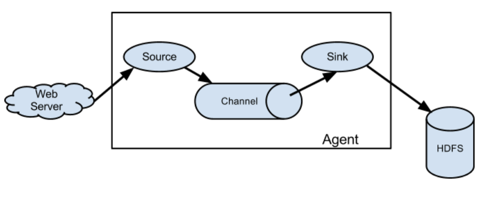
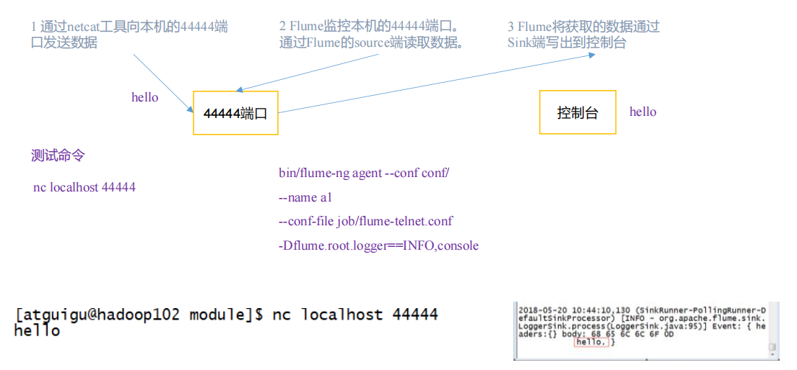
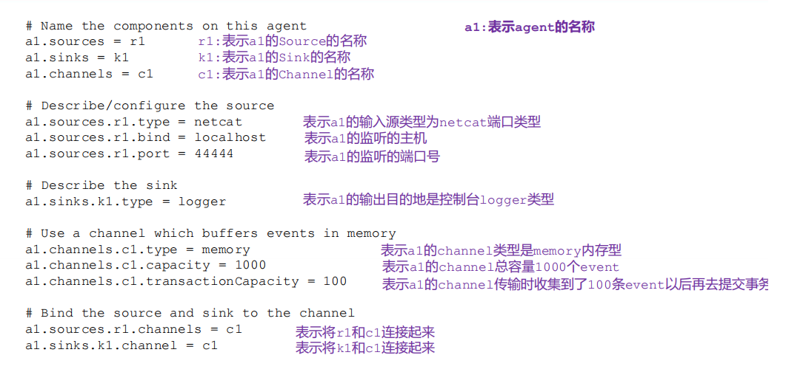
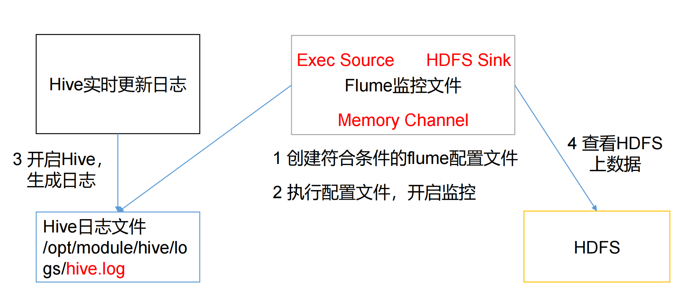
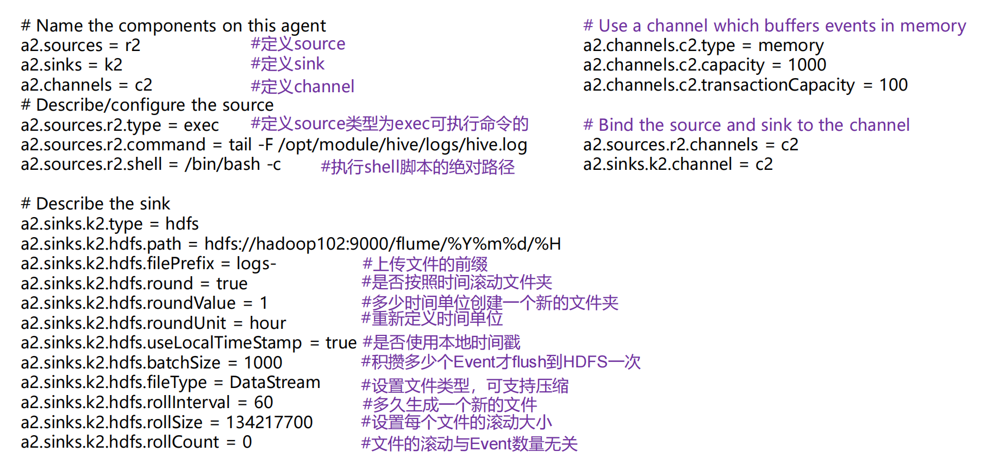
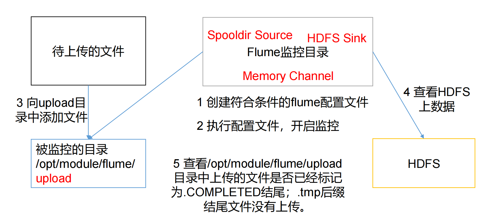
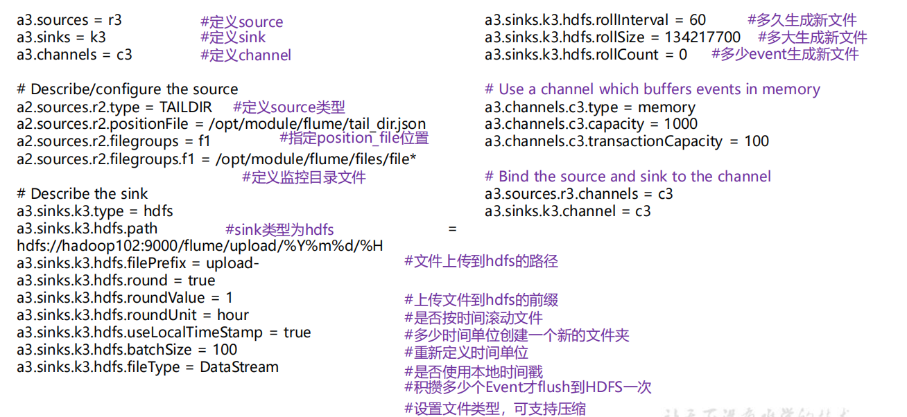

日志采集、传输到HDFS或Kafka的工具，Flume最主要的作用就是，实时读取服务器本地磁盘的数据，将数据写入到HDFS。

官方文档很详细，http://flume.apache.org/FlumeUserGuide.html

下载地址：http://archive.apache.org/dist/flume/

# 概述

## 架构



1.2.1 Agent

Agent 是一个 JVM 进程，它以事件的形式将数据从源头送至目的。 Agent 主要有 3 个部分组成，Source、Channel、Sink。

1.2.2 Source

Source 是负责接收数据到 Flume Agent 的组件。Source 组件可以处理各种类型、各种 格式的日志数据，包括 avro、thrift、exec、jms、spooling directory、netcat、taildir、 sequence generator、syslog、http、legacy。

1.2.3 Sink

Sink 不断地轮询 Channel 中的事件且批量地移除它们，并将这些事件批量写入到存储或索引系统、或者被发送到另一个 Flume Agent。

Sink 组件目的地包括 hdfs、logger、avro、thrift、ipc、file、HBase、solr、自定 义。

1.2.4 Channel

Channel 是位于 Source 和 Sink 之间的缓冲区。因此，Channel 允许 Source 和 Sink 运 作在不同的速率上。Channel 是线程安全的，可以同时处理几个 Source 的写入操作和几个 Sink 的读取操作。channel:可以将kafka, mySQL作为channel

Flume 自带两种 Channel：Memory Channel 和 File Channel。

Memory Channel 是内存中的队列。Memory Channel 在不需要关心数据丢失的情景下适 用。如果需要关心数据丢失，那么 Memory Channel 就不应该使用，因为程序死亡、机器宕 机或者重启都会导致数据丢失。

File Channel 将所有事件写到磁盘。因此在程序关闭或机器宕机的情况下不会丢失数据。

# 案例

启动配置命令口诀NFC： flume-ng agent -n -f -c

## 监控端口数据官方案例

提前配置hadoop，java环境变量

logger

nectar,linux中向控制台发送数据的轻量型工具

1）案例需求： 使用 Flume 监听一个端口，收集该端口数据，并打印到控制台。 

2）需求分析：



3）实现步骤：

```bash
（1）安装 netcat 工具
[ola@hadoop102 software]$ sudo yum install -y nc
（2）判断 44444 端口是否被占用
[ola@hadoop102 flume-telnet]$ sudo netstat -nlp | grep 44444
（3）在 flume 目录下创建 job 文件夹并进入 job 文件夹。
[ola@hadoop102 flume]$ mkdir job
[ola@hadoop102 flume]$ cd job/
（4）在 job 文件夹下创建 Flume Agent 配置文件 flume-netcat-logger.conf。
[ola@hadoop102 job]$ vim flume-netcat-logger.conf
（5）在 flume-netcat-logger.conf 文件中添加如下内容。
添加内容如下：
# Name the components on this agent
a1.sources = r1 #a1是当前agent的名称
a1.sinks = k1
a1.channels = c1
# Describe/configure the source
a1.sources.r1.type = netcat
a1.sources.r1.bind = localhost
a1.sources.r1.port = 44444
# Describe the sink
a1.sinks.k1.type = logger
# Use a channel which buffers events in memory
a1.channels.c1.type = memory
a1.channels.c1.capacity = 1000 #channel接受的事件总容量
a1.channels.c1.transactionCapacity = 100 #单个任务的事件容量
# Bind the source and sink to the channel
a1.sources.r1.channels = c1
a1.sinks.k1.channel = c1

注：配置文件来源于官方手册 http://flume.apache.org/FlumeUserGuide.html
(6)先开启 flume 监听端口
第一种写法：
[ola@hadoop102 flume]$ bin/flume-ng agent --conf conf/ --name 
a1 --conf-file job/flume-netcat-logger.conf -
Dflume.root.logger=INFO,console
第二种写法：
[ola@hadoop102 flume]$ bin/flume-ng agent -c conf/ -n a1 -f 
job/flume-netcat-logger.conf -Dflume.root.logger=INFO,console

参数说明：
--conf/-c：表示配置文件存储在 conf/目录
--name/-n：表示给 agent 起名为 a1
--conf-file/-f：flume 本次启动读取的配置文件是在 job 文件夹下的 flume-telnet.conf
文件。
-Dflume.root.logger=INFO,console ：-D 表示 flume 运行时动态修改 flume.root.logger
参数属性值，并将控制台日志打印级别设置为 INFO 级别。日志级别包括:log、info、warn、
error

（7）使用 netcat 工具向本机的 44444 端口发送内容
[ola@hadoop102 ~]$ nc localhost 44444
hello 
atguigu
（8）在 Flume 监听页面观察接收数据情况
```



## 实时监控单个追加文件--不支持断点续传

1）案例需求：实时监控 Hive 日志，并上传到 HDFS 中 

2）需求分析：



3）实现步骤：

```bash
（1）Flume 要想将数据输出到 HDFS，依赖 Hadoop 相关 jar 包
检查/etc/profile.d/my_env.sh 文件，确认 Hadoop 和 Java 环境变量配置正确
JAVA_HOME=/opt/module/jdk1.8.0_212
HADOOP_HOME=/opt/module/ha/hadoop-3.1.3
PATH=$PATH:$JAVA_HOME/bin:$HADOOP_HOME/bin:$HADOOP_HOME/sbin
export PATH JAVA_HOME HADOOP_HOME
（2）创建 flume-file-hdfs.conf 文件
创建文件
[atguigu@hadoop102 job]$ vim flume-file-hdfs.conf
注：要想读取 Linux 系统中的文件，就得按照 Linux 命令的规则执行命令。由于 Hive
日志在 Linux 系统中所以读取文件的类型选择：exec 即 execute 执行的意思。表示执行
Linux 命令来读取文件。
添加如下内容
# Name the components on this agent
a2.sources = r2
a2.sinks = k2
a2.channels = c2
# Describe/configure the source
a2.sources.r2.type = exec
a2.sources.r2.command = tail -F /opt/module/hive/logs/hive.log
# Describe the sink
a2.sinks.k2.type = hdfs
a2.sinks.k2.hdfs.path = hdfs://hadoop102:8020/flume/%Y%m%d/%H
#上传文件的前缀
a2.sinks.k2.hdfs.filePrefix = logs- 
#是否按照时间滚动文件夹
a2.sinks.k2.hdfs.round = true
#多少时间单位创建一个新的文件夹
a2.sinks.k2.hdfs.roundValue = 1
#重新定义时间单位
a2.sinks.k2.hdfs.roundUnit = hour

#是否使用本地时间戳
a2.sinks.k2.hdfs.useLocalTimeStamp = true
#积攒多少个 Event 才 flush 到 HDFS 一次
a2.sinks.k2.hdfs.batchSize = 100
#设置文件类型，可支持压缩
a2.sinks.k2.hdfs.fileType = DataStream
#多久生成一个新的文件
a2.sinks.k2.hdfs.rollInterval = 60
#设置每个文件的滚动大小
a2.sinks.k2.hdfs.rollSize = 134217700
#文件的滚动与 Event 数量无关
a2.sinks.k2.hdfs.rollCount = 0
# Use a channel which buffers events in memory
a2.channels.c2.type = memory
a2.channels.c2.capacity = 1000
a2.channels.c2.transactionCapacity = 100
# Bind the source and sink to the channel
a2.sources.r2.channels = c2
a2.sinks.k2.channel = c2

注意：对于所有与时间相关的转义序列，Event Header 中必须存在以 “timestamp”的
key（除非 hdfs.useLocalTimeStamp 设置为 true，此方法会使用 TimestampInterceptor 自
动添加 timestamp）。
例如：a3.sinks.k3.hdfs.useLocalTimeStamp = true

（3）运行 Flume
[ola@hadoop102 flume]$ bin/flume-ng agent -c conf/ -n a2 -f job/flume-file-hdfs.conf
（4）开启 Hadoop 和 Hive 并操作 Hive 产生日志
[ola@hadoop102 hadoop-2.7.2]$ sbin/start-dfs.sh
[ola@hadoop103 hadoop-2.7.2]$ sbin/start-yarn.sh
[ola@hadoop102 hive]$ bin/hive
hive (default)>
（5）在 HDFS 上查看文件。
```

注意： a2.sinks.k2.hdfs.path = hdfs://hadoop102:9870/flume/%Y%m%d/%H文件夹使用了时间，要设置a3.sinks.k3.hdfs.useLocalTimeStamp = true



## 实时监控目录下多个新文件--不支持同一个文件实时动态更新上传，适合上传静态新文件

1）案例需求：使用 Flume 监听整个目录的文件，并上传至 HDFS 

2）需求分析：实时读取目录文件到HDFS案例



3）实现步骤：

```bash
（1）创建配置文件 flume-dir-hdfs.conf
创建一个文件
[atguigu@hadoop102 job]$ vim flume-dir-hdfs.conf
添加如下内容
a3.sources = r3
a3.sinks = k3
a3.channels = c3
# Describe/configure the source
a3.sources.r3.type = spooldir
a3.sources.r3.spoolDir = /opt/module/flume/upload
a3.sources.r3.fileSuffix = .COMPLETED
a3.sources.r3.fileHeader = true
#忽略所有以.tmp 结尾的文件，不上传
a3.sources.r3.ignorePattern = ([^ ]*\.tmp)

# Describe the sink
a3.sinks.k3.type = hdfs
a3.sinks.k3.hdfs.path = hdfs://hadoop102:8020/flume/upload/%Y%m%d/%H
#上传文件的前缀
a3.sinks.k3.hdfs.filePrefix = upload- #是否按照时间滚动文件夹
a3.sinks.k3.hdfs.round = true
#多少时间单位创建一个新的文件夹
a3.sinks.k3.hdfs.roundValue = 1
#重新定义时间单位
a3.sinks.k3.hdfs.roundUnit = hour
#是否使用本地时间戳
a3.sinks.k3.hdfs.useLocalTimeStamp = true
#积攒多少个 Event 才 flush 到 HDFS 一次
a3.sinks.k3.hdfs.batchSize = 100
#设置文件类型，可支持压缩
a3.sinks.k3.hdfs.fileType = DataStream
#多久生成一个新的文件
a3.sinks.k3.hdfs.rollInterval = 60
#设置每个文件的滚动大小大概是 128M
a3.sinks.k3.hdfs.rollSize = 134217700
#文件的滚动与 Event 数量无关
a3.sinks.k3.hdfs.rollCount = 0

# Use a channel which buffers events in memory
a3.channels.c3.type = memory
a3.channels.c3.capacity = 1000
a3.channels.c3.transactionCapacity = 100

# Bind the source and sink to the channel
a3.sources.r3.channels = c3
a3.sinks.k3.channel = c3
```

不要上传名字相同的文件，不然会无限执行上传，任务挂了

## 实时监控目录下的多个追加文件--适合动态文件（常用）

flume1.7后推出的新功能

* Exec source 适用于监控一个实时追加的文件，但是不能实现断点续传；

* Spooldir Source--适用于静态文件，不再变动的文件，不适用于实时更新

  适合用于同步新文件，但不适合对实时追加日志的文件进行监听并同步；为处理静态文件设计的，而不是实时更新的日志文件

* Taildir Source---适用于实时更新的文件

  适合用于监听多个实时追加的文件，并且能够实现断点续传。


**Taildir 说明：** 

Taildir Source 维护了一个 json 格式的 position File，其会定期的往 position File中更新每个文件读取到的最新的位置，因此能够实现断点续传。

Linux 中储存文件元数据的区域就叫做 inode，每个 inode 都有一个号码，操作系统用 inode 号码来识别不同的文件，Unix/Linux 系统内部不使用文件名，而使用 inode 号码来识别文件。 

Position File 的格式如下：

```bash
{"inode":2496272,"pos":12,"file":"/opt/module/flume/files/file1.txt"}
{"inode":2496275,"pos":12,"file":"/opt/module/flume/files/file2.txt"}
```

Taildir Source下默认通过file绝对路径和inode来判断一个文件是否是新文件，这就会出现一个新的问题，如果文件夹内监控的文件是会更新名称的，则会导致文件重复上传，比如监控的是hive.log，但是第二天会更改会hive20240401.log，那么会重复上传数据。有两种解决方案，第一是让后端生成log文件时，将名称按照hive+日期的形式。第二种是改源码，将判断是否是新文件判断标准改成只通过inode来识别，即使文件改了名称，也还是一个文件。

```bash
a3.sources = r3
a3.sinks = k3
a3.channels = c3
# Describe/configure the source
a3.sources.r3.type = TAILDIR
a3.sources.r3.positionFile = /opt/module/flume/tail_dir.json
a3.sources.r3.filegroups = f1 f2
a3.sources.r3.filegroups.f1 = /opt/module/flume/files/.*file.*
a3.sources.r3.filegroups.f2 = /opt/module/flume/files2/.*log.*

# Describe the sink
a3.sinks.k3.type = hdfs
a3.sinks.k3.hdfs.path = 
hdfs://hadoop102:9820/flume/upload2/%Y%m%d/%H
#上传文件的前缀
a3.sinks.k3.hdfs.filePrefix = upload-
#是否按照时间滚动文件夹
a3.sinks.k3.hdfs.round = true
#多少时间单位创建一个新的文件夹
a3.sinks.k3.hdfs.roundValue = 1
#重新定义时间单位
a3.sinks.k3.hdfs.roundUnit = hour
#是否使用本地时间戳
a3.sinks.k3.hdfs.useLocalTimeStamp = true
#积攒多少个 Event 才 flush 到 HDFS 一次
a3.sinks.k3.hdfs.batchSize = 100
#设置文件类型，可支持压缩
a3.sinks.k3.hdfs.fileType = DataStream
#多久生成一个新的文件
a3.sinks.k3.hdfs.rollInterval = 60
#设置每个文件的滚动大小大概是 128M
a3.sinks.k3.hdfs.rollSize = 134217700
#文件的滚动与 Event 数量无关
a3.sinks.k3.hdfs.rollCount = 0

# Use a channel which buffers events in memory
a3.channels.c3.type = memory
a3.channels.c3.capacity = 1000
a3.channels.c3.transactionCapacity = 100
# Bind the source and sink to the channel
a3.sources.r3.channels = c3
a3.sinks.k3.channel = c3
```



# Flume进阶

# 问题

出bug后，去/opt/moudle/flume/logs下可以查看日志

