# Hadoop组成

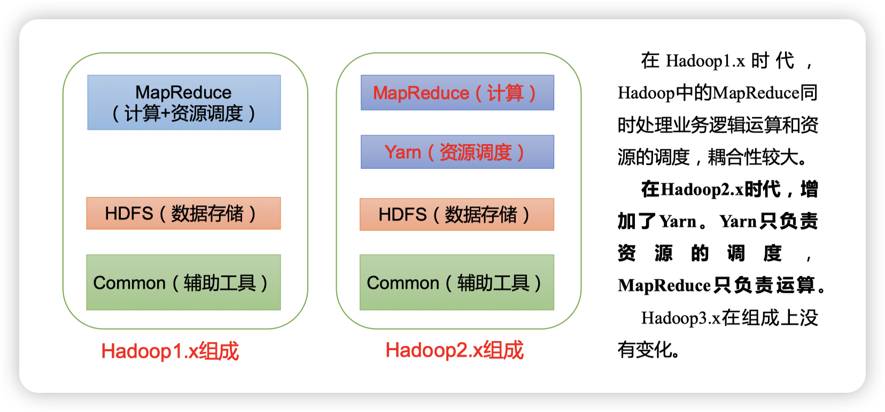

# 1.Hadoop 运行环境搭建

## 1.1Hadoop 运行环境搭建模版虚拟机环境准备

### ip设定、hostname更改、host映射添加

[见Linux学习笔记](./Linux/#指定静态ip)

### 虚拟机配置

* 使用yum安装功能，需要虚拟机可以正常上网，yum安装前可以先测试下虚拟机联网情况

  ```bash
  root@hadoop100 ~]# ping www.baidu.com
  PING www.baidu.com (14.215.177.39) 56(84) bytes of data.
  64 bytes from 14.215.177.39 (14.215.177.39): icmp_seq=1 ttl=128 time=8.60 ms
  64 bytes from 14.215.177.39 (14.215.177.39): icmp_seq=2 ttl=128 time=7.72 ms
  ```

* 安装epel-release

  注：Extra Packages for Enterprise Linux是为“红帽系”的操作系统提供额外的软件包，适用于RHEL、CentOS和Scientific Linux。相当于是一个软件仓库，大多数rpm包在官方 repository 中是找不到的）

  ```bash
  yum install -y epel-release
  ```

### 关闭防火墙，关闭防火墙开机自启

注意：在企业开发时，通常单个服务器的防火墙时关闭的。公司整体对外会设置非常安全的防火墙

```bash
[root@hadoop100 ~]# systemctl stop firewalld
[root@hadoop100 ~]# systemctl disable firewalld.service
```

### 创建用户，并修改用户的密码

```bash
[root@hadoop100 ~]# useradd ola
[root@hadoop100 ~]# passwd ola
```

### 配置用户具有root权限，方便后期加sudo执行root权限的命令

```bash
root@hadoop100 ~]# vim /etc/sudoers
```

修改/etc/sudoers文件，在%wheel这行下面添加一行，如下所示：

```bash
## Allow root to run any commands anywhere
root    ALL=(ALL)     ALL

## Allows people in group wheel to run all commands
%wheel  ALL=(ALL)       ALL
ola   ALL=(ALL)     NOPASSWD:ALL
```

ola这一行不要直接放到root行下面，因为所有用户都属于wheel组，你先配置了ola密功能，但是程序执行到%wheel行时，该功能又被覆盖回需要密码。所以ola要放到%wheel这行下面

### 在/opt目录下创建文件夹，并修改所属主和所属组

* 在/opt目录下创建module、software文件夹

  ```bash
  [root@hadoop100 ~]# mkdir /opt/module
  [root@hadoop100 ~]# mkdir /opt/software
  
  ```

* 修改module、software文件夹的所有者和所属组均为ola用户 

  ```bash
  [root@hadoop100 ~]# chown ola:ola /opt/module 
  [root@hadoop100 ~]# chown ola:ola /opt/software
  ```

* 查看module、software文件夹的所有者和所属组

  ```bash
  [root@hadoop100 ~]# ll /opt/
  总用量 0
  drwxr-xr-x. 2 ola  ola  6 3月  22 12:05 module
  drwxr-xr-x. 2 root root 6 10月 31 2018 rh
  drwxr-xr-x. 2 ola  ola  6 3月  22 12:05 software
  ```

### 卸载虚拟机自带的JDK

```bash
#查询是否安装
[root@hadoop100 ~]# rpm -qa | grep -i java 
javapackages-tools-3.4.1-11.el7.noarch
java-1.8.0-openjdk-headless-1.8.0.262.b10-1.el7.x86_64
tzdata-java-2020a-1.el7.noarch
java-1.7.0-openjdk-headless-1.7.0.261-2.6.22.2.el7_8.x86_64
java-1.8.0-openjdk-1.8.0.262.b10-1.el7.x86_64
python-javapackages-3.4.1-11.el7.noarch
java-1.7.0-openjdk-1.7.0.261-2.6.22.2.el7_8.x86_64
#卸载
[root@hadoop100 ~]# rpm -qa | grep -i java | xargs -n1 rpm -e --nodeps 
```

### 重启虚拟机

 ```bash
 [root@hadoop100 ~]# reboot
 ```

## 1.2.克隆虚拟机

### 克隆3台台

利用模板机hadoop100，克隆3台虚拟机：hadoop102 hadoop103 hadoop104 ，克隆时，要先关闭hadoop100
克隆后hadoop100所有配置和文件都会复制过来！！因此它的hostname依旧是hadoop100，需要进行下面的操作，更改配置变成新的虚拟机。

### 修改克隆机IP

[见Linux学习笔记](./Linux/#指定静态ip)，其中GATEWAY、DNS、BOOTPROTO不需要改，更改IPADDR即可，其中IPADDR网段不变，将地址改一下，比如102

### 修改克隆机主机名

[见Linux学习笔记](./Linux/#配置主机名)

### host映射

已经克隆过来了，不需要操作了

## 1.3.在克隆虚拟机上安装 JDK

> 在创建的普通用户下操作

### 卸载 JDK

[具体操作见本文档：卸载虚拟机自带的JDK](###卸载虚拟机自带的JDK)

###  导入JDK 

将 JDK 导入到 opt 目录下面的 software 文件夹下面

```bash
[ola@hadoop102 ~]# scp [jdk路径] root@192.168.109.131:/opt/software
```

检查是否上传成功

```bash
[ola@hadoop102 ~]# ll /opt/software/
total 190444
-rw-r--r--. 1 root root 195013152 Mar 22 13:55 jdk-8u212-linux-x64.tar.gz
```

### 解压 JDK

在software文件夹下，解压 JDK 到/opt/module 目录下

```bash
[ola@hadoop102 software]# tar -zxvf jdk-8u212-linux-x64.tar.gz -C /opt/module/
#查看解压是否成功
[ola@hadoop102 software]# ls /opt/module/
jdk1.8.0_212
```

### 配置 JDK 环境变量

* ```bash
  #新建/etc/profile.d/my_env.sh 文件
  [ola@hadoop102 software]# sudo vim /etc/profile.d/my_env.sh
  #在文档中添加，保存退出
  
  #JAVA_HOME
  export JAVA_HOME=/opt/module/jdk1.8.0_212
  export PATH=$PATH:$JAVA_HOME/bin
  
  #source 一下/etc/profile 文件，让新的环境变量 PATH 生效
  [ola@hadoop102 software]# source /etc/profile
  ```

### 测试 JDK 是否安装成功

```bash
[ola@hadoop102 software]# java -version
java version "1.8.0_212"
Java(TM) SE Runtime Environment (build 1.8.0_212-b10)
Java HotSpot(TM) 64-Bit Server VM (build 25.212-b10, mixed mode)
```

## 1.4.在克隆虚拟机上安装 Hadoop

###  导入

导入到 opt 目录下面的 software 文件夹下面

```bash
scp [hadoop路径] root@192.168.109.131:/opt/software
oop-3.1.3.tar.gz root@192.168.109.131:/opt/software
root@192.168.109.131's password:
hadoop-3.1.3.tar.gz                                                100%  322MB  37.9MB/s   00:08
```

检查是否上传成功

```bash
[root@hadoop102 software]# ll /opt/software/
总用量 520600
-rw-r--r--. 1 root root 338075860 3月  22 14:21 hadoop-3.1.3.tar.gz
-rw-r--r--. 1 root root 195013152 3月  22 13:55 jdk-8u212-linux-x64.tar.gz
```

### 解压

在software文件夹下，解压 到/opt/module 目录下

```bash
[root@hadoop102 software]# tar -zxvf hadoop-3.1.3.tar.gz -C /opt/module/
#查看解压是否成功
[root@hadoop102 software]# ls /opt/module/
hadoop-3.1.3  jdk1.8.0_212
```

### 配置环境变量

* ```bash
  #修改/etc/profile.d/my_env.sh 文件
  [root@hadoop102 software]# sudo vim /etc/profile.d/my_env.sh
  #在文档中添加，保存退出
  
  #HADOOP_HOME
  export HADOOP_HOME=/opt/module/hadoop-3.1.3
  export PATH=$PATH:$HADOOP_HOME/bin
  export PATH=$PATH:$HADOOP_HOME/sbin
  
  #source 一下/etc/profile 文件，让新的环境变量 PATH 生效
  [root@hadoop102 software]# source /etc/profile
  ```

### 测试 是否安装成功

```bash
[root@hadoop102 software]# hadoop version
Hadoop 3.1.3
Source code repository https://gitbox.apache.org/repos/asf/hadoop.git -r ba631c436b806728f8ec2f54ab1e289526c90579
Compiled by ztang on 2019-09-12T02:47Z
Compiled with protoc 2.5.0
From source with checksum ec785077c385118ac91aadde5ec9799
This command was run using /opt/module/hadoop-3.1.3/share/hadoop/common/hadoop-common-3.1.3.jar
```

## 1.5.Hadoop 目录结构

```bash
[root@hadoop102 hadoop-3.1.3]# ll
总用量 176
drwxr-xr-x. 2 ola ola    183 9月  12 2019 bin
drwxr-xr-x. 3 ola ola     20 9月  12 2019 etc
drwxr-xr-x. 2 ola ola    106 9月  12 2019 include
drwxr-xr-x. 3 ola ola     20 9月  12 2019 lib
drwxr-xr-x. 4 ola ola    288 9月  12 2019 libexec
-rw-rw-r--. 1 ola ola 147145 9月   4 2019 LICENSE.txt
-rw-rw-r--. 1 ola ola  21867 9月   4 2019 NOTICE.txt
-rw-rw-r--. 1 ola ola   1366 9月   4 2019 README.txt
drwxr-xr-x. 3 ola ola   4096 9月  12 2019 sbin
drwxr-xr-x. 4 ola ola     31 9月  12 2019 share
```

（1）bin 目录：存放对 Hadoop 相关服务（hdfs，yarn，mapred）进行操作的脚本 
（2）etc 目录：Hadoop 的配置文件目录，存放 Hadoop 的配置文件 
（3）lib 目录：存放 Hadoop 的本地库（对数据进行压缩解压缩功能） 
（4）sbin 目录：存放启动或停止 Hadoop 相关服务的脚本 
（5）share 目录：存放 Hadoop 的依赖 jar 包、文档、和官方案例

# 2.完全分布式运行模式（开发重点）

[Hadoop 官方网站](http://hadoop.apache.org/)
Hadoop 运行模式包括：本地模式、伪分布式模式以及完全分布式模式。

* 本地模式：单机运行，只是用来演示一下官方案例。生产环境不用。测试用。
* 伪分布式模式：也是单机运行，但是具备 Hadoop 集群的所有功能，一台服务器模 拟一个分布式的环境。个别缺钱的公司用来测试，生产环境不用。
* 完全分布式模式：多台服务器组成分布式环境。生产环境使用。

## 2.1.准备虚拟机

详情见：[Hadoop 运行环境搭建](#Hadoop 运行环境搭建)

## 2.2.编写集群分发脚本 xsync

### scp（secure copy）安全拷贝（适用于第一次复制）

scp 可以实现服务器与服务器之间的数据拷贝

* 语法

  ```bash
  scp -r $pdir/$fname $user@$host:$pdir/$fname 
  命令 递归 要拷贝的文件路径/名称 目的地用户@主机:目的地路径/名称
  ```

* 将102服务器上的JDK和hadoop拷贝到103，104服务器上，前提在 hadoop102、hadoop103、hadoop104 都已经创建好的 /opt/module，/opt/software 两个目录，并且已经把这两个目录修改为 ola:ola

  * 在 hadoop102 上， 将 hadoop102 中 /opt/module/jdk1.8.0_212 目录拷贝到 hadoop103 上

    ```bash
    [ola@hadoop102 ~]$ scp -r /opt/module/jdk1.8.0_212 ola@hadoop103:/opt/module
    ```

  * 在 hadoop103 上， 将 hadoop102 中 /opt/module/hadoop-3.1.3 目录拷贝到 hadoop103 上

    ```bash
    [ola@hadoop103 ~]$ scp -r ola@haoop102:/opt/module/hadoop-3.1.3 /opt/module
    ```

  * 在 hadoop103 上操作，将 hadoop102 中/opt/module 目录下 hadoop104 上

    ```bash
    [ola@hadoop104 ~]$ scp -r ola@hadoop102:/opt/module/jdk1.8.0_212 ola@hadoop104:/opt/module
    [ola@hadoop104 ~]$ scp -r ola@hadoop102:/opt/module/hadoop-3.1.3 ola@hadoop104:/opt/module
    ```

### rsync 远程同步工具（第一次复制后，同步更改）

rsync 主要用于备份和镜像。具有速度快、避免复制相同内容和支持符号链接的优点。rsync 和 scp 区别：用 rsync 做文件的复制要比 scp 的速度快，rsync 只对差异文件做更新。scp 是把所有文件都复制过去。

* 语法

  ```bash
  rsync -av $pdir/$fname $user@$host:$pdir/$fname 
  命令 选项参数 选项参数说明 要拷贝的文件路径/名称 目的地用户@主机:目的地路径/名称
  ```

  | 选项 | 功能         |
  | ---- | ------------ |
  | -a   | 归档拷贝     |
  | -v   | 显示复制过程 |

### xsync 集群分发脚本（运行脚本，自动实现集群分发）

> 执行没有放在环境变量里的命令，需要写全路径，比如 home/ola/bin/xsync，而不能单独使用xsync，除非在home/ola/bin目录下面。
>
> 像ll，ls，mkdir这样的命令可以全局使用，是因为已经在根目录/bin下了

* 本质：利用rsync 命令，在脚本中实现循环复制文件到所有节点的相同目录下

* 原理：在/home/ola/bin目录下面，写一个命令脚本`xsync`，然后将这个命令路径放在/bin/下面

* 实现方式

  * 第一步，编写脚本，放在/home/ola/bin目录中，文件叫`xsycn`，没有任何后缀，脚本命令是：在hadoop102 hadoop103 hadoop104中执行rsync，同步文档 

    ```bash
    #!/bin/bash
    
    #1. 判断参数个数
    if [ $# -lt 1 ]
    then
        echo Not Enough Argument!
        exit;
    fi
    #2. 遍历集群所有机器
    for host in hadoop102 hadoop103 hadoop104
    do
        echo ==================== $host ====================
        #3. 遍历所有目录，挨个发送
        for file in $@
        do
            #4. 判断文件是否存在
            if [ -e $file ]
            then
                #5. 获取父目录
                pdir=$(cd -P $(dirname $file); pwd)
                #6. 获取当前文件的名称
                fname=$(basename $file)
                ssh $host "mkdir -p $pdir"
                rsync -av $pdir/$fname $host:$pdir
            else
                echo $file does not exists!
            fi
        done
    done
    ```

  * 第二步，测试脚本

    ```bash
    #测试脚本，将/home/ola/bin复制到102，103，104中
    [ola@hadoop102 bin]$ xsync /home/ola/bin
    -bash: /home/ola/bin/xsync: 权限不够
    #修改脚本 xsync 具有执行权限
    [ola@hadoop102 bin]$ chmod +x xsync
    #再次测试脚本
    [ola@hadoop102 bin]$ xsync /home/ola/bin
    ```

  * 第三步，同步/etc/profile.d/my_env.sh（root 所有者），注意：如果用了 sudo，那么 xsync命令 一定要给它的路径补全。

    ```bash
    [ola@hadoop102 ~]$ sudo /home/ola/bin/xsync /etc/profile.d/my_env.sh
    ```

  * 现在my_env.sh已经在103，104中了，执行source /etc/profile让环境变量生效

    ```bash
    [ola@hadoop103 ~]$ source /etc/profile
    [ola@hadoop104 ~]$ source /etc/profile
    ```

## 2.3.配置SSH 无密登录

* 什么是 ssh(Secure Shell) ，ssh可以实现一台服务器登录另一台服务器

  * 基本语法：ssh 另一台电脑的 IP 地址，例如 ssh ola@198.162.109.129

* 无密钥配置，实现免密登录其他服务器

  * 原理，`将公钥发给谁，就可以免密登录谁`（用自己的公钥换登录别人自由）

    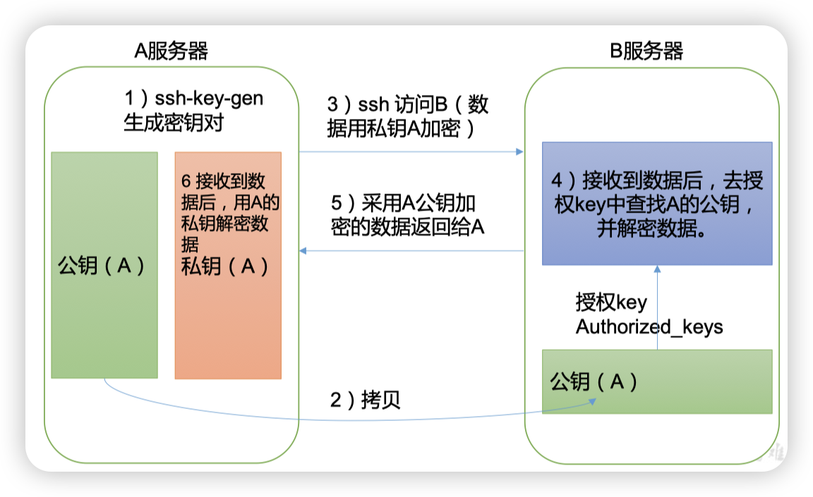

  * **实现hadoop102免密登录103**

    * **第一步，在102上，找到隐藏文件夹.ssh**

      在102服务器上执行过ssh命令登录103，会在102和103的用户目录（我的是/home/ola）下生成.ssh文件夹，是隐藏目录，可以通过下面方式查看到

      ```bash
      [ola@hadoop102 ~]$ ls -al
      总用量 20
      drwx------. 4 ola  ola   122 3月  22 21:26 .
      drwxr-xr-x. 3 root root   17 3月  22 17:49 ..
      -rw-------. 1 ola  ola   873 3月  22 21:26 .bash_history
      -rw-r--r--. 1 ola  ola    18 4月   1 2020 .bash_logout
      -rw-r--r--. 1 ola  ola   193 4月   1 2020 .bash_profile
      -rw-r--r--. 1 ola  ola   231 4月   1 2020 .bashrc
      drwxrwxr-x. 2 ola  ola    19 3月  22 21:05 bin
      drwx------. 2 ola  ola    25 3月  22 19:50 .ssh
      -rw-------. 1 ola  ola  3494 3月  22 21:05 .viminfo
      ```

      * .ssh 文件夹下（~/.ssh）的文件功能解释

      * 当102服务器第一次登录103服务器时，只有102服务器（客户端）的`known_hosts`文件可能会发生变化（添加103服务器的公钥），而103服务器的`known_hosts`文件不会受到影响

      * | 文件名称        | 用途                                                    | 如何生成                                                     |
        | --------------- | ------------------------------------------------------- | ------------------------------------------------------------ |
        | known_hosts     | * 我访问过谁<br />记录访问过的计算机的公钥              | * 通过ssh生成<br />* 前提：102和103都没访问过对方<br />102初次访问103，会生成known_hosts里面存上103的公钥；103不会生成任何文件 |
        | id_rsa          | * 我的私钥                                              | 通过：ssh-keygen -t rsa 生成                                 |
        | id_rsa.pub      | * 我的公钥                                              | 通过：ssh-keygen -t rsa 生成                                 |
        | authorized_keys | * 谁可以免密登录我 <br />存放授权过的无密登录服务器公钥 | 免密配置后自动生成                                           |

    * **第二步，在102上，给102生成公钥和私钥的2个文件夹**（在.ssh文件夹下）

      ```bash
      #进入.ssh
      [ola@hadoop102 ~]$ cd .ssh/
      #生成id_rsa.pub，id_rsa，三次回车！！！
      [ola@hadoop102 .ssh]$ ssh-keygen -t rsa
      Generating public/private rsa key pair.
      Enter file in which to save the key (/home/ola/.ssh/id_rsa):
      Enter passphrase (empty for no passphrase):
      Enter same passphrase again:
      Your identification has been saved in /home/ola/.ssh/id_rsa.
      Your public key has been saved in /home/ola/.ssh/id_rsa.pub.
      The key fingerprint is:
      SHA256:I/+8Oly+wx+ycT60jn6aQUrYSYWJNZbPeNtRg9jNSho ola@hadoop102
      The key's randomart image is:
      +---[RSA 2048]----+
      |       o++.o +   |
      |      ..+oE + =  |
      |        .+ + o . |
      |       +..= o    |
      |      o S..o .   |
      |       + +o o    |
      |       .o++.o.   |
      |        oo+X+.   |
      |        .+@O+.   |
      +----[SHA256]-----+
      ```

    * **第三步，在102上，将id_rsa.pub中的公钥拷贝到103上**（在.ssh文件夹下）

    * 完成操作后，103上会生成一个文件authorized_keys，存放授权过的无密登录服务器102的公钥

      ```bash
      [ola@hadoop102 .ssh]$ ssh-copy-id hadoop103
      /usr/bin/ssh-copy-id: INFO: Source of key(s) to be installed: "/home/ola/.ssh/id_rsa.pub"
      /usr/bin/ssh-copy-id: INFO: attempting to log in with the new key(s), to filter out any that are already installed
      /usr/bin/ssh-copy-id: INFO: 1 key(s) remain to be installed -- if you are prompted now it is to install the new keys
      ola@hadoop103's password:
      
      Number of key(s) added: 1
      
      Now try logging into the machine, with:   "ssh 'hadoop103'"
      and check to make sure that only the key(s) you wanted were added.
      ```

      成功！！以后在102上执行ssh hadoop103可以不用再输入密码了！！

    还可以通过相同的方式，实现在102上免密登录104，以及102自己（如果没有配置免密，自己登录自己也需要输入密码。至于为啥要设置自己，可能是以免在执行脚本的时候，需要在102上登录102，例如xsync）；104免密登录102，103同上；103免密登录102，104同上。

## 2.4.配置集群HDFS、Yarn、MapReduce

即将见到完整的Hadoop！！！

### 2.4.1.先了解一下HDFS 

Hadoop Distributed File System，简称 HDFS，是一个分布式文件系统

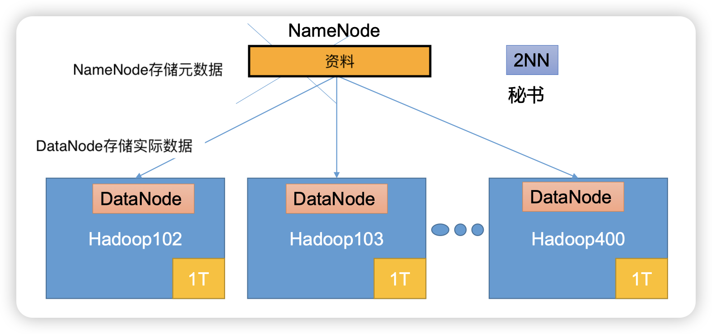

* NameNode--存储元数据，`集群只有一个`，在core-*.xml中配置

  存储文件的元数据， 如文件名，文件目录结构， 文件属性（生成时间、副本数、 文件权限），以及每个文件的块列表和块所在的DataNode等。

* DataNode--存储实际数据，`集群存在多个`，每个服务器一个

  在本地文件系统存储文件块数据，以及块数据的校验和。

* 2NN(SecondaryNameNode)--备份NameNode，`集群只有一个`，在hdfs-*.xml配置

  每隔一段时间对NameNode元数据备份。

### 2.4.2.部署规划

>  NameNode和SecondaryNameNode不要安装在同一台服务器
>
> ResourceManager不要和NameNode、SecondaryNameNode配置在同一台机器上，因为它很消耗内存

方案：

|      | hadoop102            | hadoop103                       | hadoop104                      |
| ---- | -------------------- | ------------------------------- | ------------------------------ |
| HDFS | NameNode<br>DataNode | <br/>DataNode                   | SecondaryNameNode<br/>DataNode |
| YARN | <br/>NodeManager     | ResourceManager<br/>NodeManager | <br/>NodeManager               |

* Hadoop配置文件说明，如果没有特殊需求，不需要更改自定义配置文件

  * 默认配置文件

    * 位置：存放在Hadoop的jar包中的位置--???具体在哪里我也没搞清楚

      | 要获取的默认文件                                  | 文件存放在Hadoop的jar包中的位置                           |
      | ------------------------------------------------- | --------------------------------------------------------- |
      | [core-default.xml](../other/core-default.xml)     | hadoop-common-3.1.3.jar/core-default.xml                  |
      | [hdfs-default.xml](../other/hdfs-default.xml)     | hadoop-hdfs-3.1.3.jar/hdfs-default.xml                    |
      | [yarn-default.xml](../other/yarn-default.xml)     | hadoop-yarn-common-3.1.3.jar/yarn-default.xml             |
      | [mapred-default.xml](../other/mapred-default.xml) | hadoop-mapreduce-client-core-3.1.3.jar/mapred-default.xml |

  * 自定义配置文件

    * 存放位置：存放在$HADOOP_HOME/etc/hadoop，关于$HADOOP_HOME地址，[上面安装hadoop时已经定义好了](####配置环境变量)，包括core-site.xml、hdfs-site.xml、yarn-site.xml、mapred-site.xml这四个文件，可以根据项目需求重新进行修改配置

### 2.4.3.在102上正式配置

> 总结:
> core-site.xml，hdfs-site.xml---->配置HDFS
> yarn-site.xml---->配置yarn
> mapred-site.xml---->配置MapReduce

* core-site.xml--配置NameNode、DataNode，102

  ```bash
  [ola@hadoop102 .ssh]$ cd $HADOOP_HOME/etc/hadoop
  [ola@hadoop102 hadoop]$ vim core-site.xml
  ```

  文档内容：

  ```bash
  <?xml version="1.0" encoding="UTF-8"?>
  <?xml-stylesheet type="text/xsl" href="configuration.xsl"?>
  
  <configuration>
      <!-- 指定NameNode的地址 -->
      <property>
          <name>fs.defaultFS</name>
          <value>hdfs://hadoop102:8020</value>
      </property>
  
      <!-- 指定hadoop数据的存储目录 -->
      <property>
          <name>hadoop.tmp.dir</name>
          <value>/opt/module/hadoop-3.1.3/data</value>
      </property>
  </configuration>
  ```

* hdfs-site.xml--NameNode和2NN的web端访问地址，102，104

  ```bash
  [ola@hadoop102 hadoop]$ vim hdfs-site.xml
  ```

  文档内容

  ```bash
  <?xml version="1.0" encoding="UTF-8"?>
  <?xml-stylesheet type="text/xsl" href="configuration.xsl"?>
  
  <configuration>
  	<!-- nn web端访问地址-->
  	<property>
          <name>dfs.namenode.http-address</name>
          <value>hadoop102:9870</value>
      </property>
  	<!-- 2nn web端访问地址-->
      <property>
          <name>dfs.namenode.secondary.http-address</name>
          <value>hadoop104:9868</value>
      </property>
  </configuration>
  ```

* yarn-site.xml--指定ResourceManager的地址，103

  ```bash
  [ola@hadoop102 hadoop]$ vim yarn-site.xml
  ```

  文档内容

  ```bash
  <?xml version="1.0" encoding="UTF-8"?>
  <?xml-stylesheet type="text/xsl" href="configuration.xsl"?>
  <configuration>
      <!-- 指定MR走shuffle -->
      <property>
          <name>yarn.nodemanager.aux-services</name>
          <value>mapreduce_shuffle</value>
      </property>
  
      <!-- 指定ResourceManager的地址-->
      <property>
          <name>yarn.resourcemanager.hostname</name>
          <value>hadoop103</value>
      </property>
  
      <!-- 环境变量的继承 -->
      <property>
          <name>yarn.nodemanager.env-whitelist</name>
          <value>JAVA_HOME,HADOOP_COMMON_HOME,HADOOP_HDFS_HOME,HADOOP_CONF_DIR,CLASSPATH_PREPEND_DISTCACHE,HADOOP_YARN_HOME,HADOOP_MAPRED_HOME</value>
      </property>
  </configuration>
  ```

* mapred-site.xml--指定MapReduce程序运行在Yarn上

  ```bash
  [ola@hadoop102 hadoop]$ vim mapred-site.xml
  ```

  文档内容

  ```bash
  <?xml version="1.0" encoding="UTF-8"?>
  <?xml-stylesheet type="text/xsl" href="configuration.xsl"?>
  
  <configuration>
  	<!-- 指定MapReduce程序运行在Yarn上 -->
      <property>
          <name>mapreduce.framework.name</name>
          <value>yarn</value>
      </property>
  </configuration>
  ```

### 2.4.4.在集群上分发配置好的102Hadoop配置文件

```bash
[ola@hadoop102 hadoop]$ xsync /opt/module/hadoop-3.1.3/etc/hadoop/
```

### 2.4.5.去103和104上查看文件分发情况

```bash
[ola@hadoop103 .ssh]$ vim /opt/module/hadoop-3.1.3/etc/hadoop/mapred-site.xml
[ola@hadoop104 etc]$ vim /opt/module/hadoop-3.1.3/etc/hadoop/mapred-site.xml
```

## 2.5.群起集群

### 2.5.1.配置workers

* 第一步：在102下配置workers文档

  ```bash
  [ola@hadoop102 hadoop]$ vim /opt/module/hadoop-3.1.3/etc/hadoop/workers
  ```

​	把原文中的localhost删除，增加下面内容，该文件中添加的内容结尾不允许有空格，文	件中不允许有空行：
​	hadoop102

​	hadoop103

​	hadoop104

* 第二步：同步所有节点配置文件etc到103，104

  ```bash
  [ola@hadoop102 hadoop]$ xsync /opt/module/hadoop-3.1.3/etc
  ```

### 2.5.2.启动集群

* 第一步：在102上，如果集群是第一次启动，需要在hadoop102**节点格式化NameNode**

>
> 注意：格式化NameNode，会产生新的集群id，导致NameNode和DataNode的集群id不一致，集群找不到已往数据。如果集群在运行过程中报错，需要重新格式化NameNode的话，一定要先停止namenode和datanode进程，并且要删除所有机器的data和logs目录，然后再进行格式化。

初始化后，$HADOOP_HOME下多了data和logs目录，如下：

```bash
[ola@hadoop102 hadoop-3.1.3]$ ll
总用量 176
drwxr-xr-x. 2 ola ola    183 9月  12 2019 bin
drwxrwxr-x. 3 ola ola     17 3月  23 15:22 data
drwxr-xr-x. 3 ola ola     20 9月  12 2019 etc
drwxr-xr-x. 2 ola ola    106 9月  12 2019 include
drwxr-xr-x. 3 ola ola     20 9月  12 2019 lib
drwxr-xr-x. 4 ola ola    288 9月  12 2019 libexec
-rw-rw-r--. 1 ola ola 147145 9月   4 2019 LICENSE.txt
drwxrwxr-x. 2 ola ola     36 3月  23 15:22 logs
-rw-rw-r--. 1 ola ola  21867 9月   4 2019 NOTICE.txt
-rw-rw-r--. 1 ola ola   1366 9月   4 2019 README.txt
drwxr-xr-x. 3 ola ola   4096 9月  12 2019 sbin
drwxr-xr-x. 4 ola ola     31 9月  12 2019 share
```

* 第二步，在102上，**启动HDFS**，运行后，在102$HADOOP_HOME下多了data和logs目录，也会在103，104产生。

  $HADOOP_HOME下sbin文件夹内的start-dfs.sh，脚本是用于启动Hadoop分布式文件系统（HDFS）相关的守护进程的。`start-dfs.sh`是一个Shell脚本，运行它时，它会启动HDFS集群中的3个核心服务：NameNode、SecondaryNameNode、DataNode

  ```bash
  [ola@hadoop102 hadoop-3.1.3]$ sbin/start-dfs.sh
  Starting namenodes on [hadoop102]
  Starting datanodes
  hadoop103: WARNING: /opt/module/hadoop-3.1.3/logs does not exist. Creating.
  hadoop104: WARNING: /opt/module/hadoop-3.1.3/logs does not exist. Creating.
  Starting secondary namenodes [hadoop104]
  ```

  * 在Hadoop环境中，`jps`命令经常被用来快速检查Hadoop集群各个组件（如NameNode、DataNode、ResourceManager、	NodeManager等）的运行状态。

    ```bash
    [ola@hadoop102 hadoop-3.1.3]$ jps
    12528 NameNode
    12678 DataNode
    13048 Jps
    
    [ola@hadoop103 hadoop-3.1.3]$ jps
    12629 Jps
    12015 DataNode
    
    [ola@hadoop104 etc]$ jps
    11954 DataNode
    12262 Jps
    12063 SecondaryNameNode
    ```

* 第三步，在103上，在配置了ResourceManager的节点（hadoop103）**启动YARN**

  ```bash
  [ola@hadoop103 hadoop-3.1.3]$ sbin/start-yarn.sh
  Starting resourcemanager
  Starting nodemanagers
  ```

​	同样可以使用`jps`来查看ResourceManager运行状态

* Web端查看HDFS的NameNode

  http://hadoop102:9870  ------->. 查看HDFS上存储的数据信息

  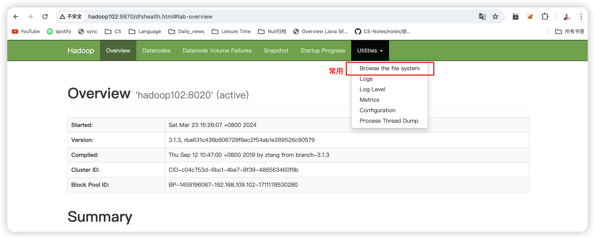

* Web端查看YARN的ResourceManager

  http://hadoop103:8088  -------->  查看YARN上运行的Job信息，只有计算时才有数据

  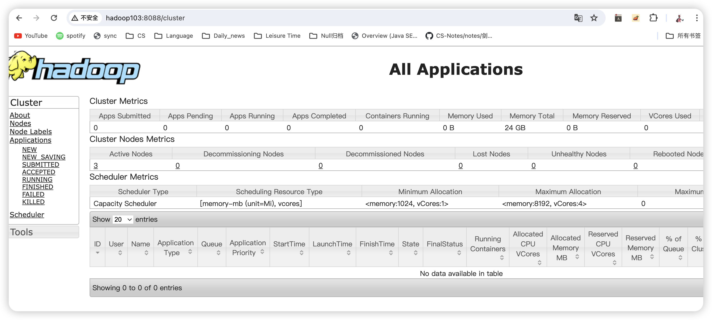

## 2.6.集群基本测试

> 以下操作在102服务器上，尝试在103上操作，也可以，看来在不同集群都可以操作

在Hadoop命令行工具中，`fs`是指文件系统（File System）的缩写，这里，`fs`后面通常跟着具体的文件系统命令和选项，用于指定要执行的操作，如列出文件、创建目录、复制文件等。

`hadoop fs -ls /`会列出HDFS根目录下的所有文件和目录

**测试HDFS：**

* 上传文件到集群

  * 在集群上新建文件夹input

  ```bash
  [ola@hadoop102 logs]$ hadoop fs -mkdir /input
  ```

  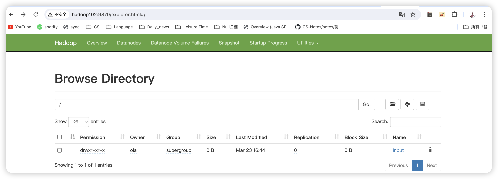

  * 上传小文件到input

  ```bash
  [ola@hadoop102 hadoop-3.1.3]$ hadoop fs -put $HADOOP_HOME/wcinput/word.txt /input
  2024-03-23 16:50:01,537 INFO sasl.SaslDataTransferClient: SASL encryption trust check: localHostTrusted = false, remoteHostTrusted = false
  ```

  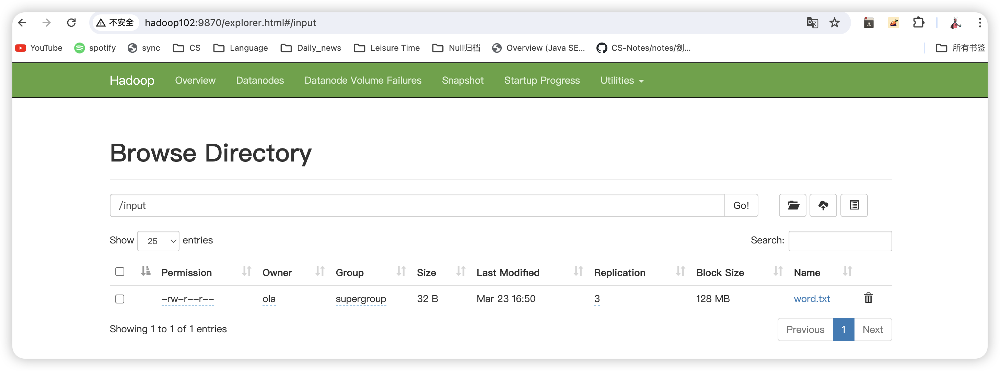

  * 上传大文件到根目录

  ```bash
  [ola@hadoop103 logs]$ hadoop fs -put  /opt/software/jdk-8u212-linux-x64.tar.gz  /
  ```

* 查看HDFS文件存储路径

  ```bash
  [ola@hadoop102 subdir0]$ ll
  总用量 191952
  -rw-rw-r--. 1 ola ola        32 3月  23 16:50 blk_1073741825
  -rw-rw-r--. 1 ola ola        11 3月  23 16:50 blk_1073741825_1001.meta
  -rw-rw-r--. 1 ola ola 134217728 3月  23 16:53 blk_1073741826
  -rw-rw-r--. 1 ola ola   1048583 3月  23 16:53 blk_1073741826_1002.meta
  -rw-rw-r--. 1 ola ola  60795424 3月  23 16:53 blk_1073741827
  -rw-rw-r--. 1 ola ola    474975 3月  23 16:53 blk_1073741827_1003.meta
  -rw-rw-r--. 1 ola ola        32 3月  23 16:56 blk_1073741828
  -rw-rw-r--. 1 ola ola        11 3月  23 16:56 blk_1073741828_1004.meta
  [ola@hadoop102 subdir0]$ pwd
  /opt/module/hadoop-3.1.3/data/dfs/data/current/BP-1459196067-192.168.109.102-1711178530280/current/finalized/subdir0/subdir0
  ```

* 查看文件内容

  这正是刚才上传的word.txt文件

  ```bash
  [ola@hadoop102 subdir0]$ cat blk_1073741825
  Everthing is gonna be okay!
  Li
  ```

* 拼接文件

  ```bash
  #使用blk_1073741826和blk_1073741827生成tmp.tar.gz
  [ola@hadoop102 subdir0]$ cat blk_1073741826 >> tmp.tar.gz
  [ola@hadoop102 subdir0]$ cat blk_1073741827 >> tmp.tar.gz
  #解压
  [ola@hadoop102 subdir0]$ tar -zxvf tmp.tar.gz
  ```

* 下载集群文件到linux

  ```bash
  [ola@hadoop102 s]$ hadoop fs -get /jdk-8u212-linux-x64.tar.gz ./
  2024-03-23 17:36:28,689 INFO sasl.SaslDataTransferClient: SASL encryption trust check: localHostTrusted = false, remoteHostTrusted = false
  [ola@hadoop102 s]$ ll
  总用量 190444
  -rw-r--r--. 1 ola ola 195013152 3月  23 17:36 jdk-8u212-linux-x64.tar.gz
  ```

测试yarn：

* 执行wordcount程序，可以在下图中看到执行任务

  ```bash
  [ola@hadoop102 hadoop-3.1.3]$ hadoop jar share/hadoop/mapreduce/hadoop-mapreduce-examples-3.1.3.jar wordcount /input /output
  ```

​	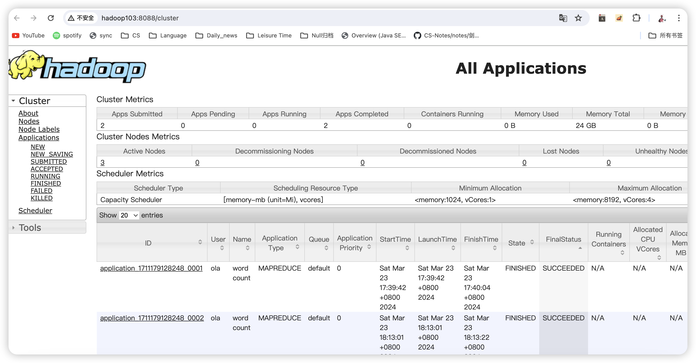	

## 2.7.配置历史运行记录服务器

上图中有个history入口，可以查看程序的历史运行情况，需要配置一下历史服务器。具体配置步骤如下:

* 在102配置mapred-site.xml

  ```bash
  [ola@hadoop102 hadoop]$ vim mapred-site.xml
  ```

  ```bash
     <!-- 历史服务器端地址 -->
     <property>
          <name>mapreduce.jobhistory.address</name>
          <value>hadoop102:10020</value>
     </property>
  
     <!-- 历史服务器web端地址 -->
     <property>
          <name>mapreduce.jobhistory.webapp.address</name>
          <value>hadoop102:19888</value>
     </property>
  ```

* 分发配置到103，104

  ```bash
  [ola@hadoop102 hadoop]$ xsync $HADOOP_HOME/etc/hadoop/mapred-site.xml
  ```

* 在102启动历史服务器

  ```bash
  [ola@hadoop102 hadoop]$ mapred --daemon start historyserver
  ```

* 查看历史服务器是否启动

  ```bash
  [ola@hadoop102 hadoop]$ jps
  12528 NameNode
  14098 Jps
  12678 DataNode
  12951 NodeManager
  14039 JobHistoryServer
  ```

* 查看JobHistory

  http://hadoop102:19888/jobhistory
  
  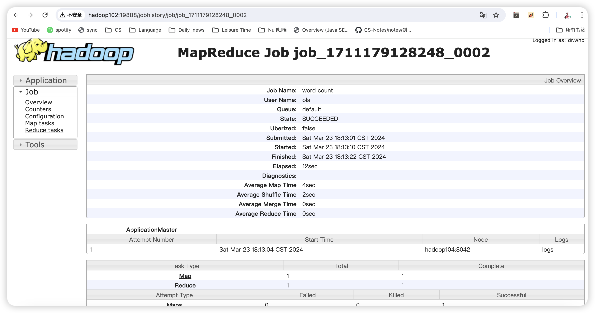

## 2.8.配置日志的聚集

上图中有个logs入口，需要配置一下
日志聚集概念：应用运行完成以后，将程序运行日志信息上传到HDFS系统上
日志聚集功能好处：可以方便的查看到程序运行详情，方便开发调试

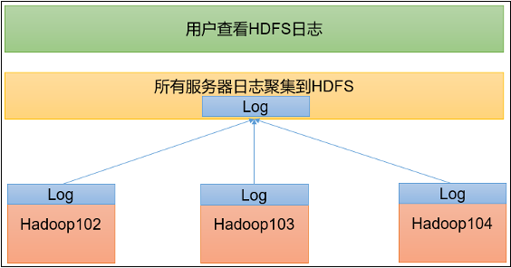

* 在102配置yarn-site.xml

  ```bash
  [ola@hadoop102 hadoop]$ vim yarn-site.xml
  ```

  配置：

  ```bash
  <!-- 开启日志聚集功能 -->
  <property>
      <name>yarn.log-aggregation-enable</name>
      <value>true</value>
  </property>
  <!-- 设置日志聚集服务器地址 -->
  <property>  
      <name>yarn.log.server.url</name>  
      <value>http://hadoop102:19888/jobhistory/logs</value>
  </property>
  <!-- 设置日志保留时间为7天 -->
  <property>
      <name>yarn.log-aggregation.retain-seconds</name>
      <value>604800</value>
  </property>
  ```

* 分发配置到103，104

  ```bash
  [ola@hadoop102 hadoop]$ xsync $HADOOP_HOME/etc/hadoop/yarn-site.xml
  ```

* 在103上关闭NodeManager 、ResourceManager，在102上关闭HistoryServer

  ```bash
  #关闭NodeManager 、ResourceManager
  [ola@hadoop103 hadoop-3.1.3]$ sbin/stop-yarn.sh
  Stopping nodemanagers
  hadoop103: WARNING: nodemanager did not stop gracefully after 5 seconds: Trying to kill with kill -9
  hadoop102: WARNING: nodemanager did not stop gracefully after 5 seconds: Trying to kill with kill -9
  hadoop104: WARNING: nodemanager did not stop gracefully after 5 seconds: Trying to kill with kill -9
  Stopping resourcemanager
  #关闭后检查一下
  [ola@hadoop103 hadoop-3.1.3]$ jps
  13656 Jps
  12015 DataNode
  ```

  ```bash
  #关闭前先检查一下
  [ola@hadoop102 hadoop-3.1.3]$ jps
  12528 NameNode
  14705 Jps
  12678 DataNode
  14039 JobHistoryServer
  #关闭HistoryServer
  [ola@hadoop102 hadoop-3.1.3]$ mapred --daemon stop historyserver
  #关闭后检查
  [ola@hadoop102 hadoop-3.1.3]$ jps
  12528 NameNode
  12678 DataNode
  14760 Jps
  ```

* 在103上启动NodeManager 、ResourceManager，在102上启动HistoryServer

  ```bash
  #启动NodeManager 、ResourceManager
  [ola@hadoop103 hadoop-3.1.3]$ sbin/start-yarn.sh
  Starting resourcemanager
  Starting nodemanagers
  #开启后检查一下
  [ola@hadoop103 hadoop-3.1.3]$ jps
  13817 ResourceManager
  13945 NodeManager
  12015 DataNode
  14303 Jps
  ```

  ```bash
  #启动HistoryServer
  [ola@hadoop102 hadoop-3.1.3]$ mapred --daemon start historyserver
  #开启后检查
  [ola@hadoop102 hadoop-3.1.3]$ jps
  12528 NameNode
  14821 NodeManager
  12678 DataNode
  15078 Jps
  15018 JobHistoryServer
  ```

* 执行WordCount程序，之前历史执行的日志看不到了，需要重新执行下新的任务，一个任务对应一个输出文件夹，将输出设置为新文件夹output2

  ```bash
  [ola@hadoop102 hadoop]$ hadoop jar share/hadoop/mapreduce/hadoop-mapreduce-examples-3.1.3.jar wordcount /input /output2
  ```

* 查看日志

  * 历史服务器地址

    http://hadoop102:19888/jobhistory

  * 点击某个历史任务

  * 点击查看任务运行日志

## 2.9.集群启动/停止方式总结

### 第一种：模块逐一启动/停止

* 在配置了NameNode的服务器上启动/停止HDFS---102

  ```bash
  [ola@hadoop102 hadoop-3.1.3]$ sbin/start-dfs.sh
  [ola@hadoop102 hadoop-3.1.3]$ sbin/stop-dfs.sh
  ```

* 在配置了ResourceManager的服务器上启动/停止YARN---103

  ```bash
  [ola@hadoop103 hadoop-3.1.3]$ sbin/start-yarn.sh
  [ola@hadoop103 hadoop-3.1.3]$ sbin/stop-yarn.sh
  ```

* 在配置了历史服务器的服务器上启动/停止历史服务器---102

  ```bash
  [ola@hadoop102 hadoop]$ mapred --daemon start historyserver
  [ola@hadoop102 hadoop]$ mapred --daemon stop historyserver
  ```

### 第二种：服务组件逐一启动停止

* 在各服务器单独启动/停止HDFS组件

  ```bash
  $HADOOP_HOME/bin/hdfs --daemon start/stop namenode/datanode/secondarynamenode
  ```

* 在各服务器单独启动/停止Yarn

  ```bash
  $HADOOP_HOME/bin/yarn --daemon start/stop  resourcemanager/nodemanager
  ```

### 第三种：集群启停脚本

* 创建Hadoop集群启停脚本（包含HDFS，Yarn，Historyserver）

  > 使用方法：
  >
  > 开启：[ola@hadoop102 bin]$ myhadoop.sh start
  >
  > 关闭：[ola@hadoop102 bin]$ myhadoop.sh start

  ```bash
  [ola@hadoop102 hadoop-3.1.3]$ cd /home/ola/bin
  [ola@hadoop102 bin]$ vim myhadoop.sh
  ```

  * ```bash
    #!/bin/bash
    
    if [ $# -lt 1 ]
    then
        echo "No Args Input..."
        exit ;
    fi
    
    case $1 in
    "start")
            echo " =================== 启动 hadoop集群 ==================="
    
            echo " --------------- 启动 hdfs ---------------"
            ssh hadoop102 "/opt/module/hadoop-3.1.3/sbin/start-dfs.sh"
            echo " --------------- 启动 yarn ---------------"
            ssh hadoop103 "/opt/module/hadoop-3.1.3/sbin/start-yarn.sh"
            echo " --------------- 启动 historyserver ---------------"
            ssh hadoop102 "/opt/module/hadoop-3.1.3/bin/mapred --daemon start historyserver"
    ;;
    "stop")
            echo " =================== 关闭 hadoop集群 ==================="
    
            echo " --------------- 关闭 historyserver ---------------"
            ssh hadoop102 "/opt/module/hadoop-3.1.3/bin/mapred --daemon stop historyserver"
            echo " --------------- 关闭 yarn ---------------"
            ssh hadoop103 "/opt/module/hadoop-3.1.3/sbin/stop-yarn.sh"
            echo " --------------- 关闭 hdfs ---------------"
            ssh hadoop102 "/opt/module/hadoop-3.1.3/sbin/stop-dfs.sh"
    ;;
    *)
        echo "Input Args Error..."
    ;;
    esac
    ```

  * 保存后退出，然后赋予脚本执行权限

    ```bash
    [ola@hadoop102 bin]$ chmod +x myhadoop.sh
    ```

* 创建查看三台服务器Java进程的脚本：jpsall

  > 使用方法：[ola@hadoop102 bin]$ jpsall

  ```bash
  [ola@hadoop102 hadoop-3.1.3]$ cd /home/ola/bin
  [ola@hadoop102 bin]$ vim jpsall
  ```

  * ```bash
    #!/bin/bash
    
    for host in hadoop102 hadoop103 hadoop104
    do
            echo =============== $host ===============
            ssh $host jps 
    done
    ```

  * 保存后退出，然后赋予脚本执行权限

    ```bash
    [ola@hadoop102 bin]$ chmod +x jpsall
    ```

* 分发/home/ola/bin目录，保证自定义脚本在三台机器上都可以使用

  ```bash
  [ola@hadoop102 bin]$ xsync /home/ola/bin/
  ```

## 2.10.常用端口号说明

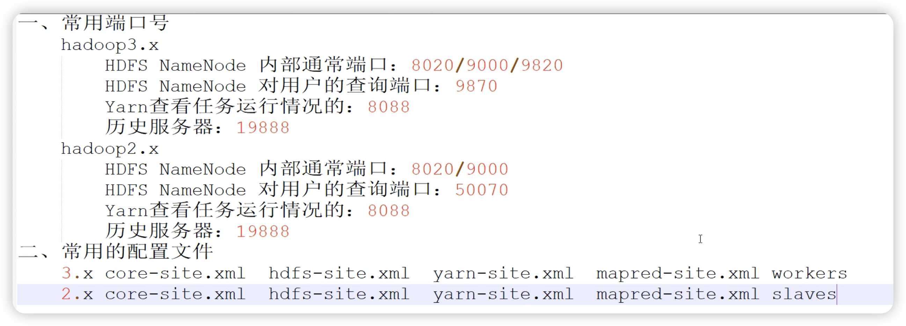

| 端口名称                  | Hadoop2.x   | Hadoop3.x         |
| ------------------------- | ----------- | ----------------- |
| NameNode内部通信端口      | 8020 / 9000 | 8020 /  9000/9820 |
| NameNode HTTP UI          | 50070       | 9870              |
| MapReduce查看执行任务端口 | 8088        | 8088              |
| 历史服务器通信端口        | 19888       | 19888             |

## 2.11.常用配置文件

> 3和2只有一个不同，就是2的salves更改成了workers

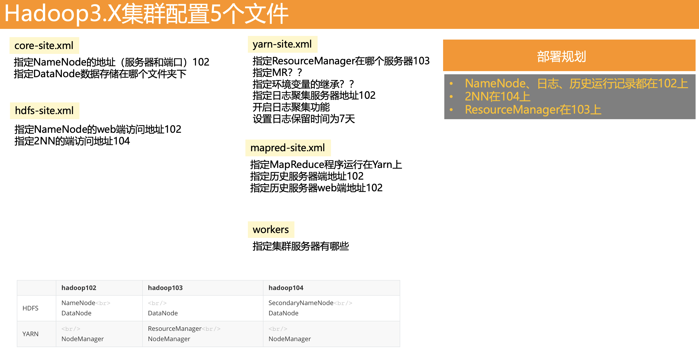

*  Hadoop3.x  
  *  core-site.xml
  * hdfs-site.xml
  * yarn-site.xml 
  * mapred-site.xml 
  * workers
* Hadoop2.x  
  *  core-site.xml
  * hdfs-site.xml
  * yarn-site.xml 
  * mapred-site.xml 
  * slaves

# 3.完全分布式运行模式总结

> 保持集群内102，103，104的配置，工具都是一致的

1. **服务器准备**
    服务器准备：102，103，104，三台服务器
    服务器环境搭建：IP设定，JDK、Hadoop安装

2. **工具准备**，脚本放在/home/ola/bin下
    集群分发脚本：xsycn
    ssh无密登录配置
    常用脚本：集群启动/停止脚本

3. **集群配置** 
    5个文件

   * 配置HDFS
   * 配置Yarn
   * 配置MapReduce
   * 配置历史运行记录
   * 配置日志
   * 配置workers

   
   
   我的集群目前配置方案：
   
   * hadoop102
     17232 JobHistoryServer
     17300 Jps
     16790 DataNode
     17065 NodeManager
     16636 NameNode
   * hadoop103 
     15875 Jps
     15223 DataNode
     15401 ResourceManager
     15530 NodeManager
   * hadoop104
      14182 Jps
      13978 SecondaryNameNode
      13868 DataNode
      14061 NodeManager
    
4. **集群启动/停止**

   * 模块逐一启动/停止
     * 在配置了NameNode的服务器上启动/停止HDFS---102
     * 在配置了ResourceManager的服务器上启动/停止YARN---103
     * 在配置了历史服务器的服务器上启动/停止历史服务器---102

   * 服务组件逐一启动/停止
     * 在各服务器单独启动/停止HDFS组件
     * 在各服务器单独启动/停止Yarn
   * 集群启停脚本

