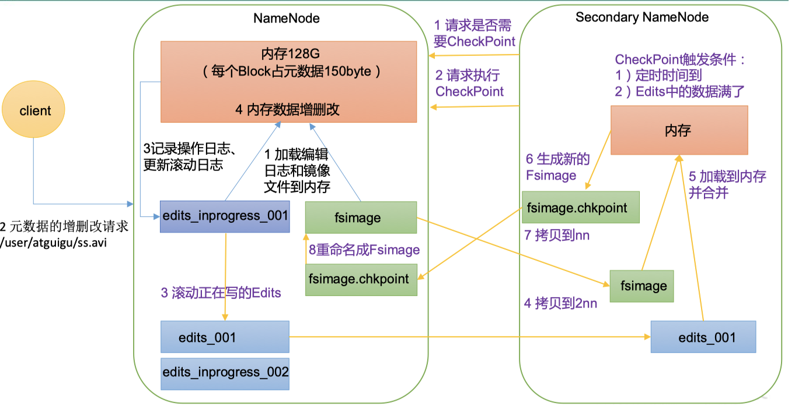

# 1.HDFS概述

不能够像mysql一样快速增删改茶，它适合数据存进去，就别动了，然后查询就行，只适合查询。

# 2.HDFS的Shell操作（开发重点）

## 2.1.基本语法

两个都行，结果一样：

hadoop fs [具体命令]---我习惯写这种

hdfs dfs [具体命令]

## 2.2.常用命令实操

### 查看命令帮助

```bash
# -help [命令]
[ola@hadoop102 ~]$ hadoop fs -help rm
-rm [-f] [-r|-R] [-skipTrash] [-safely] <src> ... :
  Delete all files that match the specified file pattern. Equivalent to the Unix
  command "rm <src>"

  -f          If the file does not exist, do not display a diagnostic message or
              modify the exit status to reflect an error.
  -[rR]       Recursively deletes directories.
  -skipTrash  option bypasses trash, if enabled, and immediately deletes <src>.
  -safely     option requires safety confirmation, if enabled, requires
              confirmation before deleting large directory with more than
              <hadoop.shell.delete.limit.num.files> files. Delay is expected when
              walking over large directory recursively to count the number of
              files to be deleted before the confirmation.
```

### 创建文件夹

```bash
# -mkdir [路径]
# 根目录下创建一个名字为shell的文件夹
[ola@hadoop102 ~]$ hadoop fs -mkdir /shell
```

### 复制上传

```bash
# -put [上传路径] [目的地路径]；也可以用-copyFromLocal
# 将diary文件复制到shell文件夹下
[ola@hadoop102 ~]$ hadoop fs -put /home/ola/diary /shell
```

### 追加上传

```bash
# -appendToFile [追加文件路径] [目的地路径]
# 将diaryCopy文件追加到shell文件夹下
[ola@hadoop102 ~]$ hadoop fs -appendToFile /home/ola/diaryCopy /shell/diary 
```

### 剪切上传

```bash
# -moveFromLocal [上传路径] [目的地路径]
# 将diary文件复制到shell文件夹下
[ola@hadoop102 ~]$ hadoop fs -moveFromLocal /home/ola/diaryCopy /shell
```

## 2.3.命令大全

通过下面的命令查询所有命令

```bash
[ola@hadoop102 bin]$ /opt/module/hadoop-3.1.3/bin/hadoop -fs
```

# 3.HDFS的API操作（用的极少）

## 3.1.客户端环境准备

> 可以省略第一步，不在mac上安装hadoop

1. 在mac上安装hadoop

   把hadoop jar包解压，解压后，模仿Java的路径，放在了Library下了，然后把Hadoop_HOME加进了环境变量.zshrc中。

   #Set Hadoop3.1.3

   export Hadoop_HOME=/Library/hadoop-3.1.3
   export PATH="$Hadoop_HOME/bin/:$PATH"

   

2. 然后在idea中，建立Maven项目

   在pom.xml中加入依赖

   * Hadoop客户端：添加`hadoop-client`的Maven依赖到你的项目中即可
   * junit: 注解test用的
   * slf4j-log4j12，产生日志

   ```xml
   <dependencies>
           <dependency>
               <groupId>org.apache.hadoop</groupId>
               <artifactId>hadoop-client</artifactId>
               <version>3.1.3</version>
           </dependency>
           <dependency>
               <groupId>junit</groupId>
               <artifactId>junit</artifactId>
               <version>4.12</version>
           </dependency>
           <dependency>
               <groupId>org.slf4j</groupId>
               <artifactId>slf4j-log4j12</artifactId>
               <version>1.7.30</version>
           </dependency>
       </dependencies>
   ```

3. 在项目的src/main/resources目录下，新建一个文件，命名为“log4j.properties”，在文件中填入。是用来打印日志的。

   ```properties
   log4j.rootLogger=INFO, stdout  
   log4j.appender.stdout=org.apache.log4j.ConsoleAppender  
   log4j.appender.stdout.layout=org.apache.log4j.PatternLayout  
   log4j.appender.stdout.layout.ConversionPattern=%d %p [%c] - %m%n  
   log4j.appender.logfile=org.apache.log4j.FileAppender  
   log4j.appender.logfile.File=target/spring.log  
   log4j.appender.logfile.layout=org.apache.log4j.PatternLayout  
   log4j.appender.logfile.layout.ConversionPattern=%d %p [%c] - %m%n

## 3.2.API案例

3步骤：

* 获取客户端对象

* 操作：文件上传，API参数优先级，文件下载，文件更改名字和移动，删除文件和目录，文件详情查看，文件和文件夹判断

* 对象关闭

可在这个文档中查看具体操作代码[hdfs-api-code](../other/hdfs-api-code.md)

# 4.HDFS的读写流程（面试重点）

## 4.1.写数据流程

> 一个文件上传，分成几个block，一个block传完再传另一个
> block内传输是以packet为单位


（1）客户端通过**Distributed FileSystem**模块向NameNode请求上传文件，NameNode检查目标文件是否已存在，父目录是否存在

（2）NameNode返回是否可以上传

（3）客户端请求第一个 Block上传到哪几个DataNode服务器上

（4）NameNode返回3个DataNode节点，分别为dn1、dn2、dn3，如何确认哪几个DataNode是通过机架感知来确定

（5）客户端通过**FSDataOutputStream**模块请求dn1上传数据，dn1收到请求会继续调用dn2，然后dn2调用dn3，将这个通信管道建立完成。`不是并发的，完成数据的副本复制`

（6）dn1、dn2、dn3逐级应答客户端

（7）客户端开始往dn1上传第一个Block（先从磁盘读取数据放到一个本地内存缓存），以Packet为单位，dn1收到一个Packet自己复制的同时传给dn2，然后dn2复制同时传给dn3；dn1每传一个packet会放入一个应答队列等待应答。`数据在客户端的缓冲队列内，传输时的单位是1个packet（64kb），1个 packet由多个chunk（516byte）组成。每发送完一个packet，datanode会返回给客户端一个应答，是否传送成功。 `

（8）当一个Block传输完成之后，客户端再次请求NameNode上传第二个Block的服务器。（重复执行3-7步）。

* Hadoop3.1.3副本节点选择

  > 节点分布在两个机架上，三分之一节点在一个机架上，三分之二再另一个机架上

  当HDFS客户端需要写入数据时，它会根据机架感知策略和节点距离选择适合的数据节点。如前所述，当复制因子为三时，HDFS的默认放置策略是


* 机架感知-Rack Awareness

  机架感知允许HDFS了解集群中每个节点的物理布局，特别是哪些节点位于同一个机架上。HDFS能够在数据复制时考虑到节点的物理位置，以优化数据的可靠性和访问性能。例如，当HDFS存储一个文件的副本时，它会尝试将这些副本分布在不同的机架上，这样即使一个机架完全失败，数据仍然可以从其他机架上的节点访问。

  * 官方说明

    http://hadoop.apache.org/docs/r3.1.3/hadoop-project-dist/hadoop-hdfs/HdfsDesign.html#Data_Replication

    ```bash
    For the common case, when the replication factor is three, HDFS’s placement policy is to put one replica on the local machine if the writer is on a datanode, otherwise on a random datanode, another replica on a node in a different (remote) rack, and the last on a different node in the same remote rack. This policy cuts the inter-rack write traffic which generally improves write performance. The chance of rack failure is far less than that of node failure; this policy does not impact data reliability and availability guarantees. However, it does reduce the aggregate network bandwidth used when reading data since a block is placed in only two unique racks rather than three. With this policy, the replicas of a file do not evenly distribute across the racks. One third of replicas are on one node, two thirds of replicas are on one rack, and the other third are evenly distributed across the remaining racks. This policy improves write performance without compromising data reliability or read performance.
    对于常见情况，当复制因子为三时，HDFS的放置策略是，如果写入者位于一个数据节点上，则将一个副本放在本地机器上，否则放在一个随机的数据节点上。另一个副本放在位于不同（远程）机架的一个节点上，最后一个副本放在同一远程机架的另一个不同节点上。这一策略减少了跨机架的写入流量，通常能提高写入性能。机架故障的可能性远小于节点故障，因此这一策略不会影响数据的可靠性和可用性保证。然而，它确实减少了读取数据时使用的总网络带宽，因为一个数据块只被放置在两个独特的机架上，而不是三个。根据这一策略，文件的副本不会均匀分布在各个机架上。三分之一的副本位于一个节点上，三分之二的副本位于一个机架上，而其他三分之一均匀分布在剩余的机架上。这一策略在不影响数据可靠性或读取性能的情况下，改善了写入性能。
    ```

  * 源码说明

    在idea中，查找BlockPlacementPolicyDefault，在该类中查找chooseTargetInOrder方法

    

* 节点距离-Node Distance

  在 HDFS 写数据的过程中，NameNode 会选择距离`待上传数据`最近距离的DataNode 接收数据。那么这个最近距离怎么计算呢？

  节点距离是基于机架感知策略来计算的，它衡量的是两个节点之间的“距离”。在这个上下文中，距离是一个抽象的概念，用于反映从一个节点到另一个节点的通信成本或延迟。Hadoop利用节点距离来优化任务的调度和数据的存储，例如，MapReduce作业的任务调度器会尽量将任务分配给距离待处理数据最近的节点。

  节点距离：两个节点到达最近的共同祖先的距离总和

  比如，d1/r1/中的n-0和n-2的共同祖先是机架1，二者分别距离机架1距离为1，所以距离是2


* 节点：比如DataNode，NameNode等，这里指DataNode，每台服务器上都会有一个，图中的n指的是节点也是服务器
* 机架：由节点组成
* 集群：由机架组成

* 机架感知（副本存储节点选择）

## 4.3.读数据流程

> 客户端读数据时，遵循两个原则，一个是节点最近，一个是负载均衡。负载均衡的目的是防止节点最近读取，都放在某一个datanode上读取，造成这个datanode负载过重


（1）客户端通过DistributedFileSystem向NameNode请求下载文件，NameNode通过查询元数据，找到文件块所在的DataNode地址

（2）挑选一台DataNode（就近原则，然后随机）服务器，请求读取数据

（3）DataNode开始传输数据给客户端（从磁盘里面读取数据输入流，以Packet为单位来做校验）

（4）客户端以Packet为单位接收，先在本地缓存，然后写入目标文件

# 5.NameNode和SecondaryNameNode（了解）

* 为了平衡计算快和数据的可靠性，采取了数据内存一份，硬盘也一份。所以就有了NameNode存储的数据有三部分
  * 内存 = Edits_Inprogress编辑日志 + FsImage镜像文件。数据最终值
  * FsImage镜像文件是怎么来的呢？先将NameNode中Edits_Inprogress变成edit，同时生成一个新的Edits_Inprogress给数据操作用，生成的edit和现有的FsImage进行合并，生成新的FsImage，替换掉NameNode中的FsImage
* 如果长时间添加数据到Edits中，会导致该文件数据过大，效率降低，而且一旦断电，恢复元数据需要的时间过长。因此出现了2NN负责定期合并后两者

102上NameNode数据存储路径：


102上NameNodes数据存储和104上2NN数据存储如下：


inprogress是namenode比2nn多的一个文件，所以当NameNode出bug挂了，就会丢失这部分数据



FsImage镜像文件--存储了目录树

Edits_Inprogress 存储了操作记录

# 6.DataNode（理解 ）

## 6.1.工作机制

> 如果机器比较差，可以将DN向NN汇报我还活着的时间缩短（10分钟+30秒），以免挂了，没有发现，影响Hadoop工作


（1）一个数据块block在DataNode上以文件形式存储在磁盘上，包括两个文件，一个是数据本身，一个是元数据包括数据块的长度，块数据的校验和，以及时间戳

（2）DataNode启动后向NameNode注册，通过后，周期性（6小时）的向NameNode上报所有的块信息。在[hdfs-default.xml](../other/hdfs-default.xml)中可以查询到

DN向NN汇报当前解读信息的时间间隔，默认6小时

```xml
<property>
	<name>dfs.blockreport.intervalMsec</name>
	<value>21600000</value>
	<description>Determines block reporting interval in milliseconds.</description>
</property>
```

DN扫描自己节点块信息列表的时间，默认6小时

```xml
<property>
	<name>dfs.datanode.directoryscan.interval</name>
	<value>21600s</value>
	<description>Interval in seconds for Datanode to scan data directories and reconcile the difference between blocks in memory and on the disk.
	Support multiple time unit suffix(case insensitive), as described
	in dfs.heartbeat.interval.
	</description>
</property>
```

（3）心跳是每3秒一次，心跳返回结果带有NameNode给该DataNode的命令如复制块数据到另一台机器，或删除某个数据块。如果超过10分钟没有收到某个DataNode的心跳，则认为该节点不可用。

（4）集群运行中可以安全加入和退出一些机器，比如可以手动停止和开启某个机器的DataNode。

## 6.2.数据完整性校验

DataNode节点上的数据损坏了，却没有发现，那么如何解决呢？

如下是DataNode节点保证数据完整性的方法。

（1）当DataNode读取Block的时候，它会计算CheckSum

（2）如果计算后的CheckSum，与Block创建时值不一样，说明Block已经损坏

（3）Client读取其他DataNode上的Block

（4）常见的校验算法crc（32），md5（128），sha1（160）

（5）DataNode在其文件创建后周期验证CheckSum


## 6.3.掉线时限参数设置


需要注意的是hdfs-site.xml 配置文件中的heartbeat.recheck.interval的单位为毫秒，dfs.heartbeat.interval的单位为秒

```xml
<property>
    <name>dfs.namenode.heartbeat.recheck-interval</name>
    <value>300000</value>
</property>

<property>
    <name>dfs.heartbeat.interval</name>
    <value>3</value>
</property>

```

