# 1.MapReduce 概述与编程案例

## 1.1 MapReduce 定义

MapReduce 是一个分布式运算程序的编程框架，是用户开发“基于 Hadoop 的数据分析 应用”的核心框架。

MapReduce将底层的节点之间通讯，多线程，交互信息组成了框架，将分布式代码封装。

MapReduce 核心功能是将用户编写的业务逻辑代码和自带默认组件整合成一个完整的分布式运算程序，并发运行在一个Hadoop 集群上。

## 1.2 MapReduce 优缺点

* 优点

  * MapReduce 易于编程

    它简单的实现一些接口，就可以完成一个分布式程序，这个分布式程序可以分布到大量 廉价的 PC 机器上运行。也就是说你写一个分布式程序，跟写一个简单的串行程序是一模一 样的。就是因为这个特点使得 MapReduce 编程变得非常流行

  * 良好的扩展性

    当你的计算资源不能得到满足的时候，你可以通过简单的增加机器来扩展它的计算能力

  * 高容错性

    MapReduce 设计的初衷就是使程序能够部署在廉价的 PC 机器上，这就要求它具有很高 的容错性。比如其中一台机器挂了，它可以把上面的计算任务转移到另外一个节点上运行， 不至于这个任务运行失败，而且这个过程不需要人工参与，而完全是由 Hadoop 内部完成的

  * 适合 PB 级以上海量数据的离线处理

    可以实现上千台服务器集群并发工作，提供数据处理能力，不适合小数据计算

* 缺点

  * 不擅长实时计算----MySQL擅长

    MapReduce 无法像 MySQL 一样，在毫秒或者秒级内返回结果

  * 不擅长流式计算---Sparkstreming， flink擅长

    流式计算的输入数据是动态的，而 MapReduce 的输入数据集是静态的，不能动态变化。 这是因为 MapReduce 自身的设计特点决定了数据源必须是静态的

  * 不擅长 DAG（有向无环图）计算---Spark擅长

    多个应用程序存在依赖关系，后一个应用程序的输入为前一个的输出。在这种情况下， MapReduce 并不是不能做，而是使用后，每个 MapReduce 作业的输出结果都会写入到磁盘， 会造成大量的磁盘 IO，导致性能非常的低下


## 1.3 MapReduce 核心思想

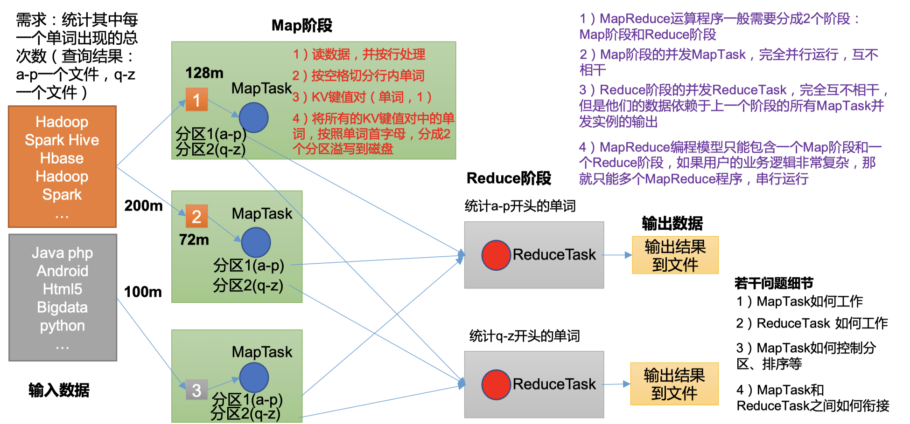

分布式的运算程序往往需要分成 2 个阶段：

（1）第一个Map阶段的 MapTask 并发实例，完全并行运行，互不相干。 

（2）第二个Reduce阶段的 ReduceTask 并发实例互不相干，但是他们的数据依赖于上一个阶段 的所有 MapTask 并发实例的输出。 

（3）MapReduce 编程模型只能包含一个 Map 阶段和一个 Reduce 阶段，如果用户的业务逻辑非常复杂，那就只能多个 MapReduce 程序，串行运行。

## 1.4.MapReduce编程规范

WordCount程序=job=任务=mr

* 在Java中，一个MapReduce进程包括：Map 类、Reduce 类和驱动类

  * 采用反编译工具反编译源码，发现 WordCount 案例有 Map 类、Reduce 类和驱动类。

  * 数据的类型是 Hadoop 自身封装的序列化类型：

  * | Java 类型 | Hadoop Writable 类型 |
    | --------- | -------------------- |
    | Boolean   | BooleanWritable      |
    | Byte      | ByteWritable         |
    | Int       | IntWritable          |
    | Float     | FloatWritable        |
    | Long      | LongWritable         |
    | Double    | DoubleWritable       |
    | String    | Text                 |
    | Map       | MapWritable          |
    | Array     | ArrayWritable        |
    | Null      | NullWritable         |

* 具体规范

  * Mapper阶段

  （1）用户自定义的Mapper要继承自己的父类 

  （2）Mapper的输入数据是KV对的形式（KV的类型可自定义） 

  （3）Mapper中的业务逻辑写在map()方法中 

  （4）Mapper的输出数据是KV对的形式（KV的类型可自定义）

  （5）map()方法（MapTask进程）对每一个<K,V>调用一次

  * Reducer阶段

  （1）用户自定义的Reducer要继承自己的父类 

  （2）Reducer的输入数据类型对应Mapper的输出数据类型，也是KV 

  （3）Reducer的业务逻辑写在reduce()方法中 

  （4）ReduceTask进程对每一组相同k的<k,v>组调用一次reduce()方法

  * Driver阶段 

    相当于YARN集群的客户端，用于提交我们整个程序到YARN集群，提交的是封装了MapReduce程序相关运行参数的job对象

* KV概念理解
  * Mapper中的KV对是MapReduce处理流程中的核心概念，它们使得分布式处理和并行计算变得可行和高效。通过对这些KV对的灵活定义和处理，可以实现广泛的数据分析和处理任务
  * 理解Mapper中的KV对可以从其作用和目的出发，
  * **分解和转换**：Mapper的主要目的是分解输入数据，并将其转换为一种更容易在后续步骤中进行汇总和分析的形式。通过将输入数据转换为键值对，MapReduce框架可以有效地对数据进行排序和分组。
  * **中间处理**：输出的KV对被视为中间结果，它们将被传输到Reduce阶段。MapReduce框架负责将所有具有相同键的值集中在一起，以便在Reduce阶段进行进一步的汇总处理。
  * **灵活性和扩展性**：通过自定义Mapper的输入和输出KV对，用户可以针对不同的数据处理需求，实现各种复杂的数据处理逻辑。这种灵活性和扩展性是MapReduce模型非常强大的原因之一。
  * Mapper的输入通常来自于Hadoop文件系统（HDFS）中的文件。对于每一行输入数据，MapReduce框架会将其转换成一个键值对作为Mapper的输入。这个键值对的键（Key）通常是文件中的位置偏移量（offset），值（Value）是文件中的一行文本

* 可以参考程序源码，学习怎么编写MR程序
  * 在hadoop-3.1.3/share文件夹内找到hadoop-mapreduce-examples-3.1.3.jar包，下载到本地，然后反编译打开。

## 1.5.本地运行案例

> 最容易出现的问题：导包导错！！用的不是hadoop的包

### 原始数据

```
atguigu atguigu
ss ss
cls cls
jiao
banzhang
xue
hadoop
```

### map阶段

输入，key偏移量，value一行文本，给每个key赋值1，然后输出：

```
(atguigu,1)
(atguigu,1)
(ss,1)
(ss,1)
(cls,1)
(cls,1)
(jiao,1)
(banzhang,1)
(xue,1)
(hadoop,1)
```

```java
package com.lili.mapreduce.wordcount;

import org.apache.hadoop.io.IntWritable;
import org.apache.hadoop.io.LongWritable;
import org.apache.hadoop.io.Text;
import org.apache.hadoop.mapreduce.Mapper;

import java.io.IOException;
/*
 * KEYIN, map 阶段输入的key的类型：Longlritable
 * VALUEIN,map 阶段输入vaLve 类型：Text
 * KEYOUT, map阶段粉出的Key类型：Text
 * VALUEOUT,map阶段输出的valve 类型：Intwritable
 * */
public class WordCountMapper extends Mapper<LongWritable, Text, Text, IntWritable> {
    Text k = new Text();//因为map每一行都会被调用1次，每次都要初始化，浪费内存，将初始化放在上面，提高性能
    IntWritable v = new IntWritable(1);//IntWritable内是1，因为没有聚合操作，在每个切割出来的词后加1

    @Override
    protected void map(LongWritable key, Text value, Context context) throws IOException, InterruptedException {

        // 1 获取一行-----这里转换成string格式，因为Text不如string方法多
        String line = value.toString();

        // 2 切割-----这里按照空格切割
        String[] words = line.split(" ");

        // 3 输出
        for (String word : words) {

            k.set(word);
            context.write(k, v);
        }
    }
}
```

### reducer阶段

输入就是map的输出，在内部识别成key，value：

```
atguigu, (1,1)
ss(1,1)
cls(1,1)
jiao(1)
banzhang(1)
xue(1)
hadoop(1)
```

```java
package com.lili.mapreduce.wordcount;

import org.apache.hadoop.io.IntWritable;
import org.apache.hadoop.io.Text;
import org.apache.hadoop.mapreduce.Mapper;
import org.apache.hadoop.mapreduce.Reducer;

import java.io.IOException;
/*
 * KEYIN, Peduce阶段粉入的key的类型：Text
 * VALUEIN, reduce价段输入vaLue 类型：IntWritable
 * KEYOUT, reduce 阶段粉出的Key类型：Text
 * VALUEOUT, reduce阶段粉出的valve类型：IntWritable
 * */
public class WordCountReducer extends Reducer<Text, IntWritable, Text, IntWritable> {

    int sum;
    IntWritable v = new IntWritable();

    @Override
    protected void reduce(Text key, Iterable<IntWritable> values, Context context) throws IOException, InterruptedException {

        // 1 累加求和
        sum = 0;
        for (IntWritable count : values) {//IntWritable是一个集合不是迭代器
            sum += count.get();
        }

        // 2 输出
        v.set(sum);
        context.write(key,v);//key保持不变
    }
}
```

给每个key累加后面的数字，输出：按照字母自动排序了

```
atguigu	2
banzhang	1
cls	2
hadoop	1
jiao	1
ss	2
xue	1
```

### Driver阶段 

八股文，照着写就行

```java
package com.lili.mapreduce.wordcount;

import org.apache.hadoop.conf.Configuration;
import org.apache.hadoop.fs.Path;
import org.apache.hadoop.io.IntWritable;
import org.apache.hadoop.io.LongWritable;
import org.apache.hadoop.io.Text;
import org.apache.hadoop.mapreduce.Job;
import org.apache.hadoop.mapreduce.lib.input.FileInputFormat;
import org.apache.hadoop.mapreduce.lib.output.FileOutputFormat;

import java.io.FileInputStream;
import java.io.IOException;

public class WordCountDriver {
    public static void main(String[] args) throws IOException, InterruptedException, ClassNotFoundException {
        // 1 获取配置信息以及获取job对象
        Configuration conf = new Configuration();
        Job job = Job.getInstance(conf);

        // 2 关联本Driver程序的jar
        job.setJarByClass(WordCountDriver.class);

        // 3 关联Mapper和Reducer的jar
        job.setMapperClass(WordCountMapper.class);
        job.setReducerClass(WordCountReducer.class);

        // 4 设置Mapper输出的kv类型
        job.setMapOutputKeyClass(Text.class);
        job.setMapOutputValueClass(IntWritable.class);

        // 5 设置最终输出kv类型
        job.setOutputKeyClass(Text.class);
        job.setOutputValueClass(IntWritable.class);

        // 6 设置输入和输出路径
        FileInputFormat.setInputPaths(job, new Path("/Users/ola/de-course/input/inputword/hello.txt"));
        FileOutputFormat.setOutputPath(job, new Path("/Users/ola/de-course/ouput/outputword/"));

        // 7 提交job
        boolean result = job.waitForCompletion(true);
        System.exit(result ? 0 : 1);
    }
}
```

## 1.6.服务器集群运行案例

以上是在本地运行，但是实际生产环境中是在服务器上运行的？？？，所以要打包

### Step1: 添加依赖

用 maven 打 jar 包，需要添加的打包插件依赖，将以下依赖添加到maven项目中的pom.xml中。

```xml
<build>
    <plugins>
        <plugin>
           <artifactId>maven-compiler-plugin</artifactId>
            <version>3.6.1</version>
            <configuration>
                <source>1.8</source>
                <target>1.8</target>
            </configuration>
        </plugin>
        <plugin>
            <artifactId>maven-assembly-plugin</artifactId>
            <configuration>
                <descriptorRefs>
                    <descriptorRef>jar-with-dependencies</descriptorRef>
                </descriptorRefs>
            </configuration>
            <executions>
                <execution>
                    <id>make-assembly</id>
                    <phase>package</phase>
                    <goals>
                        <goal>single</goal>
                    </goals>
                </execution>
            </executions>
        </plugin>
    </plugins>
</build>
```

### Step2: 更改路径

将WordCountDriver类中的输入和输出路径变成集群上的路径，或者直接变成形式参数，在执行的时候传入。下面将路径变成形式参数

```java
// 6 设置输入和输出路径
        FileInputFormat.setInputPaths(job, new Path(args[0]));
        FileOutputFormat.setOutputPath(job, new Path(args[1]));
```

### Step3: 打包

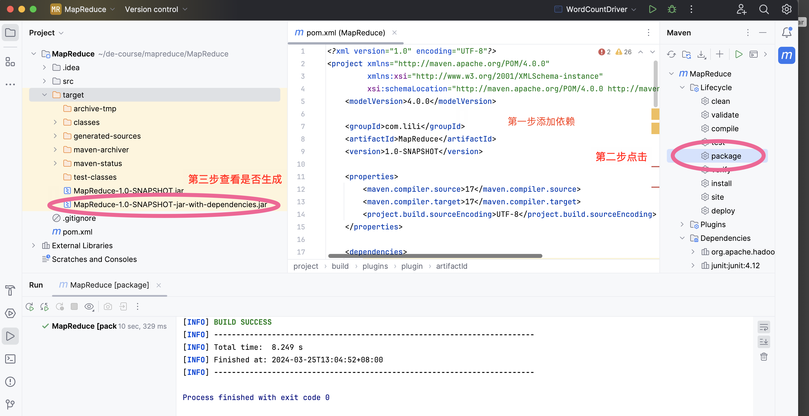

将包命名为wc.jar

### Step4: 启动集群

```bash
[ola@hadoop102 hadoop-3.1.3]$ sbin/start-dfs.sh
[ola@hadoop103 ~]$ /opt/module/hadoop-3.1.3/sbin/start-yarn.sh
```

### Step5: 运行MapReduce程序

* 本地上传程序至服务器

  ```bash
  (base) ola@192 ~ % scp /Users/ola/de-course/mapreduce/MapReduce/target/wc.jar ola@hadoop102:/opt/module/hadoop-3.1.3/
  ```

  已经从本地上传至服务器：

  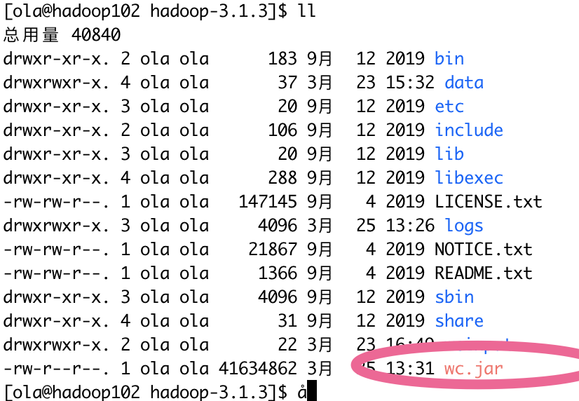

* 运行程序

  WordCountDriver这个类的引用地址在idea中拷贝下来（右键类拷贝）

  运行程序语法：hadoop jar [程序包名] [程序类名] [输入路径] [输出路径]

  ```bash
  [ola@hadoop102 hadoop-3.1.3]$ hadoop jar  wc.jar com.lili.mapreduce.wordcount2.WordCountDriver /input /output
  ```

  http://hadoop102:9870  ------->. 查看HDFS上存储的数据信息

  http://hadoop103:8088  -------->  查看YARN上运行的Job信息，只有计算时才有数据

  结果：

  | 原数据                   | 结果                     |
  | ------------------------ | ------------------------ |
  | 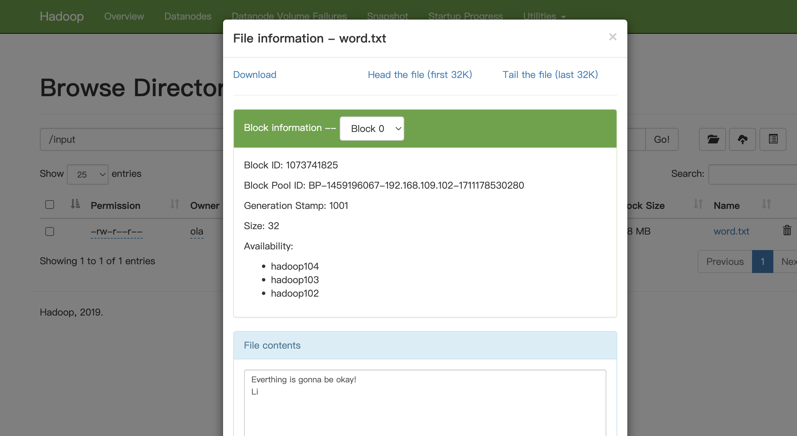 | 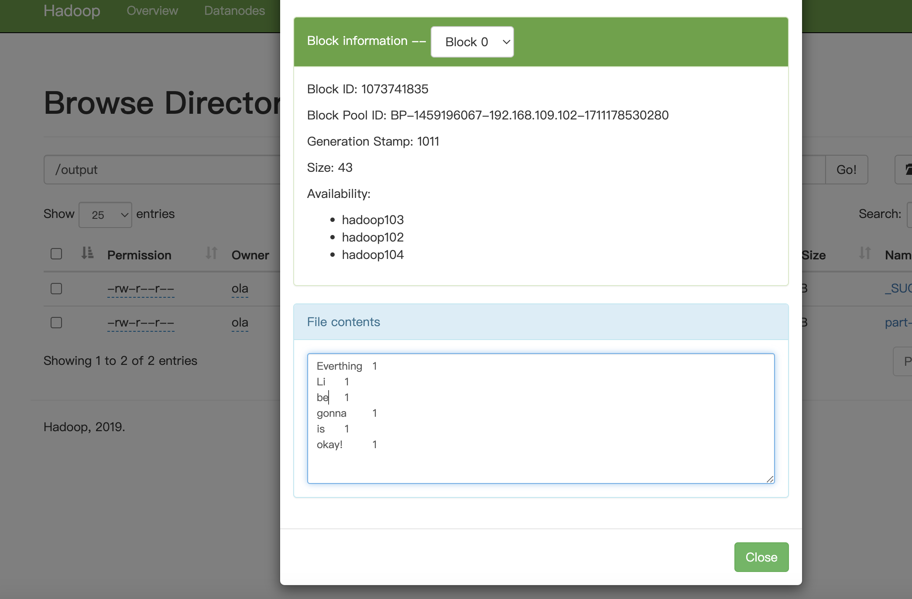 |

  序列化，实现不同服务器数据传输，为什么不同服务器要传输数据，因为MapReduce程序的Map阶段和Reduce阶段可能存在在不同的服务器上，Reduce要接收Map阶段的数据，所以需要数据传输。

  

空参构造器，用于后续反射


## 数据序列化案例

# 2.MapReduce 框架原理

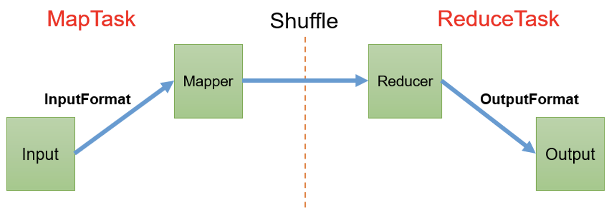

InputFormat决定切片，切片决定MapTask数量；

shuffle分区决定reducer的数量以及输出文件个数

## 2.1.Map阶段前（InputFormat数据输入）

 InputFormat是一个类！！！！

### 2.1.1.MapTask并行度决定机制

* MapTask的并行度决定Map阶段的任务处理并发度，进而影响到整个Job的处理速度，那么开启多少个MapTask呢？MapTask并行度决定机制如下：

  1）切片数------->MapTask数量（客户端在提交Job时的切片数决定了Map阶段MapTask的并行度）

  2）一个切片---->MapTask（每一个Split切片分配一个MapTask并行实例处理）

  3）默认情况下，1个切片大小=1个BlockSize （128M）

  4）切片时不考虑数据集整体，而是逐个针对每一个文件单独切片。切片是按照单个文件来切的，有两个文件，就分别切片，而不是两个文件存储大小加起来切片。

* 概念解释

  * **数据块：**Block是HDFS物理上把数据分成一块一块。数据块是HDFS存储数据单位。

  * **数据切片**：数据切片是MapReduce程序计算输入数据的单位，一个切片会对应启动一个MapTask。

    数据切片只是在逻辑上对输入进行分片，并不会在磁盘上将其切分成片进行存储。一般有几个block，就会分几个切片。也可以自定义更改。

### 2.1.2.Job提交流程源码

提交3样东西job.xml，jar包，切片信息，提交给yarn

可以按照下面的流程在idea中debug本文档[1.5.本地运行案例Driver阶段 ](###Driver阶段 )的代码

JobSubmitter.class

> 提交后，Stag路径路径内的3）、4）、5）生成的文件就会被提交，消失

```java
waitForCompletion()

submit();

// 1建立连接
	connect();	
		// 1）创建提交Job的代理
		new Cluster(getConfiguration());
			// （1）判断是本地运行环境还是yarn集群运行环境
			initialize(jobTrackAddr, conf); 

// 2 提交job
submitter.submitJobInternal(Job.this, cluster)

	// 1）创建给集群提交数据的Stag路径
	Path jobStagingArea = JobSubmissionFiles.getStagingDir(cluster, conf);

	// 2）获取jobid ，并创建Job路径
	JobID jobId = submitClient.getNewJobID();

	// 3）拷贝jar包到集群
copyAndConfigureFiles(job, submitJobDir);	
	rUploader.uploadFiles(job, jobSubmitDir);

	// 4）计算切片，生成切片规划文件
writeSplits(job, submitJobDir);
		maps = writeNewSplits(job, jobSubmitDir);
		input.getSplits(job);

	// 5）向Stag路径写XML配置文件
writeConf(conf, submitJobFile);
	conf.writeXml(out);

	// 6）提交Job,返回提交状态
status = submitClient.submitJob(jobId, submitJobDir.toString(),job.getCredentials());
```

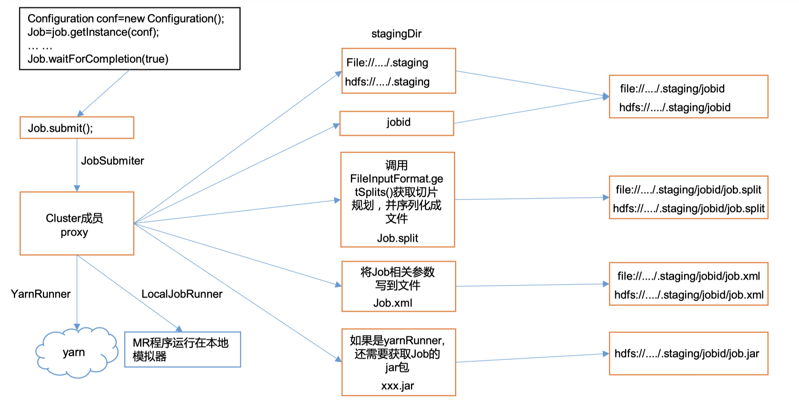

### 2.1.3.Job切片源码

#### FileInputFormat切片源码解析

`FileInputFormat`是一个抽象类，继承了InputFormat类，为MapReduce作业读取文件输入定义了基本的工作流程。它负责处理文件的输入路径，并将文件切分成一个个小的数据片段（splits），每个数据片段被一个独立的Mapper处理。

* **可以按照下面的流程在idea中debug本文档[1.5.本地运行案例Driver阶段 ](###Driver阶段 )的代码**。

* 也可以**FileInputFormat类中，直接看切片源码（方法getSplits(job)）：**

```java
public abstract class FileInputFormat<K, V> extends InputFormat<K, V> 
```

1. 程序先找到你数据存储的目录。 
2. 开始遍历处理（规划切片）目录下的每一个文件 ，对每个文件单独切。
3. 遍历第一个文件ss.txt
   * 获取文件大小fs.sizeOf(ss.txt) 
   * **计算切片大小 computeSplitSize(Math.max(minSize,Math.min(maxSize,blocksize)))=blocksize=128M** 
   * **默认情况下，切片大小=blocksize** 
   * 开始切，形成第1个切片：ss.txt—0:128M 第2个切片ss.txt—128:256M 第3个切片ss.txt—256M:300M **（每次切片时，都要判断切完剩下的部分是否大于块的1.1倍，不大于1.1倍就划分一块切片）**。当文件/block>1.1倍的时候，会进行切割，否则不切。比如68M的文件大小，集群block大小设置为32M，68-32=36M，36/32>1.1。因此68M的文件会被切割成3片。分别是32M，32M，4M。如果是64.1M的文件，会是32M，32.1M，切成两个。
   * 将切片信息写到一个切片规划文件中
   * 整个切片的核心过程在getSplit()方法中完成 
   * **InputSplit只记录了切片的元数据信息**，比如起始位置、长度以及所在的节点列表等。 
4. 提交切片规划文件到YARN上，YARN上的MrAppMaster就可以根据切片规划文件计算开启MapTask个数

#### FileInputFormat 切片机制

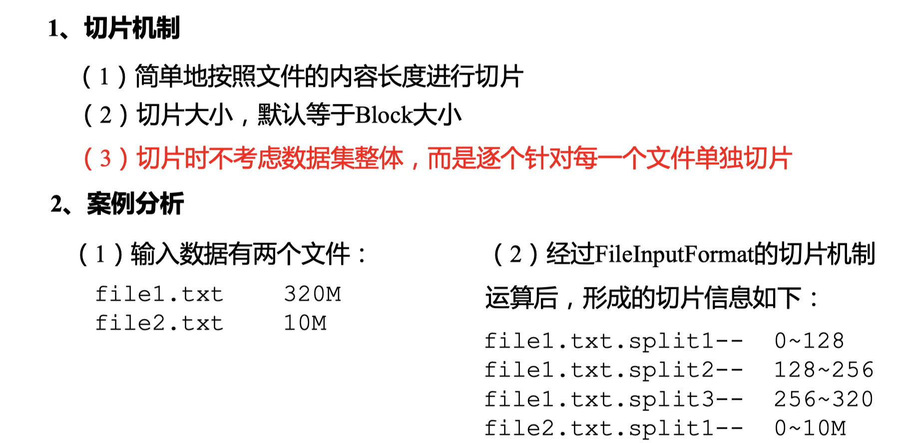

#### FileInputFormat切片大小的参数配置

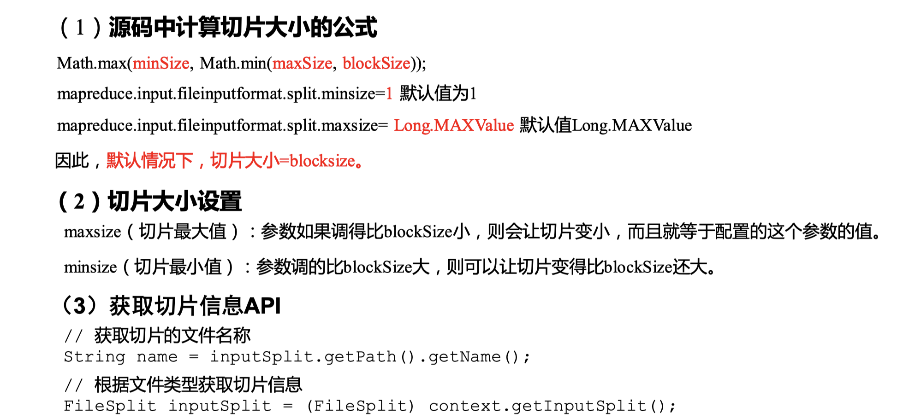

#### TextInputFormat切片(用的多，按行读)

`TextInputFormat`是处理文本数据最常用的输入格式，也是默认输入格式。适用于日志文件、纯文本数据等。
`TextInputFormat`是`FileInputFormat`的一个具体实现，主要用于读取纯文本文件。它按行处理文本文件，将文件的每一行作为一个记录：

- **键（Key）**：记录的偏移量（每行的开始位置在文件中的字节偏移量）
- **值（Value）**：行的内容（不包含行尾符）

#### CombineTextInputFormat切片(用的多，按文件)

> 注意：虚拟存储切片最大值设置最好根据实际的小文件大小情况来设置具体的值。
> 生成切片过程包括：虚拟存储过程和切片过程二部分

`CombineTextInputFormat`是为了优化处理小文件而设计的。在使用`TextInputFormat`时，如果输入路径中有大量的小文件，每个文件都会被分配给一个单独的Mapper处理，这可能会导致大量的Map任务，从而增加调度和处理的开销。`CombineTextInputFormat`通过合并这些小文件的输入切片来减少Map任务的数量

```java
// 如果不设置InputFormat，它默认用的是TextInputFormat.class
job.setInputFormatClass(CombineTextInputFormat.class);

//虚拟存储切片最大值设置4m
 CombineTextInputFormat.setMaxInputSplitSize(job, 4194304);
```

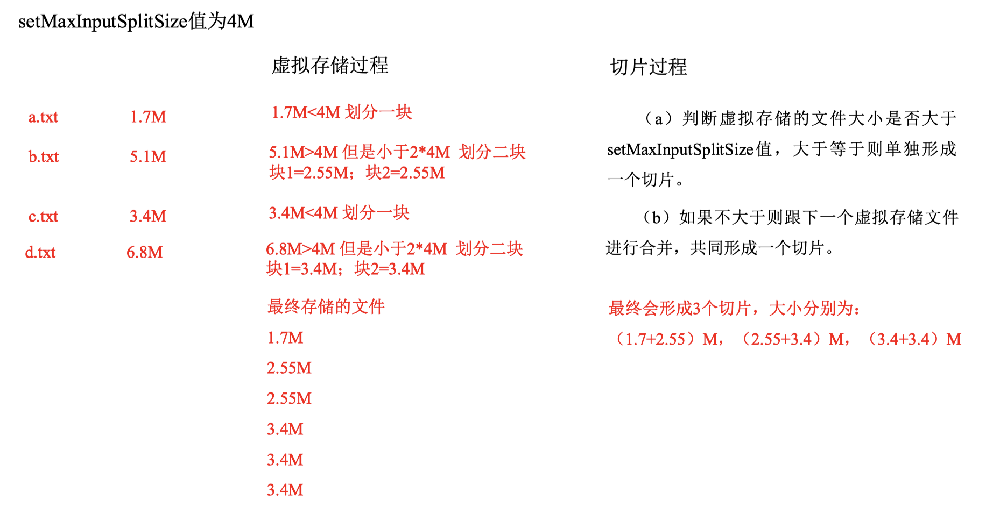

（1）虚拟存储过程： 将输入目录下所有文件大小，依次和设置的 setMaxInputSplitSize 值比较，如果不 大于设置的最大值，逻辑上划分一个块。如果输入文件大于设置的最大值且大于两倍， 那么以最大值切割一块；当剩余数据大小超过设置的最大值且不大于最大值 2 倍，此时 将文件均分成 2 个虚拟存储块（防止出现太小切片）。

例如 setMaxInputSplitSize 值为 4M，输入文件大小为 8.02M，则先逻辑上分成一个 4M。剩余的大小为 4.02M，如果按照 4M 逻辑划分，就会出现 0.02M 的小的虚拟存储 文件，所以将剩余的 4.02M 文件切分成（2.01M 和 2.01M）两个文件。 （2）切片过程：

（a）判断虚拟存储的文件大小是否大于 setMaxInputSplitSize 值，大于等于则单独 形成一个切片。

（b）如果不大于则跟下一个虚拟存储文件进行合并，共同形成一个切片。

（c）测试举例：有 4 个小文件大小分别为 1.7M、5.1M、3.4M 以及 6.8M 这四个小 文件，则虚拟存储之后形成 6 个文件块，大小分别为：

​	1.7M，（2.55M、2.55M），3.4M 以及（3.4M、3.4M）

​	最终会形成 3 个切片，大小分别为：

​	（1.7+2.55）M，（2.55+3.4）M，（3.4+3.4）M

#### CombineTextInputFormat切片案例实操

## 2.2.MapReduce详细工作流程

| 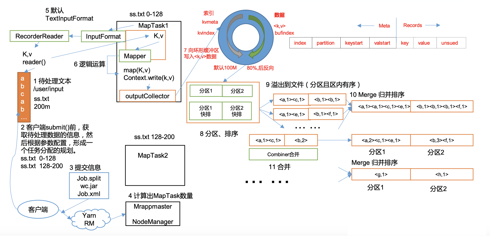 | 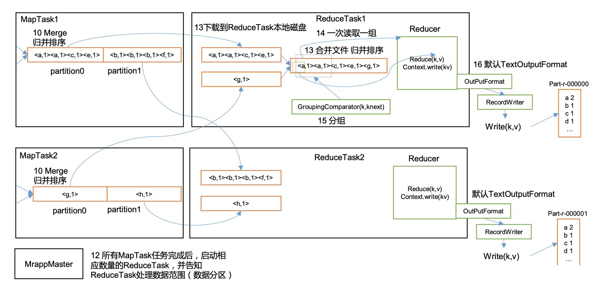 |
| ------------------------ | ------------------------- |

map阶段后，在maptask上的outPutCollector---->环形缓冲区，在内存中，左右存储数据，左边存储索引，右边存储数据，当达到80%，反向逆写，并开始向磁盘写数据，也就是第9步

先分区，再进入outPutCollector环形缓冲区，默认100M，也可以自定义，在溢写之前，对数据进行排序

* 分区：分区个数可以自定义
* 快排：对索引进行快排，按照字典顺序排

reduce task主动从map task中拉取分区数据

图2的第15步，现在企业用的少了。不用研究。

## 2.3.Map阶段后Reduce阶段前（Shuffle机制）

### 2.3.1.shuffle机制（面试）

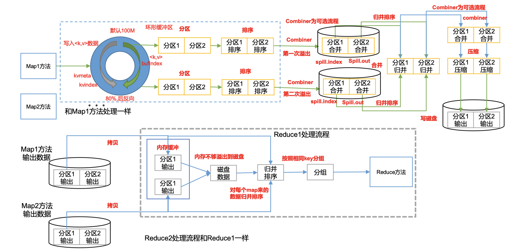

map阶段结束后，数据先分区，再进入maptask上的outPutCollector---->环形缓冲区，默认100M，也可以自定义，环形缓冲区在内存中。

环形缓冲区左右存储数据，左边存储索引，右边存储数据，当达到80%时，反向逆写，并开始向磁盘溢写写数据，写之前对数据进行排序

* 分区：分区个数可以自定义； 发生在进入环形缓冲区之前。
* 快排：对key的索引进行快排，按照字典顺序排；发生在环形缓冲区内，溢写到磁盘之前。

溢写产生两个文件，一个spill.index（索引文件）。一个spill.out（真正落地文件）

排序后可以合并和压缩等操作，Combiner可选，可以使传输数据变小。最后写入磁盘

最后reduce task来主动拉取指定分区的数据，一个reduce task拉取一个分区

### 2.3.2.Partition 分区（面试）

#### 概述

* 分区数量和ReduceTask的数量相互影响产出文件个数

- 发生在Map阶段之后，Shuffle阶段期间，目的是为了数据的分发
- 决定了Map阶段输出的键值对如何分配给Reducer，每个分区对应一个Reducer
- 分区的过程确保了具有相同键的所有值都被发送到同一个reduce task，以便进行进一步的聚合或处理

分区会影响输出文件的个数吗？

* 是的，分区直接影响输出文件的个数。在MapReduce作业中，每个reduce task的输出都会被写入一个独立的输出文件。因此，reduce task的数量（也就是分区的数量）决定了输出文件的总数。例如，如果一个MapReduce作业配置了10个reduce task，那么理论上会产生10个输出文件，前提是所有reduce task都有数据处理。

#### 分区总结

（1）如果ReduceTask的数量> getPartition的结果数，则会多产生几个空的输出文件part-r-000xx； 

（2）如果1<ReduceTask的数量<getPartition的结果数，则有一部分分区数据无处安放，会Exception； 

（3）如果ReduceTask的数量=1， 则不管MapTask端输出多少个分区文件， 最终结果都交给这一个 ReduceTask，最终也就只会产生一个结果文件 part-r-00000； 

（4）分区号必须从零开始，逐一累加。

#### 案例分析

假设自定义分区数为5

（1）job.setNumReduceTasks(1); 会正常运行，生成一个输出文件，包含所有数据

（2）job.setNumReduceTasks(2); 会报错

（3）job.setNumReduceTasks(6);大于5，程序会正常运行，会产生空文件

（4）job.setNumReduceTasks(5);等于5，程序会正常运行，会按照分区产生5个文件

#### 默认分区

默认分区是根据key的hashCode对ReduceTasks个数取模得到的。用户没法控制哪个 key存储到哪个分区。

```java
public class HashPartitioner<K, V> extends Partitioner<K, V> {

public int getPartition(K key, V value, int numReduceTasks) { return (key.hashCode() & Integer.MAX_VALUE) % numReduceTasks; }

}
```

#### 自定义分区

Step1:自定义类继承Partitioner，重写getPartition()方法

```java
public class CustomPartitioner extends Partitioner<Text, FlowBean> {

@Override public int getPartition(Text key, FlowBean value, int numPartitions) { // 控制分区代码逻辑 … …

return partition; }

}
```

* Step2:在Job驱动中，设置自定义Partitioner

```java
job.setPartitionerClass(CustomPartitioner.class);
```

* Step3:自定义Partition后，要根据自定义Partitioner的逻辑设置相应数量的ReduceTask

```java
job.setNumReduceTasks(5);
```

### XXXXX排序（面试）

为什么一定要排序，因为需要将 相同的key传输到reduce方法中，排序后可以提高reduce方法的效率。

MapTask和ReduceTask均会 对数据 按照key进行排序。 该操作属于 Hadoop的默认行为。任何应用程序中的数据均会被排序，而不管逻辑上是 否需要。默认排序是按照字典顺序排序，且实现该排序的方法是快速排序。

* shuffle：在map task中的溢写前，进行对key的索引按照字典排序进行快排
* reduce：reduce task中，在执行reduce（）方法之前进行归并排序

对于MapTask，它会将处理的结果暂时放到环形缓冲区中，当环形缓冲区使用率达到一定阈值后，再对缓冲区中的数据进行一次**快速排序**，并将这些有序数 据溢写到磁盘上，而当数据处理完毕后，它会对**磁盘上所有文件进行归并排序**。

对于ReduceTask，它从每个MapTask上远程拷贝相应的数据文件，如果文件大小超过一定阈值，则溢写磁盘上，否则存储在内存中。如果磁盘上文件数目达到 一定阈值，则进行一次归并排序以生成一个更大文件；如果内存中文件大小或者数目超过一定阈值，则进行一次合并后将数据溢写到磁盘上。当所有数据拷贝完 毕后，ReduceTask统一对内存和磁盘上的所有数据进行一次归并排序。

#### 自定义全排序


* - 
* 切片的作用
  - 发生在MapReduce作业开始之前，目的是为了并行化处理。
  - 将输入数据分割成多个切片，每个切片由一个单独的Mapper处理。
  - 切片的大小和数量可以根据数据的存储方式和框架的配置来调整，目的是优化Map阶段的执行效率。

* 切片与分区的关系
  * 切片本身不直接影响分区。切片是Map阶段处理输入数据的机制，主要关注于如何将大量数据分割成小块让每个Mapper处理。分区是指在Map阶段之后、Reduce阶段之前，决定每个Reducer处理哪部分数据的过程。虽然切片和分区处理的是不同的数据处理阶段，但它们都对处理的并行性和效率有重要影响

* 一个Reduce阶段可以有几个Reducer？
  * Reduce阶段可以有一个或多个Reducer。实际上，作业的Reducer数量是在MapReduce作业配置时指定的。这个数量可以根据处理需求和资源限制来定。每个Reducer都会处理分配给它的数据分区。

* * 

### XXXXCombiner合并

## XXXX2.4.Reduce阶段后（OutputFormat数据输出）

## 2.5.MapReduce内核源码解析

### 2.5.1.MapTask 工作机制（面试）

面试官想知道你看过源代码吗？以及理解。

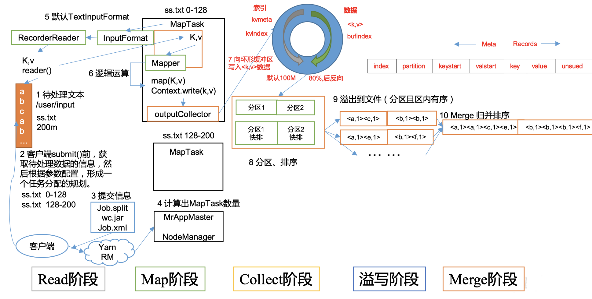

第4步之前是job提交，第5步是read阶段，之后才进入map阶段

（1）Read 阶段：MapTask 通过 InputFormat 获得的 RecordReader，从输入 InputSplit 中 解析出一个个 key/value。

（2）Map 阶段：该节点主要是将解析出的 key/value 交给用户编写 map()函数处理，并 产生一系列新的 key/value。

（3）Collect 收集阶段：在用户编写 map()函数中，当数据处理完成后，一般会调用 OutputCollector.collect() 输出 结果。 在 该 函数内部， 它会 将 生成的 key/value 分区 （ 调用 Partitioner），并写入一个环形内存缓冲区中。

（4）Spill 阶段：即“溢写”，当环形缓冲区满后，MapReduce 会将数据写到本地磁盘上， 生成一个临时文件。需要注意的是，将数据写入本地磁盘之前，先要对数据进行一次本地排序，并在必要时对数据进行合并、压缩等操作。

溢写阶段详情： 步骤 1：利用快速排序算法对缓存区内的数据进行排序，排序方式是，先按照分区编号 Partition 进行排序，然后按照 key 进行排序。这样，经过排序后，数据以分区为单位聚集在 一起，且同一分区内所有数据按照 key 有序。

步骤 2：按照分区编号由小到大依次将每个分区中的数据写入任务工作目录下的临时文 件 output/spillN.out（N 表示当前溢写次数）中。如果用户设置了 Combiner，则写入文件之 前，对每个分区中的数据进行一次聚集操作。

步骤 3：将分区数据的元信息写到内存索引数据结构 SpillRecord 中，其中每个分区的元 信息包括在临时文件中的偏移量、压缩前数据大小和压缩后数据大小。如果当前内存索引大 小超过 1MB，则将内存索引写到文件 output/spillN.out.index 中。

（5）Merge 阶段：当所有数据处理完成后，MapTask 对所有临时文件进行一次合并， 以确保最终只会生成一个数据文件。当所有数据处理完后，MapTask 会将所有临时文件合并成一个大文件，并保存到文件 output/file.out 中，同时生成相应的索引文件 output/file.out.index。

在进行文件合并过程中，MapTask 以分区为单位进行合并。对于某个分区，它将采用多 轮递归合并的方式。每轮合并 mapreduce.task.io.sort.factor（默认 10）个文件，并将产生的文 件重新加入待合并列表中，对文件排序后，重复以上过程，直到最终得到一个大文件。

让每个 MapTask 最终只生成一个数据文件，可避免同时打开大量文件和同时读取大量 小文件产生的随机读取带来的开销。

### 2.5.2.ReduceTask 工作机制

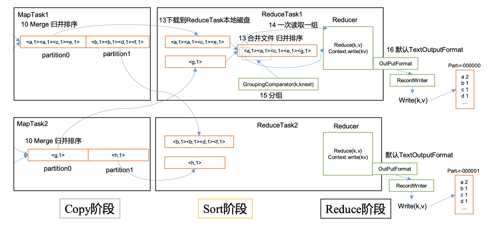

（1）Copy阶段：ReduceTask从各个MapTask上远程拷贝一片数据，并针对某一片数据，如果其大小超过一定阈值，则写到磁盘上，否则直接放到内存中。

​    （2）Sort阶段：在远程拷贝数据的同时，ReduceTask启动了两个后台线程对内存和磁盘上的文件进行合并，以防止内存使用过多或磁盘上文件过多。按照MapReduce语义，用户编写reduce()函数输入数据是按key进行聚集的一组数据。为了将key相同的数据聚在一起，Hadoop采用了基于排序的策略。由于各个MapTask已经实现对自己的处理结果进行了局部排序，因此，ReduceTask只需对所有数据进行一次归并排序即可。

​    （3）Reduce阶段：执行reduce()函数，然后将计算结果输出写到HDFS上

### 2.5.3.ReduceTask 并行度决定机制

* 方法一：手动设置 ReduceTask 并行度（个数）

  ReduceTask 的并行度同样影响整个 Job 的执行并发度和执行效率，但与 MapTask 的并 发数由切片数决定不同，ReduceTask 数量的决定是可以直接手动设置：

  ```java
  // 默认值是 1，手动设置为 4
  job.setNumReduceTasks(4);
  ```

* 方法二：测试 ReduceTask 多少合适

  （1）实验环境：1 个 Master 节点，16 个 Slave 节点：CPU:8GHZ，内存: 2G

  （2）实验目的：不同ReduceTask（数据量为 1GB），耗费时间

  （3）实验结果：

  | MapTask =16 |      |      |      |      |      |      |      |      |      |      |
  | ----------- | ---- | ---- | ---- | ---- | ---- | ---- | ---- | ---- | ---- | ---- |
  | ReduceTask  | 1    | 5    | 10   | 15   | 16   | 20   | 25   | 30   | 45   | 60   |
  | 总时间      | 892  | 146  | 110  | 92   | 88   | 100  | 128  | 101  | 145  | 104  |

* 注意事项

  （1）ReduceTask=0，表示没有Reduce阶段， 意味着这个作业将只执行Map阶段，输出文件个数和Map个数一致。

  （2）ReduceTask默认值就是1，所以输出文件个数为一个。 

  （3）如果数据分布不均匀，就有可能在Reduce阶段产生数据倾斜 

  （4）ReduceTask数量并不是任意设置，还要考虑业务逻辑需求，有些情况下，需要计算全 局汇总结果，就只能有1个ReduceTask。 

  （5）具体多少个ReduceTask，需要根据集群性能而定。 

  （6）如果分区数不是1，但是ReduceTask为1，是否执行分区过程。答案是：不执行分区过 程。因为在MapTask的源码中，执行分区的前提是先判断ReduceNum个数是否大于1。不大于1 肯定不执行。????

### XXXXX2.5.4.MapTask & ReduceTask 源码解析

## XXXX2.6.Join 应用

## XXXXX2.7.数据清洗（ETL）

## 2.8.MapReduce开发总结


1. InputFormat
   默认的是TextInputformat， key偏移量，v：一行内容

2. 处理小文件CombineTextInputFormat 把多个文件合并到一起统一切片

3. Mapper
   setup（） 初始化；map(） 用户的业务逻辑；clearup（）关闭资源；

4. 分区

   默认分区HashPartitioner，默认按照key的hash值%numreducetask个数
   自定义分区

5. 排序
   1. 部分排序：每个输出的文件内部有序。
   2. 全排序：1个reduce，对所有数据大排序。
   3. 二次排序：自定义排序范畴，实现 writableCompare按口，重写compareTo方法
6. Combiner
   1. 前提：不影响最终的业务逻辑（求和 没问题，求平均值不行）
   2. 提前聚合map =＞解决数据倾斜的一个方法
7. Reducer
   setup（） 初始化；reduce（）用户的业务逻辑； clearup(）关闭资源
8. OutputFormat
   1. 默认Textoutput Format 按行输出到文件
   2. 自定义

# XXX3.Hadoop数据压缩
