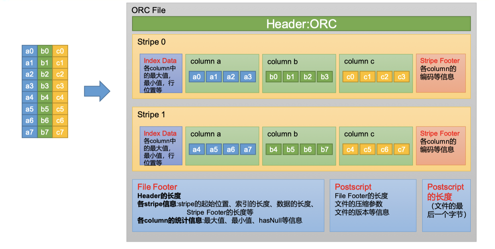
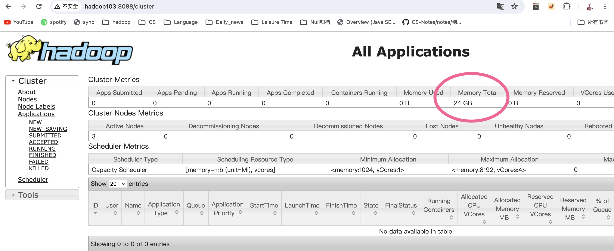

配置mysql决定了是否可以多个客户端登录，设置hiveserver2 服务是为了远程登录

hive **本质**是 Hadoop客户端，既可以作为HDFS的客户端读写数据，又可以作为Yarn的客户端提交计算任务

1. 数据存在HDFS中
2. 分析数据的底层实现是MapReduce、Spark、Tez
3. 执行在yarn上


# 1.Hive 入门

> 在HDFS存储数据，使用Hive实现MapReduce或Spark或Tez计算数据

## Hive简介

Hive 是由 Facebook 开源，基于 Hadoop 的一个数据仓库工具，可以将结构化的数据文件映射为一张表，并提供类 SQL 查询功能。

Hive 是一个 Hadoop 客户端，例如可以用于将 HQL（Hive SQL）转化成 MapReduce 程序，简化了数据查询和计算的过程

* Hive 中每张表的数据存储在 HDFS
* Hive 分析数据底层的实现是 MapReduce（也可配置为 Spark 或者 Tez）
* 执行程序运行在 Yarn 上

**简化了执行mapreduce之前需要配置Mapper、Reducer 和 Driver 三个类，并实现对应逻辑。**

## Hive 架构原理


1. 用户接口：Client

   * CLI：只能在安装了hive客户端的本地使用

   * JDBC 和 ODBC ：连接HiveServer2，实现远程访问
     * JDBC 的移植性比 ODBC 好。通常情况下，安装完 ODBC 驱动程序之后，还需要 经过确定的配置才能够应用。而不相同的配置在不相同数据库服务器之间不能够通用。 所以，安装一次就需要再配置一次。JDBC 只需要选取适当的 JDBC 数据库驱动程序，就不需 要额外的配置。在安装过程中，JDBC 数据库驱动程序会自己完成有关的配置。
     * 两者使用的语言不同，JDBC 在 Java 编程时使用，ODBC 一般在 C/C++编程时使用。

2. HiveServer2

   * 提供JDBC访问接口、用户认证服务等功能

3. 元数据：Metastore

   * 元数据包括：数据库（默认是 default）、表名、表的拥有者、列/分区字段、表的类型 （是否是外部表）、表的数据所在目录等

   * 只负责提供元数据访问接口，不负责存储数据，通常会保存在关系型数据库中，比如mysql
   * 默认存储在自带的` derby 数据库`中，由于 derby 数据库只支持单客户端访问，生产环境中为了多人开发，推荐使用 MySQL 存储 Metastore

4. 驱动器：Driver--将SQL语句转化成 MapReduce 程序

   理解成hadoop中的job提交，运行在CLI或HiveServer2上

   * 解析器（SQLParser）：将 SQL 字符串转换成抽象语法树（AST）
   * 语义分析（Semantic Analyzer）：将 AST 进一步划分为` QeuryBlock`
   * 逻辑计划生成器（Logical Plan Gen）：将语法树生成逻辑计划 
   * 逻辑优化器（Logical Optimizer）：对逻辑计划进行优化 
   * 物理计划生成器（Physical Plan Gen）：根据优化后的逻辑计划生成物理计划 
   * 物理优化器（Physical Optimizer）：对物理计划进行优化 
   * 执行器（Execution）：执行该计划，得到查询结果并返回给客户端

5. Hadoop

   使用 HDFS 进行存储，可以选择 MapReduce/Tez/Spark 进行计算

# 2.Hive 安装

## Hive 安装地址

1）Hive 官网地址 http://hive.apache.org/ 2）文档查看地址

https://cwiki.apache.org/confluence/display/Hive/GettingStarted 3）下载地址

http://archive.apache.org/dist/hive/ 4）github 地址

https://github.com/apache/hive

## Hive 安装部署（测试环境）

本次为最小化安装部署，不启动hive任何服务，以及配置元数据存储数据库，例如mysql。元数据默认是 derby 数据库，本次部署仅适用于测试，不适合实际生产环境。

* Step1: 打开虚拟服务器

* Step2: 把 apache-hive-3.1.3-bin.tar.gz 上传到 Linux 的/opt/software 目录下

  ```bash
  (base) ola@192 ~ % scp /Users/ola/de-course/apache-hive-3.1.3-bin.tar.gz ola@hadoop102:/opt/software
  ola@hadoop102's password:
  apache-hive-3.1.3-bin.tar.gz                  100%  340MB  36.6MB/s   00:09
  ```

* Step3: 解压 apache-hive-3.1.3-bin.tar.gz 到/opt/module/目录下面

  ```bash
  [ola@hadoop102 ~]$ tar -zxvf /opt/software/apache-hive-3.1.3-bin.tar.gz -C /opt/module/
  ```

* Step4: 修改 apache-hive-3.1.3-bin.tar.gz 的名称为 hive

  ```bash
  [ola@hadoop102 ~]$ mv /opt/module/apache-hive-3.1.3-bin/ /opt/module/hive
  [ola@hadoop102 ~]$ ll /opt/module
  总用量 0
  drwxr-xr-x. 12 ola ola 202 3月  25 13:31 hadoop-3.1.3
  drwxrwxr-x. 10 ola ola 184 3月  26 16:00 hive
  drwxr-xr-x.  7  10 143 245 4月   2 2019 jdk1.8.0_212
  ```

* Step5: 修改/etc/profile.d/my_env.sh，添加环境变量

  ```bash
  #打开环境配置文件
  [ola@hadoop102 ~]$ sudo vim /etc/profile.d/my_env.sh
  #添加内容：
  #HIVE_HOME
  export HIVE_HOME=/opt/module/hive
  export PATH=$PATH:$HIVE_HOME/bin
  #source一下让其生效
  [ola@hadoop102 ~]$ source /etc/profile.d/my_env.sh
  ```

* Step6: 将hive以及环境配置分发到其他服务器，并在其他服务器中source一下

  xsync是自己写的一个集群文件分发程序，详情见[Hadoop_Basic](./Hadoop_Basic.md)

  ```bash
  [ola@hadoop102 bin]$ sudo xsync /opt/module/
  [ola@hadoop102 bin]$ xsync /etc/profile.d/my_env.sh
  [ola@hadoop103 ~]$ source /etc/profile.d/my_env.sh
  [ola@hadoop104 ~]$ source /etc/profile.d/my_env.sh
  ```

* Step7: 初始化元数据库（默认是 derby 数据库），在$HIVE_HOME下出现了metastore_db文件夹。并在其他服务器中做相同操作。

  ```bash
  [ola@hadoop102 ~]$ /opt/module/hive/bin/schematool -dbType derby -initSchema
  ```

## Hive启动并使用 

监控 hive.log 文件，存储在/tmp/ola下

* 启动

  ```bash
  [ola@hadoop104 hive]$ bin/hive
  ```

* 使用

  ```bash
  hive> show databases;
  
  hive> show tables;
  
  hive> create table stu(id int, name string);
  
  hive> insert into stu values(1,"ss");
  
  hive> select * from stu;
  ```

  可以在http://hadoop103:8088/cluster查看Yarn任务

  在http://hadoop102:9870/查看HDFS表存储

# 3.MySQL 安装

目的是将元数据库存储在MySQL中，而不是内嵌的deby库，内嵌不支持多客户端访问。

拿一台服务器hadoop102举例，配置好hive后，如果使用derby库，开启一个hadoop102客户端使用hive的时候是无法再打开一个hadoop102客户端使用hive的。此时就需要将元数据库从derby换成MySQL中存储。

## 安装 MySQL

> 可以联网安装，也可以离线安装，安装哪个版本取决于linux系统版本。这里用的是centOS7，离线安装。

离线安装，要注意安装依赖的顺序。因为离线也会出现依赖失败，根据提示，缺哪个，安装哪个就可以。

上传 MySQL 安装包以及 MySQL 驱动 jar 包

解压 MySQL 安装包

tar -xf mysql-5.7.28-1.el7.x86_64.rpm-bundle.tar -C mysql_lib/

卸载系统自带的 mariadb

sudo rpm -qa | grep mariadb | xargs sudo rpm -e --nodeps

安装 MySQL 依赖

sudo rpm -ivh mysql-community-common-5.7.28-1.el7.x86_64.rpm

sudo rpm -ivh mysql-community-libs-5.7.28-1.el7.x86_64.rpm

sudo rpm -ivh mysql-community-libs-compat-5.7.28-1.el7.x86_64.rpm

安装 mysql-client

sudo rpm -ivh mysql-community-client-5.7.28-1.el7.x86_64.rpm

安装 mysql-server

sudo rpm -ivh mysql-community-server-5.7.28-1.el7.x86_64.rpm

启动 MySQL服务

sudo systemctl start mysqld

查看 MySQL 密码

sudo cat /var/log/mysqld.log | grep password

root@localhost: =ckk?i1EKsy7

## 配置 MySQL

也可以单独为hive创建一个用户，这里使用root用户，需要配置一下，让那个hive可以登录。

mysql -uroot -p'=ckk?i1EKsy7'

set password=password("Lanya@7766");

## 配置 Hive 元数据存储到 MySQL

cp /opt/software/mysql-connector-java-5.1.37.jar $HIVE_HOME/lib

```xml
<?xml version="1.0"?>
<?xml-stylesheet type="text/xsl" href="configuration.xsl"?>

<configuration>
    <!-- jdbc连接的URL -->
    <property>
        <name>javax.jdo.option.ConnectionURL</name>
        <value>jdbc:mysql://hadoop102:3306/metastore?useSSL=false</value>
    </property>
    
    <!-- jdbc连接的Driver-->
    <property>
<name>javax.jdo.option.ConnectionDriverName</name>
        <value>com.mysql.jdbc.Driver</value>
    </property>
    
	<!-- jdbc连接的username-->
    <property>
        <name>javax.jdo.option.ConnectionUserName</name>
        <value>root</value>
    </property>

    <!-- jdbc连接的password -->
    <property>
        <name>javax.jdo.option.ConnectionPassword</name>
        <value>123456</value>
    </property>

    <!-- Hive默认在HDFS的工作目录 -->
    <property>
        <name>hive.metastore.warehouse.dir</name>
        <value>/user/hive/warehouse</value>
    </property>
</configuration>

```

bin/schematool -dbType mysql -initSchema -verbose

# 4.Hive 服务部署

## 部署服务的逻辑

* 使用hive必须连接到MySQL中的元数据库，这样才能拿到元数据信息作为mapreduce的输入和输出路径。

* 现在hadoop102服务器已经部署了metastore服务了，不过是本地模式。
* 如果其他节点hadoop103想要使用hive，也要连接到MySQL中的元数据库有两种方法：
  * 方法1:像102一样采用本地模式，在hive-site.xml中配置JDBC，用来连接MySQL
  * 方法2:采用远程模式，给102配置metastore服务，也就是在hive-site.xml中配置JDBC，在103的在hive-site.xml中配上metastore服务地址，也就是102的地址。建议采用远程模式。

部署hiveserver2 服务的逻辑：

* 为什么要部署hiveserver2 服务呢？目的是为了不使用hadoop102这种本地CLI客户端，如果想要在DBeaver这种远程客户端上访问就需要一个对外暴露的地址。这时候就需要在一台服务器上部署hiveserver2 服务，远程客户端通过它来访问hadoop集群。

## hiveserver2 服务

Hive 的 hiveserver2 服务的作用是提供 jdbc/odbc 接口，为用户提供远程访问 Hive 数据 的功能，例如用户期望在个人电脑中访问远程服务中的 Hive 数据，就需要用到 Hiveserver2。


后台启动命令：nohup hive --service hiveserver2 2>&1 &


测试

启动hiveserver2

使用命令行客户端beeline进行远程访问

```bash
[ola@hadoop102 conf]$ $HIVE_HOME/bin/beeline -u jdbc:hive2://hadoop102:10000 -n ola
```


##  metastore服务

后台启动命令：nohup hive --service metastore 2>&1 &

| 嵌入式模式                                            | 独立服务模式                                       |
| ----------------------------------------------------- | -------------------------------------------------- |
| 每个客户端在hive-site.xml文件中都要配置JDBC的四个参数 | 1个客户端配置JDBC的四个参数，其他配置metastore参数 |
|                               |                            |

用来设置客户端访问元数据库的方式，

本地模式：每个客户端都可以独立访问，多对1。

远程模式：通过metastore服务作为代理访问，1对1。

## 编写Hive服务启动脚本

```bash
[ola@hadoop102 ~]$ vim $HIVE_HOME/bin/hiveservices.sh
```

```sh
#!/bin/bash

HIVE_LOG_DIR=$HIVE_HOME/logs
if [ ! -d $HIVE_LOG_DIR ]
then
	mkdir -p $HIVE_LOG_DIR
fi

#检查进程是否运行正常，参数1为进程名，参数2为进程端口
function check_process()
{
    pid=$(ps -ef 2>/dev/null | grep -v grep | grep -i $1 | awk '{print $2}')
    ppid=$(netstat -nltp 2>/dev/null | grep $2 | awk '{print $7}' | cut -d '/' -f 1)
    echo $pid
    [[ "$pid" =~ "$ppid" ]] && [ "$ppid" ] && return 0 || return 1
}

function hive_start()
{
    metapid=$(check_process HiveMetastore 9083)
    cmd="nohup hive --service metastore >$HIVE_LOG_DIR/metastore.log 2>&1 &"
    [ -z "$metapid" ] && eval $cmd || echo "Metastroe服务已启动"
    server2pid=$(check_process HiveServer2 10000)
    cmd="nohup hive --service hiveserver2 >$HIVE_LOG_DIR/hiveServer2.log 2>&1 &"
    [ -z "$server2pid" ] && eval $cmd || echo "HiveServer2服务已启动"
}

function hive_stop()
{
metapid=$(check_process HiveMetastore 9083)
    [ "$metapid" ] && kill $metapid || echo "Metastore服务未启动"
    server2pid=$(check_process HiveServer2 10000)
   [ "$server2pid" ] && kill $server2pid || echo "HiveServer2服务未启动"
}

case $1 in
"start")
    hive_start
    ;;
"stop")
    hive_stop
    ;;
"restart")
    hive_stop
    sleep 2
    hive_start
    ;;
"status")
    check_process HiveMetastore 9083 >/dev/null && echo "Metastore服务运行正常" || echo "Metastore服务运行异常"
    check_process HiveServer2 10000 >/dev/null && echo "HiveServer2服务运行正常" || echo "HiveServer2服务运行异常"
    ;;
*)
    echo Invalid Args!
    echo 'Usage: '$(basename $0)' start|stop|restart|status'
    ;;
esac

```

```bash
#添加执行权限
[ola@hadoop102 ~]$ chmod +x $HIVE_HOME/bin/hiveservices.sh
#启动Hive后台服务
[ola@hadoop102 ~]$ hiveservices.sh start
#检查进程
[ola@hadoop102 ~]$ jps -ml
2657 org.apache.hadoop.util.RunJar /opt/module/hive/lib/hive-service-3.1.3.jar org.apache.hive.service.server.HiveServer2
2019 org.apache.hadoop.hdfs.server.datanode.DataNode
2899 sun.tools.jps.Jps -ml
2502 org.apache.hadoop.mapreduce.v2.hs.JobHistoryServer
1895 org.apache.hadoop.hdfs.server.namenode.NameNode
2331 org.apache.hadoop.yarn.server.nodemanager.NodeManager
2638 org.apache.hadoop.util.RunJar /opt/module/hive/lib/hive-metastore-3.1.3.jar org.apache.hadoop.hive.metastore.HiveMetaStore
```

# 5.Hive 使用技巧

## Hive 常用交互命令


## Hive参数配置方式

* 查看当前所有的配置信息

* 参数的配置四种方式

  * 默认配置文件：hive-default.xml，用来参考，不做配置使用

  * 用户自定义配置文件：hive-site.xml，实际配置生效文件，全局生效

  * 命令行参数方式：单次hive启动进程生效，语法bin/hive -hiveconf [命令]

    ```bash
    [ola@hadoop102 ~]$ bin/hive -hiveconf mapreduce.job.reduces=10;
    ```

  * 参数声明方式：进入hive后，单次hive启动进程生效

    ```bash
    #查看参数设置
    hive (default)> set mapreduce.job.reduces;
    #在HQL中使用SET关键字设定参数
    hive(default)> set mapreduce.job.reduces=10;
    ```

上述设定方式的优先级依次递增。即**配置文件** **< 命令行参数 < 参数声明**。注意某些系统级的参数，例如log4j相关的设定，必须用前两种方式设定，因为那些参数的读取在会话建立以前已经完成了

## Hive常见属性配置

* Hive客户端显示当前库和表头，hive-site.xml中加入如下两个配置

  ```xml
  <property>
      <name>hive.cli.print.header</name>
      <value>true</value>
      <description>Whether to print the names of the columns in query output.</description>
  </property>
  <property>
      <name>hive.cli.print.current.db</name>
      <value>true</value>
      <description>Whether to include the current database in the Hive prompt.</description>
  </property>
  ```

* Hive运行日志路径配置

  Hive的log默认存放在/tmp/ola/hive.log目录下（当前用户名下）

  修改Hive的log存放日志到/opt/module/hive/logs

  ```bash
  [ola@hadoop102 ola]$ cd /opt/module/hive/conf
  # 修改$HIVE_HOME/conf/hive-log4j2.properties.template文件名称为
  [ola@hadoop102 conf]$ mv hive-log4j2.properties.template hive-log4j2.properties
  # 在hive-log4j2.properties文件中修改log存放位置
  [ola@hadoop102 conf]$ vim hive-log4j2.properties
  # 修改配置如下
  property.hive.log.dir=/opt/module/hive/logs
  ```

* Hive的JVM堆内存设置

  新版本的Hive启动的时候，默认申请的JVM堆内存大小为256M，JVM堆内存申请的太小，导致后期开启本地模式，执行复杂的SQL时经常会报错：java.lang.OutOfMemoryError: Java heap space，因此最好提前调整一下HADOOP_HEAPSIZE这个参数。

  ```bash
  [ola@hadoop102 ~]$ cd /opt/module/hive/conf
  #修改$HIVE_HOME/conf下的hive-env.sh.template为hive-env.sh
  [ola@hadoop102 conf]$ mv hive-env.sh.template hive-env.sh
  #将hive-env.sh其中的参数 export HADOOP_HEAPSIZE修改为2048，重启Hive
  # The heap size of the jvm stared by hive shell script can be controlled via:
  # export HADOOP_HEAPSIZE=2048
  ```

* 关闭Hadoop虚拟内存检查

  yarn会校验container物理大小以及虚拟内存的大小，默认两个都开启，其实开一个就行，下面把虚拟内存检查关掉

  在yarn-site.xml中关闭虚拟内存检查（虚拟内存校验，如果已经关闭了，就不需要配了）

  ```bash
  #修改前记得先停Hadoop
  [ola@hadoop102 ~]$ cd /opt/module/hadoop-3.1.3/etc/hadoop
  [ola@hadoop102 hadoop]$ vim yarn-site.xml
  #添加如下配置
  <property>
      <name>yarn.nodemanager.vmem-check-enabled</name>
      <value>false</value>
  </property>
  #修改完后记得分发yarn-site.xml，并重启yarn
  ```

# 6.DDL（Data Definition Language）数据定义

## **CREATE** **DATABASE**

## SHOW DATABASES

## ALTER DATABASE

## DROP DATABASE

## **USE** database_name

## CREATE TABLE

内部表，外部表，数据类型

| Hive      | 说明                                                | 定义          |                                      |
| --------- | --------------------------------------------------- | ------------- | ------------------------------------ |
| tinyint   | 1byte 有符号整数                                    |               |                                      |
| smallint  | 2byte 有符号整数                                    |               |                                      |
| int       | 4byte 有符号整数                                    |               |                                      |
| bigint    | 8byte 有符号整数                                    |               |                                      |
| boolean   | 布尔类型，true 或者 false                           |               |                                      |
| float     | 单精度浮点数                                        |               |                                      |
| double    | 双精度浮点数                                        |               |                                      |
| decimal   | 十进制精准数字类型                                  | decimal(16,2) | 16:整数+小数16位<br />2:保留两位小数 |
| varchar   | 字符序列，需指定最大长度，最大长度的范围是[1,65535] | varchar(32)   |                                      |
| string    | 字符串，无需指定最大长度                            |               | 用得多                               |
| timestamp | 时间类型                                            |               |                                      |
| binary    | 二进制数据                                          |               |                                      |

### 案例

* 内部表,Hive中默认创建的表都是的**内部表**，有时也被称为**管理表**。对于内部表，Hive会完全管理表的元数据和数据文件

  **ROW FORAMT** **DELIMITED** 

  [**FIELDS TERMINATED BY** char]------对于基本数据类型，只要声明字段之间如何分割就行

  [**COLLECTION ITEMS** **TERMINATED BY** char]

  [**MAP KEYS TERMINATED BY** char]

  [**LINES** **TERMINATED BY** char]----默认\n

  [**NULL DEFINED AS** char]

  **STORED AS**----也有默认值

```sql
create table if not exists student(
    id int, 
    name string
)
row format delimited 
fields terminated by '\t'
location '/user/hive/warehouse/student';
```

```
1001	student1
1002	student2
1003	student3
1004	student4
1005	student5
1006	student6
1007	student7
1008	student8
1009	student9
1010	student10
1011	student11
1012	student12
1013	student13
1014	student14
1015	student15
1016	student16

1017	student17
1018	student18
1019	student19
```

* SERDE和复杂数据类型

  JSON文件一行是一条数据

  ```bash
  {"name":"dasongsong","friends":["bingbing","lili"],"students":{"xiaohaihai":18,"xiaoyangyang":16},"address":{"street":"hui long guan","city":"beijing","postal_code":10010}}
  ```

  现在将一条数据格式化

  ```bash
  {
      "name": "dasongsong",
      "friends": [
          "bingbing",
          "lili"
      ],
      "students": {
          "xiaohaihai": 18,
          "xiaoyangyang": 16
      },
      "address": {
          "street": "hui long guan",
          "city": "beijing",
          "postal_code": 10010
      }
  }
  ```

  最终设计出的表结构如下

  我们可以考虑使用专门负责JSON文件的JSON Serde，设计表字段时，表的字段与JSON字符串中的一级字段保持一致，对于具有嵌套结构的JSON字符串，考虑使用合适复杂数据类型保存其内容。

  ```sql
  create table teacher
  (
      name     string,
      friends  array<string>,
      students map<string,int>,
      address  struct<city:string,street:string,postal_code:int>
  )
  row format serde 'org.apache.hadoop.hive.serde2.JsonSerDe'
  location '/user/hive/warehouse/teacher';
  ```

  创建该表，并准备以下文件。注意，需要确保文件中每行数据都是一个完整的JSON字符串，JSON SERDE才能正确的处理。

  ```bash
  [ola@hadoop102 datas]$ vim /opt/module/datas/teacher.txt
  # 添加内容
  {"name":"dasongsong","friends":["bingbing","lili"],"students":{"xiaohaihai":18,"xiaoyangyang":16},"address":{"street":"hui long guan","city":"beijing","postal_code":10010}}
  # 上传到hdfs
  [ola@hadoop102 datas]$ hadoop fs -put teacher.txt /user/hive/warehouse/teacher
  ```

  取值

  ```sql
  SELECT name, friends[0],students["xiaohaihai"],address.street
  FROM teacher t;
  ```

## SHOW TABLES

## **ALTER** **TABLE**

## **DROP TABLE**

## truncate table

# 7.DML（Data Manipulation Language）数据操作

## load

不加local，代表从hdfs上传，被load的文件会被剪切！！

## insert 

## import /export 

# 8.DML--数据查询

## limit

## 关系运算

**如下操作符主要用于where****和****having****语句中。**

| **操作符**               | **支持的数据类型** | **描述**                                                     |
| ------------------------ | ------------------ | ------------------------------------------------------------ |
| A=B                      | 基本数据类型       | 如果A等于B则返回true，反之返回false                          |
| A<=>B                    | 基本数据类型       | 如果A和B都为null或者都不为null，则返回true，如果只有一边为null，返回false |
| A<>B, A!=B               | 基本数据类型       | A或者B为null则返回null；如果A不等于B，则返回true，反之返回false |
| A<B                      | 基本数据类型       | A或者B为null，则返回null；如果A小于B，则返回true，反之返回false |
| A<=B                     | 基本数据类型       | A或者B为null，则返回null；如果A小于等于B，则返回true，反之返回false |
| A>B                      | 基本数据类型       | A或者B为null，则返回null；如果A大于B，则返回true，反之返回false |
| A>=B                     | 基本数据类型       | A或者B为null，则返回null；如果A大于等于B，则返回true，反之返回false |
| A [not] between B and  C | 基本数据类型       | 如果A，B或者C任一为null，则结果为null。如果A的值大于等于B而且小于或等于C，则结果为true，反之为false。如果使用not关键字则可达到相反的效果。 |
| A is null                | 所有数据类型       | 如果A等于null，则返回true，反之返回false                     |
| A is not null            | 所有数据类型       | 如果A不等于null，则返回true，反之返回false                   |
| in（数值1，数值2）       | 所有数据类型       | 使用 in运算显示列表中的值                                    |
| A [not] like B           | string 类型        | B是一个SQL下的简单正则表达式，也叫通配符模式，如果A与其匹配的话，则返回true；反之返回false。B的表达式说明如下：‘x%’表示A必须以字母‘x’开头，‘%x’表示A必须以字母‘x’结尾，而‘%x%’表示A包含有字母‘x’,可以位于开头，结尾或者字符串中间。如果使用not关键字则可达到相反的效果。 |
| A rlike B, A regexp  B   | string 类型        | B是基于java的正则表达式，如果A与其匹配，则返回true；反之返回false。匹配使用的是JDK中的正则表达式接口实现的，因为正则也依据其中的规则。例如，正则表达式必须和整个字符串A相匹配，而不是只需与其字符串匹配。 |

## 逻辑运算

| **操作符** | **含义** |
| ---------- | -------- |
| and        | 逻辑并   |
| or         | 逻辑或   |
| not        | 逻辑否   |

## 聚合函数

count(*)，表示统计所有行数，包含null值；

count(某列)，表示该列一共有多少行，不包含null值；

max()，求最大值，不包含null，除非所有值都是null；

min()，求最小值，不包含null，除非所有值都是null；

sum()，求和，不包含null。

avg()，求平均值，不包含null。

##  Join语句

* 等值Join：Hive支持通常的sql join语句，hive3.x支持等值和不等值连接，hive2.0之前不支持非等值连接。
* 内连接：join/inner join
* 左外连接：left join/left outer join
* 右外连接：right join/right outer join
* 满外连接：full join/full outer join

## 排序

* 全局排序（Order By）

* 每个Reduce内部排序（Sort By）--hiveSql 独有，用的少

  Sort by为每个reduce产生一个排序文件。每个Reduce内部进行排序，对全局结果集来说不是排序。

* 分区（Distribute By）--hiveSql 独有，用的少

  在有些情况下，我们需要控制某个特定行应该到哪个Reducer，通常是为了进行后续的聚集操作。**distribute by**子句可以做这件事。**distribute by**类似MapReduce中partition（自定义分区），进行分区，结合sort by使用。 

* 分区排序（Cluster By）--hiveSql 独有，用的少

# 9.函数

[Hive常用函数大全](./Hive常用函数大全.pdf)

[官方查询](https://cwiki.apache.org/confluence/display/Hive/LanguageManual+UDF)

## 单行函数

### 集合函数

处理复杂数据类型

## 高级聚合函数

**collect_list** **收集并形成****list****集合，结果不去重**

**collect_set** **收集并形成****set****集合，结果去重**

## 炸裂函数

UDTF（Table-Generating Functions），接收一行数据，输出一行或多行数据。

* explode里面可以放array和map格式的复杂数据

  explode(ARRAY<T>) as a

  explode(Map<K,V>) as (a,b)

* poseexplode()，返回带索引
* inline

* split(**"A,A,A"**,**','**);----->split后，string生成array格式

```sql
select
    cate,
    count(*)
from
(
    select
        movie,
        cate
    from
    (
        select
            movie,
            split(category,',') cates
        from movie_info
    )t1 lateral view explode(cates) tmp as cate
)t2
group by cate;

```

## XXX窗口函数（开窗函数）

## XXX自定义函数

## XXX自定义UDF函数

# 10.存储优化-分区表和分桶表

## 10.1.分区表

Hive中的分区就是把一张大表的数据按照业务需要分散的存储到多个目录，每个目录就称为该表的一个分区。在查询时通过where子句中的表达式选择查询所需要的分区，这样的查询效率会提高很多。

分区字段不能是表中的字段，一般按照时间天来创建。

### create

```sql
hive (default)> 
create table dept_partition
(
    deptno int,    --部门编号
    dname  string, --部门名称
    loc    string  --部门位置
)
partitioned by (day string)
row format delimited 
fields terminated by '\t';
```

### load data

```sql
hive (default)> 
load data local inpath '/opt/module/hive/datas/dept_20220401.log' 
into table dept_partition 
partition(day='20220401');
```

### insert into/overwrite

```sql
hive (default)> 
insert overwrite table dept_partition partition (day = '20220402')
select deptno, dname, loc
from dept_partition
where day = '2020-04-01';
```

### 基本操作

```sql
1）查看所有分区信息
hive> show partitions dept_partition;

2）增加分区
（1）创建单个分区
hive (default)> 
alter table dept_partition 
add partition(day='20220403');
（2）同时创建多个分区（分区之间不能有逗号）
hive (default)> 
alter table dept_partition 
add partition(day='20220404') partition(day='20220405');

3）删除分区
（1）删除单个分区
hive (default)> 
alter table dept_partition 
drop partition (day='20220403');
（2）同时删除多个分区（分区之间必须有逗号）
hive (default)> 
alter table dept_partition 
drop partition (day='20220404'), partition(day='20220405');
```

### 分区修复

> 目的：保持HDFS文件路径与元数据库一致
>
> 方法：依据HDFS路径，修复MySQL元数据中的数据

Hive将分区表的所有分区信息都保存在了元数据中，`只有元数据与HDFS上的分区路径一致时`，Hive才能对分区表正常读写数据。注意：元数据库向HDFS看齐，补充路径，而不是反过来。hive可以直接管理元数据，而不是管理HDFS路径！！！

#### 方法一：

* 若用户在HDFS手动创建/删除分区路径，Hive都是感知不到的，也就是不会记录到MySQL元数据库中，这样就会导致Hive的元数据和HDFS的分区路径不一致。修复手段：

  * 若手动创建HDFS的分区路径，Hive无法识别，可通过`add partition命令`增加分区元数据信息，从而使元数据和分区路径保持一致

    ```sql
    alter table dept_partition 
    add partition(day='20220403');
    ```

  * 若手动删除HDFS的分区路径，Hive无法识别，可通过`drop partition命令`删除分区元数据信息，从而使元数据和分区路径保持一致。

    ```sql
    alter table dept_partition 
    drop partition (day='20220403');
    ```

* 若用户在hive执行drop partition命令后，若分区表为外部表，分区元数据会被删除，而HDFS的分区路径不会被删除，同样会导致Hive的元数据和HDFS的分区路径不一致，这时候要以HDFS为准，执行add partition，让元数据与HDFS一致

#### 方法二：

msck repair table table_name：等价于msck repair table table_name **add** partitions命令

```sql
#元数据分区增加，增加HDFS路径存在但元数据缺失的分区信息
msck repair table table_name add partitions
#元数据分区删除，删除HDFS路径已经删除但元数据仍然存在的分区信息
msck repair table table_name drop partitions
#会同步HDFS路径和元数据分区信息，相当于同时执行上述的两个命令
msck repair table table_name sync partitions
```

hive 批处理，离线处理，批通常按照天处理

Flink，流式处理，实时计算

一个表一个文件夹，一个分区一个文件夹


### 动态分区

#### insert

动态分区是指向分区表insert数据时，被写往的分区不由用户指定，而是由每行数据的最后一个字段的值来动态的决定。使用动态分区，可只用一个insert语句将数据写入多个分区。

#### 参数

```sql
（1）动态分区功能总开关（默认true，开启）
	set hive.exec.dynamic.partition=true
（2）严格模式和非严格模式
	默认strict（严格模式），要求必须指定至少一个分区为静态分区
	例如：insert into table dept_partition_dynamic partition(loc=1700)
	nonstrict（非严格模式）允许所有的分区字段都使用动态分区。
	例如：insert into table dept_partition_dynamic partition(loc)
	一般调节成非严格模式
	set hive.exec.dynamic.partition.mode=nonstrict
（3）insert语句---分区个数
	一条insert语句可同时创建的最大的分区个数，默认为1000。因为分区也要写入元数据库，防止mySQL压力太大。也会消耗NameNode的内存。
	一般不用调节
	set hive.exec.max.dynamic.partitions=1000
（4）insert语句---Mapper或者Reducer可同时创建的最大的分区个数
	一条insert语句执行后，单个Mapper或者Reducer可同时创建的最大的分区个数，默认为100。控制写入HDFS的？？
	一般不调节
	set hive.exec.max.dynamic.partitions.pernode=100
（5）insert语句---文件个数
	一条insert语句可以创建的最大的文件个数，默认100000。
	hive.exec.max.created.files=100000
（6）insert语句---select数据为空
	当查询结果为空时且进行动态分区时，是否抛出异常，默认false。
	select语句有可能是空的，所以分区不会产生，设置成true，会报错提醒你
	hive.error.on.empty.partition=false
```

```sql
#1.创建目标分区表
hive (default)> 
create table dept_partition_dynamic(
    id int, 
    name string
) 
partitioned by (loc int) 
row format delimited 
fields terminated by '\t';
#2.设置动态分区
set hive.exec.dynamic.partition.mode = nonstrict;
hive (default)> 
insert into table dept_partition_dynamic partition(loc)--动态分区不需要指定具体的值 
select 
    deptno, 
    dname, 
    loc 
from dept;
#3.查看目标分区表的分区情况
hive (default)> show partitions dept_partition_dynamic;
```

## 10.2.分桶表

* 分桶字段是表中存在的字段

* 如果有分区，是在分区内，再分桶；分区和分桶字段不是一个字段哦。

* 分桶表会应用到优化中

* 实操：如果分4个桶，最终会生成4个文件，即使有的文件是空的

```sql
1）建表语句
hive (default)> 
create table stu_buck(
    id int, 
    name string
)
clustered by(id) 
into 4 buckets
row format delimited 
fields terminated by '\t';
2）数据装载
（1）数据准备
在/opt/module/hive/datas/路径上创建student.txt文件，并输入如下内容。
1001	student1
1002	student2
1003	student3
1004	student4
1005	student5
1006	student6
1007	student7
1008	student8
1009	student9
1010	student10
1011	student11
1012	student12
1013	student13
1014	student14
1015	student15
1016	student16
（2）导入数据到分桶表中
说明：Hive3.x后做了增强，load数据可以直接跑MapReduce，老版的Hive需要将数据传到一张表里，再通过查询的方式导入到分桶表里面。
hive (default)> 
load data local inpath '/opt/module/hive/datas/student.txt' 
into table stu_buck;
```


#### 分桶排序表

在每一个分桶内进行排序，分桶字段和排序字段可以不一样，也可以多个字段

```sql
1）建表语句
hive (default)> 
create table stu_buck_sort(
    id int, 
    name string
)
clustered by(id) sorted by(id)
into 4 buckets
row format delimited 
fields terminated by '\t';
2）数据装载
（1）导入数据到分桶表中
hive (default)> 
load data local inpath '/opt/module/hive/datas/student.txt' 
into table stu_buck_sort;
```

# 11.存储优化-文件格式和压缩

hive是基于hadoop的，所以HDFS有哪些压缩算法，hive就有哪些压缩算法。

## 11.1.Hadoop压缩概述

较大的压缩块可能提高压缩效率？解压会慢？答案：

压缩时，较大的数据块通过提供更多的重复模式和上下文信息，使得压缩算法能够更有效地运作，从而提高压缩效率。然而，解压缩这些大块时，需要更多的资源和时间来处理更大量的数据，特别是在只需要部分数据的情况下，这就导致了解压速度的降低。因此，选择压缩块的大小时，需要在压缩效率和解压缩性能之间找到一个平衡点。

## 11.2.Hive文件格式

为Hive表中的数据选择一个合适的文件格式，对提高查询性能的提高是十分有益的。Hive表数据的存储格式，可以选择text file、orc、parquet、sequence file等。sequence file：hadoop自己设计的。

text file和sequence file都是基于行存储的，orc和parquet是基于列式存储的。

### Text File--默认

行式存储

```sql
文本文件是Hive默认使用的文件格式，文本文件中的一行内容，就对应Hive表中的一行记录。
可通过以下建表语句指定文件格式为文本文件:

create table textfile_table
(column_specs)
stored as textfile;
```

### ORC--常用

列式存储

ORC（Optimized Row Columnar）file format是Hive 0.11版里引入的一种**列式存储**的文件格式。ORC文件能够提高Hive读写数据和处理数据的性能。

**（1）行存储的特点**

查询满足条件的一整行数据的时候，列存储则需要去每个聚集的字段找到对应的每个列的值，行存储只需要找到其中一个值，其余的值都在相邻地方，所以此时行存储查询的速度更快。

**（2）列存储的特点**

因为每个字段的数据聚集存储，在查询只需要少数几个字段的时候，能大大减少读取的数据量；每个字段的数据类型一定是相同的，列式存储可以针对性的设计更好的设计压缩算法。

orc 文件的具体结构如下图所示：



每个Orc文件由Header、Body和Tail三部分组成。

* 其中Header内容为ORC，用于表示文件类型。

* Body由1个或多个stripe组成，每个stripe一般为HDFS的块大小，每一个stripe包含多条记录，这些记录按照列进行独立存储，每个stripe里有三部分组成，分别是Index Data，Row Data，Stripe Footer。
  * Index Data：一个轻量级的index，默认是为各列每隔1W行做一个索引。每个索引会记录第n万行的位置，和最近一万行的最大值和最小值等信息。
  * Row Data：存的是具体的数据，按列进行存储，并对每个列进行编码，分成多个Stream来存储。
  * Stripe Footer：存放的是各个Stream的位置以及各column的编码信息。

* Tail由File Footer和PostScript组成。File Footer中保存了各Stripe的其实位置、索引长度、数据长度等信息，各Column的统计信息等；PostScript记录了整个文件的压缩类型以及File Footer的长度信息等。

在读取ORC文件时，会先从最后一个字节读取PostScript长度，进而读取到PostScript，从里面解析到File Footer长度，进而读取FileFooter，从中解析到各个Stripe信息，再读各个Stripe，即从后往前读

```sql
# 建表语句，文件格式定为orc后，在建表的时候不需要再写row_format...了，因为这row_format是针对行式存储的
create table orc_table
(column_specs)
stored as orc
tblproperties (property_name=property_value, ...);

-- 点击流日志
CREATE TABLE clickstream_logs (
    user_id STRING,
    timestamp BIGINT,
    page_id STRING,
    action STRING
)
STORED AS ORC
TBLPROPERTIES ("orc.compress"="SNAPPY");
```

| **参数**             | **默认值**            | **说明**                                                     |
| -------------------- | --------------------- | ------------------------------------------------------------ |
| orc.compress         | ZLIB                  | 压缩格式，可选项：NONE、ZLIB,、SNAPPY (常用)                 |
| orc.compress.size    | 262,144字节=256kb     | 每个压缩块的大小(ORC文件是分块压缩的)【不需要更改此值】      |
| orc.stripe.size      | 67,108,864字节  =64mb | 每个stripe的大小 【更改成块大小128mb】                       |
| orc.row.index.stride | 10,000                | 索引步长(每隔多少行数据建一条索引)，Index Data中的索引，不需要更改 |

orc.stripe.size条带存储在压缩块orc.compress.size中，但这两者的设计目标和影响的层面是不同的。一个条带可以跨越多个压缩块。所以默认值stripe更大。

### Parquet--常用

列式存储

Parquet文件是Hadoop生态中的一个通用的文件格式，它也是一个列式存储的文件格式。

Parquet文件的格式如下图所示：


上图展示了一个Parquet文件的基本结构，文件的首尾都是该文件的Magic Code，用于校验它是否是一个Parquet文件。

首尾中间由若干个Row Group和一个Footer（File Meta Data）组成。

每个Row Group包含多个Column Chunk，每个Column Chunk包含多个Page。以下是Row Group、Column Chunk和Page三个概念的说明：

行组（Row Group）：一个行组对应逻辑表中的若干行。 

**列块****（****Column Chunk****）：**一个行组中的一列保存在一个列块中。 

**页（Page）：**一个列块的数据会划分为若干个页。

Footer（File Meta Data）中存储了每个行组（Row Group）中的每个列快（Column Chunk）的元数据信息，元数据信息包含了该列的数据类型、该列的编码方式、该类的Data Page位置等信息。

```sql
Create table parquet_table
(column_specs)
stored as parquet
tblproperties (property_name=property_value, ...);

CREATE TABLE transaction_records (
    transaction_id STRING,
    product_id STRING,
    user_id STRING,
    timestamp BIGINT,
    amount DECIMAL(10,2),
    payment_method STRING
)
STORED AS PARQUET
TBLPROPERTIES ("parquet.compression"="GZIP");
```

| 参数                | 默认值              | 说明                                                         |
| ------------------- | ------------------- | ------------------------------------------------------------ |
| parquet.compression | uncompressed        | 压缩格式，可选项：uncompressed，snappy(常用)，gzip，lzo，brotli，lz4 |
| parquet.block.size  | 134217728字节=128mb | 行组大小，通常与 HDFS 块大小保持一致                         |
| parquet.page.size   | 1048576字节=1mb     | 页大小                                                       |

Snappy提供了快速的压缩和解压速度，适用于需要快速访问的数据；而GZIP提供了更高的压缩率，适合不经常访问的冷数据

## 11.3.压缩

在 Hive 表中和计算过程中，保持数据的压缩，对磁盘空间的有效利用和提高查询性能都是十分有益的。其实就是降低磁盘IO。

### Hive 表数据进行压缩

在Hive中，不同文件类型的表，声明数据压缩的方式是不同的。

```sql
1）TextFile
若一张表的文件类型为TextFile，若需要对该表中的数据进行压缩，多数情况下，无需在建表语句做出声明。直接将压缩后的文件导入到该表即可，Hive在查询表中数据时，可自动识别其压缩格式，进行解压。

需要注意的是，在执行往表中insert导入数据的SQL语句时，用户需设置以下参数，来保证写入表中的数据是被压缩的:
--SQL语句的最终输出结果是否压缩
set hive.exec.compress.output=true;
--输出结果的压缩格式（以下示例为snappy）
set mapreduce.output.fileoutputformat.compress.codec =org.apache.hadoop.io.compress.SnappyCodec;

2）ORC
若一张表的文件类型为ORC，若需要对该表数据进行压缩，需在建表语句中声明压缩格式如下：
create table orc_table
(column_specs)
stored as orc
tblproperties ("orc.compress"="snappy");

3）Parquet
若一张表的文件类型为Parquet，若需要对该表数据进行压缩，需在建表语句中声明压缩格式如下：
create table orc_table
(column_specs)
stored as parquet
tblproperties ("parquet.compression"="snappy");
```

### 计算过程中使用压缩

```sql
1）单个MR的中间结果进行压缩--建议按照下面的形式改写
单个MR的中间结果是指Mapper输出的数据，对其进行压缩可降低shuffle阶段的网络IO，可通过以下参数进行配置：
--开启MapReduce中间数据压缩功能
set mapreduce.map.output.compress=true;
--设置MapReduce中间数据数据的压缩方式（以下示例为snappy）
set mapreduce.map.output.compress.codec=org.apache.hadoop.io.compress.SnappyCodec;

2）单条SQL语句的中间结果进行压缩
单条SQL语句的中间结果是指，两个MR（一条SQL语句可能需要通过MR进行计算）之间的临时数据，可通过以下参数进行配置：
--是否对两个MR之间的临时数据进行压缩
set hive.exec.compress.intermediate=true;
--压缩格式（以下示例为snappy）
set hive.intermediate.compression.codec= org.apache.hadoop.io.compress.SnappyCodec;
```

# 12.调优（面试）

理解如何调是重点。写的代码倒是不多。

## 12.1.计算资源调优


### Yarn资源配置

Yarn配置说明：需要调整的Yarn参数均与CPU、内存等资源有关，核心配置参数如下

* （1）`yarn.nodemanager.resource.memory-mb`

  该参数的含义是，一个NodeManager节点分配给Container使用的内存。一个NodeManager节点可以看作一个服务器，比如有102，103，104三个服务器，每个服务器默认设置是8G，那么集群总内存24G。见下图。实际每台服务器的实际内存是3G，这里我没有配置yarn.nodemanager.resource.memory-mb，所以默认8*3=24G，所以显示的并不是实际的物理内存。会造成问题的！见[yarn节点内存分配问题](##yarn节点内存)

  该参数的配置，取决于NodeManager所在节点的总内存容量和该节点运行的其他服务的数量。

  考虑上述因素，在yarn-site.xml文件中，将其更改为节点总内存的1/2到2/3，此处如果将该参数设置为64G，如下：

  ```xml
  <property>
      <name>yarn.nodemanager.resource.memory-mb</name>
      <value>65536</value>
  </property>
  ```

  

* （2）`yarn.nodemanager.resource.cpu-vcores`

  该参数的含义是，一个NodeManager节点分配给Container使用的CPU核数。该参数的配置，同样取决于NodeManager所在节点的总CPU核数和该节点运行的其他服务。

  yarn.nodemanager.resource.cpu-vcores和yarn.nodemanager.resource.memory-mb的分配比例是1：4，1个核分配4G。

  考虑上述因素，此处如果将该参数设置为16：

  ```xml
  <property>
      <name>yarn.nodemanager.resource.cpu-vcores</name>
      <value>16</value>
  </property>
  ```

* （3）`yarn.scheduler.maximum-allocation-mb`

  该参数的含义是，单个Container能够使用的最大内存。推荐配置如下：

  ```xml
  <property>
      <name>yarn.scheduler.maximum-allocation-mb</name>
      <value>16384</value>
  </property>
  ```

* （4）`yarn.scheduler.minimum-allocation-mb`

  该参数的含义是，单个Container能够使用的最小内存，推荐配置如下：

  ```xml
  <property>
      <name>yarn.scheduler.minimum-allocation-mb</name>
      <value>512</value>
  </property>
  ```

（1）修改$HADOOP_HOME/etc/hadoop/yarn-site.xml文件

（2）修改参数，虚拟机32g内存的前提下，3台虚拟机，NodeManager内存每台10g，container内存4g

（3）分发该配置文件

（4）停止Yarn

（5）重启Yarn

### MapReduce资源配置

MapReduce资源配置主要包括Map Task的内存和CPU核数，以及Reduce Task的内存和CPU核数。核心配置参数如下：

* （1）`mapreduce.map.memory.mb`

  该参数的含义是，单个Map Task申请的container容器内存大小，其默认值为1024。该值不能超出yarn.scheduler.maximum-allocation-mb和yarn.scheduler.minimum-allocation-mb规定的范围。

  该参数需要根据不同的计算任务单独进行配置，在hive中，可直接使用如下方式为每个SQL语句单独进行配置：

  set mapreduce.map.memory.mb=2048;

* （2）`mapreduce.map.cpu.vcores`

  该参数的含义是，单个Map Task申请的container容器cpu核数，其默认值为1。该值一般无需调整。

* （3）`mapreduce.reduce.memory.mb `

  该参数的含义是，单个Reduce Task申请的container容器内存大小，其默认值为1024。该值同样不能超出yarn.scheduler.maximum-allocation-mb和yarn.scheduler.minimum-allocation-mb规定的范围。

  该参数需要根据不同的计算任务单独进行配置，在hive中，可直接使用如下方式为每个SQL语句单独进行配置：

  set mapreduce.reduce.memory.mb=2048;

* （4）`mapreduce.reduce.cpu.vcores`

  该参数的含义是，单个Reduce Task申请的container容器cpu核数，其默认值为1。该值一般无需调整。

如何配置task的内存，可以在MapReduce执行任务日志中看到，具体操作：

| 1                         | 2                         | 3                                         |
| ------------------------- | ------------------------- | ----------------------------------------- |
|  |  |                  |
| **4**                     | **5**                     | **结论**                                  |
|  |  | **可以看到一个map task占用内存不到400MB** |

## 12.2.执行计划调优

### Explain查看执行计划（重点）

```sql
hive> explain SELECT id,count(*)
    > FROM stu
    > GROUP BY id;
OK
STAGE DEPENDENCIES:
  Stage-1 is a root stage
  Stage-0 depends on stages: Stage-1

STAGE PLANS:
  Stage: Stage-1
    Map Reduce
      Map Operator Tree:
          TableScan
            alias: stu
            Statistics: Num rows: 1 Data size: 4 Basic stats: COMPLETE Column stats: NONE
            Select Operator
              expressions: id (type: int)
              outputColumnNames: id
              Statistics: Num rows: 1 Data size: 4 Basic stats: COMPLETE Column stats: NONE
              Group By Operator
                aggregations: count()
                keys: id (type: int)
                mode: hash
                outputColumnNames: _col0, _col1
                Statistics: Num rows: 1 Data size: 4 Basic stats: COMPLETE Column stats: NONE
                Reduce Output Operator
                  key expressions: _col0 (type: int)
                  sort order: +【shuffle阶段排序规则，+代表升序，-代表降序，一个+代表只有一个分区字段，也可能是两个++】
                  Map-reduce partition columns: _col0 (type: int)
                  Statistics: Num rows: 1 Data size: 4 Basic stats: COMPLETE Column stats: NONE
                  value expressions: _col1 (type: bigint)
      Execution mode: vectorized
      Reduce Operator Tree:
        Group By Operator
          aggregations: count(VALUE._col0)
          keys: KEY._col0 (type: int)
          mode: mergepartial
          outputColumnNames: _col0, _col1
          Statistics: Num rows: 1 Data size: 4 Basic stats: COMPLETE Column stats: NONE
          File Output Operator
            compressed: false
            Statistics: Num rows: 1 Data size: 4 Basic stats: COMPLETE Column stats: NONE
            table:
                input format: org.apache.hadoop.mapred.SequenceFileInputFormat
                output format: org.apache.hadoop.hive.ql.io.HiveSequenceFileOutputFormat
                serde: org.apache.hadoop.hive.serde2.lazy.LazySimpleSerDe

  Stage: Stage-0
    Fetch Operator
      limit: -1
      Processor Tree:
        ListSink

Time taken: 0.333 seconds, Fetched: 49 row(s)
```

|  | 常见的Operator及其作用如下：<br/>TableScan：表扫描操作，通常map端第一个操作肯定是表扫描操作<br/>Select Operator：选取操作<br/>Group By Operator：分组聚合操作<br/>Reduce Output Operator：输出到 reduce 操作<br/>Filter Operator：过滤操作<br/>Join Operator：join 操作<br/>File Output Operator：文件输出操作<br/>Fetch Operator 客户端获取数据操作 |
| ---------------------------------------------------- | ------------------------------------------------------------ |

### HQL语法优化之分组聚合优化

### HQL语法优化之Join优化

### HQL语法优化之数据倾斜

### HQL语法优化之任务并行度

### HQL语法优化之小文件合并

### 其他优化

# 其他资料

## yarn节点内存分配问题

如果你的三台服务器实际每台都只有3GB内存，但没有在`yarn-site.xml`中明确配置`yarn.nodemanager.resource.memory-mb`属性，而YARN的默认配置（或通过其他方式设置的配置）假设每台服务器有8GB内存可供YARN使用，那么在实际运行中，分配和调度作业时遵循的会是YARN配置中指定的内存大小，也就是假定的8GB。

这种情况下，YARN认为每个NodeManager能够提供8GB的内存给容器使用。这可能会导致几个问题：

1. 内存超分配

YARN会基于每个NodeManager配置的8GB内存来调度和分配任务。这意味着它可能会尝试在每台机器上启动使用更多内存的任务，超过实际可用的3GB。这种超分配可能会导致任务运行失败、执行缓慢，甚至影响整个节点的稳定性，因为操作系统可能会开始使用交换空间（swap space），导致性能严重下降。

2. 资源管理问题

资源管理器（Resource Manager）基于每台NodeManager报告的资源量（在这个假设中是8GB）来全局管理和调度任务。如果实际物理资源少于报告的资源，可能会导致资源管理器做出基于错误信息的调度决策，如同时调度过多的任务到一个内存不足的NodeManager上。

3. 如何处理

为了避免这种情况，建议按照实际的物理内存大小来配置`yarn.nodemanager.resource.memory-mb`属性。如果每台服务器有3GB物理内存，你应该考虑留出一部分内存给操作系统和其他非YARN进程，然后基于剩余内存来设置`yarn.nodemanager.resource.memory-mb`。例如，如果决定留出1GB给操作系统，那么可以将`yarn.nodemanager.resource.memory-mb`设置为2048（2GB）。

调整建议

- **检查和更新配置**：确保`yarn-site.xml`文件在所有NodeManager上正确配置，并且反映了每台机器的实际内存资源。
- **重启YARN服务**：更改配置后，重启所有的NodeManager和Resource Manager以使配置生效。
- **监控和调整**：密切监控YARN集群的运行情况，特别是内存使用情况。根据实际运行情况，适时调整配置以优化性能和资源利用率。

按实际内存配置YARN不仅可以提高集群的稳定性和作业的运行效率，还可以避免因资源超分配导致的运行失败。

