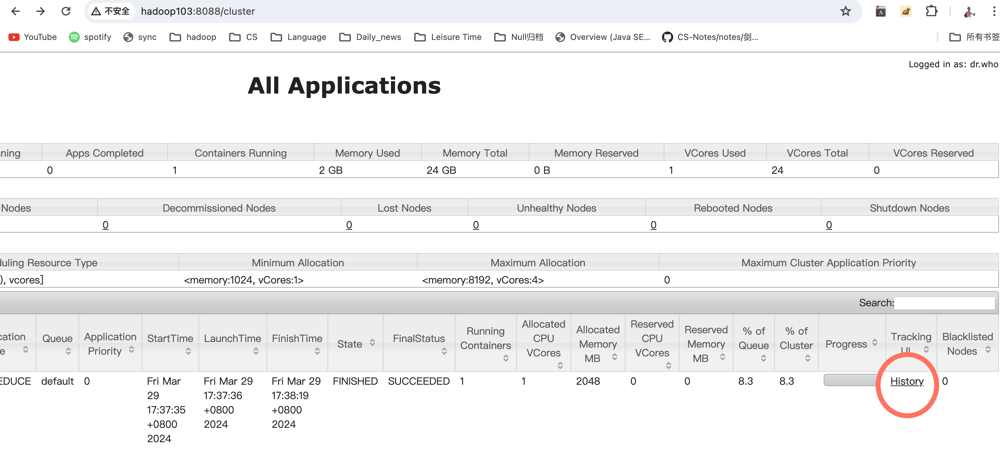
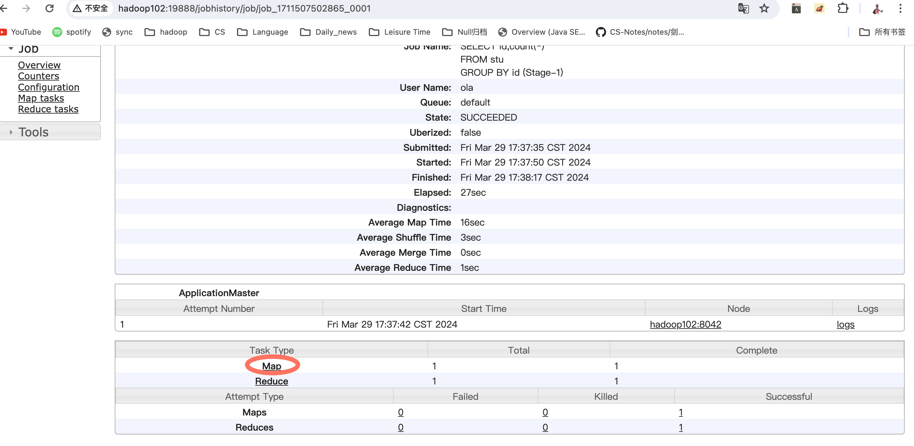
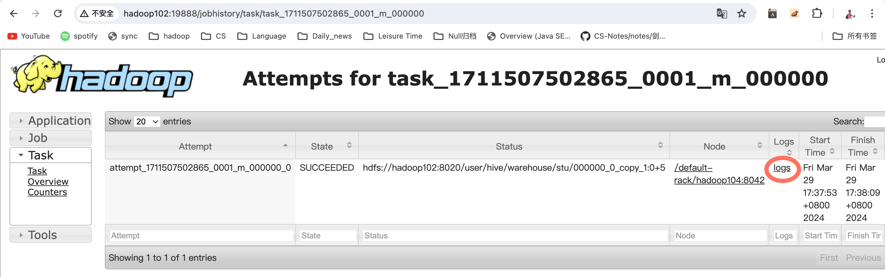

> hive on spark调优

写一条sql语句，底层对应的spark算子是怎么写，job，stage有几个

executor多个，driver一个

nodemanager--多个container，executor在container中，executor内有多个task，每个task默认一个核

container进程是一个JVM进程


desc formatted 表名字；查看存储大小，行数l

优化大部分围绕shuffle进行，分组聚合优化优化思路为减少shuffle的数据量


# Explain 执行计划

* 一个Stage对应一个 MapReduce Job或Spark Job

  Explain 呈现的执行计划，由一系列 Stage 组成，这一系列 Stage 具有依赖关系，每个Stage 对应一个 MapReduce Job，或者一个文件系统操作（fetch抓取结果）等。

* 一个stage也就是一个 Job包含Map Operator Tree 和 Reduce Operator Tree 

  其 Map 端和 Reduce 端的计算逻辑分别由Map Operator Tree 和 Reduce Operator Tree 进行描述，Operator Tree 由一系列的 Operator 组成，**一个 Operator 代表在 Map 或 Reduce 阶段的一个单一的逻辑操作**，例如 TableScan Operator，Select Operator，Join Operator 等。

  

# 1.分组聚合优化

[讲解](https://www.bilibili.com/video/BV1g84y147sX?p=128&spm_id_from=pageDriver&vd_source=6f12b8c78467086fc666a02ab409ef20)

* 思路：优化思路为map-side聚合。所谓map-side聚合，就是在map端维护一个hash table，利用其完成分区内的、部分的聚合，然后将部分聚合的结果，发送至reduce端，完成最终的聚合。map-side聚合能有效减少shuffle的数据量，提高分组聚合运算的效率。

```bash
map-side 聚合相关的参数如下：
--启用map-side聚合
set hive.map.aggr=true;

--hash map占用map端内存的最大比例
set hive.map.aggr.hash.percentmemory=0.5;

--用于检测源表是否适合map-side聚合的条数。
set hive.groupby.mapaggr.checkinterval=100000;

--map-side聚合所用的HashTable，占用map任务堆内存的最大比例，若超出该值，则会对HashTable进行一次flush。
set hive.map.aggr.hash.force.flush.memory.threshold=0.9;
```

在 MapReduce 中，Map 阶段执行过程中，Map 任务会将处理的数据存储在内存中的哈希表中进行局部聚合。这个哈希表被称为 Map 端的哈希表（Map-side Hashtable），用于临时存储中间结果。当这个哈希表占用的内存达到一定的阈值时，Map 任务会执行一次 flush 操作。

flush 操作指的是将哈希表中的数据写入磁盘，以释放内存空间。具体来说，flush 操作会将哈希表中的数据写入磁盘的临时文件中，这些临时文件通常被称为溢出文件（spill files）。在这个过程中，Map 任务会将内存中的部分数据写入溢出文件，以便于继续处理更多的输入数据。

通过执行 flush 操作，Map 任务可以及时释放内存，并继续处理更多的输入数据，以避免因内存不足而导致任务失败或性能下降。虽然 flush 操作会引入磁盘 I/O 的开销，但它是保证 Map 任务内存使用的一种重要机制，可以提高 Map 阶段的执行效率。

# 2.Join

## Common Join

原理：是 Hive 中最稳定的 join 算法，其通过一个 MapReduce Job 完成一个join 操作

Map 端负责读取 join 操作所需表的数据，**并按照关联字段进行分区**，通过Shuffle，将其发送到 Reduce 端，相同 key 的数据在 Reduce 端完成最终的 Join 操作。如下图所示: 

需要**注意**的是，sql 语句中的 join 操作和执行计划中的 Common Join 任务并非一对一的关系，一个 sql 语句中的**相邻**的且**关联字段相同**的多个 join 操作可以合并为一个Common Join 任务。


## Map Join-大表&小表-制作hashtable

1. **预处理**：在执行 Map Join 前

   将小表制作为hash table，并上传至 Hadoop 分布式缓存（本质上是上传至 HDFS）。

   小表被完整地读取并加载到内存中。这一步通常在查询执行的初始化阶段完成。

   这两种哪个对？？？不管了【#me】

2. **分发小表**：当 MapJoin 被触发时，小表（已加载到内存中）被分发到执行 Map 任务的各个节点。这意味着，不管集群有多少个 Map 任务，每个任务都会获得一份小表的完整副本。

3. **大表处理**：大表则按照正常的 MapReduce 流程被分割成多个分区（或称为“切片”），每个分区由一个 Map 任务处理。在处理大表数据时，每个 Map 任务会使用已加载到内存中的小表数据进行即时的 Join 操作。

4. **输出结果**：每个 Map 任务输出的是已经完成 Join 操作的结果数据。因为在 Map 阶段就已经完成了 Join，所以这个过程不需要传统的 Reduce 阶段，从而减少了数据的传输和整体的查询时间。

Map Join 算法可以通过两个只有 map 阶段的 Job 完成一个 join 操作，**没有reduce，没有 shuffle**。

其适用场景为大表 join 小表。若某 join 操作满足要求：

第一个stage（Map Job） 会读取小表数据，将其制作为hash table，并上传至 Hadoop 分布式缓存（本质上是上传至 HDFS）。

第一个本地任务，原因是因为读取的表是小表，如果采用yarn模式读取数据，向RM申请资源那一系列操作繁琐。更加耗费时间，不如本地任务。

第二个stage（Map Job） 会先从分布式缓存中读取小表数据，并缓存在 Map Task 的内存中，然后扫描大表数据，这样在 map 端即可完成关联操作。

```bash
Map Join相关参数如下：
-- 启用map join自动转换
set hive.auto.convert.join=true;
-- 使用无条件转 Map Join，默认是ture
set hive.auto.convert.join.noconditionaltask;
-- common join转map join小表阈值
set hive.auto.convert.join.noconditionaltask.size=
```

## Bucket Map Join-大表&大表

利用Map Join的原理，实现大表关联大表。Map Join的小文件，变成了桶文件

Bucket Map Join 的核心思想是：若能保证参与 join 的表均为分桶表，且关联字段为分桶字段，且其中一张表的分桶数量是另外一张表分桶数量的整数倍，就能保证参与 join的两张表的分桶之间具有明确的关联关系，所以就可以在两表的分桶间进行 Map Join 操作了。这样一来，第二个 Job 的 Map 端就无需再缓存小表的全表数据了，而只需缓存其所需的分桶即可

## Sort Merge Bucket Map Join-大表&大表-不用-制作hashtable，要做桶

优化了Bucket Map Join，不用关注分桶的大小，也不用将整个桶读到内存中，因为桶内排序，只需要读一条数据，对桶的大小没有要求。

Bucket Map Join，两个分桶之间的 join 实现原理为 Hash Join 算法 

SMB Map Join，两个分桶之间的 join实现原理为 Sort Merge Join 算法

Hash Join 和 Sort Merge Join 均为关系型数据库中常见的 Join 实现算法。HashJoin 的原理相对简单，就是对参与 join 的一张表构建 hash table，然后扫描另外一张表，然后进行逐行匹配。Sort Merge Join 需要在两张按照关联字段排好序的表中进行

SMB Map Join 与 Bucket Map Join 相比，在进行 Join 操作时，Map 端是无需对整个Bucket 构建 hash table，也无需在 Map 端缓存整个 Bucket 数据的，每个 Mapper 只需按顺序逐个 key 读取两个分桶的数据进行 join 即可。

```bash
Sort Merge Bucket Map Join相关参数：
--启动Sort Merge Bucket Map Join优化
set hive.optimize.bucketmapjoin.sortedmerge=true;
--使用自动转换SMB Join
set hive.auto.convert.sortmerge.join=true;
```

|                            | 内存                           | 规则                     | 适用于       |
| -------------------------- | ------------------------------ | ------------------------ | ------------ |
| Map Join                   | 小表加载到内存                 |                          | 大表join小表 |
| Sort Merge Bucket Map Join | 不用担心内存，桶内按顺序按条读 | 连接字段为分桶和排序字段 | 大表join大表 |
|                            |                                |                          |              |

Bucket Map Join---->一个桶的大小根据map端的内存大小来定，假如map端有1024mb的内存，那么分出来500m专门用来缓存桶表，所以一个桶的大小不要超过500mb

# 3.数据倾斜

不怕数据量大，并行处理就可以解决，怕的是数据倾斜，扩大并行度没用。

数据倾斜问题，通常是指参与计算的数据分布不均，即某个 key 或者某些 key 的数据量远超其他 key，导致在 shuffle 阶段，大量相同 key 的数据被发往同一个 Reduce，进而导致该 Reduce 所需的时间远超其他 Reduce，成为整个任务的瓶颈。

Hive 中的数据倾斜常出现在分组聚合和 join 操作的场景中，下面分别介绍在上述两种场景下的优化思路。

## 分组聚合-都是提前聚合一次

* map阶段提前聚合，在reduce之前解决倾斜 

  --启用 map-side 聚合

  **set hive.map.aggr=true;** 

  --关闭 skew-groupby

  **set hive.groupby.skewindata=false;**

* map阶段不按照分组字段分区。按照随机分区。这样每个分区数据均匀，分区内聚合。reduce之前减轻数据倾斜

  是启动两个 MR 任务，第一个 MR 按照随机数分区，将数据分散发送到 Reduce，完成部分聚合，第二个 MR 按照分组字段分区，完成最终聚合。
  
  ```
  --启用 skew-groupby
  set hive.groupby.skewindata=true;
  --关闭 map-side 聚合
  set hive.map.aggr=false;
  ```

## Join

> 倾斜发生在reduce端，干掉reduce，都在map端完成

未经优化的 join 操作，默认是使用 common join 算法，通过一个MapReduce Job 完成计算。Map 端负责读取 join 操作所需表的数据，并按照关联字段进行分区，通过 Shuffle，将其发送到 Reduce 端，相同 key 的数据在 Reduce 端完成最终的 Join操作。如果关联字段的值分布不均，就可能导致大量相同的 key 进入同一 Reduce，从而导致数据倾斜问题。

* map阶段完成join，使用 map join 算法，join 操作仅在 map 端就能完成，没有 shuffle 操作，没有 reduce阶段，自然不会产生 reduce 端的数据倾斜。该方案适用于大表 join 小表时发生数据倾斜的场景。

  --启用 map join

  **set hive.auto.convert.join=true;**

  --关闭 skew join

  **set hive.optimize.skewjoin=false;**

* skew join ，为倾斜的大 key 单独启动一个 map join 任务进行计算，其他common join

  --启动 skew join

  **set hive.optimize.skewjoin=true;** 

  --关闭 map join

  **set hive.auto.convert.join=false;**

# 4.任务并行度

Hive 会将一个 SQL 语句转化成一个或者多个 Stage，每个 Stage 对应一个 MR Job。

默认情况下，Hive 同时只会执行一个 Stage。但是某 SQL 语句可能会包含多个 Stage，但这多个 Stage 可能并非完全互相依赖，也就是说有些 Stage 是可以并行执行的。此处提到的并行执行就是指这些 Stage 的并行执行。

对于一个分布式的计算任务而言，设置一个合适的并行度十分重要。在Hive中，无论其计算引擎是什么，所有的计算任务都可分为Map阶段和Reduce阶段。所以并行度的调整，也可从上述两个方面进行调整

# 5.小文件合并

小文件合并优化，分为两个方面，分别是 Map 端输入的小文件合并，和 Reduce 端输出的小文件合并。

## Map 端输入文件合并

合并 Map 端输入的小文件，是指将多个小文件划分到一个切片中，进而由一个 MapTask 去处理。目的是防止为单个小文件启动一个 Map Task，浪费计算资源。

```
--可将多个小文件切片，合并为一个切片，进而由一个 map 任务处理
set hive.input.format=org.apache.hadoop.hive.ql.io.CombineHiveInputFormat;
```

## Reduce 输出文件合并

合并 Reduce 端输出的小文件，是指将多个小文件合并成大文件。目的是减少 HDFS 小文件数量。其原理是根据计算任务输出文件的平均大小进行判断，若符合条件，则单独启动一个额外的任务进行合并。

```
--在 map-only 任务结束时合并小文件，默认 true
set hive.merge.mapfiles=true;
--在 map-reduce 任务结束时合并小文件，默认 false
set hive.merge.mapredfiles=true;
--合并后的文件大小，默认 256M
set hive.merge.size.per.task=256000000;
--当输出文件的平均大小小于该值时，启动一个独立的 map-reduce 任务进行文件 merge，默认16mb
set hive.merge.smallfiles.avgsize=16000000;
```

# 6.CBO优化

CBO 是指 Cost based Optimiser，即基于计算成本的优化。

在 Hive 中，计算成本模型考虑到了：数据的行数、CPU、本地 IO、HDFS IO、网络 IO等方面。

Hive 会计算同一 SQL 语句的不同执行计划的计算成本，并选出成本最低的执行计划。

目前 CBO 在 hive 的 MR 引擎下主要用于 join 的优化，例如多表 join 的 join 顺序。

--是否启用 cbo 优化

```bash
set hive.cbo.enable=true;
```

# 7.计算资源调优

理解如何调是重点。写的代码倒是不多。

## 12.1.计算资源调优


### Yarn资源配置

Yarn配置说明：需要调整的Yarn参数均与CPU、内存等资源有关，核心配置参数如下

* （1）`yarn.nodemanager.resource.memory-mb`

  该参数的含义是，一个NodeManager节点分配给Container使用的内存。一个NodeManager节点可以看作一个服务器，比如有102，103，104三个服务器，每个服务器默认设置是8G，那么集群总内存24G。见下图。实际每台服务器的实际内存是3G，这里我没有配置yarn.nodemanager.resource.memory-mb，所以默认8*3=24G，所以显示的并不是实际的物理内存。会造成问题的！见[yarn节点内存分配问题](##yarn节点内存)

  该参数的配置，取决于NodeManager所在节点的总内存容量和该节点运行的其他服务的数量。

  考虑上述因素，在yarn-site.xml文件中，将其更改为节点总内存的1/2到2/3，此处如果将该参数设置为64G，如下：

  ```xml
  <property>
      <name>yarn.nodemanager.resource.memory-mb</name>
      <value>65536</value>
  </property>
  ```

  

* （2）`yarn.nodemanager.resource.cpu-vcores`

  该参数的含义是，一个NodeManager节点分配给Container使用的CPU核数。该参数的配置，同样取决于NodeManager所在节点的总CPU核数和该节点运行的其他服务。

  yarn.nodemanager.resource.cpu-vcores和yarn.nodemanager.resource.memory-mb的分配比例是1：4，1个核分配4G。

  考虑上述因素，此处如果将该参数设置为16：

  ```xml
  <property>
      <name>yarn.nodemanager.resource.cpu-vcores</name>
      <value>16</value>
  </property>
  ```

* （3）`yarn.scheduler.maximum-allocation-mb`

  该参数的含义是，单个Container能够使用的最大内存。推荐配置如下：

  ```xml
  <property>
      <name>yarn.scheduler.maximum-allocation-mb</name>
      <value>16384</value>
  </property>
  ```

* （4）`yarn.scheduler.minimum-allocation-mb`

  该参数的含义是，单个Container能够使用的最小内存，推荐配置如下：

  ```xml
  <property>
      <name>yarn.scheduler.minimum-allocation-mb</name>
      <value>512</value>
  </property>
  ```

（1）修改$HADOOP_HOME/etc/hadoop/yarn-site.xml文件

（2）修改参数，虚拟机32g内存的前提下，3台虚拟机，NodeManager内存每台10g，container内存4g

（3）分发该配置文件

（4）停止Yarn

（5）重启Yarn

### MapReduce资源配置

MapReduce资源配置主要包括Map Task的内存和CPU核数，以及Reduce Task的内存和CPU核数。核心配置参数如下：

* （1）`mapreduce.map.memory.mb`

  该参数的含义是，单个Map Task申请的container容器内存大小，其默认值为1024。该值不能超出yarn.scheduler.maximum-allocation-mb和yarn.scheduler.minimum-allocation-mb规定的范围。

  该参数需要根据不同的计算任务单独进行配置，在hive中，可直接使用如下方式为每个SQL语句单独进行配置：

  set mapreduce.map.memory.mb=2048;

* （2）`mapreduce.map.cpu.vcores`

  该参数的含义是，单个Map Task申请的container容器cpu核数，其默认值为1。该值一般无需调整。

* （3）`mapreduce.reduce.memory.mb `

  该参数的含义是，单个Reduce Task申请的container容器内存大小，其默认值为1024。该值同样不能超出yarn.scheduler.maximum-allocation-mb和yarn.scheduler.minimum-allocation-mb规定的范围。

  该参数需要根据不同的计算任务单独进行配置，在hive中，可直接使用如下方式为每个SQL语句单独进行配置：

  set mapreduce.reduce.memory.mb=2048;

* （4）`mapreduce.reduce.cpu.vcores`

  该参数的含义是，单个Reduce Task申请的container容器cpu核数，其默认值为1。该值一般无需调整。

如何配置task的内存，可以在MapReduce执行任务日志中看到，具体操作：

| 1                         | 2                         | 3                                         |
| ------------------------- | ------------------------- | ----------------------------------------- |
|  |  |                  |
| **4**                     | **5**                     | **结论**                                  |
|  |  | **可以看到一个map task占用内存不到400MB** |


# 参考

[Hive调优 【本地模式】](https://www.cnblogs.com/bajiaotai/p/15878580.html)

[Hive调优 【严格模式】](https://www.cnblogs.com/bajiaotai/p/15890034.html)

[Hive调优 【分组聚合 开启map端聚合】](https://www.cnblogs.com/bajiaotai/p/15882337.html)

[Hive调优 【大小Join小表-MapJoin】](https://www.cnblogs.com/bajiaotai/p/15880521.html)

[Hive调优 【大表Join大表-空key处理】](https://www.cnblogs.com/bajiaotai/p/15880556.html)

[ Hive调优 【count(distinct)】](https://www.cnblogs.com/bajiaotai/p/15882363.html)

[Hive调优 【行列过滤 及谓词下推】](https://www.cnblogs.com/bajiaotai/p/15883660.html)

[Hive调优 【小文件合并】](https://www.cnblogs.com/bajiaotai/p/15888671.html)

？？？[Hive调优 【合理设置Map数】](https://www.cnblogs.com/bajiaotai/p/15888617.html)

[Hive调优 【合理设置Reduce数】](https://www.cnblogs.com/bajiaotai/p/15888993.html)

[Hive调优 【执行计划】](https://www.cnblogs.com/bajiaotai/p/15878557.html)

[Hive调优 【笛卡尔积】](https://www.cnblogs.com/bajiaotai/p/15882392.html)

[ Hive调优 【任务并行设置】](https://www.cnblogs.com/bajiaotai/p/15890031.html)
