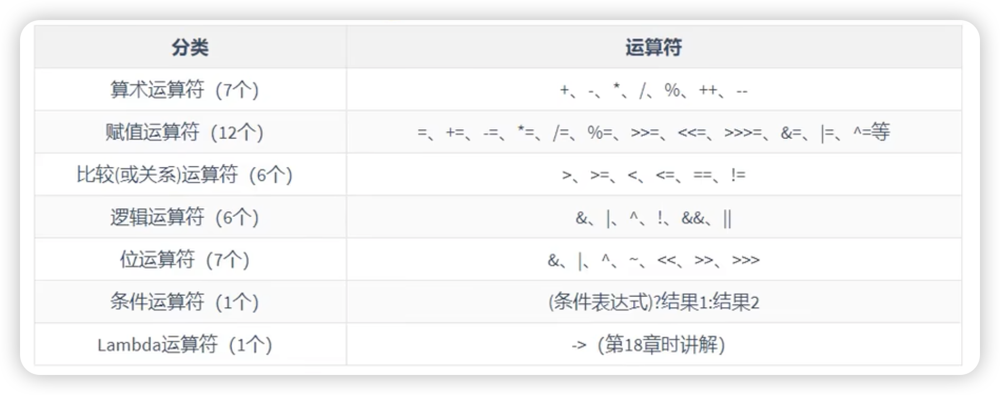
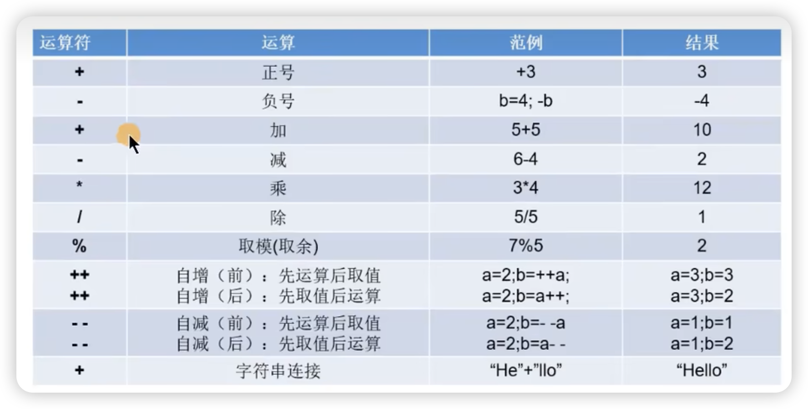

# 1.变量

## 1.1.关键字keyword

> 关键字：50个+3个
>
> true、 false、 null虽然不是关键字，但是可以当做关键字来看待
>
> 关键字中包含2个保留字：goto、const


* 定义：被Java语言赋予了特殊含义，用做专门用途的字符串（或单词）
  HelloWorld案例中，出现的关键字有 class、 public 、 static、void 等，这些单词已经被Java定 义好了。
* 特点：全部关键字都是小写字母。
  关键字比较多，不需要死记硬背，学到哪里记到哪里即可。
  官方地址：https://docs.oracle.com/javase/tutorial/java/nutsandbolts/_keywords.html

## 1.2.标识符identifier 

> 凡是自己可以起名字的地方都叫标识符。比如：类名、方法名、变量名、包名、常量名等。类用大驼峰，里面的方法和变量用小驼峰
>
> 定义标识符时，要注意“见名知意”，定义的让人一看就理解
>
> 参考: [代码整洁之道_关于标识符](./books/代码整洁之道_关于标识符.txt)、[代码整洁之道](./books/代码整洁之道.pdf)

1. **什么是标识符**

​	Java中变量、方法、类等要素命名时使用的字符序列，称为标识符。

2. **标识符的命名规则**（必须要遵守！！否则，编译不通过）

   * 由26个英文字母大小写，0-9，_或＄组成
   * 数字不可以开头、不能包含空格
   * 不可以使用[关键字和保留字](##1.1.关键字keyword)，但能包含关键字和保留字。例如不能使用public，可以使用abcpublic
   * Java中严格区分大小写，长度无限制

3. **标识符的命名规范**（不遵守不会报错，但是看起来不爽）

   > 大驼峰累竭，小驼峰变方（类、接口、变量、方法）

   * 包名：多单词组成时所有字母都小写：xxxyyyzzz
     例如：java.lang、 com. atguigu.bean
   * 类名、接口名：大驼峰，多单词组成时，所有单词的首字母大写：XxxYyyZzz
     例如：HelloWorld, String, System等
   * 变量名、方法名：小驼峰，多单词组成时，第一个单词首字母小写，第二个单词开始每个单词首字母大写：xxxYyyZzz
     例如：age,name, bookName, main,binarySearch, getName
   * 常量名：所有字母都大写。多单词时每个单词用下划线连接：XXX_YYY_ZZZ
     例如：MAX_VALUE,PI, DEFAULT_CAPACITY

## 1.3.变量

> 说明：
> 1.变量都有其作用域。变量只在作用域内是有效的，出了作用域就失效了，作用域就是method的括号{}
> 2.在同一个作用域内，不能声明两个同名的变量
> 3.定义好变量以后，就可以通过变量名的方式对变量进行调用和运算。
> 4.变量值在赋值时，必须满足变量的数据类型，并且在数据类型有效的范围内变化

1. 变量的理解：内存中的一个存储区域，该区域的数据可以在同一类型范围内不断变化

2. 变量的构成包含三个要素：[数据类型](##1.4.变量的数据类型)、变量名、存储的值

3. Java中变量声明的格式：[数据类型](##1.4.变量的数据类型) 变量名=变量值

   读法：先看等号右边的，再看等号左边 -> 将等号右边的数据赋值给等号左边的变量
   哪怕等号右边有运算,我们都得先将等号右边的运算算出一个值来,最后赋值给等号左边的变量

```java
public class VariableTest{
    public static void main(String[] args) {
        char gender; //过程1: 变量的声明
        gender='男';//过程2: 变量的赋值（或初始化）
        gender ='女';
      //过程1和2合并
        int age = 10;

    System.out.printin(age);
    }
}
```

```java
连续定义三个相同类型的变量
比如:int i,j,k;
         i = 10;
         j = 20; 
         k = 30;
或者
int i = 10,j = 20,k = 30;
```


## 1.4.变量的数据类型

Java中的变量按照数据类型来分类：

* **基本数据类型**（8种4类）：

  整型：byte \ short \ int \ long
  浮点型：float \ double
  字符型：char
  布尔型：boolean

* **引用数据类型**（6类）
  类(class)：`System.out.printin(age)中的System；String[] args中的String`
  数组(array)
  接口(interface)
  枚举(enum）
  注解(annotation)
  记录(record) 
  
  | 数据类型     | 关键字         | 内存占用 | 取值范围  |
  | :----------- | :------------- | :------- | :-------- |
  | 字节型       | byte           | 1个字节  | -127～127 |
  | 短整型       | short          | 2个字节  |           |
  | 整型         | int（默认）    | 4个字节  |           |
  | 长整型       | long           | 8个字节  |           |
  | 单精度浮点数 | float          | 4个字节  |           |
  | 双精度浮点数 | double（默认） | 8个字节  |           |
  | 字符型       | char           | 2个字节  |           |
  | 布尔类型     | boolean        | 4个字节  |           |

### 整型

> 定义long类型的变量，赋值时需要以“L“或"l"作为后缀
>
> 通常采用int类型


* int
  
  整型，在除法中，计算规则
  
  ```java
  int a = 7, b = 3;
  int c1 = a/b; //c1结果是2，取整
  //a和b中任意一个数字不是整型，结果不再是整型，按照正常的除法来算
  7.0/2=3.5
  7.0/2.0=3.5
  7/2.0=3.5
  ```
  
  

### 浮点型

> 通常采用double类型
>
> 将来开发不要用float或者double直接参与运算,因为直接参与运算会有精度损失问题  


* 浮点型常量有两种表示形式：
  * 十进制数形式。如：5.12、512.0f 、.512 （必须有小數点）
  * 科学计数法形式，如：5.1262、512E2、100E2
* float：`单精度`，尾数可以精确到7位有效数学，很多情况下，精度很难满足需求。
* double：`双精度`，精度是float的两倍。通常采用此类型。
* 定义float类型的变量，赋值时需要以“f“或"F"作为后缀。

* 浮点型精确度

  并不是所有的小数都能可以精确的用二进制浮点数表示。二进制浮点数不能精确的表示0.1、0.01、0.001这样
  10的负次幂。
  浮点类型float、 double的数据不适合在不容许舍入误差的金融计算领域。如果需要精确数字计算或保留指定
  位数的精度，需要使用` BigDecimal类`

### 字符型

字符型变量的三种表现形式：

* 形式1：使用单引号`"`括起来的单个字符
  例如：char c1 ='a'；char c2 ='在'；char c3 = '9';

* 形式2：直接使用 Unicode值 来表示字符型常量：`'\uxxx'`。其中，xxx代表一个十六进制整数。
  例如：\u0023 表示‘#。

* 形式3：Java中还允许使用 `转义字符\`来将其后的字符转变为特殊字符型常量。
  例如：charc3='\n'；//'\n'表示换行符

* 形式4：使用具体字符对应的数值（比如ASCII码）

  例如：char c11 = 97；

```java
//表示形式1：使用一对，表示，内部有且仅有一个字符
char cl ='s'
char c2 = '在'
char c3 = '1'
char c4 = '@'

//编译不通过
//char c6 =''//空字符
//char c7 = 'ab'//两个字符
  
//表示形式2：直接使用Unicode值来表示字符型常量。
char c8 = '\u0036'；
System.out. println(c8)；
//表示形式3：使用转义字符
char c9 ='\n'；
char c10 ='\t'；
System.out.println("hello" + c10 + “world")；
//表示形式4：使用具体字符对应的数值（比如ASCII码）
char c11 = 97；
System.out.printin(c11);//a
```

### 布尔类型boolean

* boolean 类型用来判断逻辑条件，一般用于流程控制语句中：
  * if条件控制语句；
  * while循环控制语句；
  * for循环控制语句；
  * do-while循环控制语句；

* boolean类型数据只有两个值：true、false，无其它。
  * 不可以使用0或非0的整数替代false和true，这点和C语言不同。
  * 拓展：Java虚拟机中没有任何供boolean值专用的字节码指令，Java语言表达所操作的boolean值，在编译之后都使用java虚拟机中的int数据类型来代替：true用1表示，false用0表示。一—《java虚拟机规范8版》

### String字符串

> char声明是单引号，只有单个字符，String是双引号，可以有任意个字符

* String是一个类，属于引用数据类型，俗称字符串

* String类型的变量，可以使用一对双引号""的方式进行赋值

* String声明的字符串内部，可以包含0个，1个或多个字符

  ```java
  public class StringTest{
      public static void main(String[] args) {
          String str1 = "a";//char c = 'a'，两个不一样！
        	String str2 = "";
      System.out.println(str1);
      System.out.println(str2);
      }
  }
  ```


## 1.5.基础数据变量间运算&类型转换

> 1.7种基本数据类型参与运算，不包括布尔类型
>
> 2.什么时候发生类型转换:
>   a.赋值，等号左右两边类型不一致
>   b.运算，不同类型的数据做运算
>
> 3.基本类型中按照取值范围从小到大排序:
>   byte,short,char -> int -> long -> float -> double   
>
>  `byte,short,char两两之间做运算，都转换为int类型`

### 自动类型转换

> 小到大

1.赋值：将取值范围小的数据类型赋值给取值范围大的数据类型 -> 小自动转大
2.运算：取值范围小的数据类型和取值范围大的数据类型做运算 -> 小自动转大 

```java
public class Demo09DataType{
	public static void main(String[] args){
		/*
		  等号右边是整数,整数默认类型为int
		  等号左边是long型的变量
		  
		  将取值范围小的数据类型赋值给取值范围大的数据类型,发生了自动类型转换
		*/
		long num1 = 100;
		System.out.println(num1);
		
		
		int i = 10;
		double b = 2.5;
		
		/*
		   double = int+double
		   double  = double+double
		   int自动提升为了double,发生了自动类型转换
		   取值范围小的数据类型和取值范围大的数据类型做运算
		*/
		double sum = i+b;
		System.out.println(sum);
	}
}
```

### 强制类型转换

> 大到小

1.将取值范围大的数据类型赋值给取值范围小的数据类型
  取值范围小的 数据类型 变量名 = 取值范围大的数据类型 -> 需要强转
2.怎么强转:
  取值范围小的数据类型 变量名 = (取值范围小的数据类型)取值范围大的数据类型

```java
public class Demo10DataType{
	public static void main(String[] args){
		/*
		  等号右边的数据是小数,小数默认类型为double
		  等号左边的变量是float型
		  
		  将取值范围大的赋值给取值范围小 -> 报错,需要强转
		*/
		//float num1 = 2.5;
		float num1 = (float)2.5;
		System.out.println(num1);
    
		byte b = 10;
		System.out.println(b);
		
		b = (byte)(b+1);
		System.out.println(b);
	}
}
```

### 强制转换注意事项

> 1.不要随意写成强转的格式,因为会有精度损失问题以及数据溢出现象,除非没有办法
> 2.byte,short定义的时候如果等号右边是整数常量,如果不超出byte和short的范围,不需要我们自己强转,jvm自动转型  
>     byte,short如果等号右边有变量参与,byte和short自动提升为int,然后结果再次赋值给byte或者short的变量,需要我们自己手动强转
> 3.char类型数据如果参与运算,会自动提升为int型,如果char类型的字符提升为int型会去ASCII码表(美国标准交换代码)范围内去查询字符对应的int值,如果在ASCII码表范围内没有对应的int值,回去unicode码表(万国码)中找  

```java
public class Demo11DataType{
	public static void main(String[] args){
		//精度损失
		int i = (int)2.9;
		System.out.println(i);
		
		/*
		  数据溢出
		  int型占内存4个字节,4个字节变成二进制是32位
		  
		  100个亿: 10 0101 0100 0000 1011 1110 0100 0000 0000 -> 34位二进制
		  
		  100个亿的二进制位比int型的二进制位多出来2位,此时干掉最前面的2位
		  
		  101 0100 0000 1011 1110 0100 0000 0000
		  
		  101 0100 0000 1011 1110 0100 0000 0000->1410065408
		*/
		int j = (int)10000000000L;
		System.out.println(j);//1410065408
		
	    System.out.println("=========================");
		
		byte b = 10;
		System.out.println(b);
		
		b = (byte)(b+1);
		System.out.println(b);
		
		System.out.println("=========================");
		
		char c = '中';
		System.out.println(c+0);//20013
	}
}
```

## 1.6.String与基础数据类型间运算

string与基本数据类型变量间的运算

* 这里的基本数据类型包括boolean在内的8种

* String与基本数据类型变量间`只能做连接运算`，使用"+"表示

* 运算的结果是String类型

  ```java
  public class StringTest{
      public static void main(String[] args) {
          int a=500;
          char age = '斤';
          String str1 = "a";//char c = 'a'，两个不一样！
        	String str2 = "";
      System.out.println(str1);
      System.out.println(str2);
      System.out.println(str1+a+age+"今天开心");//a500斤今天开心
      }
  }
  ```

# 2.计算机底层如何存储数据

**计算机存储单位**

* 字节（Byte）：是计算机用于计量存储容量的基本 单位，一个字节等于8 bit
* 位（bit)：是数据存储的最小单位。二进制数系统中，每个0或1就是一个位，叫做bit（比特），其中8 bit
  就称为一个字节(Byte)。
* 转换关系：
  8 bit = 1 Byte
  1024 Byte =1 KB
  1024 KB = 1 MB
  1024 MB = 1 GB
  1024 GB =1 TB

计算机世界中只有二进制，所以计算机中存储和运算的 所有数据都要转为二进制。包括数字、字符、图片、声
音、视频等。 

| 十进制 | 二进制 | 八进制 | 十六进制 |
| ------ | ------ | ------ | -------- |
| 0      | 0      | 0      | 0        |
| 1      | 1      | 1      | 1        |
| 2      | 10     | 2      | 2        |
| 3      | 11     | 3      | 3        |
| 4      | 100    | 4      | 4        |
| 5      | 101    | 5      | 5        |
| 6      | 110    | 6      | 6        |
| 7      | 111    | 7      | 7        |
| 8      | 1000   | 10     | 8        |
| 9      | 1001   | 11     | 9        |
| 10     | 1010   | 12     | a或A     |
| 11     | 1011   | 13     | b或B     |
| 12     | 1100   | 14     | c或C     |
| 13     | 1101   | 15     | d或D     |
| 14     | 1110   | 16     | e或E     |
| 15     | 1111   | 17     | f或F     |
| 16     | 10000  | 20     | 10       |

## 2.1.进制的分类

* 十进制 (decimal)
  数字组成：0-9
  进位规则：满十进一
* 二进制 (binary)
  数字组成：0-1
  进位规则：满二进一，以0b或0B 开头
* 八进制 (octal)：很少使用
  数字组成：0-7
  进位规则：满八进一，以数字。开头表示
* 十六进制
  数字组成：0-9，a-f
  进位规则：满十六进一，以0x 或0X 开头表示。此处的 a-f 不区分大小写

## 2.2.进制的转换

> 1.计算机在存储数据的时候都是存储的数据的补码。计算也是用的数据的补码。但是我们最终看到的结果是原码换算出来的。
>
> 原码   反码   补码
>
> 2.正数二进制最高位为0;  负数二进制最高位为1
>
> 3.如果是正数  原码 反码 补码 一致
>
> 以byte为单位
>
> 比如:5的原码  反码  补码一致:
>    0000 0101 -> 因为是正数,二进制最高位为0
>
> 4.如果是负数,原码 反码 补码不一样了
>     反码是原码的基础上最高位不变,剩下的0和1互换
>     补码是在反码的基础上+1
>
> 比如:-9
>     原码: 1000 1001
>     反码: 1111 0110
>     补码: 1111 0111

### 十进制转成二进制

```java
辗转相除法 -> 循环除以2,取余数
```


### 二进制转成十进制

```java
给除了最高位的位置，从右到左每个位置赋一个index，例如byte，index从右到左，0-7
下面1100，index分别是3，2，1，0，然后根据index求2对应的index次方，然后再乘以对应的01数字，最后加和
```


# 3.运算符

* 按照`功能`划分，其中位运算符不常用



## 3.1.算术运算符



* %

  12%5 ，12是被模数

  常用来计算一个数是否整除另外一个数

  去模以后，结果的正负与被模数相同

* 前++

  > 带有++的变量，无论前后++，都会自增1：
  >
  > * ++a：a先自增1，再运算
  > * a++：a先运算，再自增1
  >
  > 没有其他运算的情况下，单独增1:a++/++a，这两个没有区别
  >
  > 不会改变数据类型

  ```java
  int a1 = 1;
  int b1 = ++a1;//b1等于2，a1=2
  ```

* 后++

  ```java
  int a2 = 1;
  int b2 = a1++;//b2等于1,a2=2
  ```

## 1.算数运算符

> ++/--是java独有

| 符号 | 说明                                                         |
| ---- | ------------------------------------------------------------ |
| +    | 加法                                                         |
| -    | 减法                                                         |
| *    | 乘法                                                         |
| /    | 除法<br>如果符号前后都是整数,结果取整数部分<br>如果符号前后有一个为小数,结果就是正常小数 |
| %    | 模,取余数部分                                                |

```java
public class Demo01Arithmetic {
    public static void main(String[] args) {
        int i = 10;
        int j = 3;
        int add = i+j;//推荐使用
        System.out.println(add);//13
        System.out.println(i+j);//13

        int sub = i-j;
        System.out.println(sub);//7

        int mul = i*j;
        System.out.println(mul);//30

        int div = i/j;
        System.out.println(div);//3

        int mo = i%j;
        System.out.println(mo);//1
    }
}
```

```java
+:
  1.运算
  2.字符串拼接:任何类型的数据遇到字符串都会变成字符串,此时+就不再是运算了,而是字符串拼接,将内容直接往后拼接    
 
```

```java
public class Demo02Arithmetic {
    public static void main(String[] args) {
        int i = 10;
        int j = 3;
        System.out.println(i+j+"");//13
        System.out.println(i+j+""+1);//131
        System.out.println(i+""+j);//103

        System.out.println("i和j相加只和为:"+(i+j));
    }
}
```

### 1.2.自增自减运算符(也算算数运算符的一种)

```java
1.格式:
  变量++ -> 后自加
  ++变量 -> 前自加
  变量-- -> 后自减
  --变量 -> 前自减
      
  自增和自减只变化1
      
2.使用:
  a.单独使用: ++ -- 单独为一句,没有和其他的语句掺和使用
    i++;

    符号前在在后都是先运算
        
  b.混合使用: ++ -- 和其他的语句掺和使用了(比如:输出语句,赋值语句)
    符号在前:先运算,在使用运算后的值
    符号在后:先使用原值,使用完毕之后,自身再运算
      
```

```java
public class Demo03Arithmetic {
    public static void main(String[] args) {
        int i = 10;
        //i++;
        ++i;
        System.out.println("i = " + i);

        System.out.println("==================");

        int j = 100;
        int result01 = ++j;
        System.out.println("result01 = " + result01);//101
        System.out.println(j);//101

        System.out.println("==================");
        int k = 10;
        int result02 = k++;
        System.out.println("result02 = " + result02);
        System.out.println(k);

        System.out.println("==================");

        int z = 100;
        System.out.println(z++);
        System.out.println(z);

        System.out.println("==================");

        int x = 10;
        int y = 20;

        /*
           10+19 = 29
           29+12 = 41

           以后开发肯定不会这么写
         */

        int result03 = x++ + --y + ++x;
        System.out.println("result03 = " + result03);

        System.out.println("=======================");

        int c = 10;
        c = c++;
        System.out.println(c);//10
        System.out.println(c);//10

    }
}
```

## 3.赋值运算符

```java
1.基本赋值运算符:
  =  -> 先看等号右边的,再将右边的数据赋值给等号左边的变量
      
2.复合赋值运算符:
  +=:
    int i = 10;
    i+=2 -> i = i+2
       
        
  -=
  *=
  /=  : 取整数部分
  %=  : 取余数部分  
      
3.注意:byte short 遇到复合赋值运算符,jvm会自动转型      
```

```java
public class Demo01Assignment {
    public static void main(String[] args) {
        int i = 10;
        i+=2;//i = i+2
        System.out.println(i);
    }
}
```

```java
public class Demo02Assignment {
    public static void main(String[] args) {
        byte b = 10;
        //b = (byte)(b + 1);
        b+=1;//b = b+1
        System.out.println(b);
    }
}
```

## 4.关系运算符(比较运算符)

```java
1.结果:boolean型 -> 要么是true,要么是false
2.作用:做条件判断使用    
```

| 符号 | 说明                                                       |
| ---- | ---------------------------------------------------------- |
| ==   | 如果符号前后相等为true;否则为false                         |
| >    | 如果符号前的数据大于符号后的数据为true,否则为false         |
| <    | 如果符号前的数据小于符号后的数据为true,否则为false         |
| >=   | 如果符号前的数据大于或者等于符号后的数据为true,否则为false |
| <=   | 如果符号前的数据小于或者等于符号后的数据为true,否则为false |
| !=   | 如果符号前后不相等为true;否则为false                       |

```java
public class Demo01Compare {
    public static void main(String[] args) {
        int i = 10;
        int j = 20;

        boolean result01 = i == j;
        System.out.println("result01 = " + result01);//false
        System.out.println(i>j);//false
        System.out.println(i<j);//true
        System.out.println(i>=j);//false
        System.out.println(i<=j);//true
        System.out.println(i!=j);//true

    }
}
```

## 5.逻辑运算符

```java
 1.作用:连接多个boolean结果的
 2.结果:boolean型结果    
```

| 符号        | 说明                                                         |
| ----------- | ------------------------------------------------------------ |
| &&(与,并且) | 有假则假,符号前后有一个结果为false,整体就是false             |
| \|\|(或者)  | 有真则真,符号前后有一个结果为true,整体就是true               |
| !(非,取反)  | 不是true,就是false;不是false,就是true                        |
| ^(异或)     | 符号前后结果一样为false;不一样为true<br>true^true -> false<br>true^false -> true<br>false^true -> true<br>false^false -> false |

```java
public class Demo01Logic {
    public static void main(String[] args) {
        int i = 10;
        int j = 20;
        int k = 10;

        boolean result01 = (i>j) && (i==k);
        System.out.println("result01 = " + result01);//false

        boolean result02 = (i>j) || (i==k);
        System.out.println("result02 = " + result02);//true

        boolean result03 = (i>j) ^ (i==k);//false ^ true
        System.out.println("result03 = " + result03);//true

        boolean result04 = !(i>j) ;
        System.out.println("result04 = " + result04);//true
    }
}

```

> | 符号 | 说明                                                         |
> | ---- | ------------------------------------------------------------ |
> | &    | 1.单与,如果前后都是布尔型,有假则假,但是如果符号前为false,符号后的判断会继续执行<br>2.如果该符号前后都是数字,看做是位运算符 |
> | &&   | 1.双与,有假则假,但是有短路效果,如果符号前为false,符号后的判断就不会执行了 |
> | \|   | 1.单或,如果前后都是布尔型,有真则真,但是如果符号前为true,符号后的判断会继续执行<br>2.如果该符号前后都是数字,看做是位运算符 |
> | \|\| | 1.双或,有真则真,但是有短路效果,如果符号前为true,符号后的判断就不会执行了 |
>
> ```java
> public class Demo02Logic {
>  public static void main(String[] args) {
>      int a = 10;
>      int b = 20;
>      //boolean result01 = (++a>100)&(++b>10);
>      //boolean result01 = (++a > 100) && (++b > 10);
> 
>      //boolean result01 = (++a<100)|(++b>10);
>      boolean result01 = (++a<100)||(++b>10);
>      System.out.println("result01 = " + result01);
>      System.out.println("a = " + a);
>      System.out.println("b = " + b);
>  }
> }
> ```
>
> 问题:定义一个变量(a),随意给一个值,判断这个变量接收的值是否在1-100之间
>
> 1<=a<=100 -> 错误,这是数学写法
>
> i>=1 && i<=100 -> java写法,用逻辑运算符拼接多个判断

## 6.三元运算符

```java
1.格式:
  boolean表达式?表达式1:表达式2
      
2.执行流程:
  先判断,如果是true,就走?后面的表达式1,否则就走:后面的表达式2
```

### 6.1练习1

```java
需求:小明考完试了,判断小明的分数是否及格,返回结果
```

```java
public class Demo01Ternary {
    public static void main(String[] args) {
        //定义一个变量,表示小明的分数
        int score = 60;
        String result = score>=60?"及格":"不及格";
        System.out.println("result = " + result);
    }
}
```

### 6.2练习2

```java
有两个老人,年龄分别为70  80  求出两个老人的最高年龄
```

```java
public class Demo02Ternary {
    public static void main(String[] args) {
        int old1 = 70;
        int old2 = 80;
        
        int max = old1>old2?old1:old2;
        System.out.println("max = " + max);
    }
}
```

### 6.3 练习3

```java
有三个老人,年龄分别为70  80  60  求出三个老人的最高年龄
```

```java
public class Demo03Ternary {
    public static void main(String[] args) {
        int old1 = 70;
        int old2 = 80;
        int old3 = 60;

        int temp = old1>old2?old1:old2;

        int max = temp>old3?temp:old3;
        System.out.println("max = " + max);
    }
}
```


# Practice

> 要求填写自己的姓名、年龄、性别、体重、婚姻状况（己婚用true表示，单身用false表示）、联系方式等等！

```java
public class Practice1 {
    //要求填写自己的姓名、年龄、性别、体重、婚姻状况（己婚用true表示，单身用false表示）、联系方式等等！
    public static void main(String[] args) {
        String name = "Ola", phone = "1234", gender = "female";
        int age = 30;
        double weight = 30.6;
        boolean marriage = false;
        System.out.println("姓名："+name);
        System.out.println("年龄："+age+'\n');
        System.out.println("性别："+gender);
        System.out.println("体重："+weight);
        System.out.println("婚姻状况："+marriage);
        System.out.println("联系方式："+phone);
    }
    
}
```

```bash
姓名：Ola
年龄：30

性别：female
体重：30.6
婚姻状况：false
联系方式：1234
```

```java
public class Practice2 {
    public static void main(String[] args) {
        String str1=4;//判断对错：false
        String str2 = 3.5f+"";//判断str2对错：yes
        System.out.println(str2);//输出：3.5
        System.out .println(3+4+"Hello!");//输出：7Hello!
        System.out.println("Hellol"+3+4); //输出：Hello!34
        System.out.println('a'+1+"Hello!");//输出：98Hello!
        System.out.println("Hello"+'a'+1);//输出：Helloa1
    }
    
}
```


> 数字153，求个位数、十位数、百位数的数字是多少

```java
public class Practice3 {
    public static void main(String[] args) {
        int num=153;
        int ge=num%10;
        int shi=num/10%10;//num/10不是等于15.3，而是取整数15，15.6也是15，不会四舍五入
        int bai=num/100%10;
        System.out.println("原数字："+num+"，个位数："+ge+"，十位数："+shi+"，百位数："+bai);
    }
    
}

```

```
原数字：153，个位数：3，十位数：5，百位数：1
```

> 后++，先赋值，再运算，会将运算前的原始数字存储在操作数栈中，然后再运算，操作数栈的数据留着给被赋值的变量用。
>
> 下面的例子中数据栈的数字留给被赋值的m，看起来很混淆，因为m自增1了啊，应该是3啊，听起来没毛病。但是不是这个逻辑，只能数据栈的数据给被赋值的m

```java
public class Practice4 {
    public static void main(String[] args){
        int i=1;
        int j= i++;
        System.out.println(j);
      
      	int m=2;
        m=m++;
      //（1)先取m的值“2”放操作数栈（2）m再自增，m=3(3)再把操作数栈中的“2”赋值给m,m=2
        System.out.println(m);     
    }
}
```

> 考验运算符优先级，++;--优先级最高

```java
public class Practice4 {
    public static void main(String[] args){
        int i=1;
        int j= i++ + ++i * i++;//1+3*3
        System.out.println(j);
    }
}
```

# 复习总结

_[课程视频](https://www.bilibili.com/video/BV1PY411e7J6?p=40&vd_source=6f12b8c78467086fc666a02ab409ef20)_


