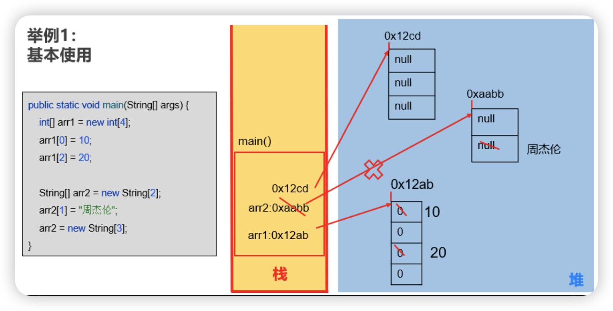
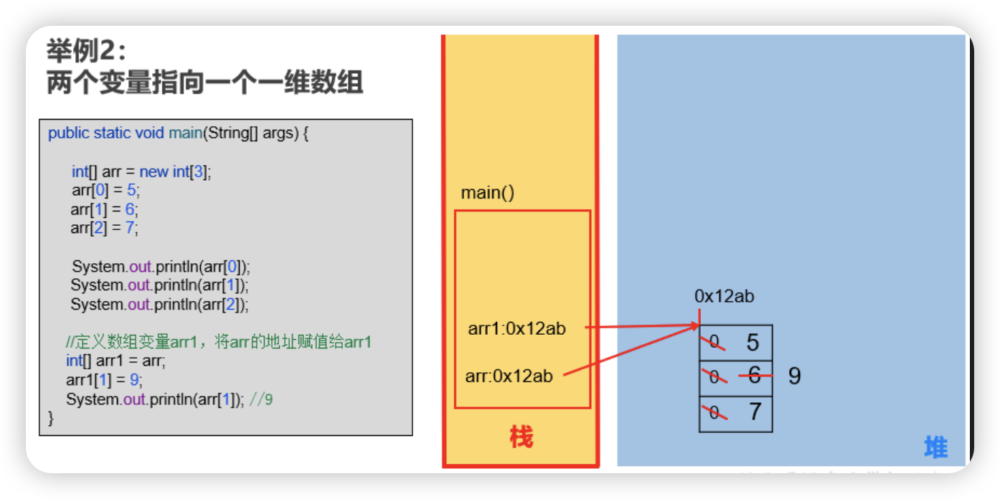
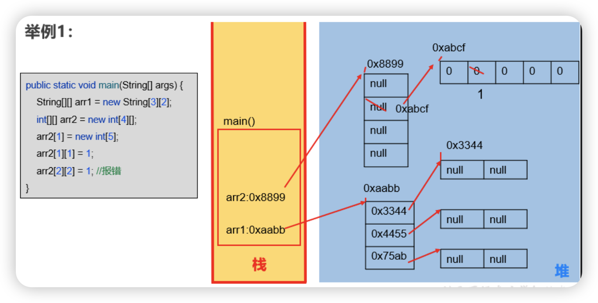

# 1. 数组概述

## 1.1.概念

> Java中的容器：数组、集合框架（第12章）：在内存中对多个数据的存储

- 数组(Array)，是多个相同类型数据按一定顺序排列的集合，并使用一个名字命名，并通过编号的方式对这些数据进行统一管理。
- 数组中的概念
  - 数组名
  - 下标（或索引index）
  - 元素
  - 数组的长度

**数组的特点：**

- 数组本身是`引用数据类型`，而数组中的元素可以是`任何数据类型`，包括基本数据类型和引用数据类型--`数组内元素可以是数组和String类`
- 创建数组对象会在内存中开辟一整块`连续的空间`。占据的空间的大小，取决于数组的长度和数组中元素的类型。
- 数组中的元素在内存中是依次紧密排列的，有序的。
- 数组，一旦初始化完成，其长度就是确定的。数组的`长度一旦确定，就不能修改`。
- 我们可以直接通过下标(或索引)的方式调用指定位置的元素，速度很快。
- 数组名中引用的是这块连续空间的首地址。

### 1.2 数组的分类

**1、按照元素类型分：**

- 基本数据类型元素的数组：每个元素位置存储基本数据类型的值
- 引用数据类型元素的数组：每个元素位置存储对象（本质是存储对象的首地址）（在面向对象部分讲解）

**2、按照维度分：**

- 一维数组：存储一组数据
- 二维数组：存储多组数据，相当于二维表，一行代表一组数据，只是这里的二维表每一行长度不要求一样

## 1.3.一维数组学习评判标准

```
一维数组的使用（6个基本点）
> 数组的声明和初始化
> 调用数组的指定元素
> 数组的属性：length,表示数组的长度
> 数组的遍历
> 数组元素的默认初始化值
> 一维数组的内存解析（难）
```

# 数组初始化

动态初始化

```java
String[] names = new String[3];
names[0]="孙猴子";
names[1]="唐僧";
names[2]="猪八戒"
```


# 一维数组内存分析

`main`方法中的变量存在`虚拟机栈`中

变量中的`数组实体`存在`堆`中






# 二维数组

一维数组的元素，不是单个的数据，而是一组数据（一维数组）

- 对于二维数组的理解，可以看成是一维数组array1又作为另一个一维数组array2的元素而存在。

- 其实，从数组底层的运行机制来看，其实没有多维数组。

  

# 算法

没看完

[排序70-72](https://www.bilibili.com/video/BV1PY411e7J6?p=70&spm_id_from=pageDriver&vd_source=6f12b8c78467086fc666a02ab409ef20)


# Practice

[一维数组课后练习](https://www.bilibili.com/video/BV1PY411e7J6?p=65&spm_id_from=pageDriver&vd_source=6f12b8c78467086fc666a02ab409ef20)