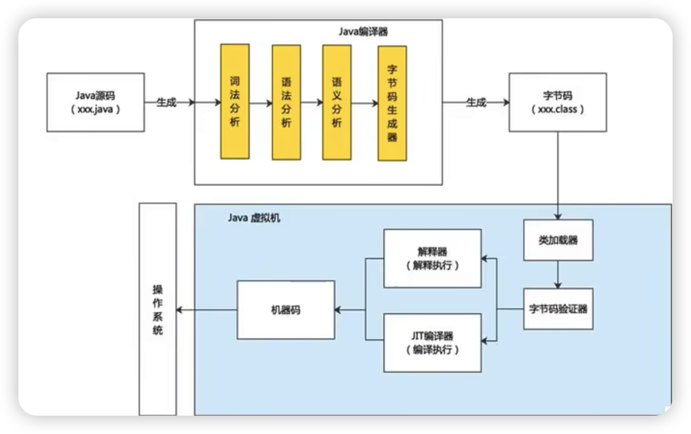

* 面试题
  * 一个”java”源文件中是否可以包括多个类？有什么限制(明•数据）
    一个源文件中可以南明多个炎，但是最多只能有一个类使用public进行声明。
    且要求声明为pubbc类的类名与源文件名相同。
  * Java 的优势（阿**巴）**

社区繁荣

跨平台型
安全性高
简单性
高性能
面向对象性
健壮性
3.常用的几个命令行操作都有哪些？（至少4个）（北京数字**）

4.Java 中是否存在内存溢出、内存泄漏？如何解决？举例说明（拼*多）

5. 如何看待Java是一门半编译半解释型的语言（携”）

java性能高，与c并驾齐驱，java是半编译、半解释型语言

在形成字节码后，运行过程中，既可以逐行解释，又可以使用JIT编译器，编译执行，所以是半编译、半解释型语言

