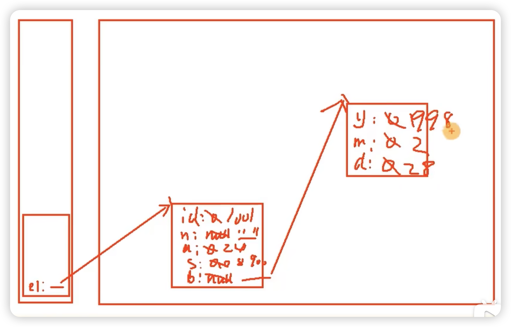

# 1.面向对象编程概念理解

[Classes and Objects](https://www.geeksforgeeks.org/classes-objects-java/)

* 面对对象的编程有两大元素

  例如 人类--日向翔阳

  * 类：对一类具有相同特征事物的抽象描述。
  * 对象：由类派生出的具体实例（instance）

* 面向对象的编程就是设计类的过程，以及创建类的对象

  步骤1：创建类，并设计类的内部成员（属性attributes、方法methods）
  步骤2：创建类的对象，可以理解为变量。比如：Phone p1 = new Phone();
  步骤3：通过对象，调用其内部声明的属性或方法，完成相关的功能

`类`（属性、方法）---->`对象`------>对象使用属性、方法

# 2.面向对象编程内存


成员变量：也叫属性、filed（字段、域），声明在类内，方法外的变量

局部变量：声明方法、构造器内部的变量

局部变量在栈中，成员变量在堆中

# 属性

类中的属性是另一个类，例如 [Employee.java](/Users/ola/Downloads/song_java2023/07_teach_code/JavaSECode/chapter06_oop1_teacher/src/com/atguigu03/field_method/field/exer2/Employee.java)类中的`birthday`是[Mydate.java](/Users/ola/Downloads/song_java2023/07_teach_code/JavaSECode/chapter06_oop1_teacher/src/com/atguigu03/field_method/field/exer2/MyDate.java)类创建的，在Employee.java中创建来自类的属性方式：类名 变量名；详情见 [Employee.java](/Users/ola/Downloads/song_java2023/07_teach_code/JavaSECode/chapter06_oop1_teacher/src/com/atguigu03/field_method/field/exer2/Employee.java)

如果要引用`birthday`，需要new一下，因为它来自于一个类。来自于类的属性（变量）都需要new。

```java
public class EmployeeTest {
    public static void main(String[] args) {

        //创建Employee的一个实例
        Employee emp1 = new Employee();

        emp1.id = 1001;
        emp1.name = "杰克"; //emp1.name = new String("杰克");name本身是string类，也应该new，但是默认不new，这是特例
        emp1.age = 24;
        emp1.salary = 8900;

        emp1.birthday = new MyDate();//变量是类，需要new一下，变量是基本数据类型，可以直接赋值
        emp1.birthday.year = 1998;
        emp1.birthday.month = 2;
        emp1.birthday.day = 28;
        /*
        另一种写法：
        * MyDate mydate1 = new MyDate();
        * emp1.birthday = mydate1;
        * */

        //打印员工信息
        System.out.println("id = " + emp1.id + ",name = " + emp1.name +
                ", age = " + emp1.age + ", salary = " + emp1.salary +
                ", birthday = [" + emp1.birthday.year + "年" + emp1.birthday.month +
                "月" + emp1.birthday.day + "日]");


    }
}
```

上面程序的内存图如下：



# 方法

> ```
> > Java里的方法`不能独立存在`，所有的方法必须定义在类里。
> > Java中的方法不调用，不执行。每调用一次，就执行一次。
> > 方法内可以调用本类中的(其它)方法或属性，调用的方法不需要区分顺序，前面的类可以调用后面的类
> > 方法内不能定义方法。
> ```

## 声明格式

```java
[修饰符] [其他修饰符] 返回值类型 方法名([形参列表])[throws 异常列表]{//方法头
  方法体的功能代码 
}
```

## 声明的细节

* 权限修饰符
      ① Java规定了哪些权限修饰符呢？ 有四种：private \ 缺省 \ protected \ public (放到封装性讲)，越往右权限越大

* 返回值类型：描述当调用完此方法时，是否需要返回一个结果。有两种，无返回、有返回

  * 无返回值类型：使用void表示即可。比如：System.out.println(x)的println(x)方法、Arrays的sort()

  * 有具体的返回值类型：需要指明返回的数据的类型。可以是基本数据类型，也可以引用数据类型

    需要在方法内部配合使用"return + 返回值类型的变量或常量"。 比如：Math.random()、new Scanner(System.in).nextInt()等

  *  [经验]我们在声明方法时，要不要提供返回值类型呢？

    根据方法具体实现的功能来决定。换句话说，具体问题具体分析

    根据题目要求

* 方法名：属于标识符。需要满足标识符的规定和规范。“见名知意”

* 形参列表：形参，属于局部变量，且可以声明多个，用逗号隔开。有两种
             格式：(形参类型1 形参1，形参类型2 形参2，...)

  * 无形参列表：不能省略小括号（）。比如：Math.random()、new Scanner(System.in).nextInt()

  * 有形参列表：在方法调用时，确定形参的类型和个数，看需要确定。
                              比如：Arrays类中的binarySearch()方法、sort()方法、equals()方法

  * [经验]我们在声明方法时，是否需要形参列表呢？

    根据方法具体实现的功能来决定。换句话说，具体问题具体分析

    根据题目要求

* 方法体： 当我们调用一个方法时，真正执行的代码。体现了此方法的功能。

  

## return

关键字：return

* return的作用
  - 作用1：结束一个方法，类似break，但是break是用于结束循环。

  - 作用2：结束一个方法的同时，可以返回数据给方法的调用者 

       方法声明中如果有返回值类型，则方法内需要搭配return使用

* 使用注意点：
      return后面不能声明执行语句

# 对象数组

```
数组的元素可以是基本数据类型，也可以是引用数据类型。当元素是引用类型中的类时，我们称为对象数组。
```

使用类创建数组，数组的每个元素是类的对象

```java
int[] arr = new int[2];
arr[0]=1;
arr[1]=10;

//使用类创建数组
Student[] stu = new Student[2];
//数组的每个元素是类的对象
stu[0]= new Student();
stu[1]= new Student();
```

