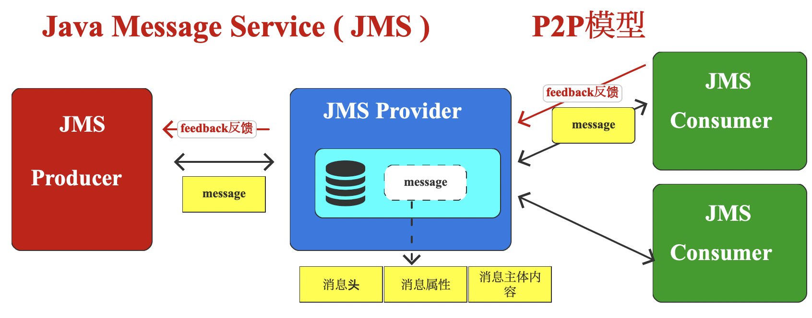
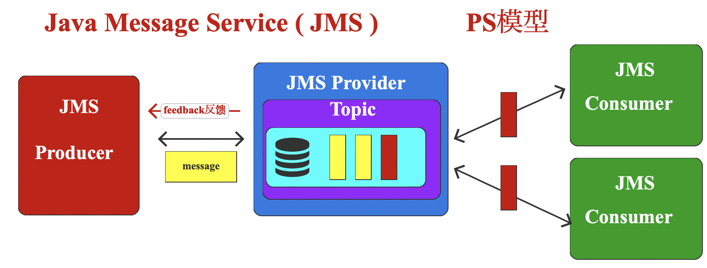
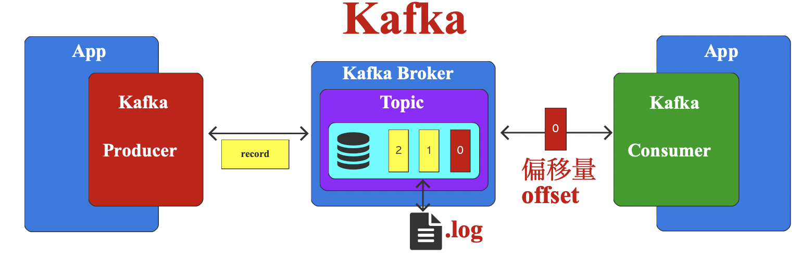

# 概述

Kafka是一个由Scala和Java语言开发的，经典高吞吐量的分布式消息发布和订阅系统，也是大数据技术领域中用作数据交换的核心组件之一

[官网地址](https://www.scala-lang.org/)

线程：数据交换发生在内存中

进程：执行java应用程序的时候，开启JVM，JVM向操作系统申请内存，通过网络数据流传输数据，比如server socket接口来实现数据传输，server socket是基础的网络通信流？

分布式系统之间需要使用一个软件（消息中间件）进行交互？进行数据的中转和临时存储，例如Kafka作为数据传输的缓冲区，降低系统之间的耦合性，增强扩展性

## 消息队列

Kafka软件最初的设计就是专门用于数据传输的消息系统，核心功能是传输数据。类似功能的软件有RabbitMQ、ActiveMQ、RocketMQ等。这些软件名称中的MQ是英文单词Message Queue的简称，也就是所谓的消息队列的意思。

而Java中如果想要实现数据传输功能，那么这个软件一般需要遵循Java消息服务技术规范JMS（Java Message Service）。

Kafka拥有作为一个消息系统应该具备的功能，但是却有着独特的设计。可以这样说，Kafka借鉴了JMS规范的思想，但是却并没有完全遵循JMS规范。这也恰恰是软件名称为Kafka，而不是KafkaMQ的原因。

无论学习哪一种消息传输系统，JMS规范都是大家应该首先了解的。所以咱们这里就对JMS规范做一个简单的介绍：

### JMS

JMS是Java平台的消息中间件通用规范，定义了主要用于消息中间件的标准接口。

可以简单地将JMS类比为Java和数据库之间的JDBC规范。Java应用程序根据JDBC规范种的接口访问关系型数据库，而每个关系型数据库厂商可以根据JDBC接口来实现具体的访问规则。

JMS定义的就是系统和系统之间传输消息的接口。

为了实现系统和系统之间的数据传输，JMS规范中定义很多用于通信的组件：

JMS Provider：JMS消息提供者。其实就是实现JMS接口和规范的消息中间件，也就是我们提供消息服务的软件系统，比如RabbitMQ、ActiveMQ、Kafka。

JMS Message：JMS消息。这里的消息指的就是数据。一般采用Java数据模型进行封装，其中包含消息头，消息属性和消息主体内容。

JMS Producer：所谓的生产者，就是生产数据的客户端应用程序，这些应用通过JMS接口发送JMS消息。

JMS Consumer：JMS消息消费者。所谓的消费者，就是从消息提供者（**JMS Provider**）中获取数据的客户端应用程序，这些应用通过JMS接口接收JMS消息。

JMS支持两种消息发送和接收模型：

| P2P（Peer-to-Peer）点对点模型  | PS（Publish-Subscribe）模型                                  |
| ------------------------------ | ------------------------------------------------------------ |
| 一条数据只能被一个consumer消费 | 数据分类成Topic，Topic中存储Message，consumer订阅Topic来获取Message，一个Topic可以被多个consumer消费 |
|          |                                        |

## Kafka初识

|                        | Kafka                  |
| ---------------------- | ---------------------- |
|                        |                        |
|  |  |

## 快速上手

### 单机环境-先启动zookeeper，再启动kafka

* Step1: java8：Kafka 3.X官方建议Java版本更新至Java11，但是Java8依然可用。未来Kafka 4.X版本会完全弃用Java8，不过，咱们当前学习的Kafka版本为3.6.1版本，所以使用Java8即可，无需升级。

* Kafka是可以直接运行在JVM上的，无需安装其他软件。因为Kafka的绝大数代码都是Scala语言编写的，而Scala语言本身就是基于Java语言开发的，并且由于Kafka内置了Scala语言包。

* Step2:  安装kafka

  * 下载安装包kafka_2.12-3.6.1.tgz，下载地址：https://kafka.apache.org/downloads

  * l 这里的3.6.1，是Kafka软件的版本。截至到2023年12月24日，Kafka最新版本为3.6.1。

    l 2.12是对应的Scala开发语言版本。Scala2.12和Java8是兼容的，所以可以直接使用。

    l tgz是一种linux系统中常见的压缩文件格式，类似与windows系统的zip和rar格式。所以Windows环境中可以直接使用压缩工具进行解压缩。

  * 解压文件：kafka_2.12-3.6.1.tgz，将文件夹在了/Library下，更改文件夹名称为kafka

  | 文件目录    |                             |
  | ----------- | --------------------------- |
  | bin         | linux系统下可执行脚本文件   |
  | bin/windows | windows系统下可执行脚本文件 |
  | config      | 配置文件                    |
  | libs        | 依赖类库                    |
  | licenses    | 许可信息                    |
  | site-docs   | 文档                        |
  | logs        | 服务日志                    |

* Step3: 启动ZooKeeper

  当前版本Kafka软件内部依然依赖ZooKeeper进行多节点协调调度，所以启动Kafka软件之前，需要先启动ZooKeeper软件。

  不过因为Kafka软件本身内置了ZooKeeper软件，所以无需额外安装ZooKeeper软件，直接调用脚本命令启动即可。具体操作步骤如下：

  ```bash
  1)进入Kafka解压缩文件夹的config目录，修改zookeeper.properties配置文件
  # 修改dataDir配置，用于设置ZooKeeper数据存储位置，该路径如果不存在会自动创建。
  dataDir=/Library/kafka/data/zk
  2)进入/Library/kafka目录执行
  bin/zookeeper-server-start.sh config/zookeeper.properties
  
  ```

* Step4: 启动Kafka

  ```bash
  1)进入Kafka解压缩文件夹的config目录，修改server.properties配置文件
  # Listener name, hostname and port the broker will advertise to clients.
  # If not set, it uses the value for "listeners".
  # 客户端访问Kafka服务器时，默认连接的服务为本机的端口9092，如果想要改变，可以修改如下配置
  # 此处我们不做任何改变，默认即可
  #advertised.listeners=PLAINTEXT://your.host.name:9092
  
  # A comma separated list of directories under which to store log files
  # 配置Kafka数据的存放位置，如果文件目录不存在，会自动生成。
  log.dirs=/Library/kafka/data/kafka
  
  2)进入/Library/kafka目录执行
  bin/kafka-server-start.sh config/server.properties
  3)进入/Library/kafka目录执行
  (base) ola@oladeMacBook-Pro kafka % jps
  3763 Main
  10117 QuorumPeerMain
  12150 Jps
  8647 org.eclipse.equinox.launcher_1.6.800.v20240304-1850.jar
  11768 Kafka
  ```

  这里名称为QuorumPeerMain的就是ZooKeeper软件进程，名称为Kafka的就是Kafka系统进程。

  此时，说明Kafka已经可以正常使用了

### 消息主题

```bash
#创建
(base) ola@oladeMacBook-Pro kafka % bin/kafka-topics.sh --bootstrap-server localhost:9092 --topic test --create
#查询
(base) ola@oladeMacBook-Pro kafka % bin/kafka-topics.sh --bootstrap-server localhost:9092 --list
#详细信息
(base) ola@oladeMacBook-Pro kafka % bin/kafka-topics.sh --bootstrap-server localhost:9092 --topic test --describe
Topic: test	TopicId: BKtuQGvuSsicLQv1xIx-AA	PartitionCount: 1	ReplicationFactor: 1	Configs:
	Topic: test	Partition: 0	Leader: 0	Replicas: 0	Isr: 0
#修改
(base) ola@oladeMacBook-Pro kafka % bin/kafka-topics.sh --bootstrap-server localhost:9092 --topic test --alter --partitions 2
(base) ola@oladeMacBook-Pro kafka % bin/kafka-topics.sh --bootstrap-server localhost:9092 --topic test --describe
Topic: test	TopicId: BKtuQGvuSsicLQv1xIx-AA	PartitionCount: 2	ReplicationFactor: 1	Configs:
	Topic: test	Partition: 0	Leader: 0	Replicas: 0	Isr: 0
	Topic: test	Partition: 1	Leader: 0	Replicas: 0	Isr: 0
#删除
(base) ola@oladeMacBook-Pro kafka % bin/kafka-topics.sh --bootstrap-server localhost:9092 --topic test --delete
(base) ola@oladeMacBook-Pro kafka % bin/kafka-topics.sh --bootstrap-server localhost:9092 --list

```

### 生产数据

#### CLI方式

```bash
#生产数据
(base) ola@oladeMacBook-Pro kafka % bin/kafka-console-producer.sh --bootstrap-server localhost:9092 --topic test
#消费数据
(base) ola@oladeMacBook-Pro kafka % bin/kafka-console-consumer.sh --bootstrap-server localhost:9092 --topic test
```

#### Java API-idea

一般情况下，我们可以通过Java程序来消费（获取）数据，所以接下来，我们就演示一下IDEA中Kafka Java API如何消费数据

* 创建Maven项目并增加Kafka依赖

<dependencies>

  <dependency>

​    <groupId>org.apache.kafka</groupId>

​    <artifactId>kafka-clients</artifactId>

​    <version>3.6.1</version>

  </dependency>

</dependencies>

* 创建com.lili.kafka.test.KafkaConsumerTest类
* 添加main方法，并增加消费者代码


```bash
```


### 消费数据

```java
package com.atguigu.kafka.test;
import org.apache.kafka.clients.consumer.ConsumerConfig;
import org.apache.kafka.clients.consumer.ConsumerRecord;
import org.apache.kafka.clients.consumer.ConsumerRecords;
import org.apache.kafka.clients.consumer.KafkaConsumer;
import java.time.Duration;
import java.util.Arrays;
import java.util.Collections;
import java.util.HashMap;
import java.util.Map;
public class KafkaProducerTest {
    public static void main(String[] args) {
        // TODO 配置属性集合
        Map<String, Object> configMap = new HashMap<String, Object>();
        // TODO 配置属性：Kafka集群地址
        configMap.put(ConsumerConfig.BOOTSTRAP_SERVERS_CONFIG, "localhost:9092");
        // TODO 配置属性: Kafka传输的数据为KV对，所以需要对获取的数据分别进行反序列化
        configMap.put(
                ConsumerConfig.KEY_DESERIALIZER_CLASS_CONFIG,
                "org.apache.kafka.common.serialization.StringDeserializer");
        configMap.put(
                ConsumerConfig.VALUE_DESERIALIZER_CLASS_CONFIG,
                "org.apache.kafka.common.serialization.StringDeserializer");
        // TODO 配置属性: 读取数据的位置 ，取值为earliest（最早），latest（最晚）
        configMap.put(ConsumerConfig.AUTO_OFFSET_RESET_CONFIG,"earliest");
        // TODO 配置属性: 消费者组
        configMap.put("group.id", "lili");
        // TODO 配置属性: 自动提交偏移量
        configMap.put("enable.auto.commit", "true");
        KafkaConsumer<String, String> consumer = new KafkaConsumer<String, String>(configMap);
        // TODO 消费者订阅指定主题的数据
        consumer.subscribe(Collections.singletonList("test"));
        while ( true ) {
            // TODO 每隔100毫秒，抓取一次数据
            ConsumerRecords<String, String> records =
                consumer.poll(Duration.ofMillis(100));
            // TODO 打印抓取的数据
            for (ConsumerRecord<String, String> record : records) {
                System.out.println("K = " + record.key() + ", V = " + record.value());
            }
        }
    }
}
```


### 

### 源码关联(可选)