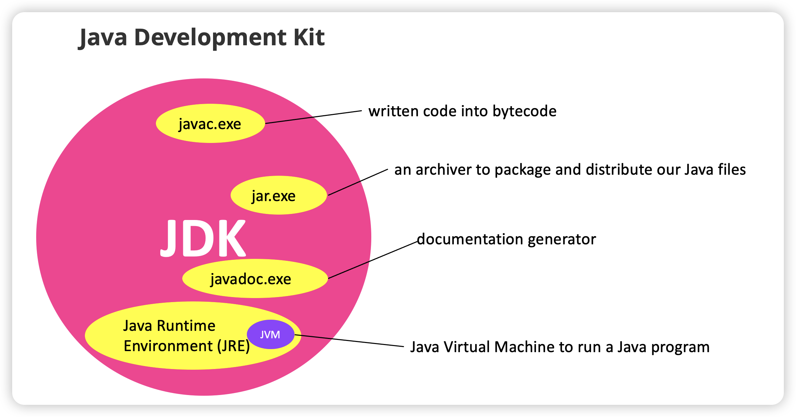

# Chapter 1: Introduction to Java

## 1.1 What is Java?

* An object-oriented programming language

* Platform independent. This means that a program written in Java can be executed on any operating system (such as Windows, Mac or Linux).【java被编译成字节码，可以在任何系统中运行】

  > Instead of compiling into machine code directly, Java compiles all written code into bytecode first. Bytecode is platform independent. That is, there is no difference between the bytecode for Windows, Mac or Linux.

## 1.2 Why Learn Java?

* Java is currently one of the most popular programming languages in use.
* Android apps are also developed using Java.
* With Java, you can write the code once and run it anywhere you want.
* Make it easier for you to master other object-oriented programming languages in future.

# Chapter 2: Getting Ready for Java

## 2.1 Installing the JDK + NetBeans Bundle

 **2.1.1 What is JDK?**

JDK stands for Java Development Kit and is a free kit provided by Oracle that contains a number of tools to help us develop Java applications.

