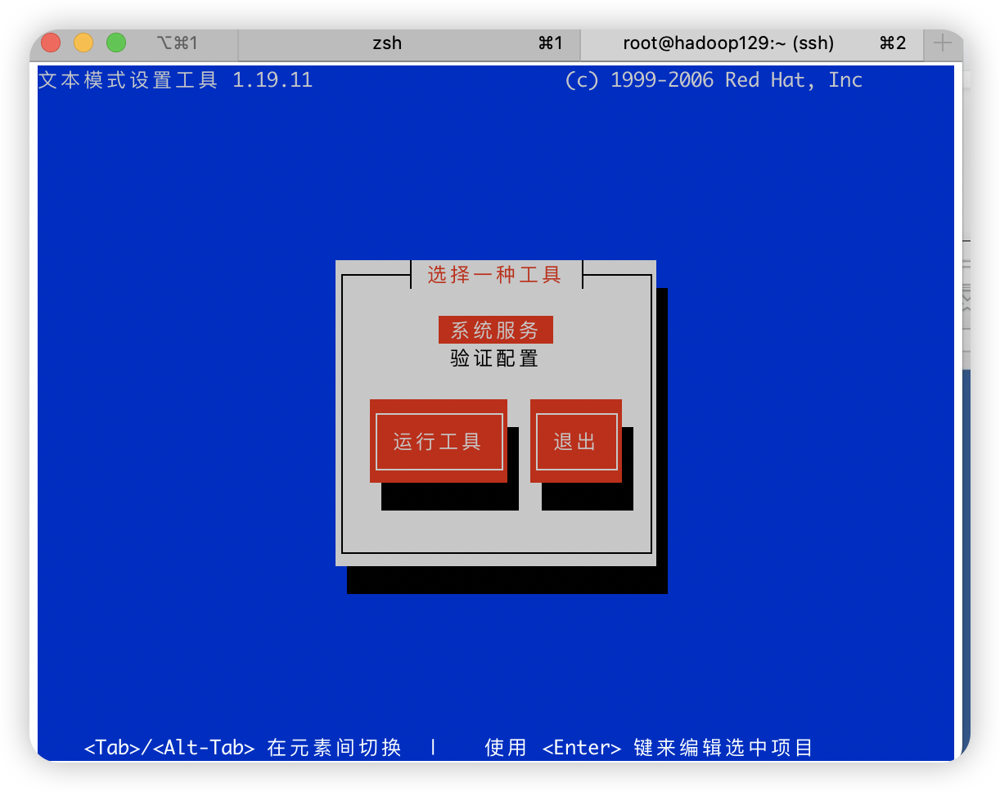

# 文件目录

linux一切皆文件

哪些文件夹能动，哪些不能动


不能动

proc

run

srv

sys 

boot

dev

使用较多：etc,lib，lib64相当于win系统dll，bin，sbin，谨慎动

能动：tmp, opt, home, root,var(日志)

etc配置

# vim编辑


编辑器之神vim编辑文本效率很高，就做文本。emacs神志编辑器理查德发明。大而全

**阅读模式下**

* 行

yy复制，7yy复制7行

p粘贴，6p粘贴6次

dd删除，3dd删除当前行和后面两行

y$，从当前光标到最后的都复制，

y^，从当前光标到最前面 的都复制

d$删除

d^

* 词

  w，yw复制当前单词

  dw删除单词

* 字符

  * x，剪切单个字符
  * r，更改当前字符

| 移动光标     |                                              |            |
| ------------ | -------------------------------------------- | ---------- |
| G            | 最底下一行                                   |            |
| gg           | 最上面一行                                   |            |
| 0            | 行头                                         | 一开始没钱 |
| $            | 行尾                                         | 最后有钱了 |
| n<Enter>     | 光标向下移动 n 行，n 为数字                  |            |
| +            | 光标移动到非空格符的下一行                   |            |
| -            | 光标移动到非空格符的上一行                   |            |
| [Ctrl] + [f] | 屏幕『向下』移动一页，相当于 [Page Down]按键 |            |
| [Ctrl] + [b] | 屏幕『向上』移动一页，相当于 [Page Down]按键 |            |


| 搜索替换              |                                                              |                                                              |
| --------------------- | ------------------------------------------------------------ | ------------------------------------------------------------ |
| /word                 | 向光标之下寻找一个名称为 word 的字符串。例如要在档案内搜寻 vbird 这个字符串，就输入 /vbird 即可！ |                                                              |
| :n1,n2s/word1/word2/g | n1 与 n2 为数字。在第 n1 与 n2 行之间寻找 word1 这个字符串，并将该字符串取代为 word2 ！ | 举例来说，在 100 到 200 行之间搜寻 vbird 并取代为 VBIRD 则：<br/>:100,200s/vbird/VBIRD/g |
| :1,$s/word1/word2/g   | 从第一行到最后一行寻找 word1 字符串，并将该字符串取代为 word2 | 替换前不用confirm                                            |
| :%s/word1/word2/g     | 同上                                                         |                                                              |
| :1,$s/word1/word2/gc  | 从第一行到最后一行寻找 word1 字符串，并将该字符串取代为 word2 ！ | 替换前要confirm！                                            |
| :%s/word1/word2/gc    |                                                              |                                                              |
|                       |                                                              |                                                              |
|                       |                                                              |                                                              |
|                       |                                                              |                                                              |


| 删除、复制、粘贴 |      |      |
| ---------------- | ---- | ---- |
|                  |      |      |
|                  |      |      |
|                  |      |      |
|                  |      |      |
|                  |      |      |
|                  |      |      |
|                  |      |      |
|                  |      |      |
|                  |      |      |

# VMware下CentOS网络配置

## 检查网络连接

目前学习下，检查 物理主机和虚拟机之间搭配

**mac：**主机与虚拟机的连接，需要获得虚拟机地址，在虚拟机终端输入`ifconfig`，地址是192.168.109.128

```bash
[root@192 Desktop]# ifconfig
ens33: flags=4163<UP,BROADCAST,RUNNING,MULTICAST>  mtu 1500
        inet 192.168.109.128  netmask 255.255.255.0  broadcast 192.168.109.255
        inet6 fe80::1c09:991a:598a:812e  prefixlen 64  scopeid 0x20<link>
        ether 00:0c:29:10:7c:ca  txqueuelen 1000  (Ethernet)
        RX packets 1573  bytes 517845 (505.7 KiB)
        RX errors 0  dropped 0  overruns 0  frame 0
        TX packets 1067  bytes 169929 (165.9 KiB)
        TX errors 0  dropped 0 overruns 0  carrier 0  collisions 0
```

然后在主机终端`ping 192.168.109.128`

获取主机ip，在主机终端输入`ifconfig en0`

```bash
(base) ola@192 ~ % ifconfig en0
en0: flags=8863<UP,BROADCAST,SMART,RUNNING,SIMPLEX,MULTICAST> mtu 1500
	options=6463<RXCSUM,TXCSUM,TSO4,TSO6,CHANNEL_IO,PARTIAL_CSUM,ZEROINVERT_CSUM>
	ether 68:2f:67:94:3a:5b
	inet6 fe80::14d0:b23c:c31f:bb73%en0 prefixlen 64 secured scopeid 0x6
	inet 192.168.0.101 netmask 0xffffff00 broadcast 192.168.0.255
	nd6 options=201<PERFORMNUD,DAD>
	media: autoselect
	status: active
```

##  三种网络模式详解

vmware为我们提供了三种网络工作模式，它们分别是：

**Bridged（桥接模式）**、**NAT（网络地址转换模式）**、**Host-Only（仅主机模式）**。


Bridged（桥接模式）最简单粗暴的方式，虚拟机与主机在一个局域网内。

主机网卡虚拟出一个网桥，网桥连接虚拟交换机，交换机再连上虚拟机。主机和虚拟机本质上都是路由器来分配地址，所以主机和虚拟机是平等的。

路由器分配的ip地址是C类地址，前三位相同，最后一位不同，用来区分不同的设备。255.255.255.0；所以只能分配254个。如果很多人使用桥接的方式建立虚拟机，ip地址有限。


NAT（网络地址转换模式）主机和虚拟机不在一个局域网。对于虚拟机而言可以访问外网，外网访问不了我。安全性高。虚拟机共享主机的IP地址来访问外部网络，但对内部网络而言，虚拟机拥有自己的私有IP地址。这种模式允许虚拟机像连接到一个内部网络一样进行通信，同时通过NAT转换与外部世界通信，而不需要额外的物理网络接口。

VMware制作了虚拟路由，实际上是通过NAT服务器做网络地址转换，DHCP用来动态地址分配。主机的网卡接到虚拟路由上。

相当于局域网虚拟出一个局域网，所以主机和虚拟机相当于在两个不同的局域网中。所以ip地址前三位不一样。这样做的结果是，虚拟机可以通过虚拟路由转换地址，连接到pc和外网。但是主机并不能连接虚拟机，解决方法是，主机生成一个虚拟网卡，虚拟网卡接到虚拟路由器上实现主机连接访问虚拟机。


Host-Only（仅主机模式）主机和虚拟机不在一个局域网。虚拟机访问不了外网。实际生产环境中可以使用。很安全，但是不能上网。

交换机没有路由功能，不能做网络地址转换，因此虚拟机不能访问外网，主机虚拟出一个虚拟网卡连接交换机，与虚拟机构成一个局域网。虚拟机只能访问主机，不能访问外网。

## 指定静态ip

主机需要连接虚拟机，但在NAT模式下，为了保持虚拟机ip不被DHCP动态更改。需要设置成静态的。

需要三个地址，分别是虚拟机中NAT的网关地址，主机DNS地址，虚拟机ip地址，前两个需要查询获取，最后一个自定义。虚拟机中NAT的网关地址和虚拟机ip地址在一个网段下。

* 把虚拟机网络配置改成nat模式

* 获取虚拟机中NAT的网关地址和子网掩码

  网关：ip = 192.168.109.2

  ```bash
  #通过Mac终端进入VMware Fusion的vmnet8目录
  cd /Library/Preferences/VMware\ Fusion/vmnet8
  #查看nat.conf
  cat nat.conf
  ```

​	

* 获取可用IP地址

  ```bash
  cat dhcpd.conf	
  ```

​	

* 获取DNS1地址

  在mac设置-网络中获取


* 配置CentOS7网络配置

  ```bash
  #登录CentOS7进入虚拟机的network-scripts目录下ifcfg-ens33
   vim /etc/sysconfig/network-scripts/ifcfg-ens33
  ```

  修改

  ```bash
  #更改成static
  BOOTPROTO="static"
  
  #添加
  #虚拟机IP 地址
  IPADDR=192.168.109.100
  #虚拟机NAT网关
  GATEWAY=192.168.109.2
  #主机域名解析器
  DNS1=192.168.1.1
  DNS2=192.168.0.1
  ```

* 虚拟机终端中，重启服务器

  ```bash
  systemctl restart NetworkManager
  ```

## 配置主机名

* Step1 修改（虚拟机终端中）

  ```bash
  #查看当前主机名
  hostname
  #更改，当即生效,也可以通过vim /etc/hostname修改
  hostnamectl set-hostname hadoop100
  ```

* Step2 修改 虚拟机**hosts** 映射文件（虚拟机终端中）

  ```bash
  #命令
  vim /etc/hosts
  #添加
  192.168.109.100 hadoop100
  192.168.109.101 hadoop101
  192.168.109.102 hadoop102
  192.168.109.103 hadoop103
  192.168.109.104 hadoop104
  192.168.109.105 hadoop105
  192.168.109.106 hadoop106
  192.168.109.107 hadoop107
  192.168.109.108 hadoop108
  ```

* Step3 修改本地 **hosts** 映射文件（主终端中）

​	sudo vim /etc/hosts

​	将上面的虚拟机ip与主机名称对应关系粘贴进去

## 远程登录

* 手动终端登录

```bash
ssh root@主机ip或者主机名
```

* 自动登录

  [iTerm2  SSH 自动登录](https://icloudnative.io/posts/iterm2-auto-login/)

# CentOS系统服务管理

## 概念理解-Linux中的进程和服务

计算机中，一个正在执行的程序或命令，被叫做“进程”（process）。启动之后一只存在、常驻内存生命周期很长的进程，一般被称作“服务”（service）。

Linux中的服务都是在后台进行的，系统服务是系统打开时吊起来，系统关闭也随之关闭。执行这些系统服务的进程叫做守护进程（守护 daemon），守护进程守护的就是系统服务，在linux中可以将守护进程和系统进程看作一回事。

## CentOS 6 服务管理（了解）

* 语法 

  service是一个命令

  service 服务名 start | stop |· restart | status 

*  经验技巧

  查看服务的方法：/etc/init.d/服务名 ,发 现只有两个服务保留，其他都在CentOS 7中

* 实际操作

  ```bash
  #查看网络服务的状态
  service network status
  #停止网络服务
  service network stop
  #启动网络服务
  service network start
  #重启网络服务
  service network restart
  
  ```


## CentOS 7 服务管理（掌握）

* 语法 

  systemctl 是一个命令

  systemctl start | stop | restart | status 服务名 

*  经验技巧

  查看服务的方法：/usr/lib/systemd/system

  .target 是一组服务
  .service 是一个服务

  Network服务保留CentOS7的，NetworkManager，别用6的network了

* 实际操作

  ```bash
  #查看网络服务的状态
  service network status
  #停止网络服务
  service network stop
  #启动网络服务
  service network start
  #重启网络服务
  service network restart
  systemctl restart NetworkManager
  
  ```

## 系统运行级别与开机自启动

自动启动的服务多少来定义系统运行级别，root管理员是级别5


* CentOS7 的运行级别简化为:

  multi-user.target 等价于原运行级别 3（多用户有网，无图形界面）
  graphical.target 等价于原运行级别 5（多用户有网，有图形界面）

* 查看当前运行级别:

  systemctl get-default

* 修改当前运行级别

  systemctl set-default TARGET.target （这里 TARGET 取 multi-user 或者 graphical）

* 运行级别切换

  在虚拟机终端，不是本地终端输入命令 init 5

```bash
#终端输入
setup
```

|  |  |
| -------------------------- | -------------------------- |

选择系统服务，进入后，使用`空格`键来选择和删除自动启动服务，带有`*`是自启动

shift+tab退出界面

## systemctl 设置后台服务的自启配置

* 基本语法

  systemctl list-unit-files （功能描述：查看服务开机启动状态） 
  systemctl disable service_name （功能描述：关掉指定服务的自动启动） 
  systemctl enable service_name （功能描述：开启指定服务的自动启动） 

* 案例实操 ，老版本：开启/关闭 iptables(防火墙)服务的自动启动，新版本：

  systemctl enable firewalld.service 
  systemctl disable firewalld.service

## 关机重启命令

在 linux 领域内大多用在服务器上，很少遇到关机的操作。毕竟服务器上跑一个服务是永无止境的，除非特殊情况下，不得已才会关机。

Linux 系统中为了提高磁盘的读写效率， 对磁盘采取了 “预读迟写”操作方式。 当用户 保存文件时， Linux 核心并不一定立即将保存数据写入物理磁盘中， 而是将数据保存在缓 冲区中，等缓冲区满时再写入磁盘，这种方式可以极大的提高磁盘写入数据的效率。但是， 也带来了安全隐患，如果数据还未写入磁盘时，系统掉电或者其他严重问题出现，则将导 致数据丢失。使用 sync 指令可以立即将缓冲区的数据写入磁盘。

# Linux常用Shell命令介绍

## 帮助

* 命令存储在/bin和/sbin中
* 如何区分内部还是外部命令，type 命令名

* 查看内部命令

  man [命令或配置文件]（功能描述：获得帮助信息）

  help 命令（功能描述：获得 shell 内置命令的帮助信息）

| 信息        | 功能                     |
| ----------- | ------------------------ |
| NAME        | 命令的名称和单行描述     |
| SYNOPSIS    | 怎样使用命令             |
| DESCRIPTION | 命令功能的深入讨论       |
| EXAMPLES    | 怎样使用命令的例子       |
| SEE ALSO    | 相关主题（通常是手册页） |

* 查看外部命令

  命令 --help

## 文件目录类

### cd

`cd ~`快速回到主目录，`cd /`去根目录

* cd ../   相对路径，..表示当前目录的上一级
* cd -   返回上一次在的位置
* cd 返回主文件夹主目录
* cd / 返回root

### pwd

print working directory

显示当前工作目录的绝对路径，从root根目录开始

```bash
cd /etc/sysconfig/
```

### ls

列出目录内容

ls -a，列出所有内容，包括隐藏文件（以.开头的文件或文件夹）
**ls -l，长数据，当前文件属性文件信息列成一行，也可以写作ll**
ls -al, 搭配使用
ls -lh，列出文件占用空间，不过不准确，因为不计算目录下的文件内容

### tree

相比ls可视化更好
centOS可能没有安装，如果没安装，使用`yum install tree`安装

### mkdir

mkdir b c，创建两个文件夹
mkdir -p d/e/f，常用，如果没有d和e主动创建
rmdir，删除
rmdir -p d/e/f，文件夹非空不能被删除，如果想删除d需要，加上下面的，自动删除下面的

###  touch - 创建空文件

**touch name.txt，**创建新的文件，linux不带文件后缀，默认txt

### cp - 复制文件或目录

* 文件

  cp 被复制 复制目的
  cp name.txt /home/name2.txt，name2.txt不存在，复制并创建name2.txt
  cp name.txt /home/name2.txt，name2.txt存在，内容被覆盖，需要确认是否覆盖
  \cp ，linux原生命令，无需，直接执行

* 文件夹

  需要加-r, 目的是递归将所有文件夹复制
  cp -r 文件夹名 

### rm - 删除

* 文件

  rm hello.txt，删除文件，需要确认
  rm -f hello.txt，强制删除，不需要确认

* 目录

  rm -r a，删除目录a，需要确认
  rm -rf a/，删除目录a，不需要确认

* 目录保留，删除下面文件

  rm -f a/*，删除文件夹a下的文件，a文件夹保留

### mv - 移动

* 文件

  mv name.txt /home/，将name移动到home文件夹下
  mv name.txt /home/name2.txt，将name移动到home文件夹并重命名

* 目录

### cat - 文件内容查看-小文件推荐

catch，小文件查看
从文件第一行开始显示
**cat name.txt，不显示行号**
cat -n name.txt，显示行号

### more 文件内容分屏幕查看

基于vi编辑器文本过滤器
more name.txt

翻页，空格翻页；回车一行行的翻页；fb向后向前；=显示当前行数
：+f ，显示文件名和行数
按q退出

### less - 文件内容分屏幕查看--大文件推荐

与more类似，更好用，不是全部加载文件，一点点加载，比more快
=显示当前行数；shif+g最后 ；g第一行；
/向下搜索关键字 ，按n向下查找，N向上查找
?向上搜索关键字 ，按n向上查找，N向下查找

按q退出

### echo - 输出内容到控制台

* 输出内容到控制台（终端）

  \t ，制表符
  \n，换行
  在使用的过程中需要被转译，否则原样输出，如何转译： 
  	-e ，echo -e "hello\nword"
  echo $，打印系统环境变量
  echo $PATH，打印放了系统命令环境变量PATH

* 写入

  echo "hello" >> name.txt，将hello写入name.txt最后一行

### head - 文件开头内容显示

head name.txt，默认显示开头10行
head -20 name.txt，显示20行

### tail - 文件结尾内容显示/监控

* 查看
  tail name.txt，默认显示最后10行
  tail -20 name.txt，显示20行
* `追踪查看`
  tail -f name.txt ，实时显示name.txt的文档更新
  ctrl + s，暂停监控；ctrl + q，启动暂停的监控

### ln - 软链接

* 创建

> 链接起来的文档，修改是同步的

ln -s [原文件或目录] [软链接名]      给原文件创建一个软链接

在想要创建软链接的文件夹下

 ```bash  
 ln -s /home/name.txt nameInfo.txt  
 ```

* 在目录之间转换

  ```bash
  #创建
  [root@hadoop100 Documents]# ln -s /root/Music MusicInfo
  #显示软链接文件夹的原路径，pwd -P
  [root@hadoop100 MusicInfo]# pwd
  /root/Documents/MusicInfo
  [root@hadoop100 MusicInfo]# pwd -P
  /root/Music
  #回到原路径，虽然写的是软路径，cd -p 路径
  [root@hadoop100 MusicInfo]# cd -P /root/Documents/MusicInfo/
  [root@hadoop100 Music]#
  ```

* 删除

  * 删除文件，rm -f nameInfo.txt

  * 删除文件夹，不要在文件夹名后加/

    ```bash
    #删除软链接MusicInfo，原Music还在
    [root@hadoop100 Documents]# rm -rf MusicInfo
    #软链接没删除，删除下面的文件，原Music文件夹还在，内容被删除
    [root@hadoop100 Documents]# rm -rf MusicInfo/
    
    ```

### history - 查看历史命令

* 查看
  * history， 查看历史
  * history 10，查看最近10条
* 清空
  * history -c

## 时间日期类

```bash
[root@hadoop100 Music]# date
2024年 03月 20日 星期三 20:26:39 PDT
[root@hadoop100 Music]# date +%Y%m%d
20240320
[root@hadoop100 Music]# date +%Y
2024
[root@hadoop100 Music]# date +%m%d
0320
[root@hadoop100 Music]# date +%d
20
[root@hadoop100 Music]# date "+%Y-%m-%d %H:%M:%S"
2024-03-20 20:27:09
#获取当前时间时间戳
[root@hadoop100 Music]# date +%s
#显示1天前
[root@hadoop100 Music]# date -d '1 days ago'
2024年 03月 19日 星期二 20:31:20 PDT
#显示60天后
[root@hadoop100 Music]# date -d '-60 days ago'
2024年 05月 19日 星期日 20:32:21 PDT
#设置系统当前时间
[root@hadoop100 Music]# date -s "2017-06-19 20:52:18"
2017年 06月 19日 星期一 20:52:18 PDT
[root@hadoop100 Music]# date -s "2065-06-19 20:52:18"
2065年 06月 19日 星期五 20:52:18 PDT
[root@hadoop100 Music]# date
2065年 06月 19日 星期五 20:52:40 PDT
#系统时间被更改后，怎么获取正确的时间？
[root@hadoop100 Music]# ntpdate 地址
 
 
 #查看日历
 cal [选项] [[[日] 月] 年]

选项：
 -1, --one        只显示当前月份(默认)
 -3, --three      显示上个月、当月和下个月
 -s, --sunday     周日作为一周第一天
 -m, --monday     周一用为一周第一天
 -j, --julian     输出儒略日
 -y, --year       输出整年
 -V, --version    显示版本信息并退出
 -h, --help       显示此帮助并退出
 [root@hadoop100 Music]# cal -m 2022
                               2022

        一月                   二月                   三月
一 二 三 四 五 六 日   一 二 三 四 五 六 日   一 二 三 四 五 六 日
                1  2       1  2  3  4  5  6       1  2  3  4  5  6
 3  4  5  6  7  8  9    7  8  9 10 11 12 13    7  8  9 10 11 12 13
10 11 12 13 14 15 16   14 15 16 17 18 19 20   14 15 16 17 18 19 20
17 18 19 20 21 22 23   21 22 23 24 25 26 27   21 22 23 24 25 26 27
24 25 26 27 28 29 30   28                     28 29 30 31
31
        四月                   五月                   六月
一 二 三 四 五 六 日   一 二 三 四 五 六 日   一 二 三 四 五 六 日
             1  2  3                      1          1  2  3  4  5
 4  5  6  7  8  9 10    2  3  4  5  6  7  8    6  7  8  9 10 11 12
11 12 13 14 15 16 17    9 10 11 12 13 14 15   13 14 15 16 17 18 19
18 19 20 21 22 23 24   16 17 18 19 20 21 22   20 21 22 23 24 25 26
25 26 27 28 29 30      23 24 25 26 27 28 29   27 28 29 30
                       30 31
        七月                   八月                   九月
一 二 三 四 五 六 日   一 二 三 四 五 六 日   一 二 三 四 五 六 日
             1  2  3    1  2  3  4  5  6  7             1  2  3  4
 4  5  6  7  8  9 10    8  9 10 11 12 13 14    5  6  7  8  9 10 11
11 12 13 14 15 16 17   15 16 17 18 19 20 21   12 13 14 15 16 17 18
18 19 20 21 22 23 24   22 23 24 25 26 27 28   19 20 21 22 23 24 25
25 26 27 28 29 30 31   29 30 31               26 27 28 29 30

        十月                  十一月                 十二月
一 二 三 四 五 六 日   一 二 三 四 五 六 日   一 二 三 四 五 六 日
                1  2       1  2  3  4  5  6             1  2  3  4
 3  4  5  6  7  8  9    7  8  9 10 11 12 13    5  6  7  8  9 10 11
10 11 12 13 14 15 16   14 15 16 17 18 19 20   12 13 14 15 16 17 18
17 18 19 20 21 22 23   21 22 23 24 25 26 27   19 20 21 22 23 24 25
24 25 26 27 28 29 30   28 29 30               26 27 28 29 30 31
31
```


## 用户管理

### who 查看登录用户信息

whoami 和 who am i通常应用对那些经常需要切换用户的系统管理员来说，经常需要明确当前使用的是什么身份

执行su后，UID不变，EUID会变。

whoami ，识别EUID， who am i，识别UID

```bash
# who am i 显示登录用户的用户名以及登陆时间，更严格，使用su切换用户后，仍识别实际登录用户信息
[root@hadoop100 ~]# who am i
root     pts/0        2024-03-21 01:00 (192.168.109.1)
# whoami 显示自身用户名称，使用su切换用户后，识别切换后登录用户信息
[root@hadoop100 ~]# whoami
root

使用 su 或者 sudo 命令切换用户身份，骗得过 whoami，但骗不过 who am i。要解释这背后的运行机制，需要搞清楚什么是实际用户（UID）和有效用户（EUID，即 Effective UID）。所谓实际用户，指的是登陆 Linux 系统时所使用的用户，因此在整个登陆会话过程中，实际用户是不会发生变化的；而有效用户，指的是当前执行操作的用户，也就是说真正决定权限高低的用户，这个是能够利用 su 或者 sudo 命令进行任意切换的。

[lamp@localhost ~] su - root
[root@localhost ~]$ whoami
root
[root@localhost ~]$ who am i
lamp  pts/0  2017-10-09 15:30 (:0.0)
```

### XXXXsudo 设置普通用户具有 root 权限

我们知道，使用 su 命令可以让普通用户切换到 root 身份去执行某些特权命令，但存在一些问题，比如说：

- 仅仅为了一个特权操作就直接赋予普通用户控制系统的完整权限；
- 当多人使用同一台主机时，如果大家都要使用 su 命令切换到 root 身份，那势必就需要 root 的密码，这就导致很多人都知道 root 的密码；

考虑到使用 su 命令可能对系统安装造成的隐患，最常见的解决方法是使用 sudo 命令，此命令也可以让你切换至其他用户的身份去执行命令。

相对于使用 su 命令还需要新切换用户的密码，sudo 命令的运行只需要知道自己的密码即可，甚至于，我们可以通过手动修改 sudo 的配置文件，使其无需任何密码即可运行。

sudo 命令默认只有 root 用户可以运行。

**例1**

**1）添加 lamp 用户，并对其设置密码。**

```
[root@localhost ~]#useradd lamp
[root@localhost ~]#passwd lamp
```


**2）修改配置文件**

前面说过，默认情况下 sudo 命令只有 root 身份可以使用，那么，如何让普通用户也能使用它呢？

解决这个问题之前，先给大家分析一下 sudo 命令的执行过程。sudo命令的运行，需经历如下几步：

- 当用户运行 sudo 命令时，系统会先通过 /etc/sudoers 文件，验证该用户是否有运行 sudo 的权限；
- 确定用户具有使用 sudo 命令的权限后，还要让用户输入自己的密码进行确认。出于对系统安全性的考虑，如果用户在默认时间内（默认是 5 分钟）不使用 sudo 命令，此后使用时需要再次输入密码；
- 密码输入成功后，才会执行 sudo 命令后接的命令。

显然，能否使用 sudo 命令，取决于对 /etc/sudoers 文件的配置（默认情况下，此文件中只配置有 root 用户）。所以接下来，我们学习对 /etc/sudoers 文件进行合理的修改。

```
[root@localhost ~]#vim /etc/sudoers 
```


修改 /etc/sudoers 文件，找到下面一行(91 行)，在 root 下面添加一行，如下所示：

```
## Allow root to run any commands anywhere
root ALL=(ALL) ALL
lamp ALL=(ALL) ALL
#用户名 被管理主机的地址=(可使用的身份) 授权命令(绝对路径)
#%wheel ALL=(ALL) ALL
#%组名 被管理主机的地址=(可使用的身份) 授权命令(绝对路径)
```


或者配置成采用 sudo 命令时，不需要输入密码

```
## Allow root to run any commands anywhere
root ALL=(ALL) ALL
lamp ALL=(ALL) NOPASSWD:ALL
```


修改完毕，现在可以用 lamp 帐号登录，然后用命令 sudo ，即可获得 root 权限进行操作。

对以上 2 个模板的各部分进行详细的说明。

| 模块             | 含义                                                         |
| ---------------- | ------------------------------------------------------------ |
| 用户名或群组名   | 表示系统中的那个用户或群组，可以使用 sudo 这个命令。         |
| 被管理主机的地址 | 用户可以管理指定 IP 地址的服务器。这里如果写 ALL，则代表用户可以管理任何主机；如果写固定 IP，则代表用户可以管理指定的服务器。如果我们在这里写本机的 IP 地址，不代表只允许本机的用户使用指定命令，而是代表指定的用户可以从任何 IP 地址来管理当前服务器。 |
| 可使用的身份     | 就是把来源用户切换成什么身份使用，（ALL）代表可以切换成任意身份。这个字段可以省略。 |
| 授权命令         | 表示 root 把什么命令命令授权给用户，换句话说，可以用切换的身份执行什么命令。需要注意的是，此命令必须使用绝对路径写。默认值是 ALL，表示可以执行任何命令。 |

**3）案例实操**

用普通用户在/opt 目录下创建一个文件夹

```
[lamp@localhost opt]$ sudo mkdir module
[root@localhost opt]# chown lamp:lamp module/
```


**例2**

假设现在有 pro1，pro2，pro3 这 3 个用户，还有一个 group 群组，我们可以通过在 /etc/sudoers 文件配置 wheel 群组信息，令这 3 个用户同时拥有管理系统的权限。

首先，向 /etc/sudoers 文件中添加群组配置信息：

```
....(前面省略)....
%group     ALL=(ALL)    ALL
#在 84 行#wheel这一行后面写入
```


此配置信息表示，group 这个群组中的所有用户都能够使用 sudo 切换任何身份，执行任何命令。接下来，我们使用 usermod 命令将 pro1 加入 group 群组，看看有什么效果：

```
[root@localhost ~]# usermod -a -G group pro1
[pro1@localhost ~]# sudo tail -n 1 /etc/shadow <==注意身份是 pro1
....(前面省略)....
Password:  <==输入 pro1 的口令喔！
pro3:$1$GfinyJgZ$9J8IdrBXXMwZIauANg7tW0:14302:0:99999:7:::
[pro2@localhost ~]# sudo tail -n 1 /etc/shadow <==注意身份是 pro2
Password:
pro2 is not in the sudoers file.  This incident will be reported.
#此错误信息表示 pro2 不在 /etc/sudoers 的配置中。
```


可以看到，由于 pro1 加入到了 group 群组，因此 pro1 就可以使用 sudo 命令，而 pro2 不行。同样的道理，如果我们想让 pro3 也可以使用 sudo 命令，不用再修改 /etc/sudoers 文件，只需要将 pro3 加入 group 群组即可。

### 添加新用户

超级管理员root的身份才可以操作

* 添加

useradd 用户名 （功能描述：添加新用户） 

useradd -g 组名 用户名 （功能描述：添加新用户到某个组）

此时我是超级管理员，我的主目录是/root，添加的用户会在`/home/`下找到，非管理员用户主目录

```bash
[root@localhost ~]# useradd lamp  
[root@localhost ~]#ll /home/ 
# /home/ 下新增一个名为lamp的文件下，下面存储的是lamp用户的主目录home里的文档，例如，Desktop  Documents  Downloads  Music  Pictures  Public  Templates  Videos
```

### 设置用户密码

passwd useradd 命令创建用户时，没有创建密码。

passwd 用户名 （功能描述：设置用户密码)

```bash
#root用户修改密码，没有密码检测，不遵守 PAM 模块设定的规则
[root@hadoop100 ~]# passwd lamp
更改用户 lamp 的密码 。
新的 密码：
重新输入新的 密码：
passwd：所有的身份验证令牌已经成功更新。
#普通用户修改密码，有密码检测，不能太简单太短
[lamp@hadoop100 ~]$ passwd
```

### id 查看用户

id 命令可以查询用户的UID、GID 和附加组的信息

```bash
[root@localhost ~]# id lamp
uid=501(lamp) gid=501(lamp) groups=501(lamp)
#能看到uid(用户ID)、gid(初始组ID), groups是用户所在组，这里既可以看到初始组，如果有附加组，则也能看到附加组
```

### 把用户加入root附加组???

```bash
#把用户加入root组
[root@localhost ~]# usermod -G root lamp
[root@localhost ~]# id lamp
uid=501(lamp) gid=501(lamp) groups=501(lamp),0(root)
#大家发现root组中加入了lamp用户的附加组信息
```

### 在 /etc/passwd 查看创建了哪些用户

Linux 系统中的 `/etc/passwd `文件，是系统用户配置文件，存储了系统中所有用户的基本信息，并且所有用户都可以对此文件执行读操作。

包含内容：

```bash
[root@localhost ~]# vim /etc/passwd
root:x:0:0:root:/root:/bin/bash
bin:x:1:1:bin:/bin:/sbin/nologin
daemon:x:2:2:daemon:/sbin:/sbin/nologin
adm:x:3:4:adm:/var/adm:/sbin/nologin
...省略部分输出...
```

每行记录对应一个用户，除了创建的用户，Linux 系统中默认怎么会有这么多的用户？这些用户中的绝大多数是系统或服务正常运行所必需的用户，这种用户通常称为系统用户或伪用户。系统用户无法用来登录系统，但也不能删除，因为一旦删除，依赖这些用户运行的服务或程序就不能正常执行，会导致系统问题。

每行用户信息都以 "：" 作为分隔符，划分为 7 个字段，每个字段所表示的含义如下：
用户名：密码：UID（用户ID）：GID（组ID）：描述性信息：主目录：默认Shell

* 用户名

  代表用户身份的字符串。Linux 系统不直接通过用户名识别用户，而是通过 UID 来识别用户身份，分配用户权限的。/etc/passwd 文件中就定义了用户名和 UID 之间的对应关系。

* 密码

  "x" 表示此用户设有密码，但不是真正的密码，真正的密码保存在 /etc/shadow 文件中。此文件只有 root 用户可以浏览和操作，这样就最大限度地保证了密码的安全。

* UID

  用户id，每个用户都有唯一的一个 UID，Linux 系统通过 UID 来识别不同的用户。
  UID 就是一个 0~65535 之间的数，不同范围的数字表示不同的用户身份

  | UID 范围  | 用户身份                                                     |
  | --------- | ------------------------------------------------------------ |
  | 0         | 超级用户。UID 为 0 就代表这个账号是管理员账号。在 Linux 中，如何把普通用户升级成管理员呢？只需把其他用户的 UID 修改为 0 就可以了，这一点和 Windows 是不同的。不过不建议建立多个管理员账号。 |
  | 1~499     | 系统用户（伪用户）。也就是说，此范围的 UID 保留给系统使用。  |
  | 500~65535 | 普通用户。通常这些 UID 已经足够用户使用了。但不够用也没关系，2.6.x 内核之后的 Linux 系统已经可以支持 232 个 UID 了。 |

* GID，初始组

  全称“Group ID”，简称“组ID”，表示用户初始组的组 ID 号。
  初始组，指用户登陆时就拥有这个用户组的相关权限。一个用户只有一个初始组。
  附加组，指用户可以加入多个其他的用户组，并拥有这些组的权限。附加组可以有多个。
  初始组和附加组的身份是可以修改的，但是我们在工作中不修改初始组，只修改附加组，因为修改了初始组有时会让管理员逻辑混乱。

* 描述性信息，这个字段并没有什么重要的用途，只是用来解释这个用户的意义而已。

* 主目录

  也就是用户登录后有操作权限的访问目录，通常称为用户的主目录。
  例如，root 超级管理员账户的主目录为 /root，普通用户的主目录为 /home/yourIDname，即在 /home/ 目录下建立和用户名相同的目录作为主目录，如 lamp 用户的主目录就是 /home/lamp/ 目录。
  在终端中通过`cd ~`快速回到主目录，`cd /`去根目录

* 默认的Shell???

  如果后面是/bin/bash，说明可以使用shell的命令权限，如果是/sbin/nologin，说明用户不能登录，如果是/usr/bin/passwd，那么这个用户可以登录，但登录之后就只能修改自己的密码，不能随便写入和登陆没有关系的命令（如 ls）

  Shell 就是 Linux 的命令解释器，是用户和 Linux 内核之间沟通的桥梁。

  系统只认识类似 0101 的机器语言，需要使用Shell 命令解释器的功能将用户输入的命令转换成系统可以识别的机器语言。
  通常情况下，Linux 系统默认使用的命令解释器是 bash（/bin/bash），当然还有其他命令解释器，例如 sh、csh 等。

### su 临时切换用户身份

* su 是最简单的用户切换命令，通过该命令可以实现任何身份的切换

  * 普通用户--->root 用户，需要密码

  * root 用户--->普通用户，不需要密码

  * 普通用户--->普通用户，需要密码

    ```bash
    #当前我是lamp
    [lamp@localhost ~]$ whoami
    lamp
    #-c 命令：仅切换用户执行一次命令，执行后自动切换回来，该选项后通常会带有要执行的命令。
    #lamp用户切换到root用户下，执行useradd user1，再切换回lamp
    [lamp@localhost ~]$ su - -c "useradd user1" root
    密码：
    [lamp@localhost ~]$ whoami
    lamp
    [lamp@localhost ~]$ grep "user1' /etc/passwd
    userl:x:502:504::/home/user1:/bin/bash
    ```

* su和su -的区别

  * su - 表示在切换用户身份的同时，连当前使用的环境变量也切换成指定用户的.环境变量是用来定义操作系统环境的，因此如果系统环境没有随用户身份切换，很多命令无法正确执行

  * 普通用户 lamp 通过 su 命令切换成 root 用户，但没有使用 - 选项，这样情况下，虽然看似是 root 用户，但系统中的 $PATH 环境变量依然是 lamp 的（而不是 root 的），因此当前工作环境中，并不包含 /sbin、/usr/sbin等超级用户命令的保存路径，这就导致很多管理员命令根本无法使用。不仅如此，当 root 用户接受邮件时，会发现收到的是 lamp 用户的邮件，因为环境变量 $MAIL 也没有切换。

    `初学者可以这样理解它们之间的区别，即有 - 选项，切换用户身份更彻底`；反之，只切换了一部分，这会导致某些命令运行出现问题或错误（例如无法使用 service 命令）。

### userdel 删除用户

userdel 删除用户的相关数据。此命令只有 root 用户才能使用。

被删除的相关数据包含如下几项：

- 用户基本信息：存储在 /etc/passwd 文件中；
- 用户个人文件：主目录默认位于 /home/用户名

```bash
[root@hadoop100 ~]# ll /home/
总用量 8
drwx------. 15 lamp  lamp  4096 3月  21 01:15 lamp
drwx------. 15 ola   ola   4096 3月  21 00:50 ola
drwx------.  3 user1 user1   78 3月  21 01:13 user1
drwx------.  3 user2 user2   78 3月  21 01:15 user2
#-r 选项表示在删除用户的同时删除用户的home目录
#删除用户user1，home下消失
[root@hadoop100 ~]# userdel -r user1
[root@hadoop100 ~]# ll /home/
总用量 8
drwx------. 15 lamp  lamp  4096 3月  21 01:15 lamp
drwx------. 15 ola   ola   4096 3月  21 00:50 ola
drwx------.  3 user2 user2   78 3月  21 01:15 user2
#删除基本信息，保留home目录
#删除用户user2，home下依旧存在文件夹，不过名字改了
[root@hadoop100 ~]# userdel user2
[root@hadoop100 ~]# ll /home/
总用量 8
drwx------. 15 lamp lamp 4096 3月  21 01:15 lamp
drwx------. 15 ola  ola  4096 3月  21 00:50 ola
drwx------.  3 1003 1003   78 3月  21 01:15 user2
```

> 如果要删除的用户已经使用过系统一段时间，那么此用户可能在系统中留有其他文件，因此，如果我们想要从系统中彻底的删除某个用户，最好在使用 userdel 命令之前，先通过 `find -user 用户名` 命令查出系统中属于该用户的文件，然后在加以删除。

### XXXX2.9 usermod 修改用户

前面章节介绍了如何利用 useradd 命令添加用户，但如果不小心添错用户信息，后期如何修改呢？

**1）基本语法**

usermod -g 用户组 用户

**2）选项说明**

`-g` 修改用户的初始登录组，给定的组必须存在。默认组 id 是 1。

**3）案例实操**

将用户加入到用户组

```
[root@dselegent-study /]# groupadd group
[root@dselegent-study lamp]# usermod -g group lamp
[root@dselegent-study lamp]# id lamp
uid=1001(lamp) gid=1002(group) 组=1002(group)
```

## 用户组管理命令XXX

### 用户和用户组

Linux 是多用户多任务操作系统，换句话说，Linux 系统支持多个用户在同一时间内登陆，不同用户可以执行不同的任务，并且互不影响。

例如，某台 Linux 服务器上有 4 个用户，分别是 root、www、ftp 和 mysql，在同一时间内，root 用户可能在查看系统日志、管理维护系统；www 用户可能在修改自己的网页程序；ftp 用户可能在上传软件到服务器；mysql 用户可能在执行自己的 SQL 查询，每个用户互不干扰，有条不紊地进行着自己的工作。与此同时，每个用户之间不能越权访问，比如 www 用户不能执行 mysql 用户的 SQL 查询操作，ftp 用户也不能修改 www 用户的网页程序。

不同用户具有不问的权限，毎个用户在权限允许的范围内完成不间的任务，Linux 正是通过这种权限的划分与管理，实现了多用户多任务的运行机制。

因此，如果要使用 Linux 系统的资源，就必须向系统管理员申请一个账户，然后通过这个账户进入系统（账户和用户是一个概念）。通过建立不同属性的用户，一方面可以合理地利用和控制系统资源，另一方面也可以帮助用户组织文件，提供对用户文件的安全性保护。

每个用户都有唯一的用户名和密码。在登录系统时，只有正确输入用户名和密码，才能进入系统和自己的主目录。

用户组是具有相同特征用户的逻辑集合。简单的理解，有时我们需要让多个用户具有相同的权限，比如查看、修改某一个文件的权限，一种方法是分别对多个用户进行文件访问授权，如果有 10 个用户的话，就需要授权 10 次，那如果有 100、1000 甚至更多的用户呢？

显然，这种方法不太合理。最好的方式是建立一个组，让这个组具有查看、修改此文件的权限，然后将所有需要访问此文件的用户放入这个组中。那么，所有用户就具有了和组一样的权限，这就是用户组。

将用户分组是 Linux 系统中对用户进行管理及控制访问权限的一种手段，通过定义用户组，很多程序上简化了对用户的管理工作。

**Linux用户和组的关系**

用户和用户组的对应关系有以下 4 种：

1. 一对一：一个用户可以存在一个组中，是组中的唯一成员；
2. 一对多：一个用户可以存在多个用户组中，此用户具有这多个组的共同权限；
3. 多对一：多个用户可以存在一个组中，这些用户具有和组相同的权限；
4. 多对多：多个用户可以存在多个组中，也就是以上 3 种关系的扩展。

用户和组之间的关系可以用图来表示：

[](https://camo.githubusercontent.com/0e8ed70adb5b583aeec815ed7a81c88e33c9a75af25dc12d6e91a13a60633fcd/68747470733a2f2f69302e6864736c622e636f6d2f6266732f616c62756d2f356562373535356162396162323531633735613532353662386162613962373934636132616365632e706e67)

### UID和GID（用户ID和组ID）

登陆 Linux 系统时，虽然输入的是自己的用户名和密码，但其实 Linux 并不认识你的用户名称，它只认识用户名对应的 ID 号（也就是一串数字）。Linux 系统将所有用户的名称与 ID 的对应关系都存储在 /etc/passwd 文件中。

> 说白了，用户名并无实际作用，仅是为了方便用户的记忆而已。

要论证 "Linux系统不认识用户名" 也很简单，在前面章节，我们曾经在网络上下载过 ".tar.gz" 或 ".tar.bz2" 格式的文件，在解压缩之后的文件中，你会发现文件拥有者的属性显示的是一串数字，这很正常，就是因为系统只认识代表你身份的 ID，这串数字就是用户的 ID（UID）号。

Linux 系统中，每个用户的 ID 细分为 2 种，分别是用户 ID（User ID，简称 UID）和组 ID（Group ID，简称 GID），这与文件有拥有者和拥有群组两种属性相对应。

[](https://camo.githubusercontent.com/36779338b5c15f7461300971dfa293328cf39c44ade10275c0c9fe978582afe5/68747470733a2f2f69302e6864736c622e636f6d2f6266732f616c62756d2f373266616263393061396466663937346639653261346162656165333466346533666236626636332e706e67)

从图中可以看到，该文件的拥有者是超级管理员 root，拥有群组也是 root。读者可能会问，既然 Linux 系统不认识用户名，文件是如何判别它的拥有者名称和群组名称的呢？

每个文件都有自己的拥有者 ID 和群组 ID，当显示文件属性时，系统会根据 /etc/passwd 和 /etc/group 文件中的内容，分别找到 UID 和 GID 对应的用户名和群组名，然后显示出来。

/etc/passwd 文件和 /etc/group 文件，后续文章会做详细讲解，这里只需要知道，在 /etc/passwd 文件中，利用 UID 可以找到对应的用户名；在 /etc/group 文件中，利用 GID 可以找到对应的群组名。

### groupadd 新增组

添加用户组的命令是 groupadd，命令格式如下:

```
[root@localhost ~]# groupadd [选项] 组名
```

选项：

- -g GID：指定组 ID；
- -r：创建系统群组。

使用 groupadd 命令创建新群组非常简单，例如：

```
[root@localhost ~]# groupadd group1
#添加group1组
[root@localhost ~]# grep "group1" /etc/group
/etc/group:group1:x:502:
/etc/gshadow:group1:!::
```

### groupdel 删除组

groupdel 命令用于删除用户组（群组），此命令基本格式为：

```
[root@localhost ~]#groupdel 组名
```

通过前面的学习不难猜测出，使用 groupdel 命令删除群组，其实就是删除 /etc/gourp 文件和 /etc/gshadow 文件中有关目标群组的数据信息。

例如，删除前面章节中用 groupadd 命令创建的群组 group1，执行命令如下：

```
[root@localhost ~]#grep "group1" /etc/group /etc/gshadow
/etc/group:group1:x:505:
/etc/gshadow:group1:!::
[root@localhost ~]#groupdel group1
[root@localhost ~]#grep "group1" /etc/group /etc/gshadow
[root@localhost ~]#
```


注意，不能使用 groupdel 命令随意删除群组。此命令仅适用于删除那些 "不是任何用户初始组" 的群组，换句话说，如果有群组还是某用户的初始群组，则无法使用 groupdel 命令成功删除。例如：

```
[root@localhost ~]# useradd temp
#运行如下命令，可以看到 temp 用户建立的同时，还创建了 temp 群组，且将其作为 temp用户的初始组（组ID都是 505）
[root@localhost ~]# grep "temp" /etc/passwd /etc/group /etc/gshadow
/etc/passwd:temp:x:505:505::/home/temp:/bin/bash
/etc/group:temp:x:505:
/etc/gshadow:temp:!::
#下面尝试删除 temp 群组
[root@localhost ~]# groupdel temp
groupdel:cannot remove the primary group of user 'temp'
```

可以看到，groupdel 命令删除 temp 群组失败，且提示“不能删除 temp 用户的初始组”。如果一定要删除 temp 群组，要么修改 temp 用户的 GID，也就是将其初始组改为其他群组，要么先删除 temp 用户。

切记，虽然我们已经学了如何手动删除群组数据，但胡乱地删除群组可能会给其他用户造成不小的麻烦，因此更改文件数据要格外慎重。

### groupmod 修改

groupmod 命令用于修改用户组的相关信息，命令格式如下：

```
[root@localhost ~]# groupmod [选现] 新组名 旧组名
```

选项：

- -g GID：修改组 ID；
- -n 新组名：修改组名；

例子：

```
[root@localhost ~]# groupmod -n testgrp group1
#把组名group1修改为testgrp
[root@localhost ~]# grep "testgrp" /etc/group
testgrp:x:502:
#注意GID还是502，但是组名已经改变
```

不过大家还是要注意，用户名不要随意修改，组名和 GID 也不要随意修改，因为非常容易导致管理员逻辑混乱。如果非要修改用户名或组名，则建议大家先删除旧的，再建立新的。

### cat /etc/group 查看创建了哪些组

/ect/group 文件是用户组配置文件，即用户组的所有信息都存放在此文件中。

此文件是记录组 ID（GID）和组名相对应的文件。前面讲过，etc/passwd 文件中每行用户信息的第四个字段记录的是用户的初始组 ID，那么，此 GID 的组名到底是什么呢？就要从 /etc/group 文件中查找。

/etc/group 文件的内容可以通过 Vim 看到：

```
[root@localhost ~]#vim /etc/group
root:x:0:
bin:x:1:bin,daemon
daemon:x:2:bin,daemon
…省略部分输出…
lamp:x:502:
```

可以看到，此文件中每一行各代表一个用户组。在前面章节中，我们曾创建 lamp 用户，系统默认生成一个 lamp 用户组，在此可以看到，此用户组的 GID 为 502，目前它仅作为 lamp 用户的初始组。

各用户组中，还是以 "：" 作为字段之间的分隔符，分为 4 个字段，每个字段对应的含义为：

组名：密码：GID：该用户组中的用户列表

接下来，分别介绍各个字段具体的含义。

#### 组名

也就是是用户组的名称，有字母或数字构成。同 /etc/passwd 中的用户名一样，组名也不能重复。

####  组密码

和 /etc/passwd 文件一样，这里的 "x" 仅仅是密码标识，真正加密后的组密码默认保存在 /etc/gshadow 文件中。

不过，用户设置密码是为了验证用户的身份，那用户组设置密码是用来做什么的呢？用户组密码主要是用来指定组管理员的，由于系统中的账号可能会非常多，root 用户可能没有时间进行用户的组调整，这时可以给用户组指定组管理员，如果有用户需要加入或退出某用户组，可以由该组的组管理员替代 root 进行管理。但是这项功能目前很少使用，我们也很少设置组密码。如果需要赋予某用户调整某个用户组的权限，则可以使用 sudo 命令代替。

#### 组ID (GID)

就是群组的 ID 号，Linux 系统就是通过 GID 来区分用户组的，同用户名一样，组名也只是为了便于管理员记忆。

这里的组 GID 与 /etc/passwd 文件中第 4 个字段的 GID 相对应，实际上，/etc/passwd 文件中使用 GID 对应的群组名，就是通过此文件对应得到的。

#### 组中的用户

此字段列出每个群组包含的所有用户。需要注意的是，如果该用户组是这个用户的初始组，则该用户不会写入这个字段，可以这么理解，该字段显示的用户都是这个用户组的附加用户。

举个例子，lamp 组的组信息为 `"lamp:x:502:"`，可以看到，第四个字段没有写入 lamp 用户，因为 lamp 组是 lamp 用户的初始组。如果要查询这些用户的初始组，则需要先到 /etc/passwd 文件中查看 GID（第四个字段），然后到 /etc/group 文件中比对组名。

每个用户都可以加入多个附加组，但是只能属于一个初始组。所以我们在实际工作中，如果需要把用户加入其他组，则需要以附加组的形式添加。例如，我们想让 lamp 也加入 root 这个群组，那么只需要在第一行的最后一个字段加入 lamp，即 `root:x:0:lamp` 就可以了。

一般情况下，用户的初始组就是在建立用户的同时建立的和用户名相同的组。

到此，我们已经学习了/etc/passwd、/etc/shadow、/etc/group，它们之间的关系可以这样理解，即先在 /etc/group 文件中查询用户组的 GID 和组名；然后在 /etc/passwd 文件中查找该 GID 是哪个用户的初始组，同时提取这个用户的用户名和 UID；最后通过 UID 到 /etc/shadow 文件中提取和这个用户相匹配的密码。

## 文件权限和搜索查找类命令

### 1.文件权限类

#### 1.1 权限管理的重要性

和 Windows 系统不同，Linux 系统为每个文件都添加了很多的属性，最大的作用就是维护数据的安全。举个简单的例子，在你的 Linux 系统中，和系统服务相关的文件通常只有 root 用户才能读或写，就拿 /etc/shadow 这个文件来说，此文件记录了系统中所有用户的密码数据，非常重要，因此绝不能让任何人读取（否则密码数据会被窃取），只有 root 才可以有读取权限。

此外，如果你有一个软件开发团队，你希望团队中的每个人都可以使用某一些目录下的文件，而非团队的其他人则不予以开放。通过前面章节的学习我们知道，只需要将团队中的所有人加入新的群组，并赋予此群组读写目录的权限，即可实现要求。反之，如果你的目录权限没有做好，就很难防止其他人在你的系统中乱搞。

比如说，本来 root 用户才能做的开关机、ADSL 拨接程序，新增或删除用户等命令，一旦允许任何人拥有这些权限，系统很可能会经常莫名其妙的挂掉。而且，万一 root 用户的密码被其他人获取，他们就可以登录你的系统，从事一些只有 root 用户才能执行的操作，这是绝对不允许发生的。

因此，在服务器上，绝对不是所有的用户都使用 root 身份登录，而要根据不同的工作需要和职位需要，合理分配用户等级和权限等级。

在Linux中我们可以使用ll或者ls -l或ll命令来显示一个文件的属性以及文件所属 的用户和组。

```bash
[root@hadoop100 ~]# ll
总用量 16
-rw-------. 1 root root 2815 3月  19 22:45 anaconda-ks.cfg
drwxr-xr-x. 2 root root   77 3月  20 06:01 Desktop
-rw-r--r--. 1 root root  155 3月  21 02:35 diary
drwxr-xr-x. 2 root root   39 3月  20 20:08 Documents
drwxr-xr-x. 2 root root    6 3月  19 23:39 Downloads
drwxr-xr-x. 2 root root    6 3月  19 23:39 Music
-rw-r--r--. 2 root root    6 3月  20 20:03 name.txt
-rw-------. 1 root root 2095 3月  19 22:45 original-ks.cfg
drwxr-xr-x. 2 root root    6 3月  19 23:39 Pictures
drwxr-xr-x. 2 root root    6 3月  19 23:39 Public
drwxr-xr-x. 2 root root    6 3月  19 23:39 Templates
drwxr-xr-x. 2 root root    6 3月  19 23:39 Videos
```

#### 1.2 权限位

Linux 系统，最常见的文件权限有 3 种，即对文件的读（用 r 表示）、写（用 w 表示）和执行（用 x 表示，针对可执行文件或目录）权限。在 Linux 系统中，每个文件都明确规定了不同身份用户的访问权限，通过 ls 命令即可看到。

> 除此之外，我们有时会看到 s（针对可执行文件或目录，使文件在执行阶段，临时拥有文件所有者的权限）和 t（针对目录，任何用户都可以在此目录中创建文件，但只能删除自己的文件），文件设置 s 和 t 权限，会占用 x 权限的位置。

例如，我们以 root 的身份登陆 Linux，并执行如下指令：

```bash
[root@hadoop100 ~]# ll
总用量 16
-rw-------. 1 root root 2815 3月  19 22:45 anaconda-ks.cfg
drwxr-xr-x. 2 root root   77 3月  20 06:01 Desktop
-rw-r--r--. 1 root root  155 3月  21 02:35 diary
drwxr-xr-x. 2 root root   39 3月  20 20:08 Documents
drwxr-xr-x. 2 root root    6 3月  19 23:39 Downloads
drwxr-xr-x. 2 root root    6 3月  19 23:39 Music
-rw-r--r--. 2 root root    6 3月  20 20:03 name.txt
-rw-------. 1 root root 2095 3月  19 22:45 original-ks.cfg
drwxr-xr-x. 2 root root    6 3月  19 23:39 Pictures
drwxr-xr-x. 2 root root    6 3月  19 23:39 Public
drwxr-xr-x. 2 root root    6 3月  19 23:39 Templates
drwxr-xr-x. 2 root root    6 3月  19 23:39 Videos
```

因此，为文件设定不同用户的读、写和执行权限，仅涉及到 9 位字符，以 ls 命令输出信息中的 .bash_logout 文件为例，设定不同用户的访问权限是 rw-r--r--，各权限位的含义如图所示。


从图中可以看到，Linux 将访问文件的用户分为 3 类，分别是文件的所有者，所属组（也就是文件所属的群组）以及其他人。

很显然，Linux 系统为 3 种不同的用户身份，分别规定了是否对文件有读、写和执行权限。拿图 1 来说，文件所有者拥有对文件的读和写权限，但是没有执行权限；所属群组中的用户只拥有读权限，也就是说，这部分用户只能读取文件内容，无法修改文件；其他人也是只能读取文件。

Linux 系统中，多数文件的文件所有者和所属群组都是 root（都是 root 账户创建的），这也就是为什么，root 用户是超级管理员，权限足够大的原因。

#### 1.3 读写执行权限（-r、-w、-x）的含义

**从左到右的 10 个字符表示**


如果没有权限，就会出现减号[ - ]而已。从左至右用0-9这些数字来表示:

（1）0 首位表示类型

​	在Linux中第一个字符代表这个文件是目录、文件或链接文件等等

> - \- 代表文件 
>
> - d 代表目录 
>
> - l 链接文档(link file)；

（2）第1-3位确定属主（该文件的所有者）拥有该文件的权限。---User

（3）第4-6位确定属组（所有者的同组用户）拥有该文件的权限，---Group

（4）第7-9位确定其他用户拥有该文件的权限 ---Other

**rwx 作用文件和目录的不同解释**

（1）作用到文件：

- [ r ]代表可读(read): 可以读取，查看 

- [ w ]代表可写(write): 可以修改，但是不代表可以删除该文件，删除一个文件的前提条件是对该文件所在的目录有写权限，才能删除该文件

- [ x ]代表可执行(execute):可以被系统执行

（2）作用到目录：

- [ r ]代表可读(read): 可以读取，ls查看目录内容 

- [ w ]代表可写(write): 可以修改，目录内创建+删除+重命名目录 

- [ x ]代表可执行(execute):可以进入该目录

**案例实操**

```bash
[root@hadoop100 ~]# ll
总用量 16
-rw-------. 1 root root 2815 3月  19 22:45 anaconda-ks.cfg
-rw-------. 1 root root 2095 3月  19 22:45 original-ks.cfg
-rw-r--r--. 1 root root  155 3月  21 02:35 diary
drwxr-xr-x. 2 root root    6 3月  19 23:39 Pictures
drwxr-xr-x. 2 root root    6 3月  19 23:39 Public
drwxr-xr-x. 2 root root    6 3月  19 23:39 Templates
drwxr-xr-x. 2 root root    6 3月  19 23:39 Videos
```


（1）如果查看到是文件：链接数指的是硬链接个数。

（2）如果查看的是文件夹：链接数指的是子文件夹个数。

#### 1.4 chmod 改变权限

文件权限对于一个系统的重要性，每个文件都设定了针对不同用户的访问权限，那么，是否可以手动修改文件的访问权限呢？可以！通过 chmod 命令即可。

##### 1.字母修改文件权限

既然文件的基本权限就是 3 种用户身份（所有者、所属组和其他人）搭配 3 种权限（rwx），chmod 命令中用 u、g、o 分别代表 3 种身份，还用 a 表示全部的身份（all 的缩写）。另外，chmod 命令仍使用 r、w、x 分别表示读、写、执行权限。

使用字母修改文件权限的 chmod 命令，其基本格式如图所示。


例如，如果我们要设定 .bashrc 文件的权限为 rwxr-xr-x，则可执行如下命令：

```bash
[root@localhost ~]# chmod u=rwx,go=rx .bashrc
[root@localhost ~]# ls -al .bashrc
-rwxr-xr-x. 1 root root 176 Sep 22 2004 .bashrc
```


再举个例子，如果想要增加 .bashrc 文件的每种用户都可做写操作的权限，可以使用如下命令：

```bash
[root@localhost ~]# ls -al .bashrc
-rwxr-xr-x. 1 root root 176 Sep 22 2004 .bashrc
[root@localhost ~]# chmod a+w .bashrc
[root@localhost ~]# ls -al .bashrc
-rwxrwxrwx. 1 root root 176 Sep 22 2004 .bashrc
```

##### 使用数字修改文件权限-常用

Linux 系统中，文件的基本权限由 9 个字符组成，以 `rwxrw-r-x` 为例，我们可以使用数字来代表各个权限，各个权限与数字的对应关系如下：

```bash
r --> 4
w --> 2
x --> 1
```

由于这 9 个字符分属 3 类用户，因此每种用户身份包含 3 个权限（r、w、x），通过将 3 个权限对应的数字累加，最终得到的值即可作为每种用户所具有的权限。

拿 rwxrw-r-x 来说，所有者、所属组和其他人分别对应的权限值为：

```bash
所有者 = rwx = 4+2+1 = 7
所属组 = rw- = 4+2 = 6
其他人 = r-x = 4+1 = 5
```

所以，此权限对应的权限值就是 765。

使用数字修改文件权限的 chmod 命令基本格式为：

`[root@localhost ~]# chmod [-R] 权限值 文件名`

- -R（注意是大写）选项表示连同子目录中的所有文件，也都修改设定的权限。

例如，使用如下命令，即可完成对 .bashrc 目录文件的权限修改：

```bash
[root@localhost ~]# ls -al .bashrc
-rw-r--r--. 1 root root 176 Sep 22 2004 .bashrc
[root@localhost ~]# chmod 777 .bashrc
[root@localhost ~]# ls -al .bashrc
-rwxrwxrwx. 1 root root 176 Sep 22 2004 .bashrc
```


再举个例子，通常我们以 Vim 编辑 Shell 文件批处理文件后，文件权限通常是 rw-r--r--（644），那么，如果要将该文件变成可执行文件，并且不让其他人修改此文件，则只需将此文件的权限该为 rwxr-xr-x（755）即可。

**修改整个文件夹里面的所有文件的所有者、所属组、其他用户都具有可读可写可 执行权限。**

```bash

```

#### XXX1.5 chown 改变所有者和所属组

chown 命令，可以认为是 "change owner" 的缩写，主要用于修改文件（或目录）的所有者，除此之外，这个命令也可以修改文件（或目录）的所属组。

当只需要修改所有者时，可使用如下 chown 命令的基本格式：

`[root@localhost ~]# chown [-R] 所有者 文件或目录`

- -R（注意大写）选项表示连同子目录中的所有文件，都更改所有者。

如果需要同时更改所有者和所属组，chown 命令的基本格式为：

`[root@localhost ~]# chown [-R] 所有者:所属组 文件或目录`

注意，在 chown 命令中，所有者和所属组中间也可以使用点（.），但会产生一个问题，如果用户在设定账号时加入了小数点（例如 zhangsan.temp），就会造成系统误判。因此，建议大家使用冒号连接所有者和所属组。

当然，chown 命令也支持单纯的修改文件或目录的所属组，例如 `chown :group install.log` 就表示修改 install.log 文件的所属组，但修改所属组通常使用 chgrp 命令，因此并不推荐大家使用 chown 命令。

另外需要注意的一点是，使用 chown 命令修改文件或目录的所有者（或所属者）时，要保证使用者用户（或用户组）存在，否则该命令无法正确执行，会提示 "invalid user" 或者 "invaild group"。

【例 1】
其实，修改文件的所有者，更多时候是为了得到更高的权限，举一个实例：

```bash
[root@localhost ~]# touch file
#由root用户创建file文件
[root@localhost ~]# ll file
-rw-r--r--. 1 root root 0 Apr 17 05:12 file
#文件的所有者是root，普通用户user对这个文件拥有只读权限
[root@localhost ~]# chown user file
#修改文件的所有者
[root@localhost ~]# ll file
-rw-r--r--. 1 user root 0 Apr 17 05:12 file
#所有者变成了user用户，这时user用户对这个文件就拥有了读、写权限
```

可以看到，通过修改 file 文件的所有者，user 用户从其他人身份（只对此文件有读取权限）转变成了所有者身份，对此文件拥有读和写权限。

【例 2】
Linux 系统中，用户等级权限的划分是非常清楚的，root 用户拥有最高权限，可以修改任何文件的权限，而普通用户只能修改自己文件的权限（所有者是自己的文件），例如：

```bash
[root@localhost ~]# cd /home/user
#进入user用户的家目录
[root@localhost user]# touch test
#由root用户新建文件test
[root@localhost user]# ll test
-rw-r--r--. 1 root root 0 Apr 17 05:37 test
#文件所有者和所属组都是root用户
[root@localhost user]# su - user
#切换为user用户
[user@localhost ~]$ chmod 755 test
chmod:更改"test"的权限：不允许的操作 #user用户不能修改test文件的权限
[user@localhost ~]$ exit
#退回到root身份
[root@localhost user]# chown user test
#由root用户把test文件的所有者改为user用户
[root@localhost user]# su - user
#切换为user用户
[user@localhost ~]$ chmod 755 test
#user用户由于是test文件的所有者，所以可以修改文件的权限
[user@localhost ~]$ ll test
-rwxr-xr-x. 1 user root 0 Apr 17 05:37 test
#查看权限
```

可以看到，user 用户无权更改所有者为 root 用户文件的权限，只有普通用户是这个文件的所有者，才可以修改文件的权限。

【例 3】

```bash
[root@localhost ~]# chown user:group file
[root@localhost ~]# ll file
-rw-r--r--. 1 user group 0 Apr 17 05:12 file
```

#### XXX1.6 chgrp 改变所属组

hgrp 命令用于修改文件（或目录）的所属组。

为了方便初学者记忆，可以将 chgrp 理解为是 "change group" 的缩写。

chgrp 命令的用法很简单，其基本格式为：

`[root@localhost ~]# chgrp [-R] 所属组 文件名（目录名）`

- -R（注意是大写）选项长作用于更改目录的所属组，表示更改连同子目录中所有文件的所属组信息。

使用此命令需要注意的一点是，要被改变的群组名必须是真实存在的，否则命令无法正确执行，会提示 "invaild group name"。

举个例子，当以 root 身份登录 Linux 系统时，主目录中会存在一个名为 install.log 的文件，我们可以使用如下方法修改此文件的所属组：

```bash
[root@localhost ~]# groupadd group1
#新建用于测试的群组 group1
[root@localhost ~]# chgrp group1 install.log
#修改install.log文件的所属组为group1
[root@localhost ~]# ll install.log
-rw-r--r--. 1 root group1 78495 Nov 17 05:54 install.log
#修改生效
[root@localhost ~]# chgrp testgroup install.log
chgrp: invaild group name 'testgroup'
```

可以看到，在具有 group1 群组的前提下，我们成功修改了 install.log 文件的所属组，但我们再次试图将所属组修改为 testgroup 时，命令执行失败，就是因为系统的 /etc/group 文件中，没有 testgroup 群组。

### 2.搜索查找类

#### 2.1 find 查找文件或者目录

Linux find 命令用来在指定目录下`递归`查找文件。任何位于参数之前的字符串都将被视为欲查找的目录名。如果使用该命令时，不设置任何参数，则 find 命令将在当前目录下查找子目录与文件。并且将查找到的子目录和文件全部进行显示。find 命令有非常大的灵活性，可以向其指定丰富的搜索条件（如文件权限、属主、属组、文件类型、日期和大小等）来定位系统中的文件和目录。此外，find 还支持对搜索到的结果进行多种类型的命令操作。

**1）基本语法**

find [搜索路径] [选项]

**2）选项说明**

- -name<查询方式> 按照指定的文件名查找模式查找文件
- -user<用户名> 查找属于指定用户名所有文件
- -size<文件大小> 按照指定的文件大小查找文件,单位为
  - b —— 块（512 字节）
  - c —— 字节 
  - w —— 字（2 字节） 
  - k —— 千字节 
  - M —— 兆字节 
  - G —— 吉字节

**3）案例实操**

（1）按文件名：根据名称查找/目录下的后缀是.txt文件。

`[root@hadoop100 ~]# find /home -name "*.txt" `

  (2) 将当前目录及其子目录下所有文件后缀为 **.c** 的文件列出来

`[root@hadoop100 ~]# find . -name "*.c"`

（3）按拥有者：查找/home目录下，查找属于指定用户名所有文件

`[root@hadoop100 ~]# find /home -user lamp `

（4）按文件大小：在/home目录下查找大于200m的文件（+n 大于 -n小于 n等于）

`[root@hadoop100 ~]find /home -size +204800`

#### 2.2 locate 快速定位文件路径

一般情况我们只需要输入 **locate your_file_name** 即可查找指定文件。

Locate 指令无需遍历整个文件系统，查询速度较快。为了保证查询结果的准确 度，管理员必须定期更新 locate 时刻。

**1）基本语法**

​	locate 搜索文件

**2）经验技巧**

locate 与 find 不同: find 是去硬盘找，locate 只在 /var/lib/slocate 资料库中找。

locate 的速度比 find 快，它并不是真的查找，而是查数据库，一般文件数据库在 /var/lib/slocate/slocate.db 中，所以 locate 的查找并不是实时的，而是以数据库的更新为准，每天更新一次。一般是系统自己维护，也可以手工升级数据库 ，命令为：

```bash
updatedb
```

**3）案例实操**

查询文件夹

```bash
[root@hadoop101 ~]# updatedb
[root@hadoop101 ~]# locate tmp
```

查找 passwd 文件，输入以下命令：

```bash
[root@hadoop101 ~]# locate passwd
```

查找命令存放在哪里

whereis 比which更标准

```bash
[root@hadoop100 ~]# which ls
alias ls='ls --color=auto'
	/usr/bin/ls
[root@hadoop100 ~]# whereis ls
ls: /usr/bin/ls /usr/share/man/man1/ls.1.gz /usr/share/man/man1p/ls.1p.gz
```

#### 2.3 grep 过滤查找文件内字符串

在文本中查找！！！！

Linux grep 命令用于查找文件里符合条件的字符串。

**基本语法**

`grep 选项 查找内容 源文件`

- **-n 或 --line-number** : 在显示符合样式的那一行之前，标示出该行的列数编号。

**实例**

```bash
#查找anaconda-ks.cfg文档中字符串root，标识出行号
[root@hadoop100 ~]# grep -n root anaconda-ks.cfg
27:rootpw --iscrypted $5$6tbDxZWTDCk/pifV$k.qUHMwoI2P9ArHJsfogc//D5TbhUqf821Q3XJ6eFa5
```

#### 2.4 “|”管道符

> 管道符主要用于多重命令处理，前面命令的打印结果作为后面命令的输入。简单点说就是，就像工厂的流水线一样，进行完一道工序后，继续传送给下一道工序处理…

```bash
[root@hadoop100 ~]# ls
anaconda-ks.cfg  Documents  Music     original-ks.cfg  Public     Videos
Desktop          Downloads  name.txt  Pictures         Templates
[root@hadoop100 ~]# ls | grep .cfg
anaconda-ks.cfg
original-ks.cfg
```

```bash
[root@hadoop100 ~]# cat /etc/passwd | grep /bin/bash
root:x:0:0:root:/root:/bin/bash
ola:x:1000:1000:ola:/home/ola:/bin/bash
lamp:x:1001:1001::/home/lamp:/bin/bash
```

这条命令使用了两个管道，利用第一个管道将cat命令（显示passwd文件的内容）的输出送给grep命令，grep命令找出含有`/bin/bash`的所有行；

#### 2.5 wc 计算字数

利用wc指令我们可以计算文件的Byte数、字数、或是列数，

**语法**

```bash
wc 文档名
```

- -c或--bytes或--chars 只显示Bytes数。
- -l或--lines 显示行数。
- -w或--words 只显示字数。
- --help 在线帮助。
- --version 显示版本信息。

**例1**

配合grep查询的结果使用

```bash
[root@hadoop100 ~]# ls | grep .cfg |wc
      2       2      32
[root@hadoop100 ~]# ls | grep .cfg
anaconda-ks.cfg
original-ks.cfg 
```

**例2**

如果想同时统计多个文件的信息，例如同时统计testfile、testfile_1、testfile_2，可使用如下命令：

```
wc testfile testfile_1 testfile_2   #统计三个文件的信息 
```

输出结果如下：

```bash
$ wc testfile testfile_1 testfile_2  #统计三个文件的信息  
3 92 598 testfile                    #第一个文件行数为3、单词数92、字节数598  
9 18 78 testfile_1                   #第二个文件的行数为9、单词数18、字节数78  
3 6 32 testfile_2                    #第三个文件的行数为3、单词数6、字节数32  
15 116 708 总用量                    #三个文件总共的行数为15、单词数116、字节数708 
```

## 压缩和解压

### 1.打包（归档）和压缩

* 归档，也称为打包；命令（ tar 和 dd）

  指的是一个文件或目录的集合，而这个集合被存储在一个文件中。归档文件没有经过压缩，因此，它占用的空间是其中所有文件和目录的总和。

> 通常，归档总是会和系统（数据）备份联系在一起，不过，有关数据备份的内容，留到后续章节讲，本章仅学习归档命令的基本使用

* 压缩，命令（gzip、zip、bzip2、tar  ）所占用的磁盘空间比集合中所有文件大小的总和要小，很可能损坏文件中的内容

  文件也是一个文件和目录的集合，且这个集合也被存储在一个文件中，但它们的不同之处在于，压缩文件采用了不同的存储方式，使其所占用的磁盘空间比集合中所有文件大小的总和要小。

  压缩是指利用算法将文件进行处理，已达到保留最大文件信息，而让文件体积变小的目的。其基本原理为，通过查找文件内的重复字节，建立一个相同字节的词典文件，并用一个代码表示。比如说，在压缩文件中，有不止一处出现了 "C语言中文网"，那么，在压缩文件时，这个词就会用一个代码表示并写入词典文件，这样就可以实现缩小文件体积的目的。

  由于计算机处理的信息是以二进制的形式表示的，因此，压缩软件就是把二进制信息中相同的字符串以特殊字符标记，只要通过合理的数学计算，文件的体积就能够被大大压缩。把一个或者多个文件用压缩软件进行压缩，形成一个文件压缩包，既可以节省存储空间，有方便在网络上传送。

  如果你能够理解文件压缩的基本原理，那么很容易就能想到，对文件进行压缩，很可能损坏文件中的内容，因此，压缩又可以分为有损压缩和无损压缩。无损压缩很好理解，指的是压缩数据必须准确无误；有损压缩指的是即便丢失个别的数据，对文件也不会造成太大的影响。有损压缩广泛应用于动画、声音和图像文件中，典型代表就是影碟文件格式 mpeg、音乐文件格式 mp3 以及图像文件格式 jpg。

  采用压缩工具对文件进行压缩，生成的文件称为压缩包，该文件的体积通常只有原文件的一半甚至更小。需要注意的是，压缩包中的数据无法直接使用，使用前需要利用压缩工具将文件数据还原，此过程又称解压缩。

### 2.gzip/gunzip 压缩

#### 2.1 gzip压缩文件

gzip 是 Linux 系统中经常用来对文件进行压缩和解压缩的命令，通过此命令压缩得到的新文件，其扩展名通常标记为“.gz”。

> 再强调一下，gzip 命令只能用来压缩文件，不能压缩目录，即便指定了目录，也只能压缩目录内的所有文件。

gzip 命令的基本格式如下：

`[root@localhost ~]# gzip [选项] 源文件`

命令中的源文件，当进行压缩操作时，指的是普通文件；当进行解压缩操作时，指的是压缩文件。

| 选项  | 含义                                                         |
| ----- | ------------------------------------------------------------ |
| -c    | 将压缩数据输出到标准输出中，并保留源文件。                   |
| -d    | 对压缩文件进行解压缩。                                       |
| -r    | 递归压缩指定目录下以及子目录下的所有文件。                   |
| -v    | 对于每个压缩和解压缩的文件，显示相应的文件名和压缩比。       |
| -l    | 对每一个压缩文件，显示以下字段：压缩文件的大小；未压缩文件的大小；压缩比；未压缩文件的名称。 |
| -数字 | 用于指定压缩等级，-1 压缩等级最低，压缩比最差；-9 压缩比最高。默认压缩比是 -6。 |

【例 1】基本压缩。
gzip 压缩命令非常简单，甚至不需要指定压缩之后的压缩包名，只需指定源文件名即可。我们来试试：

```bash
[root@localhost ~]# gzip install.log
#压缩instal.log 文件
[root@localhost ~]# ls
anaconda-ks.cfg install.log.gz install.log.syslog
#压缩文件生成，但是源文件也消失了
```

【例 2】保留源文件压缩。
在使用 gzip 命令压缩文件时，源文件会消失，从而生成压缩文件。能不能在压缩文件的时候，不让源文件消失？

```bash
[root@localhost ~]# gzip -c anaconda-ks.cfg >anaconda-ks.cfg.gz
#使用-c选项，但是不让压缩数据输出到屏幕上，而是重定向到压缩文件中，这样可以缩文件的同时不删除源文件
[root@localhost ~]# ls
anaconda-ks.cfg anaconda-ks.cfg.gz install.log.gz install.log.syslog
#可以看到压缩文件和源文件都存在
```

【例 3】 压缩目录。
我们可能会想当然地认为 gzip 命令可以压缩目录。 我们来试试：

```bash
[root@localhost ~]# mkdir test
[root@localhost ~]# touch test/test1
[root@localhost ~]# touch test/test2
[root@localhost ~]# touch test/test3 #建立测试目录，并在里面建立几个测试文件
[root@localhost ~]# gzip -r test/
#压缩目录，并没有报错
[root@localhost ~]# ls
anaconda-ks.cfg anaconda-ks.cfg.gz install.log.gz install.log.syslog test
#但是查看发现test目录依然存在，并没有变为压缩文件
[root@localhost ~]# ls test/
testl .gz test2.gz test3.gz
#原来gzip命令不会打包目录，而是把目录下所有的子文件分别压缩
```

在 Linux 中，打包和压缩是分开处理的。而 gzip 命令只会压缩，不能打包，所以才会出现没有打包目录，而只把目录下的文件进行压缩的情况。

#### 2.2 gunzip解压缩文件

gunzip 是一个使用广泛的解压缩命令，它用于解压被 gzip 压缩过的文件（扩展名为 .gz）。

对于解压被 gzip 压缩过的文件，还可以使用 gzip 自己，即 gzip -d 压缩包。

gunzip 命令的基本格式为：

`[root@localhost ~]# gunzip [选项] 文件`

| 选项 | 含义                                               |
| ---- | -------------------------------------------------- |
| -r   | 递归处理，解压缩指定目录下以及子目录下的所有文件。 |
| -c   | 把解压缩后的文件输出到标准输出设备。               |
| -f   | 强制解压缩文件，不理会文件是否已存在等情况。       |
| -l   | 列出压缩文件内容。                                 |
| -v   | 显示命令执行过程。                                 |
| -t   | 测试压缩文件是否正常，但不对其做解压缩操作。       |


【例 1】直接解压缩文件。

`[root@localhost ~]# gunzip install.log.gz`

当然，"gunzip -r"依然只会解压缩目录下的文件，而不会解打包。要想解压缩".gz"格式，还可以使用 "gzip -d"命令，例如：

`[root@localhost ~]# gzip -d anaconda-ks.cfg.gz`

【例 2】要解压缩目录下的内容，则需使用 "-r" 选项，例如：

`[root@localhost ~]# gunzip -r test/`

注意，如果我们压缩的是一个纯文本文件，则可以直接使用 zcat 命令在不解压缩的情况下查看这个文本文件中的内容。例如：

`[root@localhost ~]# zcat anaconda-ks.cfg.gz`

**总结**

（1）只能压缩文件不能压缩目录 

（2）不保留原来的文件 

（3）同时多个文件会产生多个压缩包

### 3.zip/unzip 压缩

#### 3.1 zip压缩文件或目录

我们经常会在 Windows 系统上使用 “.zip”格式压缩文件，其实“.zip”格式文件是 Windows 和 Linux 系统都通用的压缩文件类型，属于几种主流的压缩格式（zip、rar等）之一，是一种相当简单的分别压缩每个文件的存储格式，

本节要讲的 zip 命令，类似于 Windows 系统中的 winzip 压缩程序，其基本格式如下：

`[root@localhost ~]#zip [选项] 压缩包名 源文件或源目录列表`

注意，zip 压缩命令需要手工指定压缩之后的压缩包名，注意写清楚扩展名，以便解压缩时使用。

| 选项      | 含义                                                         |
| --------- | ------------------------------------------------------------ |
| -r        | 递归压缩目录，及将制定目录下的所有文件以及子目录全部压缩。   |
| -m        | 将文件压缩之后，删除原始文件，相当于把文件移到压缩文件中。   |
| -v        | 显示详细的压缩过程信息。                                     |
| -q        | 在压缩的时候不显示命令的执行过程。                           |
| -压缩级别 | 压缩级别是从 1~9 的数字，-1 代表压缩速度更快，-9 代表压缩效果更好。 |
| -u        | 更新压缩文件，即往压缩文件中添加新文件。                     |


下面给大家举几个例子。

【例 1】zip 命令的基本使用。

```bash
[root@localhost ~]# zip ana.zip anaconda-ks.cfg
adding: anaconda-ks.cfg (deflated 37%)
#压缩
[root@localhost ~]# ll ana.zip
-rw-r--r-- 1 root root 935 6月 1716:00 ana.zip
#压缩文件生成
```

不仅如此，所有的压缩命令都可以同时压缩多个文件，例如：

```bash
[root@localhost ~]# zip test.zip install.log install.log.syslog
adding: install.log (deflated 72%)
adding: install.log.syslog (deflated 85%)
#同时压缩多个文件到test.zip压缩包中
[root@localhost ~]#ll test.zip
-rw-r--r-- 1 root root 8368 6月 1716:03 test.zip
#压缩文件生成
```

【例 2】使用 zip 命令压缩目录，需要使用“-r”选项，例如：

```bash
[root@localhost ~]# mkdir dir1
#建立测试目录
[root@localhost ~]# zip -r dir1.zip dir1
adding: dir1/(stored 0%)
#压缩目录
[root@localhost ~]# ls -dl dir1.zip
-rw-r--r-- 1 root root 160 6月 1716:22 dir1.zip
#压缩文件生成
```

#### 3.2 unzip解压zip文件

unzip 命令可以查看和解压缩 zip 文件。该命令的基本格式如下：

`[root@localhost ~]# unzip [选项] 压缩包名`

| 选项        | 含义                                                         |
| ----------- | ------------------------------------------------------------ |
| -d 目录名   | 将压缩文件解压到指定目录下。                                 |
| -n          | 解压时并不覆盖已经存在的文件。                               |
| -o          | 解压时覆盖已经存在的文件，并且无需用户确认。                 |
| -v          | 查看压缩文件的详细信息，包括压缩文件中包含的文件大小、文件名以及压缩比等，但并不做解压操作。 |
| -t          | 测试压缩文件有无损坏，但并不解压。                           |
| -x 文件列表 | 解压文件，但不包含文件列表中指定的文件。                     |


【例 1】不论是文件压缩包，还是目录压缩包，都可以直接解压缩，例如：

```bash
[root@localhost ~]# unzip dir1.zip
Archive: dir1.zip
creating: dirl/
#解压缩
```


【例 2】使用 -d 选项手动指定解压缩位置，例如：

```bash
[root@localhost ~]# unzip -d /tmp/ ana.zip
Archive: ana.zip
inflating: /tmp/anaconda-ks.cfg
#把压缩包解压到指定位置
```

**总结**

zip 压缩命令在windows/linux都通用，可以压缩目录且保留源文件。

### XXX4.tar 打包【常用】

Linux 系统中，最常用的归档（打包）命令就是 tar，该命令可以将许多文件一起保存到一个单独的磁带或磁盘中进行归档。不仅如此，该命令还可以从归档文件中还原所需文件，也就是打包的反过程，称为解打包。

使用 tar 命令归档的包通常称为 tar 包（tar 包文件都是以“.tar”结尾的）。

#### 4.1 tar命令做打包操作

当 tar 命令用于打包操作时，该命令的基本格式为：

`[root@localhost ~]#tar [选项] 源文件或目录`

| 选项    | 含义                                                         |
| ------- | ------------------------------------------------------------ |
| -z      | 打包同时压缩                                                 |
| -c      | 将多个文件或目录进行打包。                                   |
| -A      | 追加 tar 文件到归档文件。                                    |
| -f 包名 | 指定包的文件名。包的扩展名是用来给管理员识别格式的，所以一定要正确指定扩展名； |
| -v      | 显示打包文件过程；                                           |

需要注意的是，在使用 tar 命令指定选项时可以不在选项前面输入“-”。例如，使用“cvf”选项和 “-cvf”起到的作用一样。

下面给大家举几个例子，一起看看如何使用 tar 命令打包文件和目录。

【例 1】打包文件和目录。

```bash
[root@localhost ~]# tar -cvf anaconda-ks.cfg.tar anaconda-ks.cfg
#把anacondehks.cfg打包为 anacondehks.cfg.tar文件
```

选项 `-cvf` 一般是习惯用法，记住打包时需要指定打包之后的文件名，而且要用 ".tar" 作为扩展名。打包目录也是如此：

```bash
[root@localhost ~]# ll -d test/
drwxr-xr-x 2 root root 4096 6月 17 21:09 test/
#test是我们之前的测试目录
[root@localhost ~]# tar -cvf test.tar test/
test/
test/test3
test/test2
test/test1
#把目录打包为test.tar文件
tar命令也可以打包多个文件或目录，只要用空格分开即可。例如:
[root@localhost ~]# tar -cvf ana.tar anaconda-ks.cfg /tmp/
#把anaconda-ks.cfg文件和/tmp目录打包成ana.tar文件包
```


【例 2】打包并压缩多个文件。

```bash
[root@hadoop101 opt]# tar -zcvf houma.tar.gz houge.txt bailongma.txt
houge.txt
bailongma.txt
[root@hadoop101 opt]# ls
houma.tar.gz houge.txt bailongma.txt
```

【例 3】打包压缩目录。

```bash
[root@hadoop101 ~]# tar -zcvf xiyou.tar.gz xiyou/
xiyou/
xiyou/mingjie/
xiyou/dssz/
xiyou/dssz/houge.txt
```

#### 4.2 tar命令做解打包操作

当 tar 命令用于对 tar 包做解打包操作时，该命令的基本格式如下：

`[root@localhost ~]#tar [选项] 压缩包`
当用于解打包时，常用的选项与含义如表 2 所示。

| 选项    | 含义                                                       |
| ------- | ---------------------------------------------------------- |
| -x      | 对 tar 包做解打包操作。                                    |
| -f      | 指定要解压的 tar 包的包名。                                |
| -t      | 只查看 tar 包中有哪些文件或目录，不对 tar 包做解打包操作。 |
| -C 目录 | 指定解打包位置。                                           |
| -v      | 显示解打包的具体过程。                                     |


其实解打包和打包相比，只是把打包选项 "-cvf" 更换为 "-xvf"。我们来试试：

```bash
[root@localhost ~]# tar -xvf anaconda-ks.cfg. tar
#解打包到当前目录下
```

如果使用 "-xvf" 选项，则会把包中的文件解压到当前目录下。如果想要指定解压位置，则需要使用 "-C(大写)" 选项。例如：

```bash
[root@localhost ~]# tar -xvf test.tar -C /tmp
#把文件包test.tar解打包到/tmp/目录下
```

如果只想查看文件包中有哪些文件，则可以把解打包选项 "-x" 更换为测试选项 "-t"。例如：

```bash
[root@localhost ~]# tar -tvf test.tar
drwxr-xr-x root/root 0 2016-06-17 21:09 test/
-rw-r-r- root/root 0 2016-06-17 17:51 test/test3
-rw-r-r- root/root 0 2016-06-17 17:51 test/test2
-rw-r-r- root/root 0 2016-06-17 17:51 test/test1
#会用长格式显示test.tar文件包中文件的详细信息
```

## XXX磁盘查看和分区

|  |  |
| -------------------------- | -------------------------- |


### 1.du 查看文件和目录占用的磁盘空间

du: disk usage 磁盘占用情况

du 是统计目录或文件所占磁盘空间大小的命令。

需要注意的是，使用"ls -r"命令是可以看到文件的大小的。但是大家会发现，在使用"ls -r"命令査看目录大小时，目录的大小多数是 4KB，这是因为目录下的子目录名和子文件名是保存到父目录的 block（默认大小为 4KB）中的，如果父目录下的子目录和子文件并不多，一个 block 就能放下，那么这个父目录就只占用了一个 block 大小。

大家可以将其想象成图书馆的书籍目录和实际书籍。如果我们用"ls-l"命令査看，则只能看到这些书籍占用了 1 页纸的书籍目录，但是实际书籍到底有多少是看不到的，哪怕它堆满了几个房间。

但是我们在统计目录时，不是想看父目录下的子目录名和子文件名到底占用了多少空间，而是想看父目录下的子目录和子文件的总磁盘占用量大小，这时就需要使用 du 命令才能统计目录的真正磁盘占用量大小。

du 命令的格式如下：

`[root@localhost ~]# du [选项] [目录或文件名]`

选项：

- -a：显示每个子文件的磁盘占用量。默认只统计子目录的磁盘占用量
- -h：使用习惯单位显示磁盘占用量，如 KB、MB 或 GB 等；
- -s：统计总磁盘占用量，而不列出子目录和子文件的磁盘占用量

**【例 1】**

```bash
[root@localhost ~]# du
#统计当前目录的总磁盘占用量大小，同时会统计当前目录下所有子目录的磁盘占用量大小，不统计子文件
#磁盘占用量的大小。默认单位为KB
20 ./.gnupg
#统计每个子目录的大小
24 ./yum.bak
8 ./dtest
28 ./sh
188
#统计当前目录总大小
```


**【例 2】**

```bash
[root@localhost ~]# du -a
#统计当前目录的总大小，同时会统计当前目录下所有子文件和子目录磁盘占用量的大小。默认单位为 KB

4 ./.bashjogout
36 ./install.log
4 ./.bash_profile
4 ./.cshrc
…省略部分输出…
188

```

**【例 3】**【常用】

```bash
[root@localhost ~]# du -sh
#只统计磁盘占用量总的大小，同时使用习惯单位显示
188K .
```

### 2.df 查看磁盘空间使用情况

df: disk free 空余磁盘

df 命令，用于显示 Linux 系统中各文件系统的硬盘使用情况，包括文件系统所在硬盘分区的总容量、已使用的容量、剩余容量等。

 df 命令主要读取的数据几乎都针对的是整个文件系统。

df 命令的基本格式为：

`[root@localhost ~]# df [选项] [目录或文件名]`

| 选项 | 作用                                                         |
| ---- | ------------------------------------------------------------ |
| -a   | 显示所有文件系统信息，包括系统特有的 /proc、/sysfs 等文件系统； |
| -m   | 以 MB 为单位显示容量；                                       |
| -k   | 以 KB 为单位显示容量，默认以 KB 为单位；                     |
| -h   | 使用人们习惯的 KB、MB 或 GB 等单位自行显示容量；             |
| -T   | 显示该分区的文件系统名称；                                   |
| -i   | 不用硬盘容量显示，而是以含有 inode 的数量来显示。            |


【例 1】

```bash
[root@localhost ~]# df
Filesystem      1K-blocks      Used Available Use% Mounted on
/dev/hdc2         9920624   3823112   5585444  41% /
/dev/hdc3         4956316    141376   4559108   4% /home
/dev/hdc1          101086     11126     84741  12% /boot
tmpfs              371332         0    371332   0% /dev/shm
```

不使用任何选项的 df 命令，默认会将系统内所有的文件系统信息，以 KB 为单位显示出来。

本例中，由 df 命令显示出的各列信息的含义分别是：

- Filesystem：表示该文件系统位于哪个分区，因此该列显示的是设备名称；
- 1K-blocks：此列表示文件系统的总大小，默认以 KB 为单位；
- Used：表示用掉的硬盘空间大小；
- Available：表示剩余的硬盘空间大小；
- Use%：硬盘空间使用率。如果使用率高达 90% 以上，就需要额外注意，因为容量不足，会严重影响系统的正常运行；
- Mounted on：文件系统的挂载点，也就是硬盘挂载的目录位置。


【例 2】【常用】

```bash
[root@localhost ~]# df -h
Filesystem            Size  Used Avail Use% Mounted on
/dev/hdc2             9.5G  3.7G  5.4G  41% /
/dev/hdc3             4.8G  139M  4.4G   4% /home
/dev/hdc1              99M   11M   83M  12% /boot
tmpfs                 363M     0  363M   0% /dev/shm
```

同例 1 不同，这里使用了 -h 选项，因此文件系统的各种容量数据，会以人们习惯的单位（通常使用 GB 或 MB）显示出来。

【例 3】

```bash
[root@localhost ~]# df -h /etc
Filesystem            Size  Used Avail Use% Mounted on
/dev/hdc2             9.5G  3.7G  5.4G  41% /
```

同之前的 2 个例子不同，这里在 df 命令后添加了目录名，在这种情况下，df 命令会自动分析该目录所在的分区，并将所在分区的有关信息显示出来。由此，我们就可以知道，该目录下还可以使用多少容量。

【例 4】

```bash
[root@localhost ~]# df -aT
Filesystem    Type 1K-blocks    Used Available Use% Mounted on
/dev/hdc2     ext3   9920624 3823112   5585444  41% /
proc          proc         0       0         0   -  /proc
sysfs        sysfs         0       0         0   -  /sys
devpts      devpts         0       0         0   -  /dev/pts
/dev/hdc3     ext3   4956316  141376   4559108   4% /home
/dev/hdc1     ext3    101086   11126     84741  12% /boot
tmpfs        tmpfs    371332       0    371332   0% /dev/shm
none   binfmt_misc         0       0         0   -  /proc/sys/fs/binfmt_misc
sunrpc  rpc_pipefs         0       0         0   -  /var/lib/nfs/rpc_pipefs
```

注意，使用 -a 选项，会将很多特殊的文件系统显示出来，这些文件系统包含的大多是系统数据，存在于内存中，不会占用硬盘空间，因此你会看到，它们所占据的硬盘总容量为 0。

```bash
[root@hadoop100 ~]# free -h
              total        used        free      shared  buff/cache   available
Mem:           2.7G        1.2G         82M         32M        1.5G        1.3G
Swap:          2.0G          0B        2.0G
```

### 3.du命令和df命令的区别

有时我们会发现，使用 du 命令和 df 命令去统计分区的使用情况时，得到的数据是不一样的。那是因为df命令是从文件系统的角度考虑的，通过文件系统中未分配的空间来确定文件系统中已经分配的空间大小。也就是说，在使用 df 命令统计分区时，不仅要考虑文件占用的空间，还要统计被命令或程序占用的空间（最常见的就是文件已经删除，但是程序并没有释放空间）。

而 du 命令是面向文件的，只会计算文件或目录占用的磁盘空间。也就是说，df 命令统计的分区更准确，是真正的空闲空间。

### XX4.lsblk 查看设备挂载情况

  lsblk命令的英文是“list block”，即用于列出所有可用块设备的信息，而且还能显示他们之间的依赖关系，但是它不会列出RAM盘的信息。块设备有硬盘，闪存盘，CD-ROM等等。lsblk命令包含在util-linux-ng包中，现在该包改名为util-linux。

【例1】列出所有块设备

直接输入lsblk命令和lsblk -a输出相同

```bash
[root@test1 ~]# lsblk
NAME MAJ:MIN RM SIZE RO TYPE MOUNTPOINT
sda 8:0 0 40G 0 disk
├─sda1 8:1 0 300M 0 part /boot
├─sda2 8:2 0 2G 0 part [SWAP]
└─sda3 8:3 0 37.7G 0 part /
sr0 11:0 1 1024M 0 rom
```

- NAME：这是块设备名。
- MAJ:MIN：本栏显示主要和次要设备号。
- RM：本栏显示设备是否可移动设备。注意，在本例中设备
- sdb和sr0的RM值等于1，这说明他们是可移动设备。
- SIZE：本栏列出设备的容量大小信息。例如298.1G表明该设备大小为298.1GB，而1K表明该设备大小为1KB。
- RO：该项表明设备是否为只读。在本案例中，所有设备的
- RO值为0，表明他们不是只读的。
- TYPE：本栏显示块设备是否是磁盘或磁盘上的一个分区。在本例中，sda和sdb是磁盘，而sr0是只读存储（rom）。
- MOUNTPOINT：本栏指出设备挂载的挂载点。

### 5.mount/umount 挂载/卸载

【文件有个目录，显示的并不是真实存储的位置，挂载其实是要在目录上找个位置】

对于Linux用户来讲，不论有几个分区，分别分给哪一个目录使用，它总归就是一个根 目录、一个独立且唯一的文件结构。 

Linux中每个分区都是用来组成整个文件系统的一部分，它在用一种叫做“挂载”的处理 方法，它整个文件系统中包含了一整套的文件和目录，并将一个分区和一个目录联系起来， 要载入的那个分区将使它的存储空间在这个目录下获得。

#### 5.1 mount 挂载

所有的硬件设备必须挂载之后才能使用，只不过，有些硬件设备（比如硬盘分区）在每次系统启动时会自动挂载，而有些（比如 U 盘、光盘）则需要手动进行挂载。

通过学习 Linux 文件系统，我们可以对挂载的含义进行引申，挂载指的是将硬件设备的文件系统和 Linux 系统中的文件系统，通过指定目录（作为挂载点）进行关联。而要将文件系统挂载到 Linux 系统上，就需要使用 mount 挂载命令。

mount 命令的常用格式有以下几种：

`[root@localhost ~]# mount [-l]`

单纯使用 mount 命令，会显示出系统中已挂载的设备信息，使用 -l 选项，会额外显示出卷标名称（读者可自行运行，查看输出结果）；

`[root@localhost ~]# mount -a`

-a 选项的含义是自动检查 /etc/fstab 文件中有无疏漏被挂载的设备文件，如果有，则进行自动挂载操作。这里简单介绍一下 /etc/fstab 文件，此文件是自动挂载文件，系统开机时会主动读取 /etc/fstab 这个文件中的内容，根据该文件的配置，系统会自动挂载指定设备。

`[root@localhost ~]# mount [-t 系统类型] [-L 卷标名] [-o 特殊选项] [-n] 设备文件名 挂载点`

各选项的含义分别是：

- -t 系统类型：指定欲挂载的文件系统类型。Linux 常见的支持类型有 EXT2、EXT3、EXT4、iso9660（光盘格式）、vfat、reiserfs 等。如果不指定具体类型，挂载时 Linux 会自动检测。
- -L 卷标名：除了使用设备文件名（例如 /dev/hdc6）之外，还可以利用文件系统的卷标名称进行挂载。
- -n：在默认情况下，系统会将实际挂载的情况实时写入 /etc/mtab 文件中，但在某些场景下（例如单人维护模式），为了避免出现问题，会刻意不写入，此时就需要使用这个选项；
- -o 特殊选项：可以指定挂载的额外选项，比如读写权限、同步/异步等，如果不指定，则使用默认值（defaults）。具体的特殊选项参见表 1；

| 选项        | 功能                                                         |
| ----------- | ------------------------------------------------------------ |
| rw/ro       | 是否对挂载的文件系统拥有读写权限，rw 为默认值，表示拥有读写权限；ro 表示只读权限。 |
| async/sync  | 此文件系统是否使用同步写入（sync）或异步（async）的内存机制，默认为异步 async。 |
| dev/nodev   | 是否允许从该文件系统的 block 文件中提取数据，为了保证数据安装，默认是 nodev。 |
| auto/noauto | 是否允许此文件系统被以 mount -a 的方式进行自动挂载，默认是 auto。 |
| suid/nosuid | 设定文件系统是否拥有 SetUID 和 SetGID 权限，默认是拥有。     |
| exec/noexec | 设定在文件系统中是否允许执行可执行文件，默认是允许。         |
| user/nouser | 设定此文件系统是否允许让普通用户使用 mount 执行实现挂载，默认是不允许（nouser），仅有 root 可以。 |
| defaults    | 定义默认值，相当于 rw、suid、dev、exec、auto、nouser、async 这 7 个选项。 |
| remount     | 重新挂载已挂载的文件系统，一般用于指定修改特殊权限。         |


【例 1】

```bash
[root@localhost ~]# mount
#查看系统中已经挂载的文件系统，注意有虚拟文件系统
/dev/sda3 on / type ext4 (rw) <--含义是，将 /dev/sda3 分区挂载到了 / 目录上，文件系统是 ext4，具有读写权限
proc on /proc type proc (rw)
sysfe on /sys type sysfs (rw)
devpts on /dev/pts type devpts (rw, gid=5, mode=620)
tmpfs on /dev/shm type tmpfs (rw)
/dev/sda1 on /boot type ext4 (rw)
none on /proc/sys/fe/binfmt_misc type binfmt_misc (rw)
sunrpc on /var/lib/nfe/rpc_pipefs type rpc_pipefs (rw)
```


【例 2】
修改特殊权限。通过例 1 我们查看到，/boot 分区已经被挂载了，而且采用的是 defaults 选项。这里我们重新挂载分区，并采用 noexec 权限禁止执行文件执行，看看会出现什么情况（注意不要用 / 分区做实验，否则系统命令也就不能执行了。

```bash
[root@localhost ~]# mount -o remount noexec /boot
#重新挂载 /boot 分区，并使用 noexec 权限
[root@localhost sh]# cd /boot
#写一个 shell 脚本，看是否会运行
[root@localhost boot]#vi hello.sh
#!/bin/bash
echo "hello!!"
[root@localhost boot]# chmod 755 hello.sh
[root@localhost boot]# ./hello.sh
-bash:./hello.sh:权限不够
#虽然赋予了hello.sh执行权限，但是仍然无法执行
[root@localhost boot]# mount -o remount exec /boot
#记得改回来，否则会影响系统启动
```

对于特殊选项的修改，除非特殊场景下需要，否则不建议大家随意修改，非常容易造成系统出现问题，而且还找不到问题的根源。

【例 3】挂载分区。

```bash
[root@localhost ~]# mkdir /mnt/disk1
#建立挂载点目录
[root@localhost ~]# mount /dev/sdb1 /mnt/disk1
#挂载分区
```

/dev/sdb1 分区还没有被划分。我们在这里只看看挂载分区的方式，非常简单，甚至不需要使用 "-ext4" 命令指定文件系统，因为系统可以自动检测。

为什么使用 Linux 系统的硬盘分区这么麻烦，而不能像 Windows 系统那样，硬盘安装上就可以使用？

其实，硬盘分区（设备）挂载和卸载（使用 umount 命令）的概念源自 UNIX，UNIX 系统一般是作为服务器使用的，系统安全非常重要，特别是在网络上，最简单有效的方法就是“不使用的硬盘分区（设备）不挂载”，因为没有挂载的硬盘分区是无法访问的，这样系统也就更安全了。

另外，这样也可以减少挂载的硬盘分区数量，相应地，也就可以减少系统维护文件的规模，当然也就减少了系统的开销，即提高了系统的效率。

#### 5.2 umount 卸载

硬盘分区是否需要卸载，取决于你下次是否还需要使用，一般不对硬盘分区执行卸载操作。

umount 命令用于卸载已经挂载的硬件设备，该命令的基本格式如下：

`[root@localhost ~]# umount 设备文件名或挂载点`
注意，卸载命令后面既可以加设备文件名，也可以加挂载点，不过只能二选一，比如：

```bash
[root@localhost ~]# umount /mnt/usb
#卸载U盘
[root@localhost ~]# umount /mnt/cdrom
#卸载光盘
[root@localhost ~]# umount /dev/sr0
#命令加设备文件名同样是可以卸载的
```


如果加了两个（如下所示），从理论上分析，会对光驱卸载两次，当然，卸载第二次的时候就会报错。

`[root@localhost ~]# mount /dev/sr0 /mnt/cdrom/`
另外，我们在卸载时有可能会出现以下情况：

```bash
[root@localhost ~]# cd /mnt/cdrom/
#进入光盘挂载点
[root@localhost cdrom]# umount /mnt/cdrom/
umount: /mnt/cdrom: device is busy.
#报错，设备正忙
```

这种报错是因为我们已经进入了挂载点，因此，如果要卸载某硬件设备，在执行 umount 命令之前，用户须退出挂载目录。

卸载硬件设备成功与否，除了执行 umount 命令不报错之外，还可以使用 df 命令或 `mount -l` 来查看目标设备是否还挂载在系统中。

### 6.fdisk 分区

我们在安装操作系统的过程中已经对系统硬盘进行了分区，但如果新添加了一块硬盘，想要正常使用，难道需要重新安装操作系统才可以分区吗？

当然不是，在 Linux 中有专门的分区命令 fdisk 和 parted。其中 fdisk 命令较为常用，但不支持大于 2TB 的分区；如果需要支持大于 2TB 的分区，则需要使用 parted 命令，当然 parted 命令也能分配较小的分区。我们先来看看如何使用 fdisk 命令进行分区。

fdisk 命令的格式如下：

```bash
[root@localhost ~]# fdisk ~l
#列出系统分区
[root@localhost ~]# fdisk 设备文件名
#给硬盘分区
```

**该命令必须在 root 用户下才能使用**

使用 "fdisk -l" 查看分区信息，能够看到我们添加的两块硬盘（/dev/sda 和 /dev/sdb）的信息。我们解释一下这些信息，其上半部分态是硬盘的整体状态，/dev/sda 硬盘的总大小是 32.2 GB，共有 3916 个柱面，每个柱面由 255 个磁头读/写数据，每个磁头管理 63 个扇区。每个柱面的大小是 8225280 Bytes，每个扇区的大小是 512 Bytes。

信息的下半部分是分区的信息，共 7 列，含义如下：

- Device：分区的设备文件名。
- Boot：是否为启动引导分区，在这里 /dev/sda1 为启动引导分区。
- Start：起始柱面，代表分区从哪里开始。
- End：终止柱面，代表分区到哪里结束。
- Blocks：分区的大小，单位是 KB。
- id：分区内文件系统的 ID。在 fdisk 命令中，可以 使用 "i" 查看。
- System：分区内安装的系统是什么。

在 fdisk 交互界面中输入 m 可以得到帮助，帮助里列出了 fdisk 可以识别的交互命令，我们来解释一下这些命令

| 命令 | 说 明                                                        |
| ---- | ------------------------------------------------------------ |
| a    | 设置可引导标记                                               |
| b    | 编辑 bsd 磁盘标签                                            |
| c    | 设置 DOS 操作系统兼容标记                                    |
| d    | 删除一个分区                                                 |
| 1    | 显示已知的文件系统类型。82 为 Linux swap 分区，83 为 Linux 分区 |
| m    | 显示帮助菜单                                                 |
| n    | 新建分区                                                     |
| 0    | 建立空白 DOS 分区表                                          |
| P    | 显示分区列表                                                 |
| q    | 不保存退出                                                   |
| s    | 新建空白 SUN 磁盘标签                                        |
| t    | 改变一个分区的系统 ID                                        |
| u    | 改变显示记录单位                                             |
| V    | 验证分区表                                                   |
| w    | 保存退出                                                     |

## XXX进程管理类

无论是 Linux 系统管理员还是普通用户，监视系统进程的运行情况并适时终止一些失控的进程，是每天的例行事务。和 Linux 系统相比，进程管理在 Windows 中更加直观，它主要是使用"任务管理器"来进行进程管理的。

通常，使用"任务管理器"主要有 3 个目的：

1. 利用"应用程序"和"进程"标签来査看系统中到底运行了哪些程序和进程；
2. 利用"性能"和"用户"标签来判断服务器的健康状态；
3. 在"应用程序"和"进程"标签中强制中止任务和进程；


Linux 中虽然使用命令进行进程管理，但是进程管理的主要目的是一样的，即查看系统中运行的程序和进程、判断服务器的健康状态和强制中止不需要的进程。

那么，到底什么是进程呢？它和我们平时所说的“程序”又有什么联系呢？

### 1.什么是进程和程序

这么讲很难理解，那我们换一种说法。程序是人使用计算机语言编写的，可以实现一定功能，并且可以执行的代码集合。而进程是正在执行中的程序。当程序被执行时，执行人的权限和属性，以及程序的代码都会被加载入内存，操作系统给这个进程分配一个 ID，称为 PID（进程 ID）。

也就是说，在操作系统中，所有可以执行的程序与命令都会产生进程。只是有些程序和命令非常简单，如 ls 命令、touch 命令等，它们在执行完后就会结束，相应的进程也就会终结，所以我们很难捕捉到这些进程。但是还有一些程和命令，比如 httpd 进程，启动之后就会一直驻留在系统当中，我们把这样的进程称作常驻内存进程。

某些进程会产生一些新的进程，我们把这些进程称作子进程，而把这个进程本身称作父进程。比如，我们必须正常登录到 Shell 环境中才能执行系统命令，而 Linux 的标准 Shell 是 bash。我们在 bash 当中执行了 ls 命令，那么 bash 就是父进程，而 ls 命令是在 bash 进程中产生的进程，所以 ls 进程是 bash 进程的子进程。也就是说，子进程是依赖父进程而产生的，如果父进程不存在，那么子进程也不存在了。

### 2.进程管理的作用

进程管理主要有以下 3 个作用

**1) 判断服务器的健康状态**

运维工程师最主要的工作就是保证服务器安全、稳定地运行。理想的状态是，在服务器出现问题，但是还没有造成服务器宕机或停止服务时，就人为干预解决了问题。

进程管理最主要的工作就是判断服务器当前运行是否健康，是否需要人为干预。如果服务器的 CPU 占用率、内存占用率过高，就需要人为介入解决问题了。这又出现了一个问题，我们发现服务器的 CPU 或内存占用率很高，该如何介入呢？是直接终止高负载的进程吗？

当然不是，应该判断这个进程是否是正常进程，如果是正常进程，则说明你的服务器已经不能满足应用需求，你需要更好的硬件或搭建集群了；如果是非法进程占用了系统资源，则更不能直接中止进程，而要判断非法进程的来源、作用和所在位置，从而把它彻底清除。

当然，如果服务器数量很少，我们完全可以人为通过进程管理命令来进行监控与干预，但如果服务器数量较多，那么人为手工监控就变得非常困难了，这时我们就需要相应的监控服务，如 cacti 或 nagios。总之，进程管理工作中最重要的工作就是判断服务器的健康状态，最理想的状态是服务器宕机之前就解决问题，从而避免服务器的宕机。

**2) 查看系统中所有的进程**

我们需要查看看系统中所有正在运行的进程，通过这些进程可以判断系统中运行了哪些服务、是否有非法服务在运行。

**3) 杀死进程**

这是进程管理中最不常用的手段。当需要停止服务时，会通过正确关闭命令来停止服务（如 apache 服务可以通过 service httpd stop 命令来关闭）。只有在正确终止进程的手段失效的情况下，才会考虑使用 kill 命令杀死进程。

其实，进程管理和 Windows 中任务管理器的作用非常类似，不过大家在使用任务管理器时是为了杀死进程，而不是为了判断服务器的健康状态。

### 3.ps 查看当前系统进程状态

ps 命令是最常用的监控进程的命令，通过此命令可以查看系统中所有运行进程的详细信息。

ps 命令有多种不同的使用方法，这常常给初学者带来困惑。在各种 Linux 论坛上，询问 ps 命令语法的帖子屡见不鲜，而出现这样的情况，还要归咎于 UNIX 悠久的历史和庞大的派系。在不同的 Linux 发行版上，ps 命令的语法各不相同，为此，Linux 采取了一个折中的方法，即融合各种不同的风格，兼顾那些已经习惯了其它系统上使用 ps 命令的用户。

ps 命令的基本格式如下：

```bash
#查看系统中所有的进程
[root@localhost ~]# ps aux
#可以查看子父进程之间的关系
[root@localhost ~]# ps -ef
```

选项：

- a：显示一个终端的所有进程，除会话引线外；
- u：显示进程的归属用户及内存的使用情况；
- x：显示没有控制终端的进程；
- -l：长格式显示更加详细的信息；
- -e：显示所有进程；
- -f：显示完整格式的进程列表

可以看到，ps 命令有些与众不同，它的部分选项不能加入"-"，比如命令"ps aux"，其中"aux"是选项，但是前面不能带“-”。

大家如果执行 "man ps" 命令，则会发现 ps 命令的帮助为了适应不同的类 UNIX 系统，可用格式非常多，不方便记忆。所以，我建议大家记忆几个固定选项即可。比如：

- "ps aux" 可以查看系统中所有的进程；
- "ps -ef" 可以查看系统中所有的进程，而且还能看到进程的父进程的 PID 和进程优先级；
- "ps -l" 只能看到当前 Shell 产生的进程；


有这三个命令就足够了，下面分别来查看。

【例 1】

```bash
[root@localhost ~]# ps aux
#查看系统中所有的进程
USER PID %CPU %MEM  VSZ  RSS   TTY STAT START TIME COMMAND
root   1  0.0  0.2 2872 1416   ?   Ss   Jun04 0:02 /sbin/init
root   2  0.0  0.0    0    0   ?    S   Jun04 0:00 [kthreadd]
root   3  0.0  0.0    0    0   ?    S   Jun04 0:00 [migration/0]
root   4  0.0  0.0    0    0   ?    S   Jun04 0:00 [ksoftirqd/0]
…省略部分输出…
```

以上输出信息中各列的具体含义。

| 表头    | 含义                                                         |
| ------- | ------------------------------------------------------------ |
| USER    | 该进程是由哪个用户产生的。                                   |
| PID     | 进程的 ID。                                                  |
| %CPU    | 该进程占用 CPU 资源的百分比，占用的百分比越高，进程越耗费资源。 |
| %MEM    | 该进程占用物理内存的百分比，占用的百分比越高，进程越耗费资源。 |
| VSZ     | 该进程占用虚拟内存的大小，单位为 KB。                        |
| RSS     | 该进程占用实际物理内存的大小，单位为 KB。                    |
| TTY     | 该进程是在哪个终端运行的。其中，tty1 ~ tty7 代表本地控制台终端（可以通过 Alt+F1 ~ F7 快捷键切换不同的终端），tty1~tty6 是本地的字符界面终端，tty7 是图形终端。pts/0 ~ 255 代表虚拟终端，一般是远程连接的终端，第一个远程连接占用 pts/0，第二个远程连接占用 pts/1，依次増长。 |
| STAT    | 进程状态。常见的状态有以下几种：-D：不可被唤醒的睡眠状态，通常用于 I/O 情况。-R：该进程正在运行。-S：该进程处于睡眠状态，可被唤醒。-T：停止状态，可能是在后台暂停或进程处于除错状态。-W：内存交互状态（从 2.6 内核开始无效）。-X：死掉的进程（应该不会出现）。-Z：僵尸进程。进程已经中止，但是部分程序还在内存当中。-<：高优先级（以下状态在 BSD 格式中出现）。-N：低优先级。-L：被锁入内存。-s：包含子进程。-l：多线程（小写 L）。-+：位于后台。 |
| START   | 该进程的启动时间。                                           |
| TIME    | 该进程占用 CPU 的运算时间，注意不是系统时间。                |
| COMMAND | 产生此进程的命令名。                                         |

【例 2】"ps aux"命令可以看到系统中所有的进程，"ps -ef"命令也能看到系统中所有的进程。

```bash
[root@localhost ~]# ps -ef
F S UID PID PPID C  PRI Nl ADDR  SZ WCHAN TTY      TIME  CMD
4 S   0   1    0 0  80   0 -    718 -     ?    00:00:02  init
1 S   0   2    0 0  80   0 -      0 -     ?    00:00:00  kthreadd
1 S   0   3    2 0 -40   - -      0 -     ?    00:00:00  migration/0
1 S   0   4    2 0  80   0 -      0 -     ?    00:00:00  ksoflirqd/0
1 S   0   5    2 0 -40   - -      0 -     ?    00:00:00  migration/0
…省略部分输出…
```

以上输出信息中各列的含义。

| 表头  | 含义                                                         |
| ----- | ------------------------------------------------------------ |
| F     | 进程标志，说明进程的权限，常见的标志有两个: 1：进程可以被复制，但是不能被执行；4：进程使用超级用户权限； |
| S     | 进程状态。具体的状态和"psaux"命令中的 STAT 状态一致；        |
| UID   | 运行此进程的用户的 ID；                                      |
| PID   | 进程的 ID；                                                  |
| PPID  | 父进程的 ID；                                                |
| C     | 该进程的 CPU 使用率，单位是百分比；                          |
| PRI   | 进程的优先级，数值越小，该进程的优先级越高，越早被 CPU 执行； |
| NI    | 进程的优先级，数值越小，该进程越早被执行；                   |
| ADDR  | 该进程在内存的哪个位置；                                     |
| SZ    | 该进程占用多大内存；                                         |
| WCHAN | 该进程是否运行。"-"代表正在运行；                            |
| TTY   | 该进程由哪个终端产生；                                       |
| TIME  | 该进程占用 CPU 的运算时间，注意不是系统时间；                |
| CMD   | 产生此进程的命令名；                                         |

【例 3】如果不想看到所有的进程，只想查看一下当前登录产生了哪些进程，那只需使用 "ps -l" 命令就足够了：

```bash
[root@localhost ~]# ps -l
#查看当前登录产生的进程
F S UID   PID  PPID C PRI NI ADDR SZ WCHAN TTY       TIME CMD
4 S 0   18618 18614 0  80  0 - 1681  -     pts/1 00:00:00 bash
4 R 0   18683 18618 4  80  0 - 1619  -     pts/1 00:00:00 ps
```

可以看到，这次从 pts/1 虚拟终端登录，只产生了两个进程：一个是登录之后生成的 Shell，也就是 bash；另一个是正在执行的 ps 命令。

我们再来说说僵尸进程。僵尸进程的产生一般是由于进程非正常停止或程序编写错误，导致子进程先于父进程结束，而父进程又没有正确地回收子进程，从而造成子进程一直存在于内存当中，这就是僵尸进程。

僵尸进程会对主机的稳定性产生影响，所以，在产生僵尸进程后，一定要对产生僵尸进程的软件进行优化，避免一直产生僵尸进程；对于已经产生的僵尸进程，可以在查找出来之后强制中止。

### 4.kill 终止进程

### 4.1 kill 终止进程

kill 从字面来看，就是用来杀死进程的命令，但事实上，这个或多或少带有一定的误导性。从本质上讲，kill 命令只是用来向进程发送一个信号，至于这个信号是什么，是用户指定的。

也就是说，kill 命令的执行原理是这样的，kill 命令会向操作系统内核发送一个信号（多是终止信号）和目标进程的 PID，然后系统内核根据收到的信号类型，对指定进程进行相应的操作。

kill 命令的基本格式如下：

`[root@localhost ~]# kill [信号] PID`

kill 命令是按照 PID 来确定进程的，所以 kill 命令只能识别 PID，而不能识别进程名。Linux 定义了几十种不同类型的信号，读者可以使用 kill -l 命令查看所有信号及其编号，这里仅列出几个常用的信号。

| 信号编号 | 信号名 | 含义                                                         |
| -------- | ------ | ------------------------------------------------------------ |
| 0        | EXIT   | 程序退出时收到该信息。                                       |
| 1        | HUP    | 挂掉电话线或终端连接的挂起信号，这个信号也会造成某些进程在没有终止的情况下重新初始化。 |
| 2        | INT    | 表示结束进程，但并不是强制性的，常用的 "Ctrl+C" 组合键发出就是一个 kill -2 的信号。 |
| 3        | QUIT   | 退出。                                                       |
| 9        | KILL   | 杀死进程，即强制结束进程。                                   |
| 11       | SEGV   | 段错误。                                                     |
| 15       | TERM   | 正常结束进程，是 kill 命令的默认信号。                       |


需要注意的是，表中省略了各个信号名称的前缀 SIG，也就是说，SIGTERM 和 TERM 这两种写法都对，kill 命令都可以理解。

下面，我们举几个例子来说明一下 kill 命令。

【例 1】 标准 kill 命令。


```bash
[root@localhost ~]# kill 2248
#杀死PID是2248的httpd进程，默认信号是15，正常停止
#如果默认信号15不能杀死进程，则可以尝试-9信号，强制杀死进程
```


【例 2】使用“-1”信号，让进程重启。

```bash
[root@localhost ~]# kill -1 2246
使用“-1 (数字1)”信号，让httpd的主进程重新启动
```


学会如何使用 kill 命令之后，再思考一个问题，使用 kill 命令一定可以终止一个进程吗？

答案是否定的。文章开头说过，kill 命令只是“发送”一个信号，因此，只有当信号被程序成功“捕获”，系统才会执行 kill 命令指定的操作；反之，如果信号被“封锁”或者“忽略”，则 kill 命令将会失效。

### 4.2  killall 终止特定的一类进程

killall 也是用于关闭进程的一个命令，但和 kill 不同的是，killall 命令不再依靠 PID 来杀死单个进程，而是通过程序的进程名来杀死一类进程，也正是由于这一点，该命令常与 ps、pstree 等命令配合使用。

killall 命令的基本格式如下：

`[root@localhost ~]# killall [选项] 进程名`

注意，此命令的信号类型同 kill 命令一样，因此这里不再赘述，此命令常用的选项有如下 2 个：

- -i：交互式，询问是否要杀死某个进程；
- -I：忽略进程名的大小写；


接下来，给大家举几个例子。

【例 1】杀死 httpd 进程。

```bash
[root@localhost ~]# killall httpd
#杀死所有进程名是httpd的进程
[root@localhost ~]# ps aux | grep "httpd" | grep -v "grep"
#查询发现所有的httpd进程都消失了
```

### 5.pstree 查看进程树

pstree 命令是以树形结构显示程序和进程之间的关系，此命令的基本格式如下：

`[root@localhost ~]# pstree [选项] [PID或用户名]`

 pstree 命令常用选项以及各自的含义。

| 选项 | 含义                                                         |
| ---- | ------------------------------------------------------------ |
| -a   | 显示启动每个进程对应的完整指令，包括启动进程的路径、参数等。 |
| -c   | 不使用精简法显示进程信息，即显示的进程中包含子进程和父进程。 |
| -n   | 根据进程 PID 号来排序输出，默认是以程序名排序输出的。        |
| -p   | 显示进程的 PID。                                             |
| -u   | 显示进程对应的用户名称。                                     |

需要注意的是，在使用 pstree 命令时，如果不指定进程的 PID 号，也不指定用户名称，则会以 init 进程为根进程，显示系统中所有程序和进程的信息；反之，若指定 PID 号或用户名，则将以 PID 或指定命令为根进程，显示 PID 或用户对应的所有程序和进程。

init 进程是系统启动的第一个进程，进程的 PID 是 1，也是系统中所有进程的父进程。
【例 1】

```bash
[root@1ocalhost ~]# pstree
init──┬──abrc-dump-oopa
├──abrtd
├──acpid
...省略部分输出...
├──rayslogd───3[{rsyslogrd}]
#有3个rsyslogd进程存在
├──sshd───sshd───bash───pstree
#Pstree命令进程是在远程连接中被执行的
├──udevd───2[udevd
└──xinecd
```


【例 2】如果想知道某个用户都启动了哪些进程，使用 pstree 命令可以很容易实现，以 mysql 用户为例：

```bash
[root@1ocalhost ~]# pstree mysql
mysqid---6*[{mysqid}]
```

此输出结果显示了 mysql 用户对应的进程为 mysqid，并且 mysqid 进程拥有 5 个子进程（外加 1 个父进程，共计 6 个进程）。

### 6.top 实时监控系统进程状态

ps 命令可以一次性给出当前系统中进程状态，但使用此方式得到的信息缺乏时效性，并且，如果管理员需要实时监控进程运行情况，就必须不停地执行 ps 命令，这显然是缺乏效率的。

为此，Linux 提供了 top 命令。top 命令可以动态地持续监听进程地运行状态，与此同时，该命令还提供了一个交互界面，用户可以根据需要，人性化地定制自己的输出，进而更清楚地了进程的运行状态。

使用权限：所有使用者。

top 命令的基本格式如下：

`[root@localhost ~]#top [选项]`

选项：

- -d 秒数：指定 top 命令每隔几秒更新。默认是 3 秒；
- -b：使用批处理模式输出。一般和"-n"选项合用，用于把 top 命令重定向到文件中；
- -n 次数：指定 top 命令执行的次数。一般和"-"选项合用；
- -p 进程PID：仅查看指定 ID 的进程；
- -s：使 top 命令在安全模式中运行，避免在交互模式中出现错误；
- -u 用户名：只监听某个用户的进程；

在 top 命令的显示窗口中，还可以使用如下按键，进行一下交互操作：

- ? 或 h：显示交互模式的帮助；
- P：按照 CPU 的使用率排序，默认就是此选项；
- M：按照内存的使用率排序；
- N：按照 PID 排序；
- T：按照 CPU 的累积运算时间排序，也就是按照 TIME+ 项排序；
- k：按照 PID 给予某个进程一个信号。一般用于中止某个进程，信号 9 是强制中止的信号；
- r：按照 PID 给某个进程重设优先级（Nice）值；
- q：退出 top 命令；

我们看看 top 命令的执行结果，如下：

```bash
[root@localhost ~]# top
top - 12:26:46 up 1 day, 13:32, 2 users, load average: 0.00, 0.00, 0.00
Tasks: 95 total, 1 running, 94 sleeping, 0 stopped, 0 zombie
Cpu(s): 0.1%us, 0.1%sy, 0.0%ni, 99.7%id, 0.1%wa, 0.0%hi, 0.1%si, 0.0%st
Mem: 625344k total, 571504k used, 53840k free, 65800k buffers
Swap: 524280k total, 0k used, 524280k free, 409280k cached
PID   USER PR NI VIRT  RES  SHR S %CPU %MEM   TIME+ COMMAND
19002 root 20  0 2656 1068  856 R  0.3  0.2 0:01.87 top
1     root 20  0 2872 1416 1200 S  0.0  0.2 0:02.55 init
2     root 20  0    0    0    0 S  0.0  0.0 0:00.03 kthreadd
3     root RT  0    0    0    0 S  0.0  0.0 0:00.00 migration/0
4     root 20  0    0    0    0 S  0.0  0.0 0:00.15 ksoftirqd/0
5     root RT  0    0    0    0 S  0.0  0.0 0:00.00 migration/0
6     root RT  0    0    0    0 S  0.0  0.0 0:10.01 watchdog/0
7     root 20  0    0    0    0 S  0.0  0.0 0:05.01 events/0
8     root 20  0    0    0    0 S  0.0  0.0 0:00.00 cgroup
9     root 20  0    0    0    0 S  0.0  0.0 0:00.00 khelper
10    root 20  0    0    0    0 S  0.0  0.0 0:00.00 netns
11    root 20  0    0    0    0 S  0.0  0.0 0:00.00 async/mgr
12    root 20  0    0    0    0 S  0.0  0.0 0:00.00 pm
13    root 20  0    0    0    0 S  0.0  0.0 0:01.70 sync_supers
14    root 20  0    0    0    0 S  0.0  0.0 0:00.63 bdi-default
15    root 20  0    0    0    0 S  0.0  0.0 0:00.00 kintegrityd/0
16    root 20  0    0    0    0 S  0.0  0.0 0:02.52 kblockd/0
17    root 20  0    0    0    0 S  0.0  0.0 0:00.00 kacpid
18    root 20  0    0    0    0 S  0.0  0.0 0:00.00 kacpi_notify
```

我们解释一下命令的输出。top 命令的输出内容是动态的，默认每隔 3 秒刷新一次。命令的输出主要分为两部分：

1. 第一部分是前五行，显示的是整个系统的资源使用状况，我们就是通过这些输出来判断服务器的资源使用状态的；
2. 第二部分从第六行开始，显示的是系统中进程的信息；

我们先来说明第一部分的作用。

- 第一行为任务队列信息。

  | 内 容                         | 说 明                                                        |
  | ----------------------------- | ------------------------------------------------------------ |
  | 12:26:46                      | 系统当前时间                                                 |
  | up 1 day, 13:32               | 系统的运行时间.本机己经运行 1 天 13 小时 32 分钟             |
  | 2 users                       | 当前登录了两个用户                                           |
  | load average: 0.00,0.00，0.00 | 系统在之前 1 分钟、5 分钟、15 分钟的平均负载。如果 CPU 是单核的，则这个数值超过 1 就是高负载：如果 CPU 是四核的，则这个数值超过 4 就是高负载 （这个平均负载完全是依据个人经验来进行判断的，一般认为不应该超过服务器 CPU 的核数） |

- 第二行为进程信息。

  | 内 容           | 说 明                                          |
  | --------------- | ---------------------------------------------- |
  | Tasks: 95 total | 系统中的进程总数                               |
  | 1 running       | 正在运行的进程数                               |
  | 94 sleeping     | 睡眠的进程数                                   |
  | 0 stopped       | 正在停止的进程数                               |
  | 0 zombie        | 僵尸进程数。如果不是 0，则需要手工检查僵尸进程 |

- 第三行为 CPU 信息。

  | 内 容           | 说 明                                                        |
  | --------------- | ------------------------------------------------------------ |
  | Cpu(s): 0.1 %us | 用户模式占用的 CPU 百分比                                    |
  | 0.1%sy          | 系统模式占用的 CPU 百分比                                    |
  | 0.0%ni          | 改变过优先级的用户进程占用的 CPU 百分比                      |
  | 99.7%id         | 空闲 CPU 占用的 CPU 百分比                                   |
  | 0.1%wa          | 等待输入/输出的进程占用的 CPU 百分比                         |
  | 0.0%hi          | 硬中断请求服务占用的 CPU 百分比                              |
  | 0.1%si          | 软中断请求服务占用的 CPU 百分比                              |
  | 0.0%st          | st（steal time）意为虚拟时间百分比，就是当有虚拟机时，虚拟 CPU 等待实际 CPU 的时间百分比 |

- 第四行为物理内存信息。

  | 内 容              | 说 明                                                        |
  | ------------------ | ------------------------------------------------------------ |
  | Mem: 625344k total | 物理内存的总量，单位为KB                                     |
  | 571504k used       | 己经使用的物理内存数量                                       |
  | 53840k&ee          | 空闲的物理内存数量。我们使用的是虚拟机，共分配了 628MB内存，所以只有53MB的空闲内存 |
  | 65800k buffers     | 作为缓冲的内存数量                                           |

- 第五行为交换分区（swap）信息。

  | 内 容               | 说 明                        |
  | ------------------- | ---------------------------- |
  | Swap: 524280k total | 交换分区（虚拟内存）的总大小 |
  | Ok used             | 已经使用的交换分区的大小     |
  | 524280k free        | 空闲交换分区的大小           |
  | 409280k cached      | 作为缓存的交换分区的大小     |


我们通过 top 命令的第一部分就可以判断服务器的健康状态。如果 1 分钟、5 分钟、15 分钟的平均负载高于 1，则证明系统压力较大。如果 CPU 的使用率过高或空闲率过低，则证明系统压力较大。如果物理内存的空闲内存过小，则也证明系统压力较大。

这时，我们就应该判断是什么进程占用了系统资源。如果是不必要的进程，就应该结束这些进程；如果是必需进程，那么我们该増加服务器资源（比如増加虚拟机内存），或者建立集群服务器。

我们还要解释一下缓冲（buffer）和缓存（cache）的区别：

- 缓存（cache）是在读取硬盘中的数据时，把最常用的数据保存在内存的缓存区中，再次读取该数据时，就不去硬盘中读取了，而在缓存中读取。
- 缓冲（buffer）是在向硬盘写入数据时，先把数据放入缓冲区,然后再一起向硬盘写入，把分散的写操作集中进行，减少磁盘碎片和硬盘的反复寻道，从而提高系统性能。

简单来说，缓存（cache）是用来加速数据从硬盘中"读取"的，而缓冲（buffer）是用来加速数据"写入"硬盘的。

再来看 top 命令的第二部分输出，主要是系统进程信息，各个字段的含义如下：

- PID：进程的 ID。
- USER：该进程所属的用户。
- PR：优先级，数值越小优先级越高。
- NI：优先级，数值越小、优先级越高。
- VIRT：该进程使用的虚拟内存的大小，单位为 KB。
- RES：该进程使用的物理内存的大小，单位为 KB。
- SHR：共享内存大小，单位为 KB。
- S：进程状态。
- %CPU：该进程占用 CPU 的百分比。
- %MEM：该进程占用内存的百分比。
- TIME+：该进程共占用的 CPU 时间。
- COMMAND：进程的命令名。


这部分和 ps 命令的输出比较类似，只是如果在终端执行 top 命令，则不能看到所有的进程，而只能看到占比靠前的进程。接下来我们举几个 top 命令常用的实例。

【例 1】如果只想让 top 命令查看某个进程，就可以使用 "-p 选项"。命令如下：

```bash
[root@localhost ~]# top -p 15273
#只查看 PID为 15273的apache进程
top - 14:28:47 up 1 day, 15:34, 3 users, load average: 0.00,0.00,0.00
Tasks: 1 total, 0 running, 1 sleeping, 0 stopped, 0 zombie
Cpu(s): 0.0%us, 0.0%sy, 0.0%ni,100.0%id, 0.0%wa, 0.0%hi, 0.0%si, 0.0%st
Mem: 625344k total, 574124k used, 51220k free, 67024k buffers
Swap: 524280k total, Ok used, 524280k free, 409344k cached
PID     USER PR NI VIRT  RES SHR S %CPU %MEM  TIME+  COMMAND
15273 daemon 20 0  4520 1192 580 S  0.0  0.2 0:00.00   httpd
```

### 7.netstat 显示网络状态和端口占用信息

**1）基本语法** 

`netstat -anp | grep 进程号 （功能描述：查看该进程网络信息） `

`netstat –nlp | grep 端口号 （功能描述：查看网络端口号占用情况`

**2）选项说明**

- -a 显示所有正在监听（listen）和未监听的套接字（socket）

- -n 拒绝显示别名，能显示数字的全部转化成数字 

- -l 仅列出在监听的服务状态 

- -p 表示显示哪个进程在调用

**3）案例实操**

（1）通过进程号查看sshd进程的网络信息

```bash
[root@hadoop101 hadoop-2.7.2]# netstat -anp | grep sshd
tcp 0 0 0.0.0.0:22 0.0.0.0:* LISTEN
951/sshd
tcp 0 0 192.168.202.100:22 192.168.202.1:57741
ESTABLISHED 3380/sshd: root@pts
tcp 0 52 192.168.202.100:22 192.168.202.1:57783
ESTABLISHED 3568/sshd: root@pts
tcp 0 0 192.168.202.100:22 192.168.202.1:57679
ESTABLISHED 3142/sshd: root@pts
tcp6 0 0 :::22 :::* LISTEN
951/sshd
unix 2 [ ] DGRAM 39574 3568/sshd:
root@pts
unix 2 [ ] DGRAM 37452 3142/sshd:
root@pts
unix 2 [ ] DGRAM 48651 3380/sshd:
root@pts
unix 3 [ ] STREAM CONNECTED 21224 951/sshd
```

（2）查看某端口号是否被占用

```bash
[root@hadoop101 桌面]# netstat -nltp | grep 22
tcp 0 0 192.168.122.1:53 0.0.0.0:* LISTEN
1324/dnsmasq
tcp 0 0 0.0.0.0:22 0.0.0.0:* LISTEN
951/sshd
tcp6 0 0 :::22 :::* LISTEN
951/sshd
```

## 定时任务/软件安装/克隆虚拟机

确认守护进程crond是否打开。

```bash
[root@hadoop100 ~]# systemctl status crond
● crond.service - Command Scheduler
   Loaded: loaded (/usr/lib/systemd/system/crond.service; enabled; vendor preset: enabled)
   Active: active (running) since 四 2024-03-21 00:59:04 PDT; 7h ago
 Main PID: 1159 (crond)
    Tasks: 1
   CGroup: /system.slice/crond.service
           └─1159 /usr/sbin/crond -n

3月 21 00:59:04 hadoop100 systemd[1]: Started Command Scheduler.
3月 21 00:59:04 hadoop100 crond[1159]: (CRON) INFO (RANDOM_DELAY will be scaled with factor 8% if used.)
3月 21 00:59:05 hadoop100 crond[1159]: (CRON) INFO (running with inotify support)
Hint: Some lines were ellipsized, use -l to show in full.
```

### 1.crontab 系统定时任务

在实际工作中，系统的定时任务一般是需要重复执行的，这就需要使用 crontab 命令来执行循环定时任务。

每个用户都可以实现自己的 crontab 定时任务，只需使用这个用户身份执行“crontab -e”命令即可。当然，这个用户不能写入 /etc/cron.deny 文件。

crontab 命令的基本格式如下：

`[root@localhost ~]# crontab [选项] [file]`

注意，这里的 file 指的是命令文件的名字，表示将 file 作为 crontab 的任务列表文件并载入 crontab，若在命令行中未指定文件名，则此命令将接受标准输入（键盘）上键入的命令，并将它们键入 crontab。

| 选项    | 功能                                                         |
| ------- | ------------------------------------------------------------ |
| -u user | 用来设定某个用户的 crontab 服务，例如 "-u demo" 表示设备 demo 用户的 crontab 服务，此选项一般有 root 用户来运行。 |
| **-e**  | **编辑某个用户的 crontab 文件内容。如果不指定用户，则表示编辑当前用户的 crontab 文件。** |
| **-l**  | **显示某用户的 crontab 文件内容，如果不指定用户，则表示显示当前用户的 crontab 文件内容。** |
| **-r**  | **从 /var/spool/cron 删除某用户的 crontab 文件，如果不指定用户，则默认删除当前用户的 crontab 文件。** |
| -i      | 在删除用户的 crontab 文件时，给确认提示。                    |

其实 crontab 定时任务非常简单，只需执行“crontab -e”命令，然后输入想要定时执行的任务即可。不过，当我们执行“crontab -e”命令时，打开的是一个空文件，而且操作方法和 Vim 是一致的。那么，这个文件的格式才是我们真正需要学习的内容。文件格式如下：

```bash
[root@localhost ！]# crontab -e
#进入 crontab 编辑界面。会打开Vim编辑你的任务
* * * * * 执行的任务
```

这个文件中是通过 5 个“*”来确定命令或任务的执行时间的，这 5 个“*。

| 项目      | 含义                           | 范围                    |
| --------- | ------------------------------ | ----------------------- |
| 第一个"*" | 一小时当中的第几分钟（minute） | 0~59                    |
| 第二个"*" | 一天当中的第几小时（hour）     | 0~23                    |
| 第三个"*" | 一个月当中的第几天（day）      | 1~31                    |
| 第四个"*" | 一年当中的第几个月（month）    | 1~12                    |
| 第五个"*" | 一周当中的星期几（week）       | 0~7（0和7都代表星期日） |

在时间表示中，还有一些特殊符号需要学习。

| 特殊符号  | 含义                                                         |
| --------- | ------------------------------------------------------------ |
| *（星号） | 代表任何时间。比如第一个"*"就代表一小时种每分钟都执行一次的意思。 |
| ,（逗号） | 代表不连续的时间。比如"0 8，12，16***命令"就代表在每天的 8 点 0 分、12 点 0 分、16 点 0 分都执行一次命令。 |
| -（中杠） | 代表连续的时间范围。比如"0 5 ** 1-6命令"，代表在周一到周六的凌晨 5 点 0 分执行命令。 |
| */n       | 代表每隔多久执行一次。比如"*/10****命令"，代表每隔 10 分钟就执行一次命令。 |

当“crontab -e”编辑完成之后，一旦保存退出，那么这个定时任务实际就会写入 /var/spool/cron/ 目录中，每个用户的定时任务用自己的用户名进行区分。而且 crontab 命令只要保存就会生效，只要 crond 服务是启动的。知道了这 5 个时间字段的含义，我们多举几个时间的例子来熟悉一下时间字段。

| 时间              | 含义                                                         |
| ----------------- | ------------------------------------------------------------ |
| 45 22 ***命令     | 在 22 点 45 分执行命令                                       |
| 0 17 ** 1命令     | 在每周一的 17 点 0 分执行命令                                |
| 0 5 1，15**命令   | 在每月 1 日和 15 日的凌晨 5 点 0 分执行命令                  |
| 40 4 ** 1-5命令   | 在每周一到周五的凌晨 4 点 40 分执行命令                      |
| */10 4 ***命令    | 在每天的凌晨 4 点，每隔 10 分钟执行一次命令                  |
| 0 0 1，15 * 1命令 | 在每月 1 日和 15 日，每周一个 0 点 0 分都会执行命令，注意：星期几和几日最好不要同时出现，因为它们定义的都是天，非常容易让管理员混淆 |

现在我们已经对这 5 个时间字段非常熟悉了，可是在“执行的任务”字段中都可以写什么呢？既可以定时执行系统命令，也可以定时执行某个 Shell 脚本，这里举几个实际的例子。

【例 1】让系统每隔 5 分钟就向 /tmp/test 文件中写入一行“11”，验证一下系统定时任务是否会执行。

```bash
[root@localhost ~]# crontab -e
#进入编辑界面
*/5 * * * * /bin/echo "11" >> /tmp/test
```

这个任务在时间工作中没有任何意义，但是可以很简单地验证我们的定时任务是否可以正常执行。如果觉得每隔 5 分钟太长，那就换成“*”，让它每分钟执行一次。而且和 at 命令一样，如果我们定时执行的是系统命令，那么最好使用绝对路径。

【例 2】让系统在每周二的凌晨 5 点 05 分重启一次。

```bash
[root@localhost ~]# crontab -e
5.5 * * 2 /sbin/shutdown -r now
```

如果服务器的负载压力比较大，则建议每周重启一次，让系统状态归零。比如绝大多数游戏服务器每周维护一次，维护时最主要的工作就是重启，让系统状态归零。这时可以让我们的服务器自动来定时执行。

【例 3】在每月 1 日、10 日、15 日的凌晨 3 点 30 分都定时执行日志备份脚本 autobak.sh。

```bash
[root@localhost ~]# crontab -e
30.3 1，10，15 * * /root/sh/autobak.sh
```

这些定时任务保存之后，就可以在指定的时间执行了。我们可以使用命令来查看和删除定时任务，命令如下：

```bash
[root@localhost ~]# crontab -l
#查看root用户的crontab任务
*/5 * * * * /bin/echo "11" >> /tmp/test
5.5 * * 2 /sbin/shutdown -r now
30.3 1，10，15 * * /root/sh/autobak.sh
[root@localhost ~]# crontab -r
#删除root用户所有的定时任务。如果只想删除某个定时任务，则可以执行“crontab -e”命令进入
#编辑模式手工删除
[root@localhost ~]# crontab -l
no crontab for root
#删除后，再查询就没有root用户的定时任务了
```

在书写 crontab 定时任务时，需要注意以下几个事项：

- 6 个选项都不能为空，必须填写。如果不确定，则使用“*”代表任意时间。
- crontab 定时任务的最小有效时间是分钟，最大有效时间是月。像 2018 年某时执行、3 点 30 分 30 秒这样的时间都不能被识别。
- 在定义时间时，日期和星期最好不要在一条定时任务中出现，因为它们都以天为单位，非常容易让管理员混淆。
- 在定时任务中，不管是直接写命令，还是在脚本中写命令，最好都使用绝对路径。有时使用相对路径的命令会报错。

* ```
  每分钟
  */1 * * * * echo "test" >> /home/Documents/crontabTest
  ```

### 2.软件包管理

#### 2.1 源码包和二进制包

Linux下的软件包众多，且几乎都是经 GPL 授权、免费开源（无偿公开源代码）的。这意味着如果你具备修改软件源代码的能力，只要你愿意，可以随意修改。

> GPL，全称 General Public License，中文名称“通用性公开许可证”，简单理解 GPL 就是一个保护软件自由的一个协议，经 GPL 协议授权的软件必须开源，请猛击《[开源协议](http://c.biancheng.net/view/2947.html)》了解更多信息。

Linux下的软件包可细分为两种，分别是源码包和二进制包。

##### 2.1.1 源码包

实际上，源码包就是一大堆源代码程序，是由程序员按照特定的格式和语法编写出来的。

我们都知道，计算机只能识别机器语言，也就是二进制语言，所以源码包的安装需要一名“翻译官”将“abcd”翻译成二进制语言，这名“翻译官”通常被称为编译器。

“编译”指的是从源代码到直接被计算机（或虚拟机）执行的目标代码的翻译过程，编译器的功能就是把源代码翻译为二进制代码，让计算机识别并运行。

虽然源码包免费开源，但用户不会编程怎么办？一大堆源代码程序不会使用怎么办？源码包容易安装吗？等等这些都是使用源码包安装方式无法解答的问题。

另外，由于源码包的安装需要把源代码编译为二进制代码，因此安装时间较长。比如，大家应该都在 Windows下安装过 QQ，QQ 功能较多，程序相对较大（有 70 MB左右），但由于其并非是以源码包的形式发布，而是编译后才发布的，因此只需几分钟（经过简单的配置）即可安装成功。但如果我们以源码包安装的方式在 Linux 中安装一个 [MySQL](http://c.biancheng.net/mysql/) 数据库，即便此软件的压缩包仅有 23 MB左右，也需要 30 分钟左右的时间（根据硬件配置不同，略有差异）。

通过对比你会发现，源码包的编译是很费时间的，况且绝多大数用户并不熟悉程序语言，在安装过程中我们只能祈祷程序不要报错，否则初学者很难解决。

为了解决使用源码包安装方式的这些问题，Linux 软件包的安装出现了使用二进制包的安装方式。

##### 2.1.2 二进制包

二进制包，也就是源码包经过成功编译之后产生的包。由于二进制包在发布之前就已经完成了编译的工作，因此用户安装软件的速度较快（同 Windows下安装软件速度相当），且安装过程报错几率大大减小。

二进制包是 Linux 下默认的软件安装包，因此二进制包又被称为默认安装软件包。目前主要有以下 2 大主流的二进制包管理系统：

- RPM 包管理系统：功能强大，安装、升级、査询和卸载非常简单方便，因此很多 Linux 发行版都默认使用此机制作为软件安装的管理方式，例如 Fedora、CentOS、SuSE 等。
- DPKG 包管理系统：由 Debian Linux 所开发的包管理机制，通过 DPKG 包，Debian Linux 就可以进行软件包管理，主要应用在 Debian 和 Ubuntu 中。

> RPM 包管理系统和 DPKG 管理系统的原理和形式大同小异，可以触类旁通。由于本教程使用的是 CentOS 6.x 版本，因此本节主要讲解 RPM 二进制包。

##### 2.1.3 源码包 VS RPM二进制包

源码包一般包含多个文件，为了方便发布，通常会将源码包做打包压缩处理，Linux 中最常用的打包压缩格式为“tar.gz”，因此源码包又被称为 Tarball。

Tarball 是 Linux 系统的一款打包工具，可以对源码包进行打包压缩处理，人们习惯上将最终得到的打包压缩文件称为 Tarball 文件。

源码包需要我们自己去软件官方网站进行下载，包中通常包含以下内容：

- 源代码文件。
- 配置和检测程序（如 configure 或 config 等）。
- 软件安装说明和软件说明（如 INSTALL 或 README）。


总的来说，使用源码包安装软件具有以下几点好处：

- 开源。如果你有足够的能力，则可以修改源代码。
- 可以自由选择所需的功能。
- 因为软件是编译安装的，所以更加适合自己的系统，更加稳定，效率也更高。
- 卸载方便。


但同时，使用源码包安装软件也有几点不足：

- 安装过程步骤较多，尤其是在安装较大的软件集合时（如 LAMP 环境搭建），容易出现拼写错误。
- 编译时间较长，所以安装时间比二进制安装要长。
- 因为软件是编译安装的，所以在安装过程中一旦报错，新手很难解决。


相比源码包，二进制包是在软件发布时已经进行过编译的软件包，所以安装速度比源码包快得多（和 Windows 下软件安装速度相当）。也正是因为已经进行通译，大家无法看到软件的源代码。

使用 RMP 包安装软件具有以下 2 点好处：

1. 包管理系统简单，只通过几个命令就可以实现包的安装、升级、査询和卸载。
2. 安装速度比源码包安装快得多。


与此同时，使用 RMP 包安装软件有如下不足：

- 经过编译，不能在看到源代码。
- 功能选择不如源码包灵活。
- 依赖性。有时我们会发现，在安装软件包 a 时需要先安装 b 和 c，而在安装 b 时需要先安装 d 和 e。这就需要先安装 d 和 e，再安装 b 和 c，最后才能安装 a。比如，我买了一个漂亮的灯具，打算安装在客厅里，可是在安装灯具之前，客厅需要有顶棚，并且顶棚需要刷好油漆。安装软件和装修及其类似，需要有一定的顺序，但是有时依赖性会非常强。

##### 2.1.4 如何选择

通过源码包和 RMP 二进制包的对比，在 Linux 进行软件安装时，我们应该使用哪种软件包呢？

为了更好的区别两种软件包，这里举个例子。假设我们想做一套家具，源码包就像所有的家具完全由自己动手手工打造（手工编译），想要什么样的板材、油漆、颜色和样式都由自己决定（功能自定义，甚至可以修改源代码）。想想就觉得爽，完全不用被黑心的厂商所左右，而且不用担心质量问题（软件更适合自己的系统，效率更高，更加稳定）。但是，所花费的时间大大超过了买一套家具的时间（编译浪费时间），而且自己真的有做木工这个能力吗（需要对源代码非常了解）？就算请别人定制好的家具，再由自己组装，万一哪个部件不匹配（报错很难解决），怎么办？

那么二进制包呢？也是我们需要一套家具，去商场买了一套（安装简单），家具都是现成的，不会有哪个部件不匹配，除非因为自身问题没有量好尺寸而导致放不下（报错很少）。但是我们完全不知道这套家具用的是什么材料、油漆是否合格，而且家具的样式不能随意选择（软件基本不能自定义功能）。

#### 2.2 RPM包统一命名规则

RPM（redhat package manager）是红帽家的软件包管理工具 ，二进制包的命名需遵守统一的命名规则，用户通过名称就可以直接获取这类包的版本、适用平台等信息。

RPM 二进制包命名的一般格式如下：

> 包名-版本号-发布次数-发行商-Linux平台-适合的硬件平台-包扩展名


例如，RPM 包的名称是`httpd-2.2.15-15.el6.centos.1.i686.rpm`，其中：

- httped：软件包名。这里需要注意，httped 是包名，而 httpd-2.2.15-15.el6.centos.1.i686.rpm 通常称为包全名，包名和包全名是不同的，在某些 Linux 命令中，有些命令（如包的安装和升级）使用的是包全名，而有些命令（包的查询和卸载）使用的是包名，一不小心就会弄错。
- 2.2.15：包的版本号，版本号的格式通常为`主版本号.次版本号.修正号`。
- 15：二进制包发布的次数，表示此 RPM 包是第几次编程生成的。
- el*：软件发行商，el6 表示此包是由 Red Hat 公司发布，适合在 RHEL 6.x (Red Hat Enterprise Unux) 和 CentOS 6.x 上使用。
- centos：表示此包适用于 CentOS 系统。
- i686：表示此包使用的硬件平台，目前的 RPM 包支持的平台如表所示：

| 平台名称 | 适用平台信息                                                 |
| -------- | ------------------------------------------------------------ |
| i386     | 386 以上的计算机都可以安装                                   |
| i586     | 686 以上的计算机都可以安装                                   |
| i686     | 奔腾 II 以上的计算机都可以安装，目前所有的 CPU 是奔腾 II 以上的，所以这个软件版本居多 |
| x86_64   | 64 位 CPU 可以安装                                           |
| noarch   | 没有硬件限制                                                 |

- rpm：RPM 包的扩展名，表明这是编译好的二进制包，可以使用 rpm 命令直接安装。此外，还有以 src.rpm 作为扩展名的 RPM 包，这表明是源代码包，需要安装生成源码，然后对其编译并生成 rpm 格式的包，最后才能使用 rpm 命令进行安装。


有人可能会问，Linux 系统不靠扩展名分区文件类型，那为什么包全名中要包含 .rpm 扩展名呢？其实，这里的扩展名是为系统管理员准备的，如果我们不对 RPM 包标注扩展名，管理员很难知道这是一个 RPM 包，当然也就无法正确使用。

#### 2.3 RPM包安装、卸载和升级

##### 2.3.1 RPM包默认安装路径

通常情况下，RPM 包采用系统默认的安装路径，所有安装文件会按照类别分散安装到表所示的目录中。

| 安装路径        | 含 义                      |
| --------------- | -------------------------- |
| /etc/           | 配置文件安装目录           |
| /usr/bin/       | 可执行的命令安装目录       |
| /usr/lib/       | 程序所使用的函数库保存位置 |
| /usr/share/doc/ | 基本的软件使用手册保存位置 |
| /usr/share/man/ | 帮助文件保存位置           |


RPM 包的默认安装路径是可以通过命令查询的。

除此之外，RPM 包也支持手动指定安装路径，但此方式并不推荐。因为一旦手动指定安装路径，所有的安装文件会集中安装到指定位置，且系统中用来查询安装路径的命令也无法使用（需要进行手工配置才能被系统识别），得不偿失。

与 RPM 包不同，源码包的安装通常采用手动指定安装路径（习惯安装到 /usr/local/ 中）的方式。既然安装路径不同，同一 apache 程序的源码包和 RPM 包就可以安装到一台 Linux 服务器上（但同一时间只能开启一个，因为它们需要占用同一个 80 端口）。

##### 2.4.2 rpm -qa：查询系统中所有安装的软件包

使用 rpm 查询 Linux 系统中所有已安装软件包的命令为：

```bash
[root@localhost ~]# rpm -qa
libsamplerate-0.1.7-2.1.el6.i686
startup-notification-0.10-2.1.el6.i686
gnome-themes-2.28.1-6.el6.noarch
fontpackages-filesystem-1.41-1.1.el6.noarch
gdm-libs-2.30.4-33.el6_2.i686
gstreamer-0.10.29-1.el6.i686
redhat-lsb-graphics-4.0-3.el6.centos.i686
…省略部分输出…
```

此外，这里还可以使用管道符查找出需要的内容，比如：

```bash
[root@localhost ~]# rpm -qa | grep httpd
httpd-devel-2.2.15-15.el6.centos.1.i686
httpd-tools-2.2.15-15.el6.centos.1.i686
httpd-manual-2.2.15-15.el6.centos.1.noarch
httpd-2.2.15-15.el6.centos.1.i686
```

相比`rpm -q 包名`命令，采用这种方式可以找到含有包名的所有软件包。

##### 2.4 rpm命令查询软件包

rpm 命令还可用来对 RPM 软件包做查询操作，具体包括：

- 查询软件包是否已安装；
- 查询系统中所有已安装的软件包；
- 查看软件包的详细信息；
- 查询软件包的文件列表；
- 查询某系统文件具体属于哪个 RPM 包。

使用 rpm 做查询命令的格式如下：

`[root@localhost ~]# rpm 选项 查询对象`

##### 2.4.1 rpm -q：查询软件包是否安装

用 rpm 查询软件包是否安装的命令格式为：

`[root@localhost ~]# rpm -q 包名`

- -q 表示查询，是 query 的首字母。

例如，查看 Linux 系统中是否安装 apache，rpm 查询命令应写成：

```bash
[root@localhost ~]# rpm -q httpd
httpd-2.2.15-15.el6.centos.1.i686
```

注意这里使用的是包名，而不是包全名。因为已安装的软件包只需给出包名，系统就可以成功识别（使用包全名反而无法识别）。

##### 2.4.3 rpm -qi：查询软件包的详细信息

通过 rpm 命令可以查询软件包的详细信息，命令格式如下：

`[root@localhost ~]# rpm -qi 包名`

- -i 选项表示查询软件信息，是 information 的首字母。

例如，想查看 apache 包的详细信息，可以使用如下命令：

```bash
[root@localhost ~]# rpm -qi httpd
Name : httpd Relocations:(not relocatable)
#包名
Version : 2.2.15 Vendor:CentOS
#版本和厂商
Release : 15.el6.centos.1 Build Date: 2012年02月14日星期二 06时27分1秒
#发行版本和建立时间
Install Date: 2013年01月07日星期一19时22分43秒
Build Host:
c6b18n2.bsys.dev.centos.org
#安装时间
Group : System Environment/Daemons Source RPM:
httpd-2.2.15-15.el6.centos.1.src.rpm
#组和源RPM包文件名
Size : 2896132 License: ASL 2.0
#软件包大小和许可协议
Signature :RSA/SHA1,2012年02月14日星期二 19时11分00秒，Key ID
0946fca2c105b9de
#数字签名
Packager：CentOS BuildSystem http://bugs.centos.org
URL : http://httpd.apache.org/
#厂商网址
Summary : Apache HTTP Server
#软件包说明
Description:
The Apache HTTP Server is a powerful, efficient, and extensible web server.
#描述
```

##### 2.4.4 rpm -ql：命令查询软件包的文件列表

通过前面的学习我们知道，rpm 软件包通常采用默认路径安装，各安装文件会分门别类安放在适当的目录文件下。使用 rpm 命令可以查询到已安装软件包中包含的所有文件及各自安装路径，命令格式为：

`[root@localhost ~]# rpm -ql 包名`

-l 选项表示列出软件包所有文件的安装目录。

例如，查看 apache 软件包中所有文件以及各自的安装位置，可使用如下命令：

```bash
[root@localhost ~]# rpm -ql httpd
/etc/httpd
/etc/httpd/conf
/etc/httpd/conf.d
/etc/httpd/conf.d/README
/etc/httpd/conf.d/welcome.conf
/etc/httpd/conf/httpd.conf
/etc/httpd/conf/magic
…省略部分输出…
```

同时，rpm 命令还可以查询未安装软件包中包含的所有文件以及打算安装的路径，命令格式如下：

`[root@localhost ~]# rpm -qlp 包全名`

- -p 选项表示查询未安装的软件包信息，是 package 的首字母。

注意，由于软件包还未安装，因此需要使用“绝对路径+包全名”的方式才能确定包。

比如，我们想查看 bing 软件包（未安装，绝对路径为：/mnt/cdrom/Packages/bind-9.8.2-0.10.rc1.el6.i686.rpm）中的所有文件及各自打算安装的位置，可以执行如下命令：

```bash
[root@localhost ~]# rpm -qlp /mnt/cdrom/Packages/bind-9.8.2-0.10.rc1.el6.i686.rpm
/etc/NetworkManager/dispatcher.d/13-named
/etc/logrotate.d/named
/etc/named
/etc/named.conf
/etc/named.iscdlv.key
/etc/named.rfc1912.zones
…省略部分输出…
```

##### 2.3.2 RPM 包的安装

安装 RPM 的命令格式为：

`[root@localhost ~]# rpm -ivh 包全名`

注意一定是包全名。涉及到包全名的命令，一定要注意路径，可能软件包在光盘中，因此需提前做好设备的挂载工作。

此命令中各选项参数的含义为：

- -i：安装（install）;
- -v：显示更详细的信息（verbose）;
- -h：打印 #，显示安装进度（hash）;


例如，使用此命令安装 apache 软件包，如下所示：

```bash
[root@localhost ~]# rpm -ivh \
/mnt/cdrom/Packages/httpd-2.2.15-15.el6.centos.1.i686.rpm
Preparing...
####################
[100%]
1:httpd
####################
[100%]
```

注意，直到出现两个 100% 才是真正的安装成功，第一个 100% 仅表示完成了安装准备工作。

此命令还可以一次性安装多个软件包，仅需将包全名用空格分开即可，如下所示：

`[root@localhost ~]# rpm -ivh a.rpm b.rpm c.rpm`

如果还有其他安装要求（比如强制安装某软件而不管它是否有依赖性），可以通过以下选项进行调整：

- -nodeps：不检测依赖性安装。软件安装时会检测依赖性，确定所需的底层软件是否安装，如果没有安装则会报错。如果不管依赖性，想强制安装，则可以使用这个选项。注意，这样不检测依赖性安装的软件基本上是不能使用的，所以不建议这样做。
- -replacefiles：替换文件安装。如果要安装软件包，但是包中的部分文件已经存在，那么在正常安装时会报"某个文件已经存在"的错误，从而导致软件无法安装。使用这个选项可以忽略这个报错而覆盖安装。
- -replacepkgs：替换软件包安装。如果软件包已经安装，那么此选项可以把软件包重复安装一遍。
- -force：强制安装。不管是否已经安装，都重新安装。也就是 -replacefiles 和 -replacepkgs 的综合。
- -test：测试安装。不会实际安装，只是检测一下依赖性。
- -prefix：**指定安装路径。为安装软件指定安装路径，而不使用默认安装路径**。

apache 服务安装完成后，可以尝试启动：

```bash
[root@localhost ~]# systemctl start|stop|restart|status 服务名
```

各参数含义：

- start：启动服务；
- stop：停止服务；
- restart：重启服务；
- status: 查看服务状态；

例如：

`[root@localhost ~]# systemctl start httpd #启动apache服务`

服务启动后，可以查看端口号 80 是否出现。命令如下：

```bash
[root@localhost ~]# netstat -tlun | grep 80
tcp 0 0 :::80:::* LISTEN
```

##### 2.3.3 RPM包的升级

使用如下命令即可实现 RPM 包的升级：

`[root@localhost ~]# rpm -Uvh 包全名`

-U（大写）选项的含义是：如果该软件没安装过则直接安装；若没安装则升级至最新版本。

`[root@localhost ~]# rpm -Fvh 包全名`

-F（大写）选项的含义是：如果该软件没有安装，则不会安装，必须安装有较低版本才能升级。

##### 2.4.4 RPM包的卸载

RPM 软件包的卸载要考虑包之间的依赖性。例如，我们先安装的 httpd 软件包，后安装 httpd 的功能模块 mod_ssl 包，那么在卸载时，就必须先卸载 mod_ssl，然后卸载 httpd，否则会报错。

软件包卸载和拆除大楼是一样的，本来先盖的 2 楼，后盖的 3 楼，那么拆楼时一定要先拆除 3 楼。

如果卸载 RPM 软件不考虑依赖性，执行卸载命令会包依赖性错误，例如：

```bash
[root@localhost ~]# rpm -e httpd
error: Failed dependencies:
httpd-mmn = 20051115 is needed by (installed) mod_wsgi-3.2-1.el6.i686
httpd-mmn = 20051115 is needed by (installed) php-5.3.3-3.el6_2.8.i686
httpd-mmn = 20051115 is needed by (installed) mod_ssl-1:2.2.15-15.el6.
centos.1.i686
httpd-mmn = 20051115 is needed by (installed) mod_perl-2.0.4-10.el6.i686
httpd = 2.2.15-15.el6.centos.1 is needed by (installed) httpd-manual-2.2.
15-15.el6.centos.1 .noarch
httpd is needed by (installed) webalizer-2.21_02-3.3.el6.i686
httpd is needed by (installed) mod_ssl-1:2.2.15-15.el6.centos.1.i686
httpd=0:2.2.15-15.el6.centos.1 is needed by(installed)mod_ssl-1:2.2.15-15.el6.centos.1.i686
```

#### 2.5 yum是什么

本节介绍一种可自动安装软件包（自动解决包之间依赖关系）的安装方式。

yum，全称“Yellow dog Updater, Modified”，是一个专门为了解决包的依赖关系而存在的软件包管理器。就好像 Windows 系统上可以通过 360 软件管家实现软件的一键安装、升级和卸载，Linux 系统也提供有这样的工具，就是 yum。


可以这么说，yum 是改进型的 RPM 软件管理器，它很好的解决了 RPM 所面临的软件包依赖问题。yum 在服务器端存有所有的 RPM 包，并将各个包之间的依赖关系记录在文件中，当管理员使用 yum 安装 RPM 包时，yum 会先从服务器端下载包的依赖性文件，通过分析此文件从服务器端一次性下载所有相关的 RPM 包并进行安装。

yum 软件可以用 rpm 命令安装，安装之前可以通过如下命令查看 yum 是否已安装：

```bash
[root@localhost ~]# rpm -qa | grep yum
yum-metadata-parser-1.1.2-16.el6.i686
yum-3.2.29-30.el6.centos.noarch
yum-utils-1.1.30-14.el6.noarch
yum-plugin-fastestmirror-1.1.30-14.el6.noarch
yum-plugin-security-1.1.30-14.el6.noarch
```

可以看到，系统上已经安装了 yum。

使用 rpm 命令安装 yum 的具体方式可查看《[Linux怎么安装yum](https://jingyan.baidu.com/article/e3c78d6483a02a3c4d85f578.html)》一节。

使用 yum 安装软件包之前，需指定好 yum 下载 RPM 包的位置，此位置称为 yum 源。换句话说，yum 源指的就是软件安装包的来源。

使用 yum 安装软件时至少需要一个 yum 源。yum 源既可以使用网络 yum 源，也可以将本地光盘作为 yum 源。接下来就给大家介绍这两种 yum 源的搭建方式。

#### 2.6 yum命令（查询、安装、升级和卸载软件包）

##### 2.6.1 yum查询命令

使用 yum 对软件包执行查询操作，常用命令可分为以下几种：

- yum list：查询所有已安装和可安装的软件包。例如：

  ```bash
  [root@localhost yum.repos.d]# yum list
  #查询所有可用软件包列表
  Installed Packages
  #已经安装的软件包
  ConsdeKit.i686 0.4.1-3.el6
  @anaconda-CentOS-201207051201 J386/6.3
  ConsdeKit-libs.i686 0.4.1-3.el6 @anaconda-CentOS-201207051201 J386/6.3
  …省略部分输出…
  Available Packages
  #还可以安装的软件包
  389-ds-base.i686 1.2.10.2-15.el6 c6-media
  389-ds-base-devel.i686 1.2.10.2-15.el6 c6-media
  #软件名 版本 所在位置（光盘）
  …省略部分输出…
  ```

- yum list 包名：查询执行软件包的安装情况。例如：

  ```bash
  [root@localhost yum.repos.d]# yum list samba
  Available Packages samba.i686 3.5.10-125.el6 c6-media
  #查询 samba 软件包的安装情况
  ```

- yum search 关键字：从 yum 源服务器上查找与关键字相关的所有软件包。例如：

  ```bash
  [root@localhost yum.repos.d]# yum search samba
  #搜索服务器上所有和samba相关的软件包
  ======N/S Matched:
  samba =======
  samba-client.i686：Samba client programs
  samba-common.i686：Files used by both Samba servers and clients
  samba-doc.i686: Documentation for the Samba suite
  …省略部分输出…
  Name and summary matches only, use"search all" for everything.
  ```

- yum info 包名：查询执行软件包的详细信息。例如：

  ```bash
  [root@localhost yum.repos.d]# yum info samba
  #查询samba软件包的信息
  Available Packages <-没有安装
  Name : samba <-包名
  Arch : i686 <-适合的硬件平台
  Version : 3.5.10 <―版本
  Release : 125.el6 <—发布版本
  Size : 4.9M <—大小
  Repo : c6-media <-在光盘上
  …省略部分输出…
  ```

##### 2.6.2 yum安装命令

yum 安装软件包的命令基本格式为：

`[root@localhost yum.repos.d]# yum -y install 包名`

其中：

- install：表示安装软件包。
- -y：自动回答 yes。如果不加 -y，那么每个安装的软件都需要手工回答 yes；
  例如使用此 yum 命令安装 gcc：

```bash
[root@localhost yum jepos.d]#yum -y install gcc
#使用yum自动安装gcc
```

gcc 是 C 语言的编译器，鉴于该软件包涉及到的依赖包较多，建议使用 yum 命令安装。

##### 2.6.3 yum 升级命令

使用 yum 升级软件包，需确保 yum 源服务器中软件包的版本比本机安装的软件包版本高。

yum 升级软件包常用命令如下：

- `yum -y update`：升级所有软件包。不过考虑到服务器强调稳定性，因此该命令并不常用。
- `yum -y update 包名`：升级特定的软件包。

##### 2.6.4 yum 卸载命令

使用 yum 卸载软件包时，会同时卸载所有与该包有依赖关系的其他软件包，即便有依赖包属于系统运行必备文件，也会被 yum 无情卸载，带来的直接后果就是使系统崩溃。

除非你能确定卸载此包以及它的所有依赖包不会对系统产生影响，否则不要使用 yum 卸载软件包。

yum 卸载命令的基本格式如下：

```bash
[root@localhost yum.repos.d]# yum remove 包名
#卸载指定的软件包
```

例如，使用 yum 卸载 samba 软件包的命令如下：

```bash
[root@localhost yum.repos.d]# yum remove samba
#卸载samba软件包
```

#### 2.7 yum命令补充

- check-update 检查是否有可用的更新 rpm 软件包
- clean 清理 yum 过期的缓存
- deplist 显示 yum 软件包的所有依赖关系

### 3.克隆虚拟机

1）从现有虚拟机(关机状态)克隆出新虚拟机，右键选择管理=>克隆

2）点击下一步

3）选择虚拟机中的当前状态

4）选择创建完整克隆

5）设置虚拟机名称及存储位置

6）等等等……等待克隆完成

# 其他学习资料

https://www.runoob.com/linux/linux-system-contents.html

https://github.com/CyC2018/CS-Notes/blob/master/notes/Linux.md

https://github.com/dselegent/Learning-Notes/tree/master/Linux

面试重点考进程管理、磁盘查看分区、用户管理
