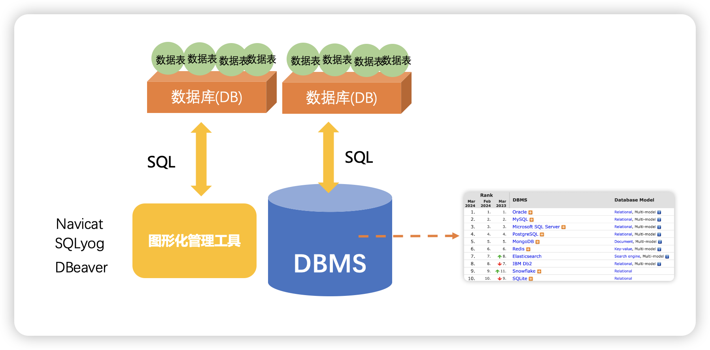
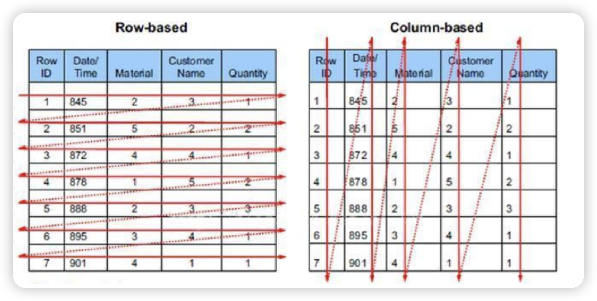
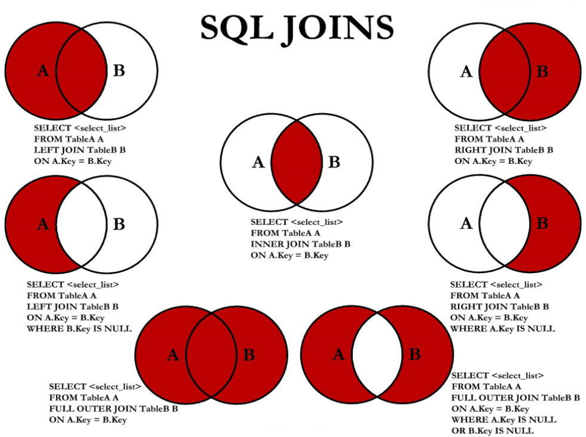

# 1. 数据库

## 1.1.概念



* **DB：数据库（Database）**

​	即存储数据的“仓库”，其本质是一个文件系统。它保存了一系列有组织的数据。

* **DBMS：数据库管理系统（Database Management System）**

​	是一种操纵和管理数据库的大型软件，用于建立、使用和维护数据库，对数据库进行统一管理和控 制。用户通过数据库管理系统访	问数据库中表内的数据。

* **SQL：结构化查询语言（Structured Query Language）**

​	专门用来与数据库通信的语言。

## 1.2.RDBMS 与 非RDBMS

从排名中我们能看出来，关系型数据库绝对是 DBMS 的主流，其中使用最多的 DBMS 分别是 Oracle、 MySQL 和 SQL Server。这些都是关系型数据库（RDBMS）。

* 关系型数据库(RDBMS)

  * 这种类型的数据库是`最古老 `的数据库类型，关系型数据库模型是把复杂的数据结构归结为简单的二元关系（即`二维表格`形式）。

  * 关系型数据库以 行(row) 和 列(column) 的形式存储数据，以便于用户理解。这一系列的行和列被称为表(table) ，一组表组成了一个库(database)。

  * 表与表之间的数据记录有关系(relationship)。现实世界中的各种实体以及实体之间的各种联系均用关系模型 来表示。关系型数据库，就是建立在关系模型基础上的数据库。

  * 优势

    复杂查询 可以用SQL语句方便的在一个表以及多个表之间做非常复杂的数据查询。 事务支持 使得对于安全性能很高的数据访问要求得以实现。

* 非关系型数据库(非RDBMS)

  * 非关系型数据库，可看成传统关系型数据库的功能`阉割版本`，基于键值对存储数据，不需要经过SQL层的解析， 性能非常高 。同时，通过减少不常用的功能，进一步提高性能。

  * 种类：列式数据库，列式数据库是相对于行式存储的数据库，Oracle、MySQL、SQL Server 等数据库都是采用的行式存储 （Row-based），而列式数据库是将数据按照列存储到数据库中，这样做的好处是可以大量降低系统的 I/O，适合于分布式文件系统，不足在于功能相对有限。典型产品：HBase等。

    

# 2.SQL概述

##  常用的 SQL 标准有哪些

我们首先需要知道 SQL 存在不同版本的标准规范，因为不同规范下的表 连接操作是有区别的。

SQL 有两个主要的标准，分别是 SQL92 和 SQL99 。92 和 99 代表了标准提出的时间，SQL92 就是 92 年 提出的标准规范。当然除了 SQL92 和 SQL99 以外，还存在 SQL-86、SQL-89、SQL:2003、SQL:2008、 SQL:2011 和 SQL:2016 等其他的标准。

这么多标准，到底该学习哪个呢？`实际上最重要的 SQL 标准就是 SQL92 和 SQL99`。一般来说 SQL92 的 形式更简单，但是写的 SQL 语句会比较长，可读性较差。而 SQL99 相比于 SQL92 来说，语法更加复杂， 但可读性更强。我们从这两个标准发布的页数也能看出，SQL92 的标准有 500 页，而 SQL99 标准超过了 1000 页。实际上从 SQL99 之后，很少有人能掌握所有内容，因为确实太多了。就好比我们使用 Windows、Linux 和 Office 的时候，很少有人能掌握全部内容一样。我们只需要掌握一些核心的功能，满 足日常工作的需求即可。

SQL92 和 SQL99 是经典的 SQL 标准，也分别叫做 SQL-2 和 SQL-3 标准。 也正是在这两个标准发布之

后，SQL 影响力越来越大，甚至超越了数据库领域。现如今 SQL 已经不仅仅是数据库领域的主流语言， 还是信息领域中信息处理的主流语言。在图形检索、图像检索以及语音检索中都能看到 SQL 语言的使 用。

## SQL分类


## 语言规范与规则

* 注释

  ```sql
  单行注释：#注释文字(MySQL特有的方式) 
  单行注释：-- 注释文字(--后面必须包含一个空格。) 
  多行注释：/* 注释文字 */
  ```

## 数据类型

[数据类型学习文档](./MySQL_data_type.pdf)

# 3. mySQL中常见数据库对象

我们在使用 SQL 语言的时候，不是直接和这门语言打交道，而是通过它使用不同的数据库软件，即 DBMS。 **DBMS** **之间的差异性很大，远大于同一个语言不同版本之间的差异。**

[语法查询网站](http://www.w3school.com.cn/sql/index.asp)

## 表

### 多表查询

> 我们要控制连接表的数量 。多表连接就相当于嵌套 for 循环一样，非常消耗资源，会让 SQL 查询性能下 降得很严重，因此不要连接不必要的表。在许多 DBMS 中，也都会有最大连接表的限制。【强制】超过三个表禁止 join。需要 join 的字段，数据类型保持绝对一致；多表关联查询时， 保 证被关联的字段需要有索引。

* 无连接条件--笛卡尔积
* 内连接INNER JOIN ----->JOIN
* 外连接 OUTER JOIN
  * 左连接 LEFT OUTER JOIN -----> LEFT JOIN
  * 右连接 RIGHT OUTER JOIN-----> RIGHT JOIN
  * 满外连接  FULL OUTER JOIN 【mySQL不支持】



> 表连接的约束条件可以有三种方式：WHERE, ON, USING ，建议使用第二种on，where是sql92中的；on是sql99新特性
>
> WHERE：适用于所有关联查询 
>
> ON ：只能和JOIN一起使用，只能写关联条件。虽然关联条件可以并到WHERE中和其他条件一起 写，但分开写可读性更好。 
>
> USING：只能和JOIN一起使用，而且要求两个关联字段在关联表中名称一致，而且只能表示关联字 段值相等

```sql
#关联条件 #把关联条件写在where后面 SELECT last_name,department_name FROM employees,departments WHERE employees.department_id = departments.department_id;

#把关联条件写在on后面，只能和JOIN一起使用 SELECT last_name,department_name FROM employees INNER JOIN departments ON employees.department_id = departments.department_id;

SELECT last_name,department_name FROM employees CROSS JOIN departments ON employees.department_id = departments.department_id;

SELECT last_name,department_name FROM employees JOIN departments ON employees.department_id = departments.department_id;

#把关联字段写在using()中，只能和JOIN一起使用 #而且两个表中的关联字段必须名称相同，而且只能表示= #查询员工姓名与基本工资 SELECT last_name,job_title FROM employees INNER JOIN jobs USING(job_id);

#n张表关联，需要n-1个关联条件 #查询员工姓名，基本工资，部门名称 SELECT last_name,job_title,department_name FROM employees,departments,jobs WHERE employees.department_id = departments.department_id AND employees.job_id = jobs.job_id;

SELECT last_name,job_title,department_name FROM employees INNER JOIN departments INNER JOIN jobs ON employees.department_id = departments.department_id AND employees.job_id = jobs.job_id;
```

### 函数

从函数定义的角度出发，我们可以将函数分成 内置函数 和 自定义函数 。在 SQL 语言中，同样也包括了

内置函数和自定义函数。内置函数是系统内置的通用函数，而自定义函数是我们根据自己的需要编写 的。

我们在使用 SQL 语言的时候，不是直接和这门语言打交道，而是通过它使用不同的数据库软件，即 DBMS。 **DBMS** **之间的差异性很大，远大于同一个语言不同版本之间的差异。** 实际上，只有很少的函数是 被 DBMS 同时支持的。比如，大多数 DBMS 使用（||）或者（+）来做拼接符，而在 MySQL 中的字符串拼 接函数为concat()。大部分 DBMS 会有自己特定的函数，这就意味着**采用** **SQL** **函数的代码可移植性是很差的**，因此在使用函数的时候需要特别注意。

* 聚合函数

  SELECT和HAVING两个位置可以存在聚合函数

  ```sql
  #sql99语法：
  SELECT ....,....,....(存在聚合函数)
  FROM ... (LEFT / RIGHT)JOIN ....ON 多表的连接条件 
  (LEFT / RIGHT)JOIN ... ON ....
  WHERE 不包含聚合函数的过滤条件
  GROUP BY ...,....
  HAVING 包含聚合函数的过滤条件
  ORDER BY ....,...(ASC / DESC )
  LIMIT ...,....
  ```

  * SELECT中除聚合函数生成的字段以外的字段，与GROUP BY中一致。但是包含在 GROUP BY 子句中的字段可以在SELECT 列表中 省略。简而言之，要么两者字段一样，要么SELECT中省略。

  * 使用 WITH ROLLUP 关键字之后，在所有查询出的分组记录之后增加一条记录，该记录计算查询出的所 有记录的总和，即统计记录数量。当使用ROLLUP时，不能同时使用ORDER BY子句进行结果排序，即ROLLUP和ORDER BY是互相排斥 的。

    ```sql
    SELECT department_id,AVG(salary) 
    FROM employees 
    WHERE department_id > 80 
    GROUP BY department_id WITH ROLLUP;
    ```

  * HAVING 不能单独使用，必须要跟 GROUP BY 一起使用。
  * WHERE和HAVING的对比:
    * 都可以过滤数据，HAVING条件可以包含聚合函数，WHERE不可以。
    * 当过滤条件中没有聚合函数时，则此过滤条件声明在WHERE中或HAVING中都可以。但是，建议使用WHERE。
    *  从适用范围上来讲，WHERE比HAVING的适用范围更广

### 子查询

子查询指一个查询语句嵌套在另一个查询语句内部的查询，这个特性从MySQL 4.1开始引入。

SQL 中子查询的使用大大增强了 SELECT 查询的能力，因为很多时候查询需要从结果集中获取数据，或者 需要从同一个表中先计算得出一个数据结果，然后与这个数据结果（可能是某个标量，也可能是某个集 合）进行比较。

* 子查询的分类

  * 角度1：从内查询返回的结果的条目数：单行子查询  vs  多行子查询

    

    

  * 角度2：内查询是否被执行多次：相关子查询  vs  不相关子查询

      比如：相关子查询的需求：查询工资大于本部门平均工资的员工信息。

         不相关子查询的需求：查询工资大于本公司平均工资的员工信息。

      不相关子查询：`子查询计算一次`
      
      相关子查询：通常情况下都是因为子查询中的表用到了外部的表，`因此每执行一次外部查询，子查询都要重新计算一次`，这样的子查询就称之为 关联子查询。

* 子查询的位置

  在SELECT中，除了GROUP BY 和 LIMIT之外，其他位置都可以声明子查询！

  ```sql
  #FROM
  SELECT e.last_name,e.salary,e.department_id
  FROM employees e,(
  		SELECT department_id,AVG(salary) avg_sal
  		FROM employees
  		GROUP BY department_id) t_dept_avg_sal
  WHERE e.department_id = t_dept_avg_sal.department_id
  AND e.salary > t_dept_avg_sal.avg_sal
  #WHERE
  SELECT last_name,salary,department_id
  FROM employees e1
  WHERE salary > (
  		SELECT AVG(salary)
  		FROM employees e2
  		WHERE department_id = e1.`department_id`
  		);
  #HAVINE
  SELECT department_id
  FROM employees
  GROUP BY department_id
  HAVING AVG(salary) <= ALL(	
  			SELECT AVG(salary) avg_sal
  			FROM employees
  			GROUP BY department_id
  			) 
  #ORDER BY
  SELECT employee_id,salary
  FROM employees e
  ORDER BY (
  	 SELECT department_name
  	 FROM departments d
  	 WHERE e.`department_id` = d.`department_id`
  	) ASC;
  ```

### DDL

[DDL操作代码](./MySQL_DDL.sql)、[DDL学习文档](./MySQL_DDL.pdf)

### DML

## 约束

使用DDL操作。

## 视图

相当于一段sql语句，不存储实际数据。与实际表实时联动。

## 存储过程与存储函数

## 变量、流程控制与游标

## 触发器

# 4.mySQL 不支持

## 多表连接

* SQL92语法实现内连接，缺省
* SQL92语法实现外连接：添加 +  ----------MySQL不支持SQL92语法中外连接的写法！Oracle支持
* SQL99语法中使用 JOIN ...ON 的方式实现多表的查询。这种方式也能解决外连接的问题。MySQL是支持此种方式的。

```sql
#不支持
SELECT employee_id,department_name
FROM employees e,departments d
WHERE e.`department_id` = d.department_id(+);
#支持
SELECT last_name,department_name
FROM employees e LEFT JOIN departments d
ON e.`department_id` = d.`department_id`;
```

* 满外连接：mysql不支持SQL99的FULL OUTER JOIN，Oracle支持

```sql
 #不支持
SELECT last_name,department_name
FROM employees e FULL OUTER JOIN departments d
ON e.`department_id` = d.`department_id`;
#支持。使用union all的形式拼接数据
SELECT employee_id,department_name
FROM employees e LEFT JOIN departments d
ON e.`department_id` = d.`department_id`
UNION ALL
SELECT employee_id,department_name
FROM employees e RIGHT JOIN departments d
ON e.`department_id` = d.`department_id`
WHERE e.`department_id` IS NULL;
```

# 5.SQL99语法新特性

## 自然连接

SQL99 在 SQL92 的基础上提供了一些特殊语法，比如 NATURAL JOIN 用来表示自然连接。我们可以把 自然连接理解为 SQL92 中的等值连接。它会帮你自动查询两张连接表中`所有相同`的字段 ，然后进行等值连接。实际使用中不常用。

在SQL92标准中：

```sql
SELECT employee_id,last_name,department_name 
FROM employees e 
JOIN departments d 
ON e.`department_id` = d.`department_id` 
	AND e.`manager_id` = d.`manager_id`;
```

在 SQL99 中你可以写成：

```sql
SELECT employee_id,last_name,department_name 
FROM employees e NATURAL JOIN departments d;
```

## USING连接

当我们进行连接的时候，SQL99还支持使用 USING 指定数据表里的`同名字段`进行等值连接。但是只能配合`JOIN`一起使用。比如：

```sql
SELECT employee_id,last_name,department_name 
FROM employees e 
JOIN departments d 
USING (department_id);
```

# 其他

## 执行顺序

[更多详细内容见视频第30分钟](https://www.bilibili.com/video/BV1iq4y1u7vj?p=41&vd_source=6f12b8c78467086fc666a02ab409ef20)

\#（1）from：从哪些表中筛选

\#（2）on：关联多表查询时，去除笛卡尔积

#（3）where：从表中筛选的条件

\#（4）group by：分组依据

\#（5）having：在统计结果中再次筛选

\#（6）order by：排序

\#（7）limit：分页

```sql
SELECT DISTINCT player_id, player_name, count(*) as num # 顺序 5 
FROM player JOIN team ON player.team_id = team.team_id # 顺序 1 
WHERE height > 1.80 # 顺序 2
GROUP BY player.team_id # 顺序 3
HAVING num > 2 # 顺序 4
ORDER BY num DESC # 顺序 6
LIMIT 2 # 顺序 7
```

## 执行原理

SELECT 是先执行 FROM 这一步的。在这个阶段，如果是多张表联查，还会经历下面的几个步骤：

1. 首先先通过 CROSS JOIN 求笛卡尔积，相当于得到虚拟表 vt（virtual table）1-1；

2. 通过 ON 进行筛选，在虚拟表 vt1-1 的基础上进行筛选，得到虚拟表 vt1-2；

3. 添加外部行。如果我们使用的是左连接、右链接或者全连接，就会涉及到外部行，也就是在虚拟 表 vt1-2 的基础上增加外部行，得到虚拟表 vt1-3。

当然如果我们操作的是两张以上的表，还会重复上面的步骤，直到所有表都被处理完为止。这个过程得 到是我们的原始数据。

当我们拿到了查询数据表的原始数据，也就是最终的虚拟表 vt1 ，就可以在此基础上再进行 WHERE 阶 段 。在这个阶段中，会根据 vt1 表的结果进行筛选过滤，得到虚拟表 vt2 。 

然后进入第三步和第四步，也就是 GROUP 和 HAVING 阶段 。在这个阶段中，实际上是在虚拟表 vt2 的 基础上进行分组和分组过滤，得到中间的虚拟表 vt3 和 vt4 。 当我们完成了条件筛选部分之后，就可以筛选表中提取的字段，也就是进入到 SELECT 和 DISTINCT 阶段 。 首先在 SELECT 阶段会提取想要的字段，然后在 DISTINCT 阶段过滤掉重复的行，分别得到中间的虚拟表 vt5-1 和 vt5-2 。 当我们提取了想要的字段数据之后，就可以按照指定的字段进行排序，也就是 ORDER BY 阶段 ，得到 虚拟表 vt6 。 最后在 vt6 的基础上，取出指定行的记录，也就是 LIMIT 阶段 ，得到最终的结果，对应的是虚拟表 vt7 。 当然我们在写 SELECT 语句的时候，不一定存在所有的关键字，相应的阶段就会省略。 同时因为 SQL 是一门类似英语的结构化查询语言，所以我们在写 SELECT 语句的时候，还要注意相应的 关键字顺序， 所谓底层运行的原理，就是我们刚才讲到的执行顺序。
