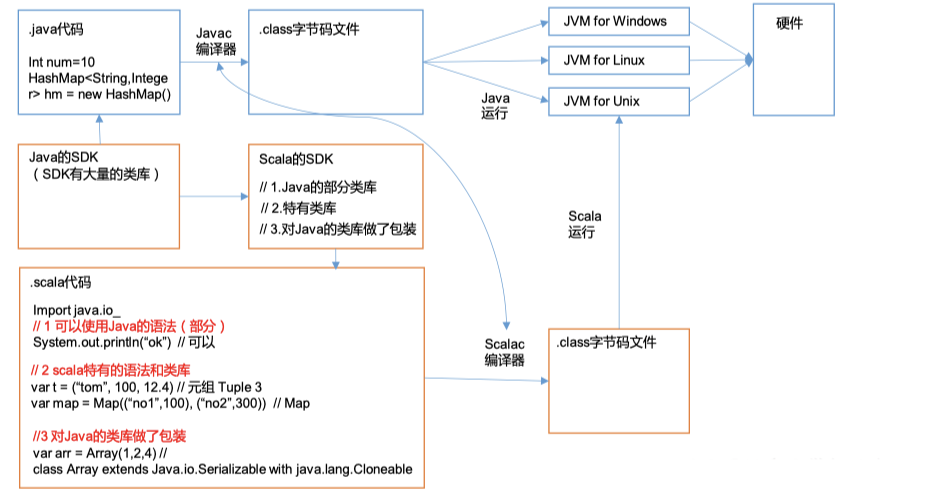
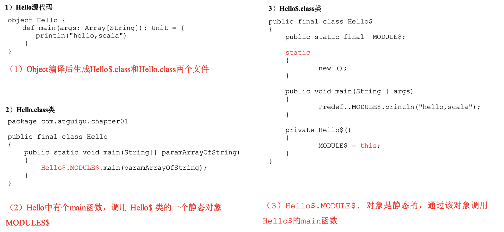
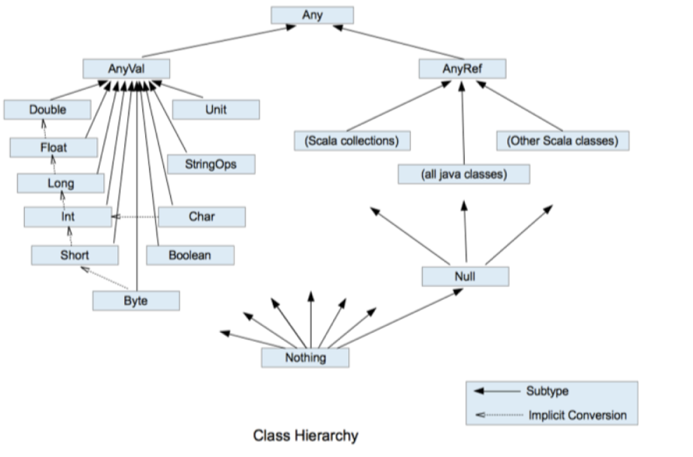
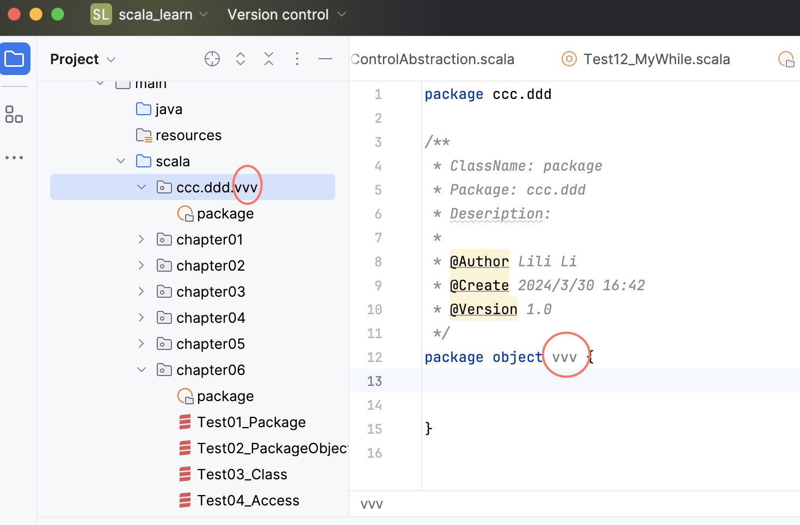

标题前加--代表与java存在不同

搜索【独有】，查看scala特别之处

# 1. 概述



```scala
object HelloWorld {
  def mian(args:Array[String]): Unit = {
    println("hello world")
  }

}
```


* Scala完全面向对象，故Scala去掉了Java中非面向对象的元素，如static关键字，void类型

   1）static

  Scala无static关键字，为什么去掉static的原因是因为java中的static的全局变量和方法是不需要创建对象，直接用类本身来调用的，这违背了面向对象的思想。因此scala在语法中去掉了static关键字，将class中需要的全局变量直接定义在相同名字的object中

  class关键字和Java中的class关键字作用相同，用来定义一个类；

  2）void 对于无返回值的函数，Scala定义其返回值类型为Unit类

| Scala程序反编译                                              |
| ------------------------------------------------------------ |
| 伴生类+伴生对象在一个class文件里面<br/><br/>main方法只能放在伴生对象里面<br/><br/>伴生对象和伴生类的属性可以互相调用 |
|                                     |

[官方编程指南](https://www.scala-lang.org/api/2.11.12/#scala.package)

# 2.变量和数据类型

## 2.1.注释

注释与java一样

（1）单行注释：// （2）多行注释：/* */ （3）文档注释：/** * */

## 2.2.变量和常量（重点）

> 注意：能用常量的地方不用变量，符合函数编程思路

0）回顾：Java 变量和常量语法

变量类型 变量名称 = 初始值

int a = 10

final int a = 10

1）基本语法 `先名称后类型`，说明类型对机器重要，对人不重要，对人重要的是名称

var a : int = 10

val  a : int =10

## 2.6.数据类型（重点）

* 回顾java

  > 因为Java中基本类型和引用类型没有共同的祖先，所以不是真正意义上的面向对象的语言

  Java基本类型：char、byte、short、int、long、float、double、boolean

  Java引用类型：（对象类型）

  由于Java有基本类型，而且基本类型不是真正意义的对象，即使后面产生了基本类型的包装类， 但是仍然存在基本数据类型，所以Java语言并不是真正意思的面向对象。

  Java基本类型的包装类：Character、Byte、Short、Integer、Long、Float、Double、Boolean

  注意：Java中基本类型和引用类型没有共同的祖先。

* scala

  

  1）Scala中一切数据都是对象，都是Any的子类。

  2）Scala中数据类型分为两大类：数值类型（AnyVal）、 引用类型（AnyRef），不管是值类型还是引用类型都是 对象。 3）Scala数据类型仍然遵守，低精度的值类型向高精 度值类型，自动转换（隐式转换）

  4）Scala中的StringOps是对Java中的String增强

  5）Unit：对应Java中的void， 用于方法返回值的位置，表 示方法没有返回值。Unit是一个数据类型， 只有一个对象 就是()。Void不是数据类型，只是一个关键字

  6）Null是一个类型， 只有一个对象就是null。 它是 所有引用类型（AnyRef）的子类。

  7）Nothing，是所有数据类型的子类，主要用在一个函数没有明确返回值时使 用，因为这样我们可以把抛出的返回值，返回给任何的变量或者函数。

## 2.7.整数类型（Byte、Short、Int、Long）

## 2.8.浮点类型（Float、Double）

## 2.9 字符类型（Char）

## 2.10 布尔类型：Boolean	

## 2.11 Unit 类型、Null 类型和 Nothing 类型（重点）

# 3.运算符

与Java语法用法类似，但是在 Scala 中其实是没有运算符的，所有运算符都是方法。

1）当调用对象的方法时，点.可以省略 

2）如果函数参数只有一个，或者没有参数，()可以省略

```scala
object TestOpt {

  def main(args: Array[String]): Unit = {

  // 标准的加法运算

  val i:Int = 1.+(1)//+是一个方法，后面（）里面是参数

  // （1）当调用对象的方法时，.可以省略

  val j:Int = 1 + (1)

  // （2）如果函数参数只有一个，或者没有参数，()可以省略

  val k:Int = 1 + 1

  println(1.toString())

  println(1 toString())

  println(1 toString)

  }

 }
```

# 4.流程控制

## --分支控制 if-else

与java大体相同，有不同的：

* 分支语句的返回值

## --嵌套分支

## --Switch 分支结构

## --For 循环控制

Scala 也为 for 循环这一常见的控制结构提供了非常多的特性，这些 for 循环的特性被称 为 for 推导式或 for 表达式。

--范围数据循环（To）

--范围数据循环（Until）

--循环守卫

--循环步长

嵌套循环

--引入变量

--循环返回值

```scala
object TestFor {
  def main(args: Array[String]): Unit = {
    var res = for (i <- 1 to 10) yield {
      i * 2
    }
    println(res)
  }
}
```

Vector(2, 4, 6, 8, 10, 12, 14, 16, 18, 20)

--倒序打印

## While 和 do..While 循环控制--scala中不推荐使用

While 和 do..While 的使用和 Java 语言中用法相同。

scala中不推荐使用，可以使用for就用for

# 5.函数式编程

函数式编程因为其没有变量概念，推荐使用val常量，值的不可变性，特别适合在大数据分布式计算中使用，提高并行处理

* 面向对象编程

  [面向对象编程是什么](https://www.bilibili.com/video/BV1Xh411S7bP/?p=48&spm_id_from=333.788.top_right_bar_window_history.content.click&vd_source=6f12b8c78467086fc666a02ab409ef20)

  解决问题，分解对象，行为，属性，然后通过对象的关系以及行为的调用来解决问题。 

  对象：用户 

  行为：登录、连接 JDBC、读取数据库 

  属性：用户名、密码

  Scala 语言是一个完全面向对象编程语言。万物皆对象

  对象的本质：对数据和行为的一个封装

* 函数式编程

  解决问题时，将问题分解成一个一个的步骤，将每个步骤进行封装（函数），通过调用 这些封装好的步骤，解决问题。

   例如：请求->用户名、密码->连接 JDBC->读取数据库 

  Scala 语言是一个完全函数式编程语言。万物皆函数。 

  函数的本质：函数可以当做一个值进行传递

## 5.1 函数基础

### 5.1.1 函数基本语法

### 5.1.2 函数和方法的区别

### 5.1.3 函数定义

### --5.1.4 函数参数

（1）可变参数 

（2）如果参数列表中存在多个参数，那么可变参数一般放置在最后 

（3）参数默认值，一般将有默认值的参数放置在参数列表的后面 ---【独有】

（4）带名参数---【独有】

### 5.1.5 函数至简原则（重点）

```scala
// 函数至简原则
object Test04_Simplify {
  def main(args: Array[String]): Unit = {

    def f0(name: String): String = {
      return name
    }

    println(f0("atguigu"))

    println("==========================")

    //    （1）return可以省略，Scala会使用函数体的最后一行代码作为返回值
    def f1(name: String): String = {
      name
    }
    println(f1("atguigu"))

    println("==========================")

    //    （2）如果函数体只有一行代码，可以省略花括号
    def f2(name: String): String = name
    println(f2("atguigu"))

    println("==========================")

    //    （3）返回值类型如果能够推断出来，那么可以省略（:和返回值类型一起省略）
    def f3(name: String) = name
    println(f3("atguigu"))

    println("==========================")

    //    （4）如果有return，则不能省略返回值类型，必须指定
//    def f4(name: String) = {
//      return name
//    }
//
//    println(f4("atguigu"))

    println("==========================")

    //    （5）如果函数明确声明unit，那么即使函数体中使用return关键字也不起作用
    def f5(name: String): Unit = {
      return name
    }

    println(f5("atguigu"))

    println("==========================")

    //    （6）Scala如果期望是无返回值类型，可以省略等号
    def f6(name: String) {
      println(name)
    }

    println(f6("atguigu"))

    println("==========================")

    //    （7）如果函数无参，但是声明了参数列表，那么调用时，小括号，可加可不加
    def f7(): Unit = {
      println("atguigu")
    }

    f7()
    f7

    println("==========================")

    //    （8）如果函数没有参数列表，那么小括号可以省略，调用时小括号必须省略
    def f8: Unit = {
      println("atguigu")
    }

//    f8()
    f8

    println("==========================")

    //    （9）如果不关心名称，只关心逻辑处理，那么函数名（def）可以省略
    def f9(name: String): Unit = {
      println(name)
    }

    // 匿名函数，lambda表达式
    (name: String) => { println(name) }

    println("==========================")

  }
}
```

## 5.2 函数高级

### 5.2.1 高阶函数

```scala
object Test06_HighOrderFunction {
  def main(args: Array[String]): Unit = {
    def f(n: Int): Int = {
      println("f调用")
      n + 1
    }

    def fun(): Int = {
      println("fun调用")
      1
    }

    val result: Int = f(123)
    println(result)//f调用,124

    // 1. 函数作为值进行传递
    val f1: Int => Int = f
    val f2 = f _

    println(f1)//chapter05.Test06_HighOrderFunction$$$Lambda$5/2109957412@2c8d66b2
    println(f1(12))//f调用,13
    println(f2)//chapter05.Test06_HighOrderFunction$$$Lambda$6/901506536@5a39699c
    println(f2(35))//f调用,36
    println("==================")
    val f3: () => Int = fun
    val f4 = fun _
    println(f3)//chapter05.Test06_HighOrderFunction$$$Lambda$7/312116338@2f7c7260
    println(f4)//chapter05.Test06_HighOrderFunction$$$Lambda$8/453211571@2d209079

    // 2. 函数作为参数进行传递
    // 定义二元计算函数
    def dualEval(op: (Int, Int) => Int, a: Int, b: Int): Int = {
      op(a, b)
    }

    def add(a: Int, b: Int): Int = {
      a + b
    }

    println(dualEval(add, 12, 35))
    println(dualEval((a, b) => a + b, 12, 35))
    println(dualEval(_ + _, 12, 35))

    // 3. 函数作为函数的返回值返回
    //形式1:
    def f5(): Int => Unit = {
      def f6(a: Int): Unit = {
        println("f6调用 " + a)
      }

      f6 // 将函数直接返回
    }
    //形式2:
    def f51() = {
      def f6(a: Int): Unit = {
        println("f6调用 " + a)
      }

      f6 _ // 将函数直接返回
    }

    //    val f6 = f5()
    //    println(f6)
    //    println(f6(25))

    println(f5()(25))
  }
}
```

### 5.2.2 匿名函数

返回值不需要显式指定，这使得代码更加简洁和易读。当你在匿名函数中没有显式写出返回语句时，Scala会将函数体的最后一个表达式的值作为函数的返回值。这是函数式编程的一部分，强调使用表达式而不是指令。

* 没有名字的函数就是匿名函数。Lambda表达式：( 参数1:int，参数2:String) => { 函数体 }

* 函数作为参数传入，类型是：参数 => 返回值
  * 例如：函数 ( name: String ) => { println(name) } 类型：String => Unit
  * 例如：函数 (a: int, b: int ) => {a +b} 类型：(Int, Int) => Int

```scala
object Test05_Lambda {
  def main(args: Array[String]): Unit = {

    def fun1(name: String): Unit = {
      println(name)
    }

    //fun是由fun1简化而来,(name: String) => { println(name) }是 String => Unit类型的，代表参数是String类型，无返回值
    val fun = (name: String) => {
      println(name)
    }
    fun("atguigu")

    println("========================")

    // 定义一个函数，以函数作为参数输入
    def f(func: String => Unit): Unit = {
      func("atguigu")
    }

    f(fun)
    f((name: String) => {
      println(name)
    })

    println("========================")

    // 匿名函数的简化原则
    //    （1）参数的类型可以省略，会根据形参进行自动的推导
    f((name) => {
      println(name)
    })

    //    （2）类型省略之后，发现只有一个参数，则圆括号可以省略；其他情况：没有参数和参数超过1的永远不能省略圆括号。
    f(name => {
      println(name)
    })

    //    （3）匿名函数如果只有一行，则大括号也可以省略
    f(name => println(name))

    //    （4）如果参数只出现一次，则参数省略且后面参数可以用_代替
    f(println(_))

    //     (5) 如果可以推断出，当前传入的println是一个函数体，而不是调用语句，可以直接省略下划线
    f(println)

    println("=========================")

    // 实际示例，定义一个”二元运算“函数，只操作1和2两个数，但是具体运算通过参数传入
    def dualFunctionOneAndTwo(fun: (Int, Int) => Int): Int = {
      fun(1, 2)
    }

    val add = (a: Int, b: Int) => a + b
    val minus = (a: Int, b: Int) => a - b

    println(dualFunctionOneAndTwo(add))
    println(dualFunctionOneAndTwo(minus))

    // 匿名函数简化
    println(dualFunctionOneAndTwo((a: Int, b: Int) => a + b))
    println(dualFunctionOneAndTwo((a: Int, b: Int) => a - b))

    println(dualFunctionOneAndTwo((a, b) => a + b))//上面dualFunctionOneAndTwo定义了参数类型，可以省略Int
    println(dualFunctionOneAndTwo(_ + _))//参数只出现一次，前面参数省略，后面参数用_代替
    println(dualFunctionOneAndTwo(_ - _))

    println(dualFunctionOneAndTwo((a, b) => b - a))
    println(dualFunctionOneAndTwo(-_ + _))
  }
}
```

### 5.2.3 高阶函数案例

```scala
object Test08_My {
  def main(args:Array[String]):Unit= {
    /*练习1
  * 定义一个匿名函数，并将它作为值赋给变量 fun。
  * 函数有三个参数，类型分别为 Int，String，Char，返回值类型为 Boolean。
  * 要求调用函数 fun(0, “”, ‘0’)得到返回值为 false，其它情况均返回 true。*/
    def fun(fun1: (Int, String, Char) => Boolean, a: Int, s: String, c: Char): Boolean = {
      fun1(a, s, c)
    }

    def funs(a: Int, s: String, c: Char): Boolean = {
      if (a == 0 && s == "" && c == '0') {
        false
      } else
        true
    }

    println(fun(funs, 0, "", '0'))
    println(fun(funs, 1, "", '0'))

    /*
    * 练习 2： 定义一个函数 func，它接收一个 Int 类型的参数，返回一个函数（记作 f1）。
    *  它返回的函数 f1，接收一个 String 类型的参数，同样返回一个函数（记作 f2）。
    * 函数 f2 接 收一个 Char 类型的参数，返回一个 Boolean 的值。
    * 要求调用函数 func(0) (“”) (‘0’)得到返回值为 false，其它情况均返回 true。*/
    def func(a: Int): String => Char => Boolean = {
      def f1(s: String): Char => Boolean = {
        def f2(c: Char): Boolean = {
          if (a == 0 && s == "" && c == '0') false else true
        }
        f2
      }
      f1
    }
    println(func(0)("")('0'))
    
    //简写
    def func2(a: Int): String => Char => Boolean = {
      s => c => if (i == 0 && s == "" && c == '0') false else true
    }
		// 柯里化，推荐使用柯里化
    def func2(i: Int)(s: String)(c: Char): Boolean = {
      if (i == 0 && s == "" && c == '0') false else true
    }
  } 
}
```

### 5.2.4 函数柯里化&闭包

闭包：函数式编程的标配

闭包：如果一个函数，访问到了它的外部（局部）变量的值，那么这个函数和他所处的环境，称为闭包

函数柯里化：把一个参数列表的多个参数，变成多个参数列表，也就是一个括号是一个参数列表，变成多个括号（）

### 5.2.5 递归


### 5.2.6 控制抽象

Java 只有值调用；Scala 既有值调用，又有名调用。【独有】

### 5.2.7 惰性加载


# 6.面向对象

## 包对象

包对象的名称与所在包的包名字一致，定义在包对象中的成员，在和它相同包下所有 class 和 object 都可以共享，可以被直接访问。



## 定义类

也是class，但是默认是public，无需加public关键字

获取类中的方法和属性，也是使用new的一个新对象来获取

```scala
object TestO{
  val test = new Test()
  println(test.sex)//null
  println(test.age)//0
  test.sex = "dog"
  println(test.sex)//dog
}

class Test{
  private val name: String = "Alice"
  @BeanProperty //作用是省去了像java一样的，get，set方法，可以自动生成规范的 setXxx/getXxx 方法
  var sex:String = _//_ 代表默认值，String是null，Int是0，和java一样
  var age: Int = _
}
```

## --封装

Scala底层做封装，和java不太一样，不建议将属性设置为private，再为其设置 public 的 get 和 set 方法的做法。。这样代码更简洁，专注代码就可以了。

但是有些java框架利用反射调用getXXX 和 setXXX 方法，为了做兼容，也会为Scala 的属性设置 getXXX 和 setXXX 方法（通过 @BeanProperty 注解实现）。

### 访问权限

在 Java 中，访问权限分为：public，private，protected 和默认。

在 Scala 中，你可以通过类似的修饰符达到同样的效果。但是使用上有区别。 

（1）Scala 中属性和方法的默认访问权限为 public，但 Scala 中无 public 关键字。 

（2）private 为私有权限，只在类的内部和伴生对象中可用。 

--（3）protected 为受保护权限，Scala 中受保护权限比 Java 中更严格，同类、子类可以访问，同包无法访问。 

（4）private[包名]，可以增加别的包的访问权限，被增加包名下的其他类也可以使用

## --构造器

和 Java 一样，Scala 构造对象也需要调用构造方法，并且可以有任意多个构造方法。 Scala 类的构造器包括：主构造器和辅助构造器

（1）辅助构造器，函数的名称 this，可以有多个，编译器来区分。 

（2）辅助构造方法不能直接构建对象，必须直接或者间接调用主构造方法。 

（3）构造器调用其他另外的构造器，要求被调用构造器必须提前声明。也就是构造器的声明顺序。前面的不可以调用后面的。

辅助构造器调用其他构造器，会把其他构造器的内容输出一遍

```scala
object Test05_Constructor {
  def main(args: Array[String]): Unit = {
    val student1 = new Student1 //1. 主构造方法被调用
    student1.Student1()//"一般方法被调用"

    val student2 = new Student1("alice")//1. 主构造方法被调用 2. 辅助构造方法一被调用 name: alice age: 0
    val student3 = new Student1("bob", 25)//1. 主构造方法被调用 2. 辅助构造方法一被调用 name: bob age: 0 3. 辅助构造方法二被调用 name: bob age: 25
  }
}

// 定义一个类，没有参数的构造器，括号可以省略
class Student1() {
  // 定义属性
  var name: String = _
  var age: Int = _

  println("1. 主构造方法被调用")//主构造器方法，new对象都会执行

  // 声明辅助构造方法，辅助构造器必须直接或者间接调用主构造方法
  def this(name: String) {
    this()    // 直接调用主构造器
    println("2. 辅助构造方法一被调用")
    this.name = name
    println(s"name: $name age: $age")
  }

  def this(name: String, age: Int){
    this(name) // 间接调用主构造器，也就是先调用this(name),然后this(name)内又调用this()
    println("3. 辅助构造方法二被调用")
    this.age = age
    println(s"name: $name age: $age")
  }

  def Student1(): Unit = {
    println("一般方法被调用")
  }
}
```

### 主构造器参数

在辅助构造器中使用`var`或`val`声明参数是不允许的

主构造器函数的形参包括三种类型：

（1）未用任何修饰符修饰，这个参数就是一个局部变量，对象无法调用

（2）var 修饰参数，作为类的成员属性使用，可以修改

（3）val 修饰参数，作为类只读属性使用，不能修改

## 继承

子类继承父类，到底调用父类哪个构造器，由extends 父类后的括号内参数决定

## --多态

java动态绑定方法，属性是静态绑定

scala方法和属性都是动态绑定，也就是说子类的属性和方法都可以通过多态的形式访问到！这是与java的不同

## 抽象类

抽象方法内可以有：

* 抽象属性，var类型，改写不加override
* 抽象方法，def eat():Unit，改写可加可不加override
* 非抽象属性，改写加override，而且父类非抽象属性是val类型，如果是var就不用override了，直接重新赋值就可以了
* 非抽象方法，改写加override


（1）如果父类为抽象类，那么子类需要将抽象的属性和方法实现，否则子类也需声明 为抽象类 （2）重写非抽象方法需要用 override 修饰，重写抽象方法则可以不加 override。 （3）子类中调用父类的方法使用 super 关键字 （4）子类对抽象属性进行实现，父类抽象属性可以用 var 修饰； 子类对非抽象属性重写，父类非抽象属性只支持 val 类型，而不支持 var。

因为 var 修饰的为可变变量，子类继承之后就可以直接使用，没有必要重写

```scala
object Test09_AbstractClass {
  def main(args: Array[String]): Unit = {
    val student = new Student9
    student.eat()
    student.sleep()
  }
}

// 定义抽象类
abstract class Person9{
  // 非抽象属性
  var name: String = "person"

  // 抽象属性
  var age: Int

  // 非抽象方法
  def eat(): Unit = {
    println("person eat")
  }

  // 抽象方法
  def sleep(): Unit
}

// 定义具体的实现子类
class Student9 extends Person9 {
  // 实现抽象属性和方法
  var age: Int = 18

  def sleep(): Unit = {
    println("student sleep")
  }

  // 重写非抽象属性和方法
//  override val name: String = "student"
  name = "student"

  override def eat(): Unit = {
    super.eat()
    println("student eat")
  }
}
```

## 匿名子类

和java中的匿名子类是一个意思，可以通过包含带有定义或重写的代码块的方式创建一个匿名的子类。

```scala
object Test10_AnnoymousClass {
  def main(args: Array[String]): Unit = {
    val person: Person10 = new Person10 {
      override var name: String = "alice"

      override def eat(): Unit = println("person eat")
    }
    
    println(person.name)//alice
    person.eat()//person eat
  }
}

// 定义抽象类
abstract class Person10 {
  var name: String
  def eat(): Unit
}
```

## 单例对象（伴生对象）

> 将静态内容放在伴生对象中，实现和java static方法和属性一样的效果

Scala语言是完全面向对象的语言，所以并没有静态的操作（即在Scala中没有静态的概念）。

但是为了能够和Java语言交互（因为Java中有静态概念），就产生了一种特殊的对象来模拟类对象，该对象为单例对象。

若单例对象名与类名一致，则称该单例对象这个类的伴生对象，这个类的所有“静态”内容都可以放置在它的伴生对象中声明。

```scala
object Test11_Object {
  def main(args: Array[String]): Unit = {
//    val student = new Student11("alice", 18)
//    student.printInfo()

    val student1 = Student11.newStudent("alice", 18)
    student1.printInfo()

    val student2 = Student11.apply("bob", 19)
    student2.printInfo()
    
//等同于上面val student2 = Student11.apply("bob", 19)
    val student3 = Student11("bob", 19)
    student3.printInfo()
  }
}

// 定义类，将构造器私有化，不能创造对象了！
class Student11 private(val name: String, val age: Int){
  def printInfo(){
    println(s"student: name = ${name}, age = $age, school = ${Student11.school}")
  }
}

// 伴生对象
object Student11{
  val school: String = "atguigu"

  // 定义一个类的对象实例的创建方法
  def newStudent(name: String, age: Int): Student11 = new Student11(name, age)

  def apply(name: String, age: Int): Student11 = new Student11(name, age)
}
```

## 单例模式

可以使用单例对象来创造单例模式

## --特质

Scala 语言中，采用特质 trait（特征）来代替接口的概念。引入 trait 特征，第一可以替代 Java 的接口，第二个也是对单继承机制的一种 补充。达到单继承，多实现。

Scala 中的 trait 中即可以有抽象属性和方法，也可以有具体的属性和方法。

一个类可以混入（mixin）多个特质。也就是可以继承多个特质。

java接口中，不能有public的属性和方法？？？


子类同时继承父类和特质时，如果属性有一样的产生冲突，一定要在子类里改写！

如何选用特质和抽象类

1.优先使用特质。一个类扩展多个特质是很方便的，但却只能扩展一个抽象类。

2.如果你需要构造函数参数，使用抽象类。因为抽象类可以定义带参数的构造函数，而特质不行（有无参构造）。

### 方法冲突

#### 普通冲突

直接改写冲突方法

#### 特质叠加

调用super.冲突方法()

执行顺序：从右往左，如果是棱形继承，要分析一下

### 特质自身类型

```scala
object Test16_TraitSelfType {
  def main(args: Array[String]): Unit = {
    val user = new RegisterUser("alice", "123456")
    user.insert()
  }
}

// 用户类
class User(val name: String, val password: String)

class User2(val name: String, val password: String)

trait UserDao {
  _: User => //_代表自身，表示将自身定义为User类型，就可以实现调用User类中的内容了！不需要继承！

  // 向数据库插入数据
  def insert(): Unit = {
    println(s"insert into db: ${this.name}")
  }
}

// 定义注册用户类
class RegisterUser(name: String, password: String) extends User(name, password) with UserDao

//error，显示：Unspecified value parameters: name: String, password: String
//class RegisterUser2(name: String, password: String) extends User2
```

## 枚举类和应用类

## Type 定义新类型

# 7.集合

不可变集合增加和删除元素，建议使用+-符号

可变集合增加和删除元素，建议使用add，append方法

Scala 的集合有三大类：所有的集合都扩展自 Iterable 特质

* 序列 Seq

* 集合Set：数据无序，不可重复

* 映射 Map

对于几乎所有的集合类，Scala 都同时提供了可变和不可变的版本，分别位于以下两 个包

## Seq

### 数组

#### 不可变Array

类似于java的ArrayList

引用不可变，但是元素可以变。在scala中推荐不可变数组，大数据中也是

不可变直接打印结果是引用，可变打印结果不是引用，是实际数组里面的数字，这就得从底层的调用方法说起来了，记住就行。

#### 可变ArrayBuffer

#### 多维数组

最高支持5维度，一般就是2维度，在大数据中就是一个表

### 列表（使用频繁）

没有索引的线性序列。因为没有索引，对列表的某个值不是很关心，要么添加数据到头和尾，要么遍历数据。

#### 不可变List

#### 可变ListBuffer

## Set

## Map

map有时候翻译成映射， 底层是哈西map？Scala 中的 Map 和 Java 类似，也是一个散列表，它存储的内容也是键值对（key-value）

# 8.Tuple元组

元组也是可以理解为一个容器，大杂烩，可以存放各种相同或不同类型的数据。说的简单点，就是将多个无关的数据封装为一个整体，称为元组。 

元组中最大只能有 22 个元素。

与List类似，List存放相同的元素，不可变


1-7线性，有序集合
