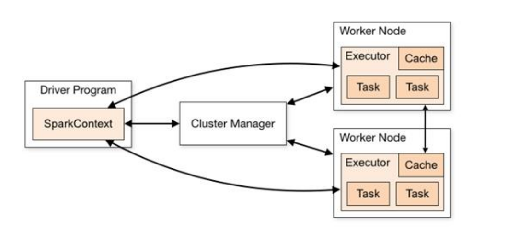
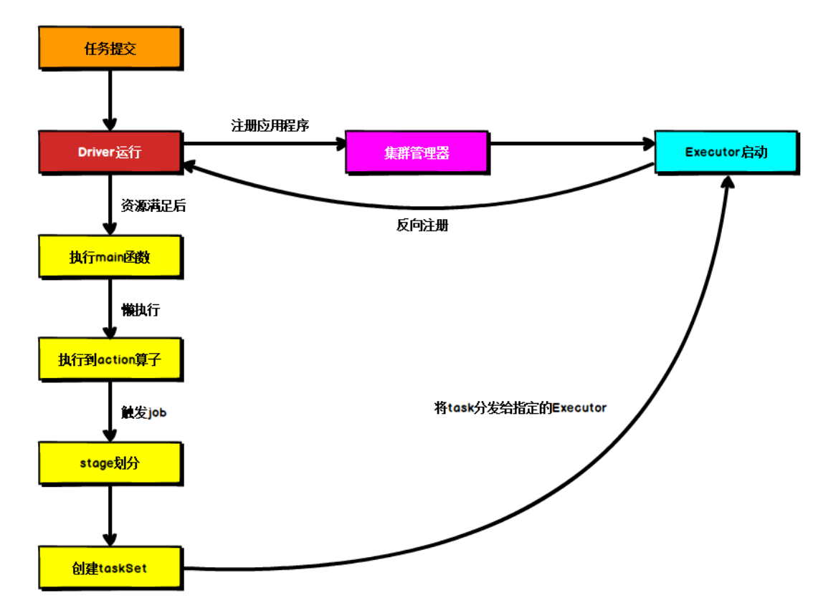
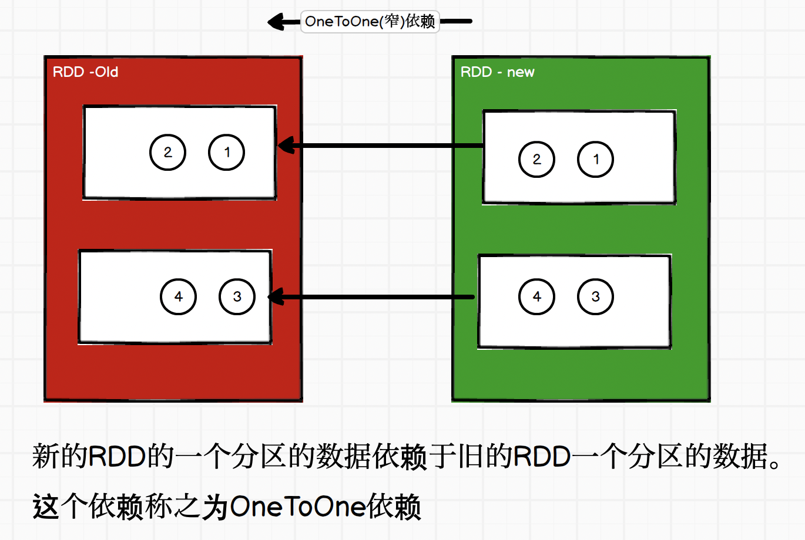

Spark 3.0.0  scala 2.12，这两者的版本搭配重要‼️

数据重新打乱组合，就是shuffle，shuffle是要落盘的，因为不可能在内存中等待数据，因为内存不够。落盘后在文件中等待数据，需要一个阶段完成后，开始另一个阶段。每个阶段有自己独立的任务。shuffle决定了任务执行的快慢。

# 1.案例

wordcount案例

spark是运行应用程序的环境，连接spark，将写的程序运行在上面。

* 1.TODO 建立和Spark框架的连接

  基于 Spark3.0 版 本，使用时请注意对应版本

在pom.xml上添加依赖:
  <dependencies>
        <dependency>
            <groupId>org.apache.spark</groupId>
            <artifactId>spark-core_2.12</artifactId>
            <version>3.0.0</version>
        </dependency>
    </dependencies>

```scala
//new SparkConf()配置对象
//setMaster()标识环境的方法
//setAppName()设置程序名称方法
val sparkConf = new SparkConf().setMaster("local").setAppName("WordCount")
val sc=new SparkContext(sparkConf)
```

* 2.TODO 执行业务操作

```scala
// 1. 读取文件，获取一行一行的数据
//    hello world
val lines: RDD[String] = sc.textFile("datas")

// 2. 将一行数据进行拆分，形成一个一个的单词（分词）
//    扁平化：将整体拆分成个体的操作
//   "hello world" => hello, world, hello, world
val words: RDD[String] = lines.flatMap(_.split(" "))

// 3. 将数据根据单词进行分组，便于统计
//    (hello, hello, hello), (world, world)
val wordGroup: RDD[(String, Iterable[String])] = words.groupBy(word=>word)

// 4. 对分组后的数据进行转换
//    (hello, 3), (world, 2)
val wordToCount = wordGroup.map {
    case ( word, list ) => {
        (word, list.size)
    }
}

// 5. 将转换结果采集到控制台打印出来
val array: Array[(String, Int)] = wordToCount.collect()
array.foreach(println)
```


* 3.TODO 关闭连接

```scala
sc.stop()
```

```xml
<build>
   <plugins>
   <!-- 该插件用于将 Scala 代码编译成 class 文件 -->
     <plugin>
       <groupId>net.alchim31.maven</groupId>
       <artifactId>scala-maven-plugin</artifactId>
       <version>3.2.2</version>
       <executions>
         <execution>
            <!-- 声明绑定到 maven 的 compile 阶段 -->
           <goals>
            <goal>testCompile</goal>
           </goals>
         </execution>
      	</executions>
     </plugin>

     <plugin>
       <groupId>org.apache.maven.plugins</groupId>
       <artifactId>maven-assembly-plugin</artifactId>
       <version>3.1.0</version>
       <configuration>
         <descriptorRefs>
         	<descriptorRef>jar-with-dependencies</descriptorRef>
         </descriptorRefs>
       </configuration>
       <executions>
         <execution>
         <id>make-assembly</id>
         <phase>package</phase>
         <goals>
         	<goal>single</goal>
         </goals>
         </execution>
       </executions>
     </plugin>
   </plugins>
</build>
```


# 2.Spark运行环境

## Local 模式

local 本地模式毕竟只是用来进行练习演示的

### **解压缩文件**

将 spark-3.0.0-bin-hadoop3.2.tgz 文件上传到 Linux 并解压缩，放置在指定位置

```bash
(base) ola@oladeMacBook-Pro ~ % scp /Users/ola/de-course/2_核心框架/Spark生态体 系框架/Spark/2.资料/spark-3.0.0-bin-hadoop3.2.tgz ola@hadoop102:/opt/software
ola@hadoop102's password:
spark-3.0.0-bin-hadoop3.2.tgz                 100%  214MB  32.8MB/s   00:06

[ola@hadoop102 software]$ tar -zxvf spark-3.0.0-bin-hadoop3.2.tgz -C /opt/module
[ola@hadoop102 software]$ cd /opt/module
[ola@hadoop102 module]$ mv spark-3.0.0-bin-hadoop3.2 spark-local
```

### **启动** **Local** **环境**

进入/opt/module/spark-local目录，执行`bin/spark-shell`

启动成功后，可以输入网址进行 Web UI 监控页面访问 `http://虚拟机地址:4040`

```bash
[ola@hadoop102 spark-local]$ bin/spark-shell
24/04/04 09:18:11 WARN NativeCodeLoader: Unable to load native-hadoop library for your platform... using builtin-java classes where applicable
Using Spark's default log4j profile: org/apache/spark/log4j-defaults.properties
Setting default log level to "WARN".
To adjust logging level use sc.setLogLevel(newLevel). For SparkR, use setLogLevel(newLevel).
Spark context Web UI available at http://hadoop102:4040
Spark context available as 'sc' (master = local[*], app id = local-1712193499336).
Spark session available as 'spark'.
Welcome to
      ____              __
     / __/__  ___ _____/ /__
    _\ \/ _ \/ _ `/ __/  '_/
   /___/ .__/\_,_/_/ /_/\_\   version 3.0.0
      /_/

Using Scala version 2.12.10 (Java HotSpot(TM) 64-Bit Server VM, Java 1.8.0_212)
Type in expressions to have them evaluated.
Type :help for more information.

scala>
```

​	

### **命令行工具**

```bash
scala> sc.textFile("data/word.txt").flatMap(_.split(" ")).map((_,1)).reduceByKey(_+_).collect
```


### **退出本地模式** 

按键 Ctrl+C 或输入 Scala 指令:quit

### **提交应用** 

除了命令行工具，还可以使用：

```bash
bin/spark-submit \
--class org.apache.spark.examples.SparkPi \
--master local[2] \
./examples/jars/spark-examples_2.12-3.0.0.jar \
10

1) --class 表示要执行程序的主类，此处可以更换为咱们自己写的应用程序
2) --master local[2] 部署模式，默认为本地模式，数字表示分配的虚拟 CPU 核数量
3) spark-examples_2.12-3.0.0.jar 运行的应用类所在的 jar 包，实际使用时，可以设定为咱
们自己打的 jar 包
4) 数字 10 表示程序的入口参数，用于设定当前应用的任务数量

[ola@hadoop102 spark-local]$ bin/spark-submit \
> --class org.apache.spark.examples.SparkPi \
> --master local[2] \
> ./examples/jars/spark-examples_2.12-3.0.0.jar \
> 10
```

## Standalone 模式

local 本地模式毕竟只是用来进行练习演示的，真实工作中还是要将应用提交到对应的集群中去执行

Standalone只使用 **Spark 自身节点**运行的集群模式，也就是我们所谓的独立部署（Standalone）模式。Spark 的 Standalone 模式体现了经典的 master-slave 模式。

集群规划:

|       | Linux1        | Linux2 | Linux3 |
| ----- | ------------- | ------ | ------ |
| Spark | Worker Master | Worker | Worker |

###  解压缩文件

```bash
将 spark-3.0.0-bin-hadoop3.2.tgz 文件上传到 Linux 并解压缩在指定位置
tar -zxvf spark-3.0.0-bin-hadoop3.2.tgz -C /opt/module
cd /opt/module 
mv spark-3.0.0-bin-hadoop3.2 spark-standalone
```

### 修改配置文件 

```bash
1) 进入解压缩后路径的 conf 目录，修改 slaves.template 文件名为 slaves
mv slaves.template slaves
2) 修改 slaves 文件，添加 work 节点
hadoop102
hadoop103
hadoop104
3) 修改 spark-env.sh.template 文件名为 spark-env.sh
mv spark-env.sh.template spark-env.sh
4) 修改 spark-env.sh 文件，添加 JAVA_HOME 环境变量和集群对应的 master 节点
export JAVA_HOME=/opt/module/jdk1.8.0_212
SPARK_MASTER_HOST=hadoop102
SPARK_MASTER_PORT=7077
注意：Spark Master 的默认端口是 7077
5) 分发 spark-standalone 目录
[ola@hadoop102 module]$ /home/ola/bin/xsync spark-standalone/
```

### 启动集群

查看 Master 资源监控 Web UI 界面: http://hadoop102:8080

```bash
1) 执行脚本命令：
[ola@hadoop102 spark-standalone]$ sbin/start-all.sh
2) 查看三台服务器运行进程
[ola@hadoop102 spark-standalone]$ /home/ola/bin/jpsall
=============== hadoop102 ===============
1832 Jps
1695 Master
1775 Worker
=============== hadoop103 ===============
1137 Worker
1191 Jps
=============== hadoop104 ===============
1137 Worker
1190 Jps
```

### 提交应用 

```bash
bin/spark-submit \
--class org.apache.spark.examples.SparkPi \
--master spark://hadoop102:7077 \
./examples/jars/spark-examples_2.12-3.0.0.jar \
10
1) --class 表示要执行程序的主类
2) --master spark://hadoop102:8020 独立部署模式，连接到 Spark 集群
3) spark-examples_2.12-3.0.0.jar 运行类所在的 jar 包
4) 数字 10 表示程序的入口参数，用于设定当前应用的任务数量

执行任务时，会产生多个 Java 进程
执行任务时，默认采用服务器集群节点的总核数，每个节点内存 1024M
```


### 配置历史服务

先停掉spark集群！！

```bash
由于 spark-shell 停止掉后，集群监控 hadoop102:4040 页面就看不到历史任务的运行情况，所以
开发时都配置历史服务器记录任务运行情况。
1) 修改 spark-defaults.conf.template 文件名为 spark-defaults.conf
mv spark-defaults.conf.template spark-defaults.conf
2) 修改 spark-defaults.conf 文件，配置日志存储路径
spark.eventLog.enabled true
spark.eventLog.dir hdfs://hadoop102:8020/directory
注意：需要启动 hadoop 集群，HDFS 上的 directory 目录需要提前存在。发现hadoop102上namenode启动不成功，解决方法是先停掉spark集群，再打开hadoop集群后
hadoop fs -mkdir /directory
3) 修改 spark-env.sh 文件, 添加日志配置
export SPARK_HISTORY_OPTS="
-Dspark.history.ui.port=18080 
-Dspark.history.fs.logDirectory=hdfs://hadoop102:8020/directory 
-Dspark.history.retainedApplications=30"
⚫ 参数 1 含义：WEB UI 访问的端口号为 18080
⚫ 参数 2 含义：指定历史服务器日志存储路径
⚫ 参数 3 含义：指定保存 Application 历史记录的个数，如果超过这个值，旧的应用程序信息将被删除，这个是内存中的应用数，而不是页面上显示的应用数。
4) 分发配置文件
xsync conf
5) 重新启动集群和历史服务
sbin/start-all.sh
sbin/start-history-server.sh
6) 重新执行任务
bin/spark-submit \
--class org.apache.spark.examples.SparkPi \
--master spark://hadoop102:7077 \
./examples/jars/spark-examples_2.12-3.0.0.jar \
10
```

### 查看历史服务

http://hadoop102:18080

### XXX配置高可用（HA）

所谓的高可用是因为当前集群中的 Master 节点只有一个，所以会存在单点故障问题。所以为了解决单点故障问题，需要在集群中配置多个 Master 节点，一旦处于活动状态的 Master发生故障时，由备用 Master 提供服务，保证作业可以继续执行。

这里的高可用一般采用Zookeeper 设置

原来集群规划:

|       | Linux1              | Linux2 | Linux3 |
| ----- | ------------------- | ------ | ------ |
| Spark | Worker <br />Master | Worker | Worker |

高可用集群规划:

|       | Linux1                            | Linux2                            | Linux3                |
| ----- | --------------------------------- | --------------------------------- | --------------------- |
| Spark | Worker<br />Master<br />Zookeeper | Worker<br />Master<br />Zookeeper | Worker<br />Zookeeper |

```bash
1) 停止集群
sbin/stop-all.sh
2) 启动 Zookeeper
xstart zk
3) 修改 spark-env.sh 文件添加如下配置
注释如下内容：
#SPARK_MASTER_HOST=hadoop102
#SPARK_MASTER_PORT=7077
添加如下内容:
#Master 监控页面默认访问端口为 8080，但是可能会和 Zookeeper 冲突，所以改成 8989，也可以自
定义，访问 UI 监控页面时请注意
SPARK_MASTER_WEBUI_PORT=8989
export SPARK_DAEMON_JAVA_OPTS="
-Dspark.deploy.recoveryMode=ZOOKEEPER 
-Dspark.deploy.zookeeper.url=linux1,linux2,linux3
-Dspark.deploy.zookeeper.dir=/spark"
4) 分发配置文件
xsync conf/
5) 启动集群
sbin/start-all.sh
```

### 问题

在配置spark-env.sh 中将SPARK_MASTER_PORT设置为了1020，导致后面提交任务失败！原因是1020是hadoop102的NameNode的通信端口，这样导致spark的Master端口和NameNode端口产生了冲突！

## Yarn 模式

独立部署（Standalone）模式由 Spark 自身提供计算资源，无需其他框架提供资源。这种方式降低了和其他第三方资源框架的耦合性，独立性非常强。

但是你也要记住，Spark 主要是计算框架，而不是资源调度框架，所以本身提供的资源调度并不是它的强项，所以还是和其他专业的资源调度框架集成会更靠谱一些。

所以接下来学习在强大的 Yarn 环境下 Spark 是如何工作的（因为在国内工作中，Yarn 使用的非常多）。

###  解压缩文件

```bash
将 spark-3.0.0-bin-hadoop3.2.tgz 文件上传到 Linux 并解压缩在指定位置
tar -zxvf spark-3.0.0-bin-hadoop3.2.tgz -C /opt/module
cd /opt/module 
mv spark-3.0.0-bin-hadoop3.2 spark-yarn
```

### 修改配置文件 

1) 修改 hadoop 配置文件/opt/module/hadoop-3.1.3/etc/hadoop/yarn-site.xml, 并分发!!!!

```bash
<!--是否启动一个线程检查每个任务正使用的物理内存量，如果任务超出分配值，则直接将其杀掉，默认是 true -->
<property>
   <name>yarn.nodemanager.pmem-check-enabled</name>
   <value>false</value>
</property>
<!--是否启动一个线程检查每个任务正使用的虚拟内存量，如果任务超出分配值，则直接将其杀掉，默认是 true -->
<property>
   <name>yarn.nodemanager.vmem-check-enabled</name>
   <value>false</value>
</property>
```

2) 修改 spark-yarn/conf/spark-env.sh，添加 JAVA_HOME 和 YARN_CONF_DIR 配置，不需要分发！！因为计算资源使用yarn，不再使用spark集群了

```bash
mv spark-env.sh.template spark-env.sh
vim spark-env.sh
#添加内容：
export JAVA_HOME=/opt/module/jdk1.8.0_212
YARN_CONF_DIR=/opt/module/hadoop-3.1.3/etc/hadoop
```

### **启动** **HDFS** **以及** **YARN** 集群

### 提交应用 

```bash
bin/spark-submit \
--class org.apache.spark.examples.SparkPi \
--master yarn \
--deploy-mode cluster \
./examples/jars/spark-examples_2.12-3.0.0.jar \
10
```

### 配置历史服务

先停掉spark集群！！，不需要分发到其他集群

```bash
由于 spark-shell 停止掉后，集群监控 hadoop102:4040 页面就看不到历史任务的运行情况，所以
开发时都配置历史服务器记录任务运行情况。
1) 修改 spark-defaults.conf.template 文件名为 spark-defaults.conf
mv spark-defaults.conf.template spark-defaults.conf
2) 修改 spark-defaults.conf 文件，配置日志存储路径
spark.eventLog.enabled true
spark.eventLog.dir hdfs://hadoop102:8020/directory
spark.yarn.historyServer.address=hadoop102:18080
spark.history.ui.port=18080
注意：需要启动 hadoop 集群，HDFS 上的 directory 目录需要提前存在。发现hadoop102上namenode启动不成功，解决方法是先停掉spark集群，再打开hadoop集群后
hadoop fs -mkdir /directory
3) 修改 spark-env.sh 文件, 添加日志配置
export SPARK_HISTORY_OPTS="
-Dspark.history.ui.port=18080 
-Dspark.history.fs.logDirectory=hdfs://hadoop102:8020/directory 
-Dspark.history.retainedApplications=30"
⚫ 参数 1 含义：WEB UI 访问的端口号为 18080
⚫ 参数 2 含义：指定历史服务器日志存储路径
⚫ 参数 3 含义：指定保存 Application 历史记录的个数，如果超过这个值，旧的应用程序信息将被删除，这个是内存中的应用数，而不是页面上显示的应用数。
4) 重新启动集群和历史服务
sbin/start-all.sh
sbin/start-history-server.sh
5) 重新执行任务
bin/spark-submit \
--class org.apache.spark.examples.SparkPi \
--master yarn \
--deploy-mode client \
./examples/jars/spark-examples_2.12-3.0.0.jar \
10
```

### 查看资源和历史任务

http://hadoop103:8080， 查看hadoop资源情况，现在是使用yarn资源，所以不能在sparkhttp://hadoop102:8080查看资源了

http://hadoop102:18080，查看历史任务，可以从hadoop资源情况跳转

## K8S & Mesos 模式

Mesos 是 Apache 下的开源分布式资源管理框架，它被称为是分布式系统的内核,在Twitter 得到广泛使用,管理着 Twitter 超过 30,0000 台服务器上的应用部署。

但是在国内，依然使用着传统的 Hadoop 大数据框架，所以国内使用 Mesos 框架的并不多，但是原理其实都差不多。


容器化部署是目前业界很流行的一项技术，基于 Docker 镜像运行能够让用户更加方便地对应用进行管理和运维。容器管理工具中最为流行的就是 Kubernetes（k8s），而 Spark也在最近的版本中支持了 k8s 部署模式。https://spark.apache.org/docs/latest/running-on-kubernetes.html

## 部署模式对比


## 端口号

➢ Spark 查看当前 Spark-shell 运行任务情况端口号：4040（计算） 

➢ Spark Master 内部通信服务端口号：7077

➢ Standalone 模式下，Spark Master Web 端口号：8080（资源）

➢ Spark 历史服务器端口号：18080

➢ Hadoop YARN 任务运行情况查看端口号：8088

# 3.Spark 运行架构

## 运行架构

Spark 框架的核心是一个计算引擎，整体来说，它采用了标准 master-slave 的结构。 

如下图所示，它展示了一个 Spark 执行时的基本结构。图形中的 Driver 表示 master，负责管理整个集群中的作业任务调度。图形中的 Executor 则是 slave，负责实际执行任务。



## 核心组件

### Driver & Executor --计算

Spark 驱动器节点，用于执行 Spark 任务中的 main 方法，负责实际代码的执行工作。Driver 在 Spark 作业执行时主要负责：

➢ 将用户程序转化为作业（job） 

➢ 在 Executor 之间调度任务(task)

➢ 跟踪 Executor 的执行情况

➢ 通过 UI 展示查询运行情况

实际上，我们无法准确地描述 Driver 的定义，因为在整个的编程过程中没有看到任何有关Driver 的字眼。所以简单理解，所谓的 Driver 就是驱使整个应用运行起来的程序，也称之为Driver 类。


Spark Executor 是集群中工作节点（Worker）中的一个 JVM 进程，负责在 Spark 作业中运行具体任务（Task），任务彼此之间相互独立。Spark 应用启动时，Executor 节点被同时启动，并且始终伴随着整个 Spark 应用的生命周期而存在。如果有 Executor 节点发生了故障或崩溃，Spark 应用也可以继续执行，会将出错节点上的任务调度到其他 Executor 节点上继续运行。

Executor 有两个核心功能：

➢ 负责运行组成 Spark 应用的任务，并将结果返回给驱动器进程

➢ 它们通过自身的块管理器（Block Manager）为用户程序中要求缓存的 RDD 提供内存式存储。RDD 是直接缓存在 Executor 进程内的，因此任务可以在运行时充分利用缓存数据加速运算。

### Master & Worker --资源

Spark 集群的独立部署环境中，不需要依赖其他的资源调度框架，自身就实现了资源调度的功能，所以环境中还有其他两个核心组件：

* Master类似于 Yarn 环境中的 RM， 是一个进程，主要负责资源的调度和分配，并进行集群的监控等职责

* Worker类似于 Yarn 环境中 NM，也是进程，一个 Worker 运行在集群中的一台服务器上，由 Master 分配资源对数据进行并行的处理和计算，

### ApplicationMaster--连接计算和资源

Yarn模式：ResourceManager----ApplicationMaster-----Driver

独立部署模式：Master----ApplicationMaster-----Driver

Hadoop 用户向 YARN 集群提交应用程序时,提交程序中应该包含 ApplicationMaster，用于向资源调度器申请执行任务的资源容器 Container，运行用户自己的程序任务 job，监控整个任务的执行，跟踪整个任务的状态，处理任务失败等异常情况。

说的简单点就是，在Yarn模式下，ResourceManager（资源）和 Driver（计算）之间的解耦合靠的就是ApplicationMaster。

## 核心概念

### Executor 与 Core

Spark Executor 是集群中运行在工作节点（Worker）中的一个 JVM 进程，是整个集群中的专门用于计算的节点。在提交应用中，可以提供参数指定计算节点的个数，以及对应的资源。这里的资源一般指的是工作节点 Executor 的内存大小和使用的虚拟 CPU 核（Core）数

量


【单核虚拟3核，底层是模拟多线程操作实现，如果只有1核，3个虚拟核使用1个物理核，体现的是并发！而并行指的是实际物理3核，虚拟也是3核】

### 并行度（Parallelism）

在分布式计算框架中一般都是多个任务同时执行，由于任务分布在不同的计算节点进行计算，所以能够真正地实现多任务并行执行。

这里是并行，而不是并发。这里我们将整个集群并行执行任务的数量称之为并行度。那么一个作业到底并行度是多少呢？这个取决于框架的默认配置。应用程序也可以在运行过程中动态修改。

### 有向无环图（DAG）

【点和线所形成的拓扑图形，箭头指向谁，就是用到了谁，依赖谁。在实际生产环境中，体现的是任务调度，比如任务执行顺序。】

大数据计算引擎框架我们根据使用方式的不同一般会分为四类.

* 其中第一类就是Hadoop 所承载的 MapReduce,它将计算分为两个阶段，分别为 Map 阶段 和 Reduce 阶段。对于上层应用来说，就不得不想方设法去拆分算法，甚至于不得不在上层应用实现多个 Job 的串联，以完成一个完整的算法，例如迭代计算。 由于这样的弊端，催生了支持 DAG 框架的产生。
* 因此，支持 DAG 的框架被划分为第二代计算引擎。如 Tez 以及更上层的Oozie。这里我们不去细究各种 DAG 实现之间的区别，不过对于当时的 Tez 和 Oozie 来说，大多还是批处理的任务。
* 接下来就是以 Spark 为代表的第三代的计算引擎。第三代计算引擎的特点主要是 Job 内部的 DAG 支持（不跨越 Job），以及实时计算。


这里所谓的有向无环图，并不是真正意义的图形，而是由 Spark 程序直接映射成的数据流的高级抽象模型。简单理解就是将整个程序计算的执行过程用图形表示出来,这样更直观，更便于理解，可以用于表示程序的拓扑结构。DAG（Directed Acyclic Graph）有向无环图是由点和线组成的拓扑图形，该图形具有方向，不会闭环。

## 提交流程

所谓的提交流程，其实就是我们开发人员根据需求写的应用程序通过 Spark 客户端提交给 Spark 运行环境执行计算的流程。

【资源的申请和计算准备】

在不同的部署环境中，这个提交过程基本相同，但是又有细微的区别，我们这里不进行详细的比较，但是因为国内工作中，将 Spark 引用部署到Yarn 环境中会更多一些，所以本课程中的提交流程是基于 Yarn 环境的。



Spark 应用程序提交到 Yarn 环境中执行的时候，一般会有两种部署执行的方式：Client和 Cluster。

**两种模式主要区别在于：Driver 程序的运行节点位置。**

### Yarn Client 模式

Client 模式将用于监控和调度的 Driver 模块在**客户端**执行，而不是在 Yarn 中，所以一般用于测试。

➢ Driver 在任务提交的本地机器上运行

➢ Driver 启动后会和 ResourceManager 通讯申请启动 ApplicationMaster

➢ ResourceManager 分配 container，在合适的 NodeManager 上启动 ApplicationMaster，负责向 ResourceManager 申请 Executor内存

➢ ResourceManager 接到 ApplicationMaster 的资源申请后会分配 container，然后ApplicationMaster 在资源分配指定的NodeManager 上启动 Executor 进程

➢ Executor 进程启动后会向 Driver 反向注册，Executor 全部注册完成后 Driver 开始执行main 函数

➢ 之后执行到 Action 算子时，触发一个 Job，并根据宽依赖开始划分 stage，每个 stage 生成对应的 TaskSet，之后将 task 分发到各个 Executor 上执行。

### Yarn Cluster 模式

Cluster 模式将用于监控和调度的 Driver 模块启动在 Yarn 集群资源中执行。一般应用于实际生产环境。

➢ 在 YARN Cluster 模式下，任务提交后会和 ResourceManager 通讯申请启动ApplicationMaster， 

➢ 随后 ResourceManager 分配 container，在合适的 NodeManager 上启动 ApplicationMaster，此时的 ApplicationMaster 就是 Driver。 

➢ Driver 启动后向 ResourceManager 申请 Executor 内存，ResourceManager 接到ApplicationMaster 的资源申请后会分配 container，然后在合适的 NodeManager 上启动Executor 进程

➢ Executor 进程启动后会向 Driver 反向注册，Executor 全部注册完成后 Driver 开始执行main 函数，

➢ 之后执行到 Action 算子时，触发一个 Job，并根据宽依赖开始划分 stage，每个 stage 生成对应的 TaskSet，之后将 task 分发到各个 Executor 上执行。

# 5.Spark 核心编程

Spark 计算框架为了能够进行高并发和高吞吐的数据处理，封装了三大数据结构，用于处理不同的应用场景。三大数据结构分别是：

【数据结构中包含数据以及计算方法，组织和处理数据的方式】

* RDD : 弹性分布式数据集
* 累加器：分布式共享只写变量
* 广播变量：分布式共享只读变量

*例子：Driver，Executor之间通过服务器端口进行任务提交和任务执行*

*网络中不能传对象，可以将对象序列化传输，再反序列化。解决方案是将Driver要传递的task对象extends Serializable特质*

## 5.1 RDD

```
算子 ： Operator（操作）
        RDD的方法和Scala集合对象的方法不一样
        集合对象的方法都是在同一个节点的内存中完成的。
        RDD的方法可以将计算逻辑发送到Executor端（分布式节点）执行
        为了区分不同的处理效果，所以将RDD的方法称之为算子。
       RDD的方法外部的操作都是在Driver端执行的，而方法内部的逻辑代码是在Executor端执行。
```

### 5.1.1 什么是 RDD

* RDD（Resilient Distributed Dataset）叫做弹性分布式数据集，是 Spark 中最基本的**数据处理模型**。【因为逻辑简单，可以类比成乐高块，如果想要复杂逻辑，需要拼接】

* RDD理解
  * RDD的数据处理方式类似于IO流，也有装饰者设计模式
  * RDD的数据只有在调用collect方法时，才会真正执行业务逻辑操作。之前的封装全部都是功能的扩展
  * RDD是不保存数据的，但是IO可以临时保存一部分数据

| RDD不保存数据             | RDD不可变                  |                            |
| ------------------------- | -------------------------- | -------------------------- |
|  |  |  |

RDD在代码中是一个抽象类，它代表一个弹性的、不可变、可分区、里面的元素可并行计算的集合。

*  弹性
  *  存储的弹性：内存与磁盘的自动切换；spark是基于内存的计算
  * 容错的弹性：数据丢失可以自动恢复；一个executor挂了，因为之前读数据已经分区了，可以找新的executor执行
  * 计算的弹性：计算出错重试机制；
  * 分片的弹性：可根据需要重新分片。也就是分区

* 分布式：数据存储在大数据集群不同节点上

* 数据集：RDD 封装了计算逻辑，并不保存数据

* 数据抽象：RDD 是一个抽象类，需要子类具体实现

* 不可变：RDD 封装了计算逻辑，是不可以改变的，想要改变，只能产生新的 RDD，在新的 RDD 里面封装计算逻辑

* 可分区、并行计算

### 5.1.2 核心属性

```scala
Internally, each RDD is characterized by five main properties:
#1.分区列表
A list of partitions
#2.分区计算函数
A function for computing each split
#3.RDD 之间的依赖关系
A list of dependencies on other RDDs
#4.分区器（可选），如何分区
Optionally, a Partitioner for key-value RDDs (e.g. to say that the RDD is hash-partitioned)
#5.首选位置（可选），怎么分配分区到executor中，也就是节点中，会优先选择文件所在位置的节点
Optionally, a list of preferred locations to compute each split on (e.g. block locations for an HDFS file)
```

* 分区列表，RDD 数据结构中存在分区列表，用于执行任务时并行计算，是实现分布式计算的重要属性。

```scala
  /**
   * Implemented by subclasses to return the set of partitions in this RDD. This method will only
   * be called once, so it is safe to implement a time-consuming computation in it.
   *
   * The partitions in this array must satisfy the following property:
   *   `rdd.partitions.zipWithIndex.forall { case (partition, index) => partition.index == index }`
   */
  protected def getPartitions: Array[Partition]
```

* 分区计算函数，Spark 在计算时，是使用分区函数对每一个分区进行计算，每个分区计算方法相同

```scala
  /**
   * :: DeveloperApi ::
   * Implemented by subclasses to compute a given partition.
   */
  @DeveloperApi
  def compute(split: Partition, context: TaskContext): Iterator[T]
```

* RDD 之间的依赖关系，RDD 是计算模型的封装，当需求中需要将多个计算模型进行组合时，就需要将多个 RDD 建

  立依赖关系

```scala
/**
   * Implemented by subclasses to return how this RDD depends on parent RDDs. This method will only
   * be called once, so it is safe to implement a time-consuming computation in it.
   */
  protected def getDependencies: Seq[Dependency[_]] = deps
```

* 分区器（可选），当数据为 KV 类型数据时，可以通过设定分区器自定义数据的分区
  Option[Partitioner]用于解决空指针，空返回none，非空some

```scala
/** Optionally overridden by subclasses to specify how they are partitioned. */
@transient val partitioner: Option[Partitioner] = None
```

* 首选位置（可选），计算数据时，可以根据计算节点的状态选择不同的节点位置进行计算

```scala
  /**
   * Optionally overridden by subclasses to specify placement preferences.
   */
  protected def getPreferredLocations(split: Partition): Seq[String] = Nil
```

### 5.1.3 执行原理-逻辑封装

从计算的角度来讲，数据处理过程中需要计算资源（内存 & CPU）和计算模型（逻辑）。执行时，需要将计算资源和计算模型进行协调和整合。

Spark 框架在执行时，先申请资源，然后将应用程序的数据处理逻辑分解成一个一个的计算任务。然后将任务发到已经分配资源的计算节点上, 按照指定的计算模型进行数据计算。最后得到计算结果。

RDD 是 Spark 框架中用于数据处理的核心模型，接下来我们看看，在 Yarn 环境中，RDD的工作原理

|                            | Step1                      | Step2                      | Step3:RDD                  | Step4                      |      |
| -------------------------- | -------------------------- | -------------------------- | -------------------------- | -------------------------- | ---- |
|  |  |  |  |  |      |

* Step1: 启动 Yarn 集群环境
* Step2: Spark 通过申请资源创建调度节点Driver和计算节点Executor
* Step3: Spark 框架根据需求将计算逻辑根据分区划分成不同的任务
* Step4: 调度节点将任务根据计算节点状态发送到对应的计算节点进行计算

从以上流程可以看出 RDD 在整个流程中主要用于将逻辑进行封装，并生成 Task 发送给Executor 节点执行计算，接下来我们就一起看看 Spark 框架中 RDD 是具体是如何进行数据处理的。

### 5.1.4 基础编程-RDD 数据处理

只有触发collect()，才会执行应用程序

#### RDD 创建

* **从集合（内存）中创建** **RDD**--常用

```scala
val sparkConf = new SparkConf().setMaster("local[*]").setAppName("RDD")
val sc = new SparkContext(sparkConf)
val seq = Seq[Int](1,2,3,4)
val rdd: RDD[Int] = sc.makeRDD(seq)
```

* **从外部存储（文件）创建** **RDD**--常用

```scala
// textFile : 以行为单位来读取数据，读取的数据都是字符串
// wholeTextFiles : 以文件为单位读取数据
val sparkConf = new SparkConf().setMaster("local[*]").setAppName("RDD")
val sc = new SparkContext(sparkConf)
val rdd = sc.textFile("hdfs://linux1:8020/test.txt")
val rdd2 = sc.wholeTextFiles("datas")
```

* **从其他** **RDD** **创建**
* **直接创建 RDD（new)**

#### RDD 并行度与分区

默认情况下，Spark 可以将一个作业切分多个任务后，发送给 Executor 节点并行计算，而能 够并行计算的任务数量我们称之为并行度。这个数量可以在构建 RDD 时指定。记住，这里的并行执行的任务数量，并不是指的切分任务的数量，不要混淆了。

* 读取内存数据时，数据可以按照并行度的设定进行数据的分区操作

  [如何读取源码](https://www.bilibili.com/video/BV11A411L7CK?p=36&vd_source=6f12b8c78467086fc666a02ab409ef20)

```scala
// TODO 准备环境
val sparkConf = new SparkConf().setMaster("local[*]").setAppName("RDD")
sparkConf.set("spark.default.parallelism", "5")//设置分区个数
val sc = new SparkContext(sparkConf)
// TODO 创建RDD
// RDD的并行度 & 分区
// makeRDD方法可以传递第二个参数，这个参数表示分区的数量
// 第二个参数可以不传递的，那么makeRDD方法会使用默认值 ： defaultParallelism（默认并行度）
//     scheduler.conf.getInt("spark.default.parallelism", totalCores)
//    spark在默认情况下，从配置对象sparkConf中获取配置参数：spark.default.parallelism
//    如果获取不到，那么使用totalCores属性，这个属性取值为当前运行环境的最大可用核数
//val rdd = sc.makeRDD(List(1,2,3,4),2)
val rdd = sc.makeRDD(List(1,2,3,4))
```

数据分区规则的Spark 核心源码如下：

```scala
def positions(length: Long, numSlices: Int): Iterator[(Int, Int)] = {
 (0 until numSlices).iterator.map { i =>
 val start = ((i * length) / numSlices).toInt
 val end = (((i + 1) * length) / numSlices).toInt
 (start, end)
 }
}
```

* 读取文件数据时，数据是按照 Hadoop 文件读取的规则进行切片，而切片规则和数据读取的规则有些差异，具体 Spark 核心源码如下。1.1倍！！！

```java
 public InputSplit[] getSplits(JobConf job, int numSplits)throws IOException {
    long totalSize = 0; // compute total size
    for (FileStatus file: files) { // check we have valid files
        if (file.isDirectory()) {
            throw new IOException("Not a file: "+ file.getPath());
        }
        totalSize += file.getLen();
    }
    long goalSize = totalSize / (numSplits == 0 ? 1 : numSplits);
    long minSize = Math.max(job.getLong(org.apache.hadoop.mapreduce.lib.input.
    FileInputFormat.SPLIT_MINSIZE, 1), minSplitSize);
 
    ...
 
    for (FileStatus file: files) {
 
    ...
 
    if (isSplitable(fs, path)) {
    long blockSize = file.getBlockSize();
    long splitSize = computeSplitSize(goalSize, minSize, blockSize);
    ...
 }

protected long computeSplitSize(long goalSize, long minSize, long blockSize) {
        return Math.max(minSize, Math.min(goalSize, blockSize));
    }
```

#### 单 Value 类型-RDD 转换算子

转换算子map(),flatMap()，行动算子collect()

RDD 根据数据处理方式的不同将算子整体上分为 Value 类型、双 Value 类型和 Key-Value类型

##### map*

def map[U: ClassTag](f: T => U): RDD[U] 

将处理的数据逐条进行映射转换，这里的转换可以是类型的转换，也可以是值的转换。效率不高！逐条操作。

```scala
package com.lili.sparkcore.rdd03._02operator.transform

import org.apache.spark.rdd.RDD
import org.apache.spark.{SparkConf, SparkContext}

object Spark01_RDD_Operator_Transform {

    def main(args: Array[String]): Unit = {

        val sparkConf = new SparkConf().setMaster("local[*]").setAppName("Operator")
        val sc = new SparkContext(sparkConf)

        // TODO 算子 - map

        val rdd = sc.makeRDD(List(1,2,3,4))
        // 1,2,3,4
        // 2,4,6,8

        // 转换函数
        def mapFunction(num:Int): Int = {
            num * 2
        }

        //val mapRDD: RDD[Int] = rdd.map(mapFunction)
        //val mapRDD: RDD[Int] = rdd.map((num:Int)=>{num*2})
        //val mapRDD: RDD[Int] = rdd.map((num:Int)=>num*2)
        //val mapRDD: RDD[Int] = rdd.map((num)=>num*2)
        //val mapRDD: RDD[Int] = rdd.map(num=>num*2)
        val mapRDD: RDD[Int] = rdd.map(_*2)

        mapRDD.collect().foreach(println)

        sc.stop()

    }
}

object Spark01_RDD_Operator_Transform_Par {

    def main(args: Array[String]): Unit = {

        val sparkConf = new SparkConf().setMaster("local[*]").setAppName("Operator")
        val sc = new SparkContext(sparkConf)

        // TODO 算子 - map

        // 1. rdd的计算一个分区内的数据是一个一个执行逻辑
        //    只有前面一个数据全部的逻辑执行完毕后，才会执行下一个数据。分区内数据的执行是有序的。
        // 2. 不同分区数据计算是无序的。
        val rdd = sc.makeRDD(List(1,2,3,4),2)

        val mapRDD = rdd.map(
            num => {
                println(">>>>>>>> " + num)
                num
            }
        )
        val mapRDD1 = mapRDD.map(
            num => {
                println("######" + num)
                num
            }
        )

        mapRDD1.collect()

        sc.stop()

    }
}
```

##### mapPartitions*

```scala
def mapPartitions[U: ClassTag](
 f: Iterator[T] => Iterator[U],
 preservesPartitioning: Boolean = false): RDD[U]
给一个迭代器，返回一个迭代器！！！
 
可以以分区为单位进行数据转换操作
但是会将整个分区的数据加载到内存进行引用
如果处理完的数据是不会被释放掉，存在对象的引用。
在内存较小，数据量较大的场合下，容易出现内存溢出。
```

将待处理的数据以分区为单位发送到计算节点进行处理，这里的处理是指可以进行任意的处理，哪怕是过滤数据。

类似io的缓冲区，有优点如下，缺点也明显，占内存，这时候就不如map了，虽然map慢。

小功能：获取每个数据分区的最大值

```scala
ackage com.lili.sparkcore.rdd03._02operator.transform

import org.apache.spark.rdd.RDD
import org.apache.spark.{SparkConf, SparkContext}

object Spark02_RDD_Operator_Transform_Test06 {

    def main(args: Array[String]): Unit = {

        val sparkConf = new SparkConf().setMaster("local[*]").setAppName("Operator")
        val sc = new SparkContext(sparkConf)

        // TODO 算子 - mapPartitions
        val rdd = sc.makeRDD(List(1,2,3,4), 2)

        // 【1，2】，【3，4】
        // 【2】，【4】
        val mpRDD = rdd.mapPartitions(
            iter => {
                List(iter.max).iterator//返回值需要是迭代器，转换一下
            }
        )
        mpRDD.collect().foreach(println)

        sc.stop()

    }
}
```

思考一个问题：map 和 mapPartitions 的区别？ 

➢ 数据处理角度

Map 算子是一个分区内一个数据一个数据的执行，类似于串行操作。而 mapPartitions 算子是以分区为单位进行批处理操作。

➢ 功能的角度

Map 算子主要目的将数据源中的数据进行转换和改变。但是不会减少或增多数据。 MapPartitions 算子需要传递一个迭代器，返回一个迭代器，没有要求的元素的个数保持不变，所以可以增加或减少数据

➢ 性能的角度

Map 算子因为类似于串行操作，所以性能比较低，而是 mapPartitions 算子类似于批处理，所以性能较高。但是 mapPartitions 算子会长时间占用内存，那么这样会导致内存可能不够用，出现内存溢出的错误。所以在内存有限的情况下，不推荐使用。使用 map 操作。

##### mapPartitionsWithIndex*

```scala
def mapPartitionsWithIndex[U: ClassTag](
 f: (Int, Iterator[T]) => Iterator[U],
 preservesPartitioning: Boolean = false): RDD[U]
加上分区号
```

将待处理的数据以分区为单位发送到计算节点进行处理，这里的处理是指可以进行任意的处理，哪怕是过滤数据，在处理时同时可以获取当前分区索引。

```scala
package com.lili.sparkcore.rdd03._02operator.transform

import org.apache.spark.{SparkConf, SparkContext}

object Spark03_RDD_Operator_Transform07 {

    def main(args: Array[String]): Unit = {

        val sparkConf = new SparkConf().setMaster("local[*]").setAppName("Operator")
        val sc = new SparkContext(sparkConf)

        // TODO 算子 - mapPartitions
        val rdd = sc.makeRDD(List(1,2,3,4), 2)
        // 【1，2】，【3，4】
        val mpiRDD = rdd.mapPartitionsWithIndex(
            (index, iter) => {
                if ( index == 1 ) {
                    iter
                } else {
                    Nil.iterator//Nil是一个空集合
                }
            }
        )
        mpiRDD.collect().foreach(println)


        sc.stop()

    }
}
```

小功能：获取数据在哪个分区

```scala

        val sparkConf = new SparkConf().setMaster("local[*]").setAppName("Operator")
        val sc = new SparkContext(sparkConf)

        // TODO 算子 - mapPartitions
        val rdd = sc.makeRDD(List(1,2,3,4))

        val mpiRDD = rdd.mapPartitionsWithIndex(
            (index, iter) => {
                // 1,   2,    3,   4
                //(0,1)(2,2),(4,3),(6,4)
                iter.map(
                    num => {
                        (index, num)
                    }
                )
            }
        )

        mpiRDD.collect().foreach(println)


        sc.stop()

    }
}
```

##### flatMap*

填入函数

```scala
def flatMap[U: ClassTag](f: T => TraversableOnce[U]): RDD[U]

val rdd: RDD[Any] = sc.makeRDD(List(List(1,2),3,List(4,5)))
val flatRDD: RDD[Any] = rdd.flatMap(//先统一元素类型成list，再flat
    data => {
        data match {
            case list:List[_] => list//集合还是集合
            case dat => List(dat)//不是集合变成集合
        }
    }
)

val rdd: RDD[String] = sc.makeRDD(List(
            "Hello Scala", "Hello Spark"
))

val flatRDD: RDD[String] = rdd.flatMap(
    s => {
        s.split(" ")
    }
)
```

将处理的数据进行映射处理，再扁平化，所以算子也称之为扁平映射

##### glom

不需要填入函数，将分区转换为数组

将同一个分区的数据直接转换为相同类型的内存数组进行处理，分区不变

```scala
def glom(): RDD[Array[T]]
```

小功能：计算所有分区最大值求和（分区内取最大值，分区间最大值求和）

```scala
 val rdd : RDD[Int] = sc.makeRDD(List(1,2,3,4), 2)

// 【1，2】，【3，4】
// 【2】，【4】
// 【6】
val glomRDD: RDD[Array[Int]] = rdd.glom()

val maxRDD: RDD[Int] = glomRDD.map(
    array => {
        array.max
    }
)
println(maxRDD.collect().sum)
```

##### groupBy*

填入函数，按照什么规则排序

```scala
def groupBy[K](f: T => K)(implicit kt: ClassTag[K]): RDD[(K, Iterable[T])]

val rdd  = sc.makeRDD(List("Hello", "Spark", "Scala", "Hadoop"), 2)
// 分组和分区没有必然的关系
val groupRDD = rdd.groupBy(_.charAt(0))
```

##### filter*

填入函数，符合规则的被保留

```scala
def filter(f: T => Boolean): RDD[T]

val rdd = sc.makeRDD(List(1,2,3,4))
val filterRDD: RDD[Int] = rdd.filter(num=>num%2!=0)
```

当数据进行筛选过滤后，分区不变，但是分区内的数据可能不均衡，生产环境下，可能会出现数据倾斜。

小功能：从服务器日志数据 apache.log 中获取 2015 年 5 月 17 日的请求路径

[解题思路](https://www.bilibili.com/video/BV11A411L7CK/?p=55&spm_id_from=pageDriver&vd_source=6f12b8c78467086fc666a02ab409ef20)

##### sample

不需要填入函数，需要填入参数

```scala
def sample(
 withReplacement: Boolean,
 fraction: Double,
 seed: Long = Utils.random.nextLong): RDD[T]
```

可以用于验证数据倾斜

##### distinct

不需要填入函数，需要填入参数

```scala
def distinct()(implicit ord: Ordering[T] = null): RDD[T]
def distinct(numPartitions: Int)(implicit ord: Ordering[T] = null): RDD[T]

val dataRDD = sparkContext.makeRDD(List(1,2,3,4,1,2),1)
val dataRDD1 = dataRDD.distinct()
val dataRDD2 = dataRDD.distinct(2)
```

##### coalesce

不需要填入函数，需要填入参数

```scala
def coalesce(numPartitions: Int, shuffle: Boolean = false,
 partitionCoalescer: Option[PartitionCoalescer] = Option.empty)
 (implicit ord: Ordering[T] = null)
 : RDD[T]

val rdd = sc.makeRDD(List(1,2,3,4,5,6), 3)
// coalesce方法默认情况下不会将分区的数据打乱重新组合
// 这种情况下的缩减分区可能会导致数据不均衡，出现数据倾斜
// 如果想要让数据均衡，可以进行shuffle处理
//val newRDD: RDD[Int] = rdd.coalesce(2)
val newRDD: RDD[Int] = rdd.coalesce(2,true)
```

根据数据量缩减分区，用于大数据集过滤后，提高小数据集的执行效率。当 spark 程序中，存在过多的小任务的时候，可以通过 coalesce 方法，收缩合并分区，减少分区的个数，减小任务调度成本

##### repartition

不需要填入函数，需要填入参数

```scala
def repartition(numPartitions: Int)(implicit ord: Ordering[T] = null): RDD[T]

val rdd = sc.makeRDD(List(1,2,3,4,5,6), 2)
// coalesce算子可以扩大分区的，但是如果不进行shuffle操作，是没有意义，不起作用。
// 所以如果想要实现扩大分区的效果，需要使用shuffle操作
// spark提供了一个简化的操作
// 缩减分区：coalesce，如果想要数据均衡，可以采用shuffle
// 扩大分区：repartition, 底层代码调用的就是coalesce，而且肯定采用shuffle
//val newRDD: RDD[Int] = rdd.coalesce(3, true)
val newRDD: RDD[Int] = rdd.repartition(3)
```

扩大分区 

##### sortBy*

填入函数，符合规则的被保留

```scala
def sortBy[K](
 f: (T) => K,
 ascending: Boolean = true,
 numPartitions: Int = this.partitions.length)
 (implicit ord: Ordering[K], ctag: ClassTag[K]): RDD[T]

val rdd = sc.makeRDD(List(6,2,4,5,3,1), 2)
val newRDD: RDD[Int] = rdd.sortBy(num=>num)

val rdd = sc.makeRDD(List(("1", 1), ("11", 2), ("2", 3)), 2)
// sortBy方法可以根据指定的规则对数据源中的数据进行排序，默认为升序，第二个参数可以改变排序的方式
// sortBy默认情况下，不会改变分区。但是中间存在shuffle操作
val newRDD = rdd.sortBy(t=>t._1.toInt, false)
```

#### 双 Value 类型-RDD 转换算子

##### intersection

##### union

##### subtract

##### zip

```scala
// 交集，并集和差集要求两个数据源数据类型保持一致
// 拉链操作两个数据源的类型可以不一致

val rdd1 = sc.makeRDD(List(1,2,3,4))
val rdd2 = sc.makeRDD(List(3,4,5,6))
val rdd7 = sc.makeRDD(List("3","4","5","6"))

// 交集 : 【3，4】
val rdd3: RDD[Int] = rdd1.intersection(rdd2)
//val rdd8 = rdd1.intersection(rdd7)
println(rdd3.collect().mkString(","))

// 并集 : 【1，2，3，4，3，4，5，6】
val rdd4: RDD[Int] = rdd1.union(rdd2)
println(rdd4.collect().mkString(","))

// 差集 : 【1，2】
val rdd5: RDD[Int] = rdd1.subtract(rdd2)
println(rdd5.collect().mkString(","))

// 拉链 : 【1-3，2-4，3-5，4-6】
val rdd6: RDD[(Int, Int)] = rdd1.zip(rdd2)
val rdd8 = rdd1.zip(rdd7)
println(rdd6.collect().mkString(","))
```

#### Key-Value 类型-RDD 转换算子

##### partitionBy

将数据按照指定 Partitioner 重新进行分区。Spark 默认的分区器是 HashPartitioner

```scala
def partitionBy(partitioner: Partitioner): RDD[(K, V)]

val newRDD = mapRDD.partitionBy(new HashPartitioner(2))//分两个区
newRDD.partitionBy(new HashPartitioner(2))
```

思考一个问题：如果重分区的分区器和当前 RDD 的分区器一样怎么办？【按照原来的】

思考一个问题：Spark 还有其他分区器吗？【还有RankPartitioner】

思考一个问题：如果想按照自己的方法进行数据分区怎么办？【自己重写一个分区器】

##### reduceByKey*

```scala
def reduceByKey(func: (V, V) => V): RDD[(K, V)]
def reduceByKey(func: (V, V) => V, numPartitions: Int): RDD[(K, V)]

val rdd = sc.makeRDD(List(
    ("a", 1), ("a", 2), ("a", 3), ("b", 4)
))

// reduceByKey : 相同的key的数据进行value数据的聚合操作
// scala语言中一般的聚合操作都是两两聚合，spark基于scala开发的，所以它的聚合也是两两聚合
// 【1，2，3】
// 【3，3】
// 【6】
// reduceByKey中如果key的数据只有一个，是不会参与运算的。
val reduceRDD: RDD[(String, Int)] = rdd.reduceByKey( (x:Int, y:Int) => {
    println(s"x = ${x}, y = ${y}")
    x + y
} )
```

##### groupByKey

```scala

val rdd = sc.makeRDD(List(
    ("a", 1), ("a", 2), ("a", 3), ("b", 4)
))

// groupByKey : 将数据源中的数据，相同key的数据分在一个组中，形成一个对偶元组
//              元组中的第一个元素就是key，
//              元组中的第二个元素就是相同key的value的集合
//(a,(1,2,3), (b,(4)))
val groupRDD: RDD[(String, Iterable[Int])] = rdd.groupByKey()

groupRDD.collect().foreach(println)
//(a,(("a", 1), ("a", 2), ("a", 3)), (b,(("b", 4))))
val groupRDD1: RDD[(String, Iterable[(String, Int)])] = rdd.groupBy(_._1)
```

区分和groupBy的区别

* 分组标准：groupByKey的分组标准是确定的，就是Key；groupBy需要自行定义
* 最终输出：groupByKey形成新的结果，可以取出所有Value放在一起，groupBy将Key和Value放一起，不改变原数据

reduceByKey 和 groupByKey 的区别？（面试）

**从** **shuffle** **的角度**：reduceByKey 和 groupByKey 都存在 shuffle 的操作，但是 reduceByKey可以在 shuffle 前对分区内相同 key 的数据进行预聚合（combine）功能，这样会减少落盘的数据量，而 groupByKey 只是进行分组，不存在数据量减少的问题，reduceByKey 性能比较高。

**从功能的角度**：reduceByKey 其实包含分组和聚合的功能。GroupByKey 只能分组，不能聚合，所以在分组聚合的场合下，推荐使用 reduceByKey，如果仅仅是分组而不需要聚合。那么还是只能使用 groupByKey

##### aggregateByKey*

reduceByKey只能进行分区内的计算，aggregateByKey可以指定分区内计算，还可以指定不同分区之间间计算

```scala
val rdd = sc.makeRDD(List(
    ("a", 1), ("a", 2), ("a", 3), ("a", 4)
),2)
// (a,【1,2】), (a, 【3，4】)
// (a, 2), (a, 4)
// (a, 6)

// aggregateByKey存在函数柯里化，有两个参数列表
// 第一个参数列表,需要传递一个参数，表示为初始值
//       主要用于当碰见第一个key的时候，用于和第一个value进行分区内计算
// 第二个参数列表需要传递2个参数
//      第一个参数表示分区内计算规则
//      第二个参数表示分区间计算规则

// math.min(x, y)
// math.max(x, y)
rdd.aggregateByKey(0)(//0是初始值，和a键的第一个value--1进行比较
    (x, y) => math.max(x, y),//x值初始值，分区内按照相同key求最大值
    (x, y) => x + y //分区间按照相同key求和
).collect.foreach(println)


val rdd = sc.makeRDD(List(
    ("a", 1), ("a", 2), ("b", 3),
    ("b", 4), ("b", 5), ("a", 6)
),2)

// aggregateByKey最终的返回数据结果应该和初始值的类型保持一致
//val aggRDD: RDD[(String, String)] = rdd.aggregateByKey("")(_ + _, _ + _)
//aggRDD.collect.foreach(println)

// 获取相同key的数据的平均值 => (a, 3),(b, 4)
val newRDD : RDD[(String, (Int, Int))] = rdd.aggregateByKey( (0,0) )(
    ( t, v ) => {//t是初始值，v是value
        (t._1 + v, t._2 + 1)
    },//分区内
    (t1, t2) => {
        (t1._1 + t2._1, t1._2 + t2._2)
    }//分区间
)

//使用mapValues而不是map的原因是你想保留原始RDD的键。mapValues仅对值进行操作，这意味着键会被保留，这对于后续操作可能是必需的。
val resultRDD: RDD[(String, Int)] = newRDD.mapValues {
    case (num, cnt) => {//模式匹配解构元祖
        num / cnt
    }
}
resultRDD.collect().foreach(println)
```

##### foldByKey*

aggregateByKey如果分区内和分区间的计算规则一样，可以使用foldByKey

```scala
val rdd = sc.makeRDD(List(
  ("a", 1), ("a", 2), ("b", 3),
  ("b", 4), ("b", 5), ("a", 6)
),2)

// 第一个参数列表,需要传递一个参数，表示为初始值
//       主要用于当碰见第一个key的时候，用于和第一个value进行分区内计算
// 第二个参数列表需要传递1个参数
//      表示分区内和分区间计算规则
// 如果聚合计算时，分区内和分区间计算规则相同，spark提供了简化的方法

//rdd.aggregateByKey(0)(_+_, _+_).collect.foreach(println)
rdd.foldByKey(0)(_+_).collect.foreach(println)
```

##### combineByKey*

最通用的对 key-value 型 rdd 进行聚集操作的聚集函数（aggregation function）。类似于aggregate()，combineByKey()允许用户返回值的类型与输入不一致。

```scala
val rdd = sc.makeRDD(List(
    ("a", 1), ("a", 2), ("b", 3),
    ("b", 4), ("b", 5), ("a", 6)
),2)

// combineByKey : 方法需要三个参数
// 第一个参数表示：将相同key的第一个数据进行结构的转换，实现操作
// 第二个参数表示：分区内的计算规则
// 第三个参数表示：分区间的计算规则
val newRDD : RDD[(String, (Int, Int))] = rdd.combineByKey(
    v => (v, 1),
    ( t:(Int, Int), v ) => {
        (t._1 + v, t._2 + 1)
    },
    (t1:(Int, Int), t2:(Int, Int)) => {
        (t1._1 + t2._1, t1._2 + t2._2)
    }
)

val resultRDD: RDD[(String, Int)] = newRDD.mapValues {
    case (num, cnt) => {
        num / cnt
    }
}
```

思考一个问题：reduceByKey、foldByKey、aggregateByKey、combineByKey 的区别？

reduceByKey: 相同 key 的第一个数据不会被修改，分区内和分区间计算规则相同

AggregateByKey：相同 key 的第一个数据和初始值进行分区内计算，分区内和分区间计算规则可以不相同

FoldByKey: 相同 key 的第一个数据和初始值进行分区内计算，分区内和分区间计算规则相同

CombineByKey:当计算时，发现数据结构不满足要求时，可以让相同 key 的第一个数据被修改，转换结构。分区内和分区间计算规则不相同。

##### sortByKey

##### join

##### leftOuterJoin

##### cogroup

类似全外连接

```scala
val rdd1 = sc.makeRDD(List(
    ("a", 1), ("b", 2)
))

val rdd2 = sc.makeRDD(List(
    ("a", 4), ("b", 5),("c", 6),("c", 7)
))

// cogroup : connect + group (分组，连接)
val cgRDD: RDD[(String, (Iterable[Int], Iterable[Int]))] = rdd1.cogroup(rdd2)
cgRDD.collect().foreach(println)

//结果
(a,(CompactBuffer(1),CompactBuffer(4)))
(b,(CompactBuffer(2),CompactBuffer(5)))
(c,(CompactBuffer(),CompactBuffer(6, 7)))
```

#### 案例-RDD 转换算子

1) 数据准备

​	agent.log：时间戳，省份，城市，用户，广告，中间字段使用空格分隔。

2) 需求描述

​	统计出每一个省份**每个广告被点击数量**排行的 Top3

3) 需求分析

   省份、广告、点击数量

4) 功能实现

   

#### RDD 行动算子

```
// 所谓的行动算子，其实就是触发作业(Job)执行的方法
// 底层代码调用的是环境对象的runJob方法
// 底层代码中会创建ActiveJob，并提交执行。
```

##### reduce

##### collect

##### count

##### first

##### take

##### takeOrdered

```scala
val rdd = sc.makeRDD(List(1,2,3,4))

// TODO - 行动算子

// reduce，分区间和分区内
//val i: Int = rdd.reduce(_+_)
//println(i)

// collect : 方法会将不同分区的数据按照分区顺序采集到Driver端内存中，形成数组
//val ints: Array[Int] = rdd.collect()
//println(ints.mkString(","))

// count : 数据源中数据的个数
val cnt = rdd.count()
println(cnt)

// first : 获取数据源中数据的第一个
val first = rdd.first()
println(first)

// take : 获取N个数据
val ints: Array[Int] = rdd.take(3)
println(ints.mkString(","))

// takeOrdered : 数据排序后，取N个数据
val rdd1 = sc.makeRDD(List(4,2,3,1))
val ints1: Array[Int] = rdd1.takeOrdered(3)
println(ints1.mkString(","))
```

##### aggregate/fold

分区的数据通过初始值和分区内的数据进行聚合，然后再和初始值进行分区间的数据聚合

折叠操作，aggregate 的简化版操作

```scala
val rdd = sc.makeRDD(List(1,2,3,4),2)

// TODO - 行动算子

//10 + 13 + 17 = 40
// aggregateByKey : 初始值只会参与分区内计算
// aggregate : 初始值会参与分区内计算,并且和参与分区间计算
val result1 = rdd.aggregate(10)(_+_, _+_)
val result = rdd.fold(10)(_+_)

println(result1)
```

##### countByKey/countByVlue

计算key的个数或value的个数

```scala
 val rdd = sc.makeRDD(List(
    ("a", 1),("a", 2),("a", 3)
))

// TODO - 行动算子

//val intToLong: collection.Map[Int, Long] = rdd.countByValue()
//println(intToLong)
val stringToLong: collection.Map[String, Long] = rdd.countByKey()
println(stringToLong)
```

##### save **相关算子**

```scala
val rdd = sc.makeRDD(List(
    ("a", 1),("a", 2),("a", 3)
))

// TODO - 行动算子
rdd.saveAsTextFile("output")
rdd.saveAsObjectFile("output1")
// saveAsSequenceFile方法要求数据的格式必须为K-V类型
rdd.saveAsSequenceFile("output2")
```

##### foreach

```scala
val rdd = sc.makeRDD(List(1,2,3,4))

// foreach 其实是Driver端内存集合的循环遍历方法，因为collect()操作将数据从RDD的分布式集合转换为驱动程序上的本地集合
rdd.collect().foreach(println)
println("******************")
// foreach 其实是Executor端内存数据打印
rdd.foreach(println)
```

#### RDD序列化

1) 闭包检查

从计算的角度, 算子以外的代码都是在 Driver 端执行, 算子里面的代码都是在 Executor端执行。那么在 scala 的函数式编程中，就会导致算子内经常会用到算子外的数据，这样就形成了闭包的效果。

如果使用的算子外的数据无法序列化，就意味着无法传值给 Executor端执行，就会发生错误，所以需要在执行任务计算前，检测闭包内的对象是否可以进行序列化，这个操作我们称之为闭包检测。Scala2.12和2.11 版本后闭包编译方式不同，各有一套。


User类产生的对象user在foreach中使用了，如上图，因此User类需要序列化，才可以实现对象在Driver和Executor中传递

```scala
def main(args: Array[String]): Unit = {

        val sparkConf = new SparkConf().setMaster("local[*]").setAppName("Operator")
        val sc = new SparkContext(sparkConf)

        val rdd = sc.makeRDD(List[Int]())
        val user = new User()
// RDD算子中传递的函数是会包含闭包操作，也就是引入外部变量形成闭合效果，因此改变变量的生命周期。在执行前，就会进行检测：闭包检测，因此如果User类没有被序列化，即使rdd中没有数据，也会检测到user对象是否序列化
        rdd.foreach(
            num => {
                println("age = " + (user.age + num))
            }
        )
  			 sc.stop()

        }
//error：没有序列化
// SparkException: Task not serializable
// NotSerializableException: com.atguigu.bigdata.spark.core.rdd.operator.action.Spark07_RDD_Operator_Action$User

//error，解决方法直接在User后混入extends Serializable 或者变成样例类case class
		class User(){
  	//class User extends Serializable {
    //case class User() {// 样例类在编译时，会自动混入序列化特质（实现可序列化接口）
      var age : Int = 30
      }
```

2) 序列化方法和属性

从计算的角度, 算子以外的代码都是在 Driver 端执行, 算子里面的代码都是在 Executor端执行，看如下代码：

```scala
def main(args: Array[String]): Unit = {
        val sparConf = new SparkConf().setMaster("local").setAppName("WordCount")
        val sc = new SparkContext(sparConf)

        val rdd: RDD[String] = sc.makeRDD(Array("hello world", "hello spark", "hive", "atguigu"))

        val search = new Search("h")

  			//会出未序列化错误，因为Search类没有序列化，所以query也没有被序列化，闭包检测出错
        //search.getMatch1(rdd).collect().foreach(println)
  
  			//不会出错，因为将query赋值给了局域变量s
        search.getMatch2(rdd).collect().foreach(println)

        sc.stop()
    }
   
    // 类的构造参数其实是类的属性, 构造参数需要进行闭包检测，其实就等同于类进行闭包检测
    class Search(query:String){

        def isMatch(s: String): Boolean = {
            s.contains(this.query)
        }

        // 函数序列化案例
        def getMatch1 (rdd: RDD[String]): RDD[String] = {
            rdd.filter(isMatch)
        }

        // 属性序列化案例
        def getMatch2(rdd: RDD[String]): RDD[String] = {
     //解决方法1:直接在Search后混入extends Serializable 或者变成样例类case class Search
     //解决方法2:将query赋值给s，成为getMatch2方法的局部变量。字符串s存在与Driver中，直接序列化传递到Executor中给filter方法用
            val s = query
            rdd.filter(x => x.contains(s))
        }
    }
```

3) Kryo 序列化框架

参考地址: https://github.com/EsotericSoftware/kryo

Java 的序列化能够序列化任何的类。但是比较重（字节多），序列化后，对象的提交也比较大。Spark 出于性能的考虑，Spark2.0 开始支持另外一种 Kryo 序列化机制。Kryo 速度是 Serializable 的 10 倍。当 RDD 在 Shuffle 数据的时候，简单数据类型、数组和字符串类型已经在 Spark 内部使用 Kryo 来序列化。

注意：即使使用 Kryo 序列化，也要继承 Serializable 接口。

```scala
val conf: SparkConf = new SparkConf()
 .setAppName("SerDemo")
 .setMaster("local[*]")
 // 替换默认的序列化机制
 .set("spark.serializer", "org.apache.spark.serializer.KryoSerializer")
 // 注册需要使用 kryo 序列化的自定义类
 .registerKryoClasses(Array(classOf[Searcher]))
```

#### RDD依赖关系

1. RDD 血缘关系

相邻两个RDD之间关系称为依赖关系：新的RDD用到了旧的RDD，所以就依赖于旧的RDD。不相邻的RDD关系称为血缘关系，每个RDD会保存血缘关系。


通过代码体现：

| 代码                        | 结果                       |
| --------------------------- | -------------------------- |
|  |  |

RDD 只支持粗粒度转换，即在大量记录上执行的单个操作。将创建 RDD 的一系列 Lineage（血统）记录下来，以便恢复丢失的分区。RDD 的 Lineage 会记录 RDD 的元数据信息和转换行为，当该 RDD 的部分分区数据丢失时，它可以根据这些信息来重新运算和恢复丢失的数据分区。

2. RDD 依赖关系

这里所谓的依赖关系，其实就是两个相邻 RDD 之间的关系。

| OneToOne依赖--窄依赖<br />源码中有一个NarrowDependecy的类 | ShuffleToOne依赖--宽依赖<br />源码中没有宽类哈，哈哈哈 |
| --------------------------------------------------------- | ------------------------------------------------------ |
|                                 |                              |

3.   RDD 窄依赖

窄依赖表示每一个父(上游)RDD 的 Partition 最多被子（下游）RDD 的一个 Partition 使用，窄依赖我们形象的比喻为独生子女。

```scala
class OneToOneDependency[T](rdd: RDD[T]) extends NarrowDependency[T](rdd)
```

4. RDD 宽依赖

宽依赖表示同一个父（上游）RDD 的 Partition 被多个子（下游）RDD 的 Partition 依赖，会引起 Shuffle

总结：宽依赖我们形象的比喻为多生。

```scala
class ShuffleDependency[K: ClassTag, V: ClassTag, C: ClassTag](
 @transient private val _rdd: RDD[_ <: Product2[K, V]],
 val partitioner: Partitioner,
 val serializer: Serializer = SparkEnv.get.serializer,
 val keyOrdering: Option[Ordering[K]] = None,
 val aggregator: Option[Aggregator[K, V, C]] = None,
 val mapSideCombine: Boolean = false)
 extends Dependency[Product2[K, V]]
```

5. RDD 阶段划分

| 窄依赖<br />无shuffle，不分阶段 | 宽依赖<br />有shuffle，分阶段 |
| ------------------------------- | ----------------------------- |
|       |     |

**shuffle和阶段有必然的联系！！！也就是说存在不同阶段的原因是因为需要shuffle！**


DAG（Directed Acyclic Graph）有向无环图是由点和线组成的拓扑图形，该图形具有方向，不会闭环。例如，DAG 记录了 RDD 的转换过程和任务的阶段。

6. RDD 阶段划分源码

[RDD 阶段划分源码讲解](https://www.bilibili.com/video/BV11A411L7CK/?p=96&spm_id_from=pageDriver&vd_source=6f12b8c78467086fc666a02ab409ef20)

一个阶段内的task执行完才可以进行下一个阶段，进入下个阶段前需要等待shuffle，这个等待就会划分成一个阶段。


```scala
try {
 // New stage creation may throw an exception if, for example, jobs are run on a
 // HadoopRDD whose underlying HDFS files have been deleted.
 finalStage = createResultStage(finalRDD, func, partitions, jobId, callSite)
} catch {
 case e: Exception =>
 logWarning("Creating new stage failed due to exception - job: " + jobId, e)
 listener.jobFailed(e)
 return
}
……
private def createResultStage(
 rdd: RDD[_],
 func: (TaskContext, Iterator[_]) => _,
 partitions: Array[Int],
 jobId: Int,
 callSite: CallSite): ResultStage = {
val parents = getOrCreateParentStages(rdd, jobId)
val id = nextStageId.getAndIncrement()
val stage = new ResultStage(id, rdd, func, partitions, parents, jobId, callSite)
stageIdToStage(id) = stage
updateJobIdStageIdMaps(jobId, stage)
stage
}

……
private def getOrCreateParentStages(rdd: RDD[_], firstJobId: Int): List[Stage] 
= {
getShuffleDependencies(rdd).map { shuffleDep =>
 getOrCreateShuffleMapStage(shuffleDep, firstJobId)
}.toList
}
……
private[scheduler] def getShuffleDependencies(
 rdd: RDD[_]): HashSet[ShuffleDependency[_, _, _]] = {
val parents = new HashSet[ShuffleDependency[_, _, _]]
val visited = new HashSet[RDD[_]]
val waitingForVisit = new Stack[RDD[_]]
waitingForVisit.push(rdd)
while (waitingForVisit.nonEmpty) {
 val toVisit = waitingForVisit.pop()
 if (!visited(toVisit)) {
 visited += toVisit
 toVisit.dependencies.foreach {
 case shuffleDep: ShuffleDependency[_, _, _] =>
 parents += shuffleDep
 case dependency =>
 waitingForVisit.push(dependency.rdd)
 }
 } }
parents
}
```

7. RDD 任务划分

RDD 任务切分中间分为：Application、Job、Stage 和 Task

* Application：初始化一个 SparkContext 即生成一个 Application； 

*  Job：一个 Action 算子就会生成一个 Job； 

* Stage：Stage 等于宽依赖(ShuffleDependency)的个数加 1； 

* Task：一个 Stage 阶段中，任务的数量 = 当前阶段中最后一个RDD的分区数量

注意：Application->Job->Stage->Task 每一层都是 1 对 n 的关系。

8. RDD 任务划分源码

......

#### RDD 持久化

1. RDD Cache 缓存

RDD 通过 Cache 或者 Persist 方法将前面的计算结果缓存，默认情况下会把数据以缓存在 JVM 的堆内存中。但是并不是这两个方法被调用时立即缓存，**而是触发后面的 action 算子时，该 RDD 将会被缓存在计算节点的内存中**，并供后面重用。


```scala
// cache默认持久化的操作，只能将数据保存到内存中，如果想要保存到磁盘文件，需要更改存储级别
//mapRDD.cache()

// 持久化操作必须在行动算子执行时完成的。
mapRDD.persist(StorageLevel.DISK_ONLY)

```

persist存储级别

```scala
object StorageLevel {
 val NONE = new StorageLevel(false, false, false, false)
 val DISK_ONLY = new StorageLevel(true, false, false, false)
 val DISK_ONLY_2 = new StorageLevel(true, false, false, false, 2)
 val MEMORY_ONLY = new StorageLevel(false, true, false, true)
 val MEMORY_ONLY_2 = new StorageLevel(false, true, false, true, 2)
 val MEMORY_ONLY_SER = new StorageLevel(false, true, false, false)
 val MEMORY_ONLY_SER_2 = new StorageLevel(false, true, false, false, 2)
 val MEMORY_AND_DISK = new StorageLevel(true, true, false, true)
 val MEMORY_AND_DISK_2 = new StorageLevel(true, true, false, true, 2)
 val MEMORY_AND_DISK_SER = new StorageLevel(true, true, false, false)
 val MEMORY_AND_DISK_SER_2 = new StorageLevel(true, true, false, false, 2)
 val OFF_HEAP = new StorageLevel(true, true, true, false, 1)
```


RDD对象的持久化操作可以是为了重用数据，也可以在数据执行较长，或数据比较重要的场合采用持久化操作。

RDD中不存储数据！！如果一个RDD需要重复使用，那么需要从头再次执行来获取数据！！RDD对象可以重用的，但是数据无法重用

2. RDD CheckPoint 检查点

```
// checkpoint 需要落盘，需要指定检查点保存路径
// 检查点路径保存的文件，当作业执行完毕后，不会被删除
// 一般保存路径都是在分布式存储系统：HDFS
```

由于血缘依赖过长会造成容错成本过高，这样就不如在中间阶段做检查点容错，如果检查点之后有节点出现问题，可以从检查点开始重做血缘，减少了开销。对 RDD 进行 checkpoint 操作并不会马上被执行，必须执行 Action 操作才能触发

```scala
// 设置检查点路径
sc.setCheckpointDir("./checkpoint1")
// 创建一个 RDD，读取指定位置文件:hello atguigu atguigu
val lineRdd: RDD[String] = sc.textFile("input/1.txt")
// 业务逻辑
val wordRdd: RDD[String] = lineRdd.flatMap(line => line.split(" "))
val wordToOneRdd: RDD[(String, Long)] = wordRdd.map {
 word => {
 (word, System.currentTimeMillis())
 } }
// 增加缓存,避免再重新跑一个job做checkpoint
wordToOneRdd.cache()
// 数据检查点：针对 wordToOneRdd 做检查点计算
wordToOneRdd.checkpoint()
// 触发执行逻辑
wordToOneRdd.collect().foreach(println)
```

3. 缓存和检查点区别

1）Cache 缓存只是将数据保存起来，不切断血缘依赖。Checkpoint 检查点切断血缘依赖。

2）Cache 缓存的数据通常存储在磁盘、内存等地方，可靠性低。Checkpoint 的数据通常存储在 HDFS 等容错、高可用的文件系统，可靠性高。

3）建议对 checkpoint()的 RDD 使用 Cache 缓存，这样 checkpoint 的 job 只需从 Cache 缓存中读取数据即可，否则需要再从头计算一次 RDD

```scala
// cache : 将数据临时存储在内存中进行数据重用
//         会在血缘关系中添加新的依赖。一旦，出现问题，可以重头读取数据
// persist : 将数据临时存储在磁盘文件中进行数据重用
//           涉及到磁盘IO，性能较低，但是数据安全
//           如果作业执行完毕，临时保存的数据文件就会丢失
//           会在血缘关系中添加新的依赖。一旦，出现问题，可以重头读取数据
// checkpoint : 将数据长久地保存在磁盘文件中进行数据重用
//           涉及到磁盘IO，性能较低，但是数据安全
//           为了保证数据安全，所以一般情况下，会独立执行作业，也就是会单独再执行一次
//           为了能够提高效率，一般情况下，是需要和cache联合使用，这样就可以防止重复独立执行
//           执行过程中，会切断血缘关系。重新建立新的血缘关系。因为改变了数据源，所以血缘关系改变
//           checkpoint等同于改变数据源
```

#### RDD 分区器

Spark 目前支持 Hash 分区和 Range 分区，和用户自定义分区。Hash 分区为当前的默认分区。分区器直接决定了 RDD 中分区的个数、RDD 中每条数据经过 Shuffle 后进入哪个分区，进而决定了 Reduce 的个数。

➢ 只有 Key-Value 类型的 RDD 才有分区器，非 Key-Value 类型的 RDD 分区的值是 None

➢ 每个 RDD 的分区 ID 范围：0 ~ (numPartitions - 1)，决定这个值是属于那个分区的。

1) **Hash** **分区**：对于给定的 key，计算其 hashCode,并除以分区个数取余
2) **Range** **分区**：将一定范围内的数据映射到一个分区中，尽量保证每个分区数据均匀，而且分区间有序
3) 自定义分区：

```scala
object Spark01_RDD_Part {

    def main(args: Array[String]): Unit = {
        val sparConf = new SparkConf().setMaster("local").setAppName("WordCount")
        val sc = new SparkContext(sparConf)

        val rdd = sc.makeRDD(List(
            ("nba", "xxxxxxxxx"),
            ("cba", "xxxxxxxxx"),
            ("wnba", "xxxxxxxxx"),
            ("nba", "xxxxxxxxx"),
        ),3)
        val partRDD: RDD[(String, String)] = rdd.partitionBy( new MyPartitioner )

        partRDD.saveAsTextFile("output")

        sc.stop()
    }

    /**
      * 自定义分区器
      * 1. 继承Partitioner
      * 2. 重写方法
      */
    class MyPartitioner extends Partitioner{
        // 分区数量
        override def numPartitions: Int = 3

        // 根据数据的key值返回数据所在的分区索引（从0开始）
        override def getPartition(key: Any): Int = {
            key match {
                case "nba" => 0
                case "wnba" => 1
                case _ => 2
            }
        }
    }
}
```

#### **RDD** 文件读取与保存

Spark 的数据读取及数据保存可以从两个维度来作区分：文件格式以及文件系统。

文件格式分为：text 文件、csv 文件、sequence 文件以及 Object 文件；

文件系统分为：本地文件系统、HDFS、HBASE 以及数据库。

## 5.2 累加器

累加器用来把 Executor 端变量信息聚合到 Driver 端。在 Driver 程序中定义的变量，在Executor 端的每个 Task 都会得到这个变量的一份新的副本，每个 task 更新这些副本的值后，传回 Driver 端进行 merge。 

| 没有使用累加器，造成sum值无法传回Driver聚合 | 使用累加器，sum传回 Driver 端进行 merge |
| ------------------------------------------- | --------------------------------------- |
|                   |               |

```scala
val rdd = sc.makeRDD(List(1,2,3,4))

// 获取系统累加器
// Spark默认就提供了简单数据聚合的累加器
val sumAcc = sc.longAccumulator("sum")//括号里是累加器的名字，用于web页面监控

//有多种：
//sc.doubleAccumulator
//sc.collectionAccumulator

rdd.foreach(
    num => {
        // 使用累加器
        sumAcc.add(num)
    }
)

// 获取累加器的值
println(sumAcc.value)
```

少加：转换算子中调用累加器，如果没有行动算子的话，那么不会执行
多加：转换算子中调用累加器，多次调用行动算子，执行多次

多加解决方法：（1）累加器会放置在行动算子进行操作 （2）设置cache

```scala
val mapRDD = rdd.map(// 一般情况下，累加器会放置在行动算子进行操作，现在是放在转换算子中，需要调用collect才会执行
    num => {
        sumAcc.add(num)
        num
    }
)

// 获取累加器的值
// 少加：转换算子中调用累加器，如果没有行动算子的话，那么不会执行
mapRDD.collect()
// 多加：转换算子中调用累加器，如果没有行动算子的话，那么不会执行
mapRDD.collect()
println(sumAcc.value)
```

## 5.3 广播变量

原理：

广播变量用来高效分发较大的对象。向所有工作节点发送一个较大的只读值，以供一个或多个 Spark 操作使用。比如，如果你的应用需要向所有节点发送一个较大的只读查询表，广播变量用起来都很顺手。在多个并行操作中使用同一个变量，但是 Spark 会为每个任务分别发送。


* 闭包数据，都是以Task为单位发送的，每个任务中包含闭包数据。这样可能会导致，一个Executor中含有大量重复的数据，并且占用大量的内存
* Executor其实就一个JVM，所以在启动时，会自动分配内存
* 完全可以将任务中的闭包数据放置在Executor的内存中，达到共享的目的
  Spark中的广播变量就可以将闭包的数据保存到Executor的内存中
  Spark中的广播变量不能够更改：分布式共享只读变量

```scala
val rdd1 = sc.makeRDD(List(("a", 1),("b", 2),("c", 3)))
val map = mutable.Map(("a", 4),("b", 5),("c", 6))

// 封装广播变量
val bc: Broadcast[mutable.Map[String, Int]] = sc.broadcast(map)

rdd1.map {
    case (w, c) => {
        // 方法广播变量
        val l: Int = bc.value.getOrElse(w, 0)
        (w, (c, l))
    }
}.collect().foreach(println)

//结果：
(a,(1,4))
(b,(2,5))
(c,(3,6))
```

# 6.Spark 案例实操
