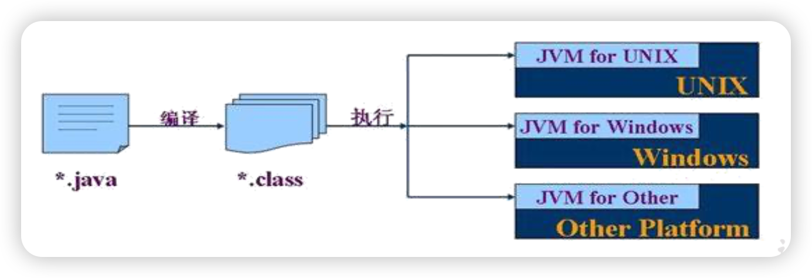

# 1.Java概述

## 计算机编程语言

> 不管是第几代语言,最终都会向0和1靠近,因为CPU只认识0和1
> 电脑上所有的内容,都是通过CPU将0和1转换而来的

语言的分代：

* 第1代：机器语言

  计算机很庞大,都是0和1组成的指令,而且需要同时按下多个键才能完成一个指令,而且用0和1组成的一个一个指令,所以工程师们就要记住0和1的各种组合以及对应的指令

* 第2代：汇编语言

  汇编语言(面向机器的语言,因为直接面对机器需要记一些 0 和1 的指令,很痛苦,所以就出现了很多助记词,比如:add.汇编语言现在还在使用,接近于机器语言,越接近机器语言,速度越快,而且最终还是转成0和1存储)

* 第3代：高级语言

  更接近我们人类语言

  * 面向过程的语言：C
  * 面向对象的语言：C++、 Java、 go、python、js

## 字节

```java
1.字节:计算机中存储数据的最小存储单元(计量单位),用byte或者B表示
  二进制位:用bit(比特)表示
  8个二进制位代表一个字节 
      
      
2.存储单元之间的转换:
  8bit = 1B
  1024B = 1KB
  1024KB = 1MB
  1024MB = 1GB
  1024GB = 1TB
      
  PB   EB  ZB ...    
```


## Java语言概述

### Java生态圈

**Java是目前应用最为广泛的软件开发平台之一。**随着Java以及Java社区的不断壮大，Java 也早已不再是简简单单的一门计算机语言了，它更是一个平台、一种文化、一个社区。

**作为一个平台，**Java虚拟机扮演着举足轻重的作用。除了 Java语言，任何一种能够被编译成字节码的计算机语言都属于Java这个平台。Groovy、Scala、 JRuby、Kotlin等都是Java平台的一部分，它们依赖于Java虚拟机，同时，Java平台也因为它们变得更加丰富多彩。而且Java还可以跨平台

**作为一种文化，**Java几乎成为了 “开源”的代名词。在Java程序中，有着数不清的开源软件和框架。如Tomcat、Struts, Hibernate, Spring,MyBatis等。就连JDK和JVM自身也有不少开源的实现，如OpenJDK、Apache Harmony。可以说，“共享”的精神在Java世界里体现得淋漓尽致。

**作为一个社区，**Java拥有全世界最多的技术拥护者和开源社区支持，有数不清的论坛和资料。从桌面应用软件、嵌入式开发到企业级应用、后台服务器、中间件，都可以看到Java的身影。其应用形式之复杂、参与人数之众多也令人咋舌。可以说，Java社区已经俨然成为了一个良好而庞大的生态系统。**其实这才是Java最大的优势和财富。**

### Java 是最好的语言吗？

不是，因为在每个领域都有更合适的编程语言。

- C 语言无疑是现代计算机软件编程语言的王者，几乎所有的操作系统都是 C 语言写成的。C里面有一个编译器,会将系统软件变成机器语言,让硬件识别,和硬件做交互.C++ 是面向对象的 C 语言，一直在不断的改进。


- JavaScript 是能运行在浏览器中的语言，丰富的前端界面离不开 Javascript 的功劳。近年来的 Node.js 又在后端占有一席之地。
- Python 用于系统管理，并通过高性能预编译的库，提供 API 来进行科学计算，文本处理等，是 Linux 必选的解释性语言。现在Python也被用于web开发、科学计算和统计、人工智能、网络爬虫等
- Ruby 强于 DSL（领域特定语言），程序员可以定义丰富的语义来充分表达自己的思想。
- Erlang 就是为分布式计算设计的，能保证在大规模并发访问的情况下，保持强壮和稳定性。
- Go 语言内置了并发能力，可以编译成本地代码。当前新的网络相关项目，很大比例是由 Go 语言编写的，如 Docker、Kubernetes 等。
- 编写网页用 PHP，函数式编程有 Lisp，编写 iOS 程序有 Swift/Objective-C。
- R的思想是：它可以提供一些集成的统计工具，但更大量的是它提供各种数学计算、统计计算的[函数](https://baike.baidu.com/item/函数/301912)，从而使使用者能灵活机动的进行数据分析，甚至创造出符合需要的新的统计计算方法 
- SQL 是用于访问和处理数据库的标准的计算机语言， 这类数据库包括：MySQL，Oracle, Sybase, SQL Server, DB2, Access 等等 

一句话概括，**能留在排行榜之上的语言，都是好的语言，在其所在的领域能做到最好。**

### Java语言发展历史

Java诞生于SUN（Stanford University Network），09年SUN被Oracle（甲骨文）收购。

Java之父是詹姆斯.高斯林(James Gosling)。


**詹姆斯·高斯林**等人于1990年代初开发Java语言的雏形，最初被命名为**Oak**，目标设置在**家用电器等小型系统的程序语言**，应用在**电视机、电话、闹钟、烤面包机**等家用电器的**控制和通信**。由于这些智能化家电的市场需求没有预期的高，Sun公司放弃了该项计划。随着1990年代互联网的发展，Sun公司看见Oak在互联网上应用的前景，于是改造了Oak，于1995年5月以Java的名称正式发布。Java伴随着互联网的迅猛发展而发展，逐渐成为重要的网络编程语言。

1996年发布JDK1.0版。

目前最新的版本是Java17。我们学习的Java8以及jdk17。

|   发行版本    |  发行时间  |                             备注                             |
| :-----------: | :--------: | :----------------------------------------------------------: |
|     Java      | 1995.05.23 |     Sun公司在Sun world会议上正式发布Java和HotJava浏览器      |
|   Java 1.0    | 1996.01.23 |             Sun公司发布了Java的第一个开发工具包              |
|   Java 1.1    | 1997.02.19 |                                                              |
|   Java 1.2    | 1998.12.08 |    拆分成：J2SE（标准版）、J2EE（企业版）、J2ME（小型版）    |
|   Java 1.3    | 2000.05.08 |                                                              |
|    Java1.4    | 2004.02.06 |                                                              |
| **Java 5.0**  | 2004.09.30 | ①版本号从1.4直接更新至5.0；②平台更名为JavaSE、JavaEE、JavaME |
|   Java 6.0    | 2006.12.11 |               2009.04.20 Oracle宣布收购SUN公司               |
|   Java 7.0    | 2011.07.02 |                                                              |
| **Java 8.0**  | 2014.03.18 |                                                              |
|   Java 9.0    | 2017.09.22 |    ①每半年更新一次；②Java 9.0开始不再支持windows 32位系统    |
|   Java 10.0   | 2018.03.21 |                                                              |
| **Java 11.0** | 2018.09.25 |           JDK安装包取消独立JRE安装包，长期支持版本           |
|   Java 12.0   | 2019.03.19 |                                                              |
|   Java 13.0   | 2019.9.18  |                                                              |
|   Java 14.0   | 2020.3.17  |                                                              |

```java
Google和Oracle的侵权事件:

Google 和 Oracle 纠缠多年的“Java 侵权案”又有了新的判决结果。Google 在此次对决中败诉，并可能需要支付高达88亿美元的赔偿金。这个案件还引发关于 API（应用程序编程接口）是否应该受版权保护的争议。

其实早在2010年8月，Oracle 就已经向法院起诉 Google 侵权，声称 Google 在开发 Android 平台时未经授权就使用了 Oracle 的 Java 应用编程接口数据包。

另外，虽然 Google 当年为避免版权问题而重写了 Java API，却意外地使用了和 Oracle JDK 相同的一小段代码，这使得 Google 陷入不利的局面。

正是由于 Google 在 Android 平台上使用 Java 时并未和 Sun 公司达成授权协议，造成了巨大的隐患，尤其是在 Oracle 收购 Sun 公司之后。
```


###  Java技术体系平台

J2SE ---> JavaSE
J2EE ---->JavaEE：主要应用场景
J2ME ---> JavaME

Java目前主要的应用场景：JavaEE后台开发、Android客户端的开发、大数据的开发

* JavaSE（Java Platform, Standard Edition标准版）：允许您在桌面和服务器上开发和部署Java应用程序。Java提供了丰富的用户界面、性能、多功能性、可移植性和当今应用程序所需的安全性。
* JavaEE（Java Platform, Enterprise Edition企业版）：是为开发企业环境下的应用程序提供的一套解决方案，主要针对于Web应用程序开发。
* JavaME（Java Platform, Micro Edition 小型版）：为互联网上的嵌入式和移动设备上运行的应用提供了一个健壮、灵活的环境：微控制器、传感器、网关、移动电话、个人数字助理（PDA）、电视机顶盒、打印机等等。JavaME包括灵活的用户界面、健壮的安全性、内置的网络协议，以及支持动态下载的网络和离线应用程序。基于JavaME的应用程序在许多设备上都是可移植的，但是利用了每个设备的本机功能。
  *  Java Embedded(Im'bedId): 用于解锁物联网的智能设备的价值：
     通过远程市场更新和刷新功能延长产品生命周期和价值；
     利用Java的可伸缩性、健壮性、可移植性和全套功能，提高生产效率，降低成本，缩短上市时间；
     在边缘启用快速数据功能；
  *  Java Card：使安全元件（如智能卡和其他防篡改安全芯片）能够承载采用Java技术的应用程序。Java card提供了一个安全的、可互操作的执行平台，它可以在一个资源受限的设备上存储和更新多个应用程序，同时保持最高的认证级别和与标准的兼容性。
  *  Java TV：是一种基于JavaME的技术，它为开发在tv和机顶盒设备上运行的java应用程序提供了一个性能良好、安全且易于实现的解决方案。使用Java TV运行时，开发人员可以轻松创建应用程序，例如电子节目指南（EPG）、视频点播（VOD）客户端、游戏和教育应用程序、用于访问Internet数据的应用程序（例如天气、新闻播报器、社交网络）以及大多数蓝光光盘标题上的用户界面和奖金内容。

### Java API说明文档

* API (Application Programming Interface， 应用程序编程接口）是Java 提供的基本编程接口
* Jav a语言通过api，提供了大量的类，因此Omcle 也为这些基础类提供了相应的说明文档，用于告诉开发者如何使
  用这些类，以及这些类里包含的方法。大多数Java书糖中的类的介绍都要参照它来完成，它是编程者经常直
  阅的资料。
  Java AP文档，即为J0K使用说明书、超助文档，类做于：

说明文档可以查询使用哪个类，像代码中的String、System都是内置的类

  ```java
class Hello{
  public static void main(String[] args) {
    System.out.println("Hello Bro");
    }
}
  ```

### JVM-java 虚拟机

> 1.jvm(java虚拟机):java运行程序的假想计算机,主要用来运行java程序的
> 2.跨平台:java代码可以在不同的操作系统上运行(一次编写,到处运行)
>   跨:跨越
>   平台:操作系统 -> windows linux mac os  
>       
> 3.关系:java程序想要在不同的操作系统上运行,实现跨平台,就需要安装不同版本的jvm   

JVM是一个虚拟的计算机，具有指令集并使用不同的存储区域。负责执行指令，管理数据、内存、寄存器。

* 实现java的跨平台性：对于不同的平台，有不同的虚拟机。只有某平台提供了对应的java虚拟机，java程序才可在此平台运行Java虚拟机机制屏蔽了底层运行平台的差别，实现write once，run anywhere
* 自动内存管理：内存分配，内存回收。虽然可以自动管理内存，还是会出现：
  * 内存泄漏：本身该回收♻️的内存，没有被JVM识别回收，形成内存垃圾。在内存溢出前，一切正常，但是垃圾变多，就会造成溢出
  * 内存溢出：java占用的内存空间 > 系统本身的内存空间。内存溢出，程序报错。



### JDK和JRE

```java
1.jdk:(Java Development Kit):java开发工具包,包含了jre
  javac 编译工具
  java 运行工具
  jdb  调试工具
  jhat 内存分析工具
  ...  
2.jre:(Java Runtime Environment):java运行环境,包含了jvm以及后面开发用到的核心类库
    
3.jdk和jre以及jvm的关系:
  jdk包含了jre,jre包含了jvm,所以我们只需要安装jdk即可
```

> 但是从jdk9开始jdk目录中就没有单独的jre目录了,因为jre作为一个运行时,里面不需要包含太多的东西浪费空间,降低运行效率,在jdk9的时候引用模块化的技术,让开发者能按照自己的应用创建一个最小的运行时(比如一个微服务的部署应用仅仅需要一个非常小的runtime,而不是像以前一样不管应用复杂还是简单,都需要一个近百兆的jre运行)这样提高了运行效率

### Java环境变量的配置

```java
1.问题:将来我们需要创建一个java文件写代码,然后编译和运行的时候需要打开此java文件所在的目录,java文件的目录如果和javac以及java命令所在的bin目录不一致,那么javac和java命令就用不了了,毕竟javac和java命令在bin目录下,所以难道我们将来必须将所有的java文件都放到bin目录下吗?
  那么我们能不能在任意目录下都能使用javac和java命令呢?能,需要配置环境变量
    
2.配置环境变量的目的:在任意路径下都可以随意使用javac和java命令进行对java代码的编译和运行    
```

```java
方式1:直接将jdk的bin路径粘贴到path中 -> 不推荐
```


```java
方式2:极力推荐
     配置JAVA_HOME
```


> jdk安装之后,自带环境变量配置->javapath(可以删除)->推荐使用JAVA_HOME
>
> 可能出现的问题:电脑重启之后,环境变量失效了
>
> 1.解决问题1:点到环境变量中,啥都不要做,直接点一下确定
>
> 2.解决问题2:直接将bin路径粘进去
>
> 当然,后面学了idea之后,不会出现这种问题了

### 什么是软件开发

```java
1.概述:
  软件开发是根据用户要求建造出软件系统或者系统中的软件部分的过程
  软件开发是一项包括需求捕捉、需求分析、设计、实现和测试的系统工程
  软件一般是用某种程序设计语言来实现的。通常采用软件开发工具可以进行开发
  
2.我们将来主要从事软件开发中各个环节的哪个环节呢?实现
  
3.我们将来主要用什么程序设计语言来开发呢? java语言 sql语言  js
```


# 2.Programing basic

## 1.1.编写，编译，运行

_[课程视频：HelloWord的编写和执行](https://www.bilibili.com/video/BV1PY411e7J6?p=13&vd_source=6f12b8c78467086fc666a02ab409ef20)_

_[课程视频：总结](https://www.bilibili.com/video/BV1PY411e7J6?p=14&vd_source=6f12b8c78467086fc666a02ab409ef20)_

* 编写

  * 将Java代码编写在`.java`结尾的源文件中，新建一个文件`HelloWorld.java`,内容是一个名为Hello的类（class）


  * 一定要有一个main方法，作为一个`java程序`运行入口，否则无法运行

  ```java
  class Hello{
    public static void main(String[] args) {
      System.out.println("Hello Bro");
      }
  }
  ```

* 编译和运行

  * 编译文件成字节码: 使用`javac HelloWorld.java`，生成一个名为类名的字节码文件`Hello.class`
  * 运行: 再使用`java Hello`，不需要class后缀

> 1. 编写
>
>    * 代码写在`.java`中，包含class，class中包含多个method，一定要有一个main()method才可以运行，在method中写代码，写你要做的事
>
>    * main()method的书写格式固定`public static void main(String[] args)`
>
>      非要有些变化的话，只能变化String[] args结构。可以写成：方式1:String args[] ；方式2： String[] a
>
>    * Java程序，严格区分大小写
>
>    * 字符串用双引号""
>
>    * 从控制台输出数据的操作：
>      System.out. printin(）：输出数据之后，会换行。
>      System.out.print(）：输出数据之后，不会换行。
>
>    * 每一行执行语句必须以英文分号;结束
>
> 2. 编译
>
>    * 如果编译不通过。可以考虑的问题：
>
>      问题1：查看编译的文件名、文件路径是否书写错误
>      问题2：查看代码中是否存在语法问题。如果存在，就可能导致编译不通过
>
>    * 一个java文件可以包含多个class，编译后生成多个名为`.java中class名字`的字节文件
>
> 3. 运行
>    我们是针对于字节码文件对应的Java类进行解释运行的。
>    要注意区分大小写！
>    如果运行不通过。可以考虑的问题：
>    问题1：查看解释运行的的类名、字节码文件路径是否书写错误
>    问题2：可能存在运行时异常。（放到第9章中具体讲解）
>
> 4. 一个`.java`源文件中可以声明多个类，但是最多只能有一个类使用public进行声明。
>    声明为public的类的类名与`.java`源文件名相同。


## 1.2.注释

* Java中的注释的种类：

  ```java
  1.单行注释//
  2.多行注释
  	/*
  	*/
  3.文档注释（Java特有）
  	/**
  	*/
  ```

* 单行注释、多行注释的作用：
  * 对程序中的代码进行解释说明
  * 对程序进行调试，注释掉后的代码，不被编译和运行

* 注意：
  * 单行注释和多行注释中声明的信息，不参与编译。换句话说，编译以后声明的字节码文件中不包含单行注释和多行注释中的信息。
  * 多行注释不能嵌套使用
  * 文档注释内容可以被JDK提供的工具 javadoc 所解析，生成一套网页文件，是该程序的说明文档


