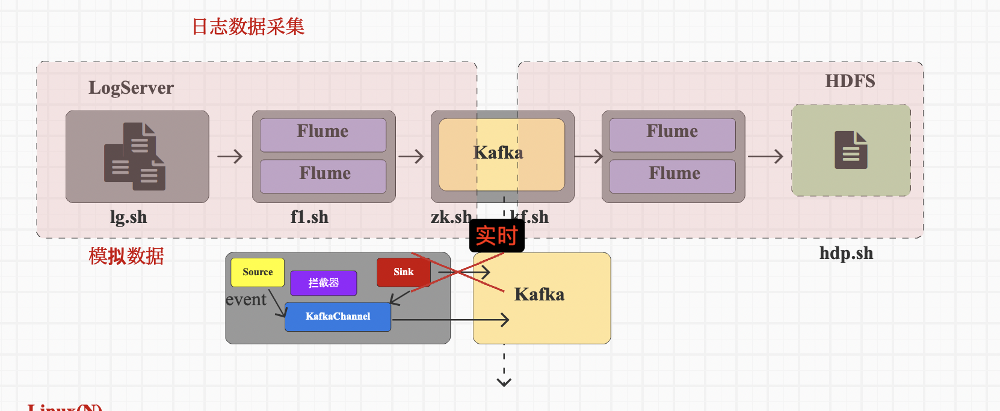

# 乱七八糟写在前面

* Hive，降低了数据查询和分析的开发难度，不然就要写mapreduce程序啦

  是建立在 Hadoop 生态系统之上的数据仓库基础设施

  * 存储：Hive 维护了一个元数据仓库，只存储元数据，本身不存储表的实际数据。
  * 查询：提供提供了一个 SQL-like 的接口（HiveQL）来查询存储在HDFS或者Amazon S3上的数据
  * 计算：本身不执行计算，将sql转换成 MapReduce 作业来执行查询。尽管 Hive 现在支持更快的执行引擎（如 Tez 和 Spark），但它的主要强项仍然是处理大规模的、不太频繁变化的数据集。

* Spark
  * 不存储数据。可以在内存（或必要时候在磁盘）中临时存储数据
  * 查询：与Hive实现一样，不过使用的是SparkSql
  * 计算：强大的分布式计算系统，在内存中处理数据，比那些依赖磁盘存储的计算模型（如 Hadoop MapReduce）更快。

* 二者关系
  * 离线：Hive on Spark，由Hive来提交作业，使用spark作为执行引擎实现计算。任务的提交者是 Hive，Spark 负责实现计算。
  * 实时：Spark on Hive，Spark使用hive中的元数据进行数据处理，使用sparksql来提交作业，使用saprk实现计算。任务提交者和实现计算均是Spark

数据采集就是将数据从数据库中同步到数据仓库


数据库存储的数据同步到数据仓库中，需要数据仓库中有相关的表信息，如果数据仓库和数据库直接关联，会造成两者很高的耦合性，对于二者的独立开发不利。

因此引入一个中间组件来解耦合，如何选择中间组件需要看你的数据仓库是如何搭建的。比如数据仓库使用Hive查询和提交任务，那么就可以使用HDFS作为中间组件，数据库中的数据有两部分，一部分是存储在数据库中的业务数据，一部分是日志文件形式存储的行为数据（埋点数据），这两者都可以用文件的形式在HDFS中存储。再通过Hive查询HDFS上的数据


数据指标-->采集什么数据 

Apache框架版本选择，需要自己测试哪个版本最合适，虽然都是一个基金会下的，但是工具开发之间是独立的

时间戳长度13位，毫秒；10位，秒


kafka直接对接HDFS不现实？HDFS是离线部分？？



## 生成模拟日志

Linux上安装JDK，用来安装jar包，在学习中，日志数据采用模拟数据

上传12.mock文件夹中的4个文件到102服务器的/opt/module/applog文件夹中， [application.yml]  [gmall-remake-mock-2023-05-15-3.jar]  [logback.xml]  [path.json] ，会在/opt/module/applog/log生成日志，在/home/ola/bin下配置生成日志命令脚本lg.sh

```bash
lg.sh test 100
```

## Flume

flume是单点操作，日志在哪个服务器上，就在哪个服务器上安装

将本地文件上传至HDFS