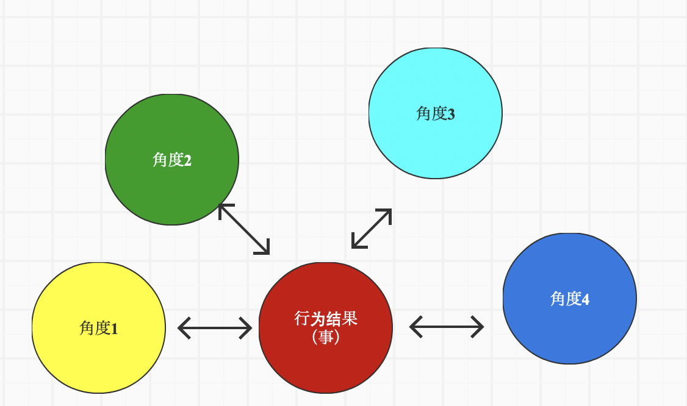
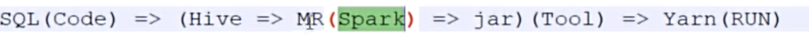
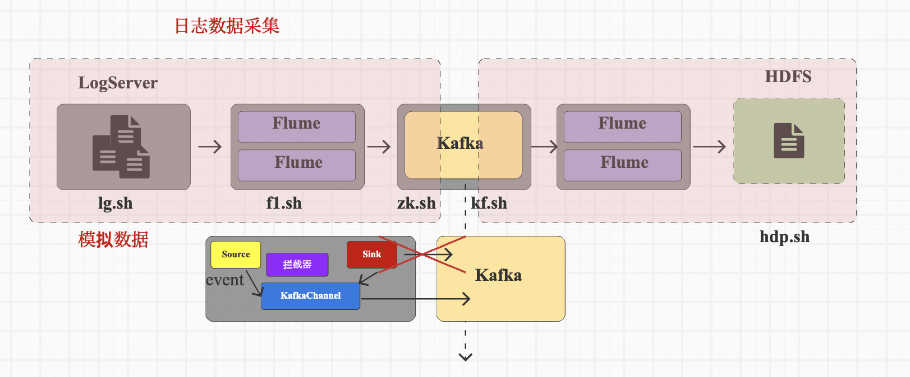
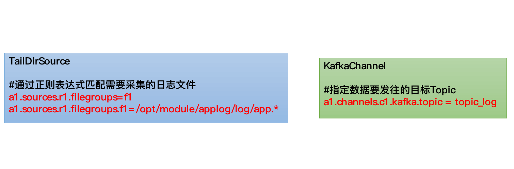
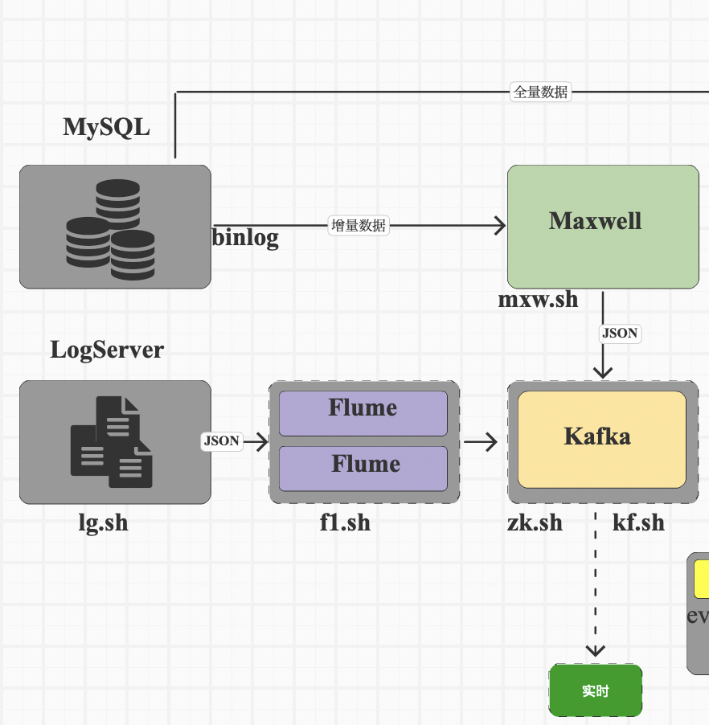
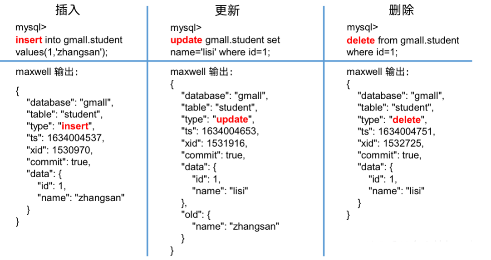
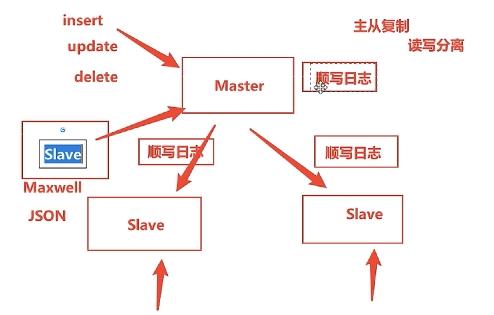
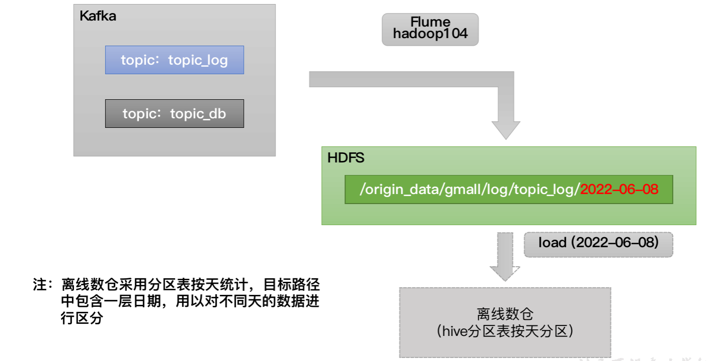
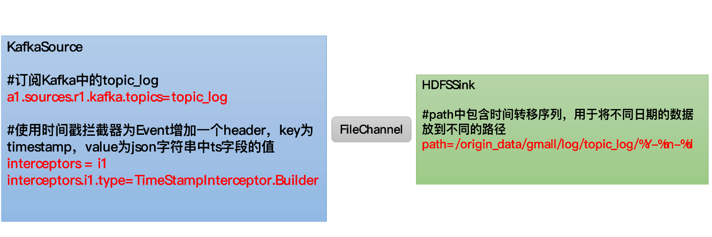
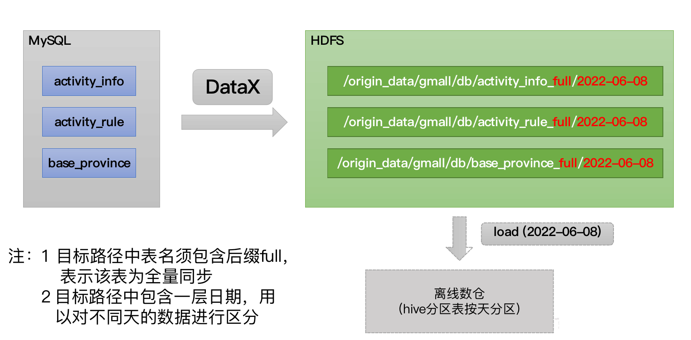

https://www.bilibili.com/video/BV1UN411j79o?p=60&vd_source=6f12b8c78467086fc666a02ab409ef20

# 学到的经验

* 分区策略：查询的数据如何存储到表的分区中查询数据的效率，数据有效
  * ODS层：一天采集到的数据就存储到表的一天的分区
  * DIM层
    * 全量：每天一份全量数据存放到一天的分区中
    * 拉链：会采用结束时间作为分区字段
  * DWD层
    * 事务型事实表： 一天的业务行为数据存放到一天的分区中
    * 周期型快照事实表：将每一天的全部状态数据保存到这一天的分区中
    * 累积型快照事实表：将业务流程中最后的那个时间字段作为分区字段

* 行为数据按照ms，业务数据按照s采集；实际工作中不会物理删除数据，会逻辑删除数据，增加一个标签

* 发到kafka的数据是增量数据，不是全量数据

* 一般都是增量数据同步，全量数据每天同步会根据实际业务需要来执行。太疯了吧，每天都用同步一遍，太冗余了。全量同步适合体量不大，变化不频繁的数据。同一张表在不同的业务需求下，既可以选择增量同步也可以选择全量同步。

* flume是单点操作，日志在哪个服务器上，就在哪个服务器上安装；在集群中查看flume是否运行jps -m

* flume底层传输的数据都是event，包括header和body

* flume的source中使用拦截器，解决零点漂移和日志校验（在java类方法中使用try catch），通过不用系统时间，用数据中的时间替换json中header的时间数据，解决零点漂移[日志数据的零点漂移问题](https://www.bilibili.com/video/BV1UN411j79o?p=44&vd_source=6f12b8c78467086fc666a02ab409ef20)


* 数据库用来存，数据仓库用来算

* 框架是不完整的计算机程序spark，需要被补充完整，所以学框架要学原理（了解底层原理，为了融合其他框架）；hdfs，kafka是系统，重点是使用，api （了解底层原理，为了优化）；数据仓库是系统？（了解底层原理，源码 ）

* 遵循了建表规范，会导致查询性能下降哦，并不是遵循规范就好，在实际过程中权衡和选择

  * ER模型强调对象和关系，不在乎性能，会把业务变复杂，因为对象（表）太多，关系复杂，适合做数据库的设计而不是数据仓库，因为数据仓库以查询为主！
  * 维度模型，统计的是行为结果，分析的是根据不同状态，不同角度。站在什么角度去统计


  

* hive是一个工具，不算是系统也不算事框架，hive可以直接用

  

* spark on hive。使用sparkSql来解析sql，生成Spark程序，提交Yarn运行，on hive是因为会使用来自hive的元数据或者使用hive当数据源

* hive on spark，使用hive解析sql，生成Spark程序，提交Yarn运行，on Spark是因为用了Spark作为计算引擎

  二者的计算引擎相同，但是解析sql文的角色不同

* spark基于scala，Hadoop开发，使用了mr的很多东西！、

* 增量表的同步，首日一般人工执行，每日一般自动执化

* 不一定非要创建维度表，如果维度简单，可以放在事实表中，这叫维度退化，维度表也不是越多越好

* 对数据的延迟来区分离线和实时，数据不间断从业务数据库，日志传输到HDFS中间件中转，数仓用离线的方式每天取前一天的数据

* 'yyyy-MM-dd HH:mm:ss'，小写y是自然年，12月31号以后就是下一年，大写M是月，小写m是分钟，大写H是24小时。小写m是12小时

* date_format(from_utc_timestamp(ts * 1000, 'GMT+8'), 'yyyy-MM-dd HH:mm:ss') --from_utc_timestamp接收浮点或整型数据，浮点按照毫米来计算，整型按照秒来计算。ts的时间按照的是时间戳，按照0时区来算的，所以需要进行时区转换

# 学习中出现的问题

* mysql中的增量数据经过maxwell为什么是json，以及怎么转换？

* 采集的数据是什么样子的，同步后又是什么样子的，怎么用

* group by中的字段可以不写在select中吗？

* 先inner join。再left join最后结果是？

  


Maxwell在103上部署了，因为是在103上安装了mysql8.0

/opt/module/applog中的application.yml修改一下！把mysql从hadoop102换成103

其他软件都在hadoop102部署，mysql因为102版本学hive的时候安装了5.7，太低了，导致建表的时候有个表格式问题，没成功。所以需要升级mysql的版本，就在103上安装了8.0版本的mysql

* 在做[5.1.用户行为数据同步](##5.1.用户行为数据同步)这部分，因为hadoop-3.1.3版本低，老师用的是hadoop-3.3.4，导致flume写入hadoop失败

  需要升级一下hadoop集群：升级后保留了原来的hadoop-3.1.3文件夹（单纯不想删），hadoop环境变量更改，分发集群，然后更改hadoop集群配置，分发。启动集群遇到的问题，hadoop102NameNode开启失败，措施是hdfs namenode -format，格式化后，再重启就没问题了。猜测是因为开启集群的时候，用的启动脚本还是之前旧的，导致namenode发生了问题。

  升级后，成功同步了kafka中的数据到HDFS

* 日志数据中ts是页面进入时间

# 乱七八糟写在前面

* Hive，降低了数据查询和分析的开发难度，不然就要写mapreduce程序啦

  是建立在 Hadoop 生态系统之上的数据仓库基础设施

  * 存储：Hive 维护了一个元数据仓库，只存储元数据，本身不存储表的实际数据。
  * 查询：提供提供了一个 SQL-like 的接口（HiveQL）来查询存储在HDFS或者Amazon S3上的数据
  * 计算：本身不执行计算，将sql转换成 MapReduce 作业来执行查询。尽管 Hive 现在支持更快的执行引擎（如 Tez 和 Spark），但它的主要强项仍然是处理大规模的、不太频繁变化的数据集。

* Spark
  * 不存储数据。可以在内存（或必要时候在磁盘）中临时存储数据
  * 查询：与Hive实现一样，不过使用的是SparkSql
  * 计算：强大的分布式计算系统，在内存中处理数据，比那些依赖磁盘存储的计算模型（如 Hadoop MapReduce）更快。

* 二者关系
  * 离线：Hive on Spark，由Hive来提交作业，使用spark作为执行引擎实现计算。任务的提交者是 Hive，Spark 负责实现计算。
  * 实时：Spark on Hive，Spark使用hive中的元数据进行数据处理，使用sparksql来提交作业，使用saprk实现计算。任务提交者和实现计算均是Spark

数据采集就是将数据从数据库中同步到数据仓库

数据库存储的数据同步到数据仓库中，需要数据仓库中有相关的表信息，如果数据仓库和数据库直接关联，会造成两者很高的耦合性，对于二者的独立开发不利。

因此引入一个中间组件来解耦合，如何选择中间组件需要看你的数据仓库是如何搭建的。比如数据仓库使用Hive查询和提交任务，那么就可以使用HDFS作为中间组件，数据库中的数据有两部分，一部分是存储在数据库中的业务数据，一部分是日志文件形式存储的行为数据（埋点数据），这两者都可以用文件的形式在HDFS中存储。再通过Hive查询HDFS上的数据


数据指标-->采集什么数据 

Apache框架版本选择，需要自己测试哪个版本最合适，虽然都是一个基金会下的，但是工具开发之间是独立的

时间戳长度13位，毫秒；10位，秒


kafka直接对接HDFS不现实？HDFS是离线部分？？


Linux上安装JDK，用来安装jar包，在学习中，日志数据采用模拟数据

上传12.mock文件夹中的4个文件到102服务器的/opt/module/applog文件夹中， [application.yml]  [gmall-remake-mock-2023-05-15-3.jar]  [logback.xml]  [path.json] ，会在/opt/module/applog/log生成日志，在/home/ola/bin下配置生成日志命令脚本lg.sh

```bash
lg.sh test 100
```

## Flume

flume是单点操作，日志在哪个服务器上，就在哪个服务器上安装

将本地文件上传至HDFS

# 2.用户行为数据采集模块

## 2.0.模拟日志

/opt/module/applog目录下

## 2.1.环境准备

### 集群命令批量执行脚本

xcall.sh，在/home/ola/bin下

```bash
#! /bin/bash

for i in hadoop102 hadoop103 hadoop104
do
    echo --------- $i ----------
    ssh $i "$*"
done
```

### Hadoop安装-集群

群起集群脚本hap.sh

项目经验，参考课件

### Zookeeper安装-集群

群起集群脚本 zk.sh

```bash
#!/bin/bash

case $1 in
"start"){
    for i in hadoop102 hadoop103 hadoop104
    do
        echo ---------- zookeeper $i 启动 ------------
        ssh $i "/opt/module/zookeeper/bin/zkServer.sh start"
    done
};;
"stop"){
    for i in hadoop102 hadoop103 hadoop104
    do
        echo ---------- zookeeper $i 停止 ------------
        ssh $i "/opt/module/zookeeper/bin/zkServer.sh stop"
    done
};;
"status"){
    for i in hadoop102 hadoop103 hadoop104
    do
        echo ---------- zookeeper $i 状态 ------------
        ssh $i "/opt/module/zookeeper/bin/zkServer.sh status"
    done
};;
esac
```

### Kafka安装-集群

kf.sh

```bash
1.2 Kafka命令行操作
1.2.1 主题命令行操作
1）查看操作主题命令参数
[atguigu@hadoop102 kafka]$ bin/kafka-topics.sh

参数	描述
--bootstrap-server <String: server toconnect to>	连接的Kafka Broker主机名称和端口号。
--topic <String: topic>	操作的topic名称。
--create	创建主题。
--delete	删除主题。
--alter	修改主题。
--list	查看所有主题。
--describe	查看主题详细描述。
--partitions <Integer: # of partitions>	设置分区数。
--replication-factor<Integer: replication factor>	设置分区副本。
--config <String: name=value>	更新系统默认的配置。
2）查看当前服务器中的所有topic
[atguigu@hadoop102 kafka]$ bin/kafka-topics.sh --bootstrap-server hadoop102:9092 --list
3）创建first topic
[atguigu@hadoop102 kafka]$ bin/kafka-topics.sh --bootstrap-server hadoop102:9092 --create --partitions 1 --replication-factor 3 --topic first
选项说明：
--topic 定义topic名
--replication-factor  定义副本数
--partitions  定义分区数
4）查看first主题的详情
[atguigu@hadoop102 kafka]$ bin/kafka-topics.sh --bootstrap-server hadoop102:9092 --describe --topic first
5）修改分区数（注意：分区数只能增加，不能减少）
[atguigu@hadoop102 kafka]$ bin/kafka-topics.sh --bootstrap-server hadoop102:9092 --alter --topic first --partitions 3
6）再次查看first主题的详情
[atguigu@hadoop102 kafka]$ bin/kafka-topics.sh --bootstrap-server hadoop102:9092 --describe --topic first
7）删除topic（学生自己演示）
[atguigu@hadoop102 kafka]$ bin/kafka-topics.sh --bootstrap-server hadoop102:9092 --delete --topic first
1.2.2 生产者命令行操作
1）查看操作生产者命令参数
[atguigu@hadoop102 kafka]$ bin/kafka-console-producer.sh
参数	描述
--bootstrap-server <String: server toconnect to>	连接的Kafka Broker主机名称和端口号。
--topic <String: topic>	操作的topic名称。
2）发送消息
[atguigu@hadoop102 kafka]$ bin/kafka-console-producer.sh --bootstrap-server hadoop102:9092 --topic first
>hello world
>atguigu  atguigu
1.2.3 消费者命令行操作
1）查看操作消费者命令参数
[atguigu@hadoop102 kafka]$ bin/kafka-console-consumer.sh
参数	描述
--bootstrap-server <String: server toconnect to>	连接的Kafka Broker主机名称和端口号。
--topic <String: topic>	操作的topic名称。
--from-beginning	从头开始消费。
--group <String: consumer group id>	指定消费者组名称。
2）消费消息
（1）消费first主题中的数据
[atguigu@hadoop102 kafka]$ bin/kafka-console-consumer.sh --bootstrap-server hadoop102:9092 --topic first
（2）把主题中所有的数据都读取出来（包括历史数据）
[atguigu@hadoop102 kafka]$ bin/kafka-console-consumer.sh --bootstrap-server hadoop102:9092 --from-beginning --topic first
```

### Flume安装-单点


## 2.2.日志采集Flume

### 日志采集Flume配置概述

按照规划，需要采集的用户行为日志文件存放在hadoop102，故需要在该节点配置日志采集Flume。日志采集Flume需要采集日志文件内容，并对日志格式（JSON）进行校验，然后将校验通过的日志发送到Kafka。

此处可选择TaildirSource和KafkaChannel，并配置日志校验拦截器。

选择TailDirSource和KafkaChannel的原因如下：

1）TailDirSource

TailDirSource相比ExecSource、SpoolingDirectorySource的优势。

TailDirSource：断点续传、多目录。Flume1.6以前需要自己自定义Source记录每次读取文件位置，实现断点续传。

ExecSource可以实时搜集数据，但是在Flume不运行或者Shell命令出错的情况下，数据将会丢失。

SpoolingDirectorySource监控目录，支持断点续传。

2）KafkaChannel

采用Kafka Channel，省去了Sink，提高了效率。

| 总部署                   | flume-->kafka            |
| ------------------------ | ------------------------ |
|  |  |

### 日志采集Flume配置实操

```bash
1）创建Flume配置文件
在hadoop102节点的Flume的job目录下创建file_to_kafka.conf。
[atguigu@hadoop102 flume]$ mkdir job
[atguigu@hadoop102 flume]$ vim job/file_to_kafka.conf
2）配置文件内容如下
#定义组件
a1.sources = r1
a1.channels = c1

#配置source
a1.sources.r1.type = TAILDIR
a1.sources.r1.filegroups = f1
a1.sources.r1.filegroups.f1 = /opt/module/applog/log/app.*
a1.sources.r1.positionFile = /opt/module/flume/taildir_position.json

#配置channel
a1.channels.c1.type = org.apache.flume.channel.kafka.KafkaChannel
a1.channels.c1.kafka.bootstrap.servers = hadoop102:9092,hadoop103:9092
a1.channels.c1.kafka.topic = topic_log
# flume会把数据封装成有head和body的event，这个不好，我们维持原始数据，所以将这里设置为false
a1.channels.c1.parseAsFlumeEvent = false

#组装 
a1.sources.r1.channels = c1
```

## 2.3.日志采集Flume测试

```bash
1）启动Zookeeper、Kafka集群
2）启动hadoop102的日志采集Flume
[atguigu@hadoop102 flume]$ bin/flume-ng agent -n a1 -c conf/ -f job/file_to_kafka.conf
3）启动一个Kafka的Console-Consumer
[atguigu@hadoop102 kafka]$ bin/kafka-console-consumer.sh --bootstrap-server hadoop102:9092 --topic topic_log
4）生成数据
执行集群日志生成脚本。
[atguigu@hadoop102 ~]$ lg.sh test 100
5）观察Kafka消费者是否能消费到数据
```

## 2.4.日志采集Flume启停脚本

```bash
1）在hadoop102节点的/home/atguigu/bin目录下创建脚本f1.sh
[ola@hadoop102 bin]$ vim f1.sh
	在脚本中填写如下内容。
#!/bin/bash

case $1 in
"start"){
    echo " --------启动 hadoop102 采集flume-------"
    ssh hadoop102 "nohup /opt/module/flume/bin/flume-ng agent -n a1 -c /opt/module/flume/conf/ -f /opt/module/flume/job/file_to_kafka.conf >/dev/null 2>&1 &"
};; 
"stop"){
    echo " --------停止 hadoop102 采集flume-------"
    ssh hadoop102 "ps -ef | grep file_to_kafka | grep -v grep |awk  '{print \$2}' | xargs -n1 kill -9 "
};;
esac
2）增加脚本执行权限
[ola@hadoop102 bin]$ chmod 777 f1.sh
3）f1启动
[ola@hadoop102 module]$ f1.sh start
4）f1停止
[ola@hadoop102 module]$ f1.sh stop
```

# 3.电商业务数据介绍

## 数据模拟

> [!NOTE]
>
> 其他都在hadoop102部署，mysql因为102版本学hive的时候安装了5.7，太低了，导致建表的时候有个表格式问题，没成功。所以需要升级mysql的版本，就在103上安装了8.0版本的mysql

MysQL数据库中保存的数据不是行为数据，而是行为导致结果状态数据。信息表中，如果用户多次修改名字。update_time只保留最后一次的。

离线的话Mysql的数据可以直接放进HDFS的。但是因为有实时处理？？，因此需要加一个kafka连接实时任务？？

什么样的数据实时处理？增量数据！

全量数据同步，表的全部数据，不用于实时数据分析

# 4.业务数据采集模块

## 4.1.采集通道




## 4.2.采集工具Maxwell

Maxwell 是由美国Zendesk公司开源，用Java编写的**MySQL变更数据抓取软件**。它会实时监控MySQL数据库的数据变更操作（包括insert、update、delete），并将变更数据**以 JSON 格式发送给 Kafka**、Kinesi等流数据处理平台。官网地址：http://maxwells-daemon.io/ 



| **字段**     | **解释**                                                     |
| ------------ | ------------------------------------------------------------ |
| **database** | 变更数据所属的数据库                                         |
| **table**    | 表更数据所属的表                                             |
| **type**     | 数据变更类型                                                 |
| **ts**       | 数据变更发生的时间                                           |
| **xid**      | 事务id                                                       |
| **commit**   | 事务提交标志，可用于重新组装事务                             |
| **data**     | 对于insert类型，表示插入的数据；对于update类型，标识修改之后的数据；对于delete类型，表示删除的数据 |
| **old**      | 对于update类型，表示修改之前的数据，只包含变更字段           |

MySql主要功能是保存数据，用于查询。为了加快查询，会把一部分数据加载到内存中，包括写缓存和读缓存。写缓存是刚insert的数据，读缓存是经常会被读取的数据。当写缓存增加到一定的阈值的时候，就会被写入磁盘（随机写入）。但是这样会增加磁盘IO，另外如果服务器挂了，那么缓存的数据还没来得及写入磁盘就消失了。造成数据丢失。

MySql提出了解决方案，就是读写分离，使用主从复制协议，往master中写入数据，从slave中读取数据。从slave中读取的数据是通过顺写日志方式同步到slave中的。

> 将变化的数据先写入文件（顺写，顺写更快），再写入缓存，再写入磁盘。目的是将顺写的文件作为副本保存，用于数据恢复。

## 4.3.Maxwell原理

遵循了了mysql的主从复制协议，伪装成slave，实时读取MySQL数据库的二进制日志（Binlog），从中获取变更数据，再将变更数据以JSON格式发送至Kafka等流处理平台。



## 4.4.Maxwell部署

注意：/opt/module/applog中的application.yml修改一下！把mysql从hadoop102换成103

* 注：Maxwell-1.30.0及以上版本不再支持JDK1.8

* 配置MySQL：

  * Binlog默认是未开启的，如需进行同步，需要先进行开启；在103上部署了，因为是在103上安装了mysql8.0

    ```bash
    1）修改MySQL配置文件/etc/my.cnf
    [ola@hadoop103 ~]$ sudo vim /etc/my.cnf
    2）增加如下配置
    #数据库id
    server-id = 1
    #启动binlog，该参数的值会作为binlog的文件名
    log-bin=mysql-bin
    #binlog类型，maxwell要求为row类型
    binlog_format=row
    #启用binlog的数据库，需根据实际情况作出修改
    binlog-do-db=gmall
    
    注：MySQL Binlog模式
    Statement-based：基于语句，Binlog会记录所有写操作的SQL语句，包括insert、update、delete等。
    优点：节省空间
    缺点：有可能造成数据不一致，例如insert语句中包含now()函数。
    Row-based：基于行，Binlog会记录每次写操作后被操作行记录的变化。
    优点：保持数据的绝对一致性。
    缺点：占用较大空间。
    mixed：混合模式，默认是Statement-based，如果SQL语句可能导致数据不一致，就自动切换到Row-based。
    Maxwell要求Binlog采用Row-based模式。
    3）重启MySQL服务
    [atguigu@hadoop102 ~]$ sudo systemctl restart mysqld
    ```

  * 创建Maxwell需要的数据库和用户

    ```bash
    Maxwell需要在MySQL中存储其运行过程中的所需的一些数据，包括binlog同步的断点位置（Maxwell支持断点续传）等等，故需要在MySQL为Maxwell创建数据库及用户。
    1）创建数据库
    msyql> CREATE DATABASE maxwell;
    2）创建Maxwell用户并赋予其必要权限
    mysql> CREATE USER 'maxwell'@'%' IDENTIFIED BY 'maxwell';
    mysql> GRANT ALL ON maxwell.* TO 'maxwell'@'%';
    mysql> GRANT SELECT, REPLICATION CLIENT, REPLICATION SLAVE ON *.* TO 'maxwell'@'%';
    ```

* 配置Maxwell

  * 修改配置文件

    ```bash
    1）修改Maxwell配置文件名称
    [ola@hadoop103 maxwell]$ cd /opt/module/maxwell
    [ola@hadoop103 maxwell]$ cp config.properties.example config.properties
    2）修改Maxwell配置文件
    [ola@hadoop103 maxwell]$ vim config.properties
    
    #Maxwell数据发送目的地，可选配置有stdout|file|kafka|kinesis|pubsub|sqs|rabbitmq|redis
    producer=kafka
    # 目标Kafka集群地址
    kafka.bootstrap.servers=hadoop102:9092,hadoop103:9092,hadoop104:9092
    #目标Kafka topic，可静态配置，例如:maxwell，也可动态配置，例如：%{database}_%{table}
    kafka_topic=topic_db
    
    # MySQL相关配置
    host=hadoop103
    user=maxwell
    password=maxwell
    jdbc_options=useSSL=false&serverTimezone=Asia/Shanghai&allowPublicKeyRetrieval=true
    
    # 过滤gmall中的z_log表数据，该表是日志数据的备份，无须采集
    filter=exclude:gmall.z_log
    # 指定数据按照主键分组进入Kafka不同分区，避免数据倾斜
    producer_partition_by=primary_key
    ```

## 4.5.Maxwell增量

只拉取变化数据

```bash
1）在102启动Kafka消费者
[ola@hadoop102 bin]$ cd $KAFKA_HOME 
[ola@hadoop102 kafka]$ bin/kafka-console-consumer.sh --bootstrap-server hadoop102:9092 --topic topic_db
2）模拟生成数据
（1）修改application.yml
确保mysql url的数据库为gmall
spring:
    datasource:
      type: com.alibaba.druid.pool.DruidDataSource
      druid:
        url: jdbc:mysql://hadoop103:3306/gmall?characterEncoding=utf-8&allowPublicKeyRetrieval=true&useSSL=false&serverTimezone=GMT%2B8
        username: root
        password: "000000"
        driver-class-name:  com.mysql.cj.jdbc.Driver
        max-active: 20
        test-on-borrow: true
（2）生成数据
[ola@hadoop102 applog]$ lg.sh
3）观察Kafka消费者
{"database":"gmall","table":"order_refund_info","type":"update","ts":1675414185,"xid":38713,"commit":true,"data":{"id":6903,"user_id":191,"order_id":36103,"sku_id":34,"refund_type":"1502","refund_num":1,"refund_amount":3927.00,"refund_reason_type":"1301","refund_reason_txt":"退款原因具体：0445847967","refund_status":"0705","create_time":"2022-06-14 11:00:53","operate_time":"2022-06-14 12:00:58"},"old":{"refund_status":"1006","operate_time":"2022-06-14 12:00:53"}}
```

## 4.6.Maxwell全量

一下子都给你把历史数据拉到kafka

```bash
上一节，我们已经实现了使用Maxwell实时增量同步MySQL变更数据的功能。但有时只有增量数据是不够的，我们可能需要使用到MySQL数据库中从历史至今的一个完整的数据集。这就需要我们在进行增量同步之前，先进行一次历史数据的全量同步。这样就能保证得到一个完整的数据集。

4.4.1 Maxwell-bootstrap
Maxwell提供了bootstrap功能来进行历史数据的全量同步，命令如下：
[ola@hadoop102 maxwell]$ /opt/module/maxwell/bin/maxwell-bootstrap --database gmall --table user_info --config /opt/module/maxwell/config.properties

4.4.2 boostrap数据格式
采用bootstrap方式同步的输出数据格式如下：
{
    "database": "fooDB",
    "table": "barTable",
    "type": "bootstrap-start",
    "ts": 1450557744,
    "data": {}
}
{
    "database": "fooDB",
    "table": "barTable",
    "type": "bootstrap-insert",
    "ts": 1450557744,
    "data": {
        "txt": "hello"
    }
}
{
    "database": "fooDB",
    "table": "barTable",
    "type": "bootstrap-insert",
    "ts": 1450557744,
    "data": {
        "txt": "bootstrap!"
    }
}
{
    "database": "fooDB",
    "table": "barTable",
    "type": "bootstrap-complete",
    "ts": 1450557744,
    "data": {}
}
注意事项：
（1）第一条type为bootstrap-start和最后一条type为bootstrap-complete的数据，是bootstrap开始和结束的标志，不包含数据，中间的type为bootstrap-insert的数据才包含数据。
（2）一次bootstrap输出的所有记录的ts都相同，为bootstrap开始的时间。
```

# 5.离线数仓同步数据

## 5.1.用户行为数据同步

### 数据通道/日志消费Flume配置概述

分区表可以提高查询效率，所以hive使用分区查询，一般是日期，因此hdfs存储数据也是日期为单位，所以flume网hdfs传输数据也需要有日期标记。

用户行为数据由Flume从Kafka直接同步到HDFS，由于离线数仓采用Hive的分区表按天统计，所以目标路径要包含一层日期。

|                          |                          |
| ------------------------ | ------------------------ |
|  |  |

### 日志消费Flume配置实操

[kafka_to_hdfs_log.conf](../other/kafka_to_hdfs_log.conf)

flume的source中使用拦截器，解决零点漂移和日志校验（在java类方法中使用try catch），通过不用系统时间，用数据中的时间替换jason中head的时间数据，解决零点漂移[日志数据的零点漂移问题](https://www.bilibili.com/video/BV1UN411j79o?p=44&vd_source=6f12b8c78467086fc666a02ab409ef20)

需要先将打好的包放入到hadoop102的/opt/module/flume/lib文件夹下面。

[gmall-1.0-SNAPSHOT-jar-with-dependencies.jar](../other/gmall-1.0-SNAPSHOT-jar-with-dependencies.jar)

### 日志消费Flume测试

使用日志消费Flume启停脚本f2.sh start

## 5.2.业务数据同步

### 全量表数据同步

全量表数据由DataX从MySQL业务数据库直接同步到HDFS，具体数据流向，如下图所示。




注：由于目标路径包含一层日期，用于对不同天的数据加以区分，故path参数并未写死，需在提交任务时通过参数动态传入，参数名称为

targetdir

### DataX全量同步数据QuerySQL模式，带参数

如果同步数据库，一般一张表一个脚本，但是可以采用批量脚本的！

写[json文档](../other/base_province_sql.json)，放在 /opt/module/datax/job目录下，执行下面脚本

```bash
[ola@hadoop102 datax]$ python bin/datax.py job/base_province_sql.json
```

通常情况下，离线数据同步任务需要每日定时重复执行，故HDFS上的目标路径通常会包含一层日期，以对每日同步的数据加以区分，也就是说每日同步数据的目标路径不是固定不变的，因此DataX配置文件中HDFS Writer的path参数的值应该是动态的。为实现这一效果，就需要使用DataX传参的功能。

DataX传参的用法如下，在JSON配置文件中使用${param}引用参数，在提交任务时使用-p"-Dparam=value"传入参数值，具体示例如下。

```json
"fileType": "text",
"path": "/base_province/${dt}",
"writeMode": "append"
}

1、先在hdfs上建立文件夹 hadoop fs -mkdir 2022-06-22
2、执行  python bin/datax.py -p"-Ddt=2022-06-08" job/base_province.json


python /opt/module/datax/bin/datax.py -p"-Dtargetdir=/origin_data/gmall/db/activity_info_full/2022-06-08" /opt/module/datax/job/import/gmall.activity_info.json

mysql_to_hdfs_full.sh all 2022-06-08
```

### DataX全量同步数据TableMode模式

和上面类似，不写了

## 增量数据表同步

f3.sh--mxw.sh--lg.sh  kafka_to_hdfs_db.conf

## 5.3.采集通道启动/停止脚本

# 6.数仓环境准备

## 6.1.Hive安装部署

## 6.2.启动Hive

# 7.数据仓库

## 7.0.概述

## 7.1.维度建模

### 7.1.1.事实表-DWD

绝大多数是增量表，特殊情况全量表

### 7.1.2.维度表-DIM

星型模型、雪花模型

绝大多数是全量表，特殊情况拉链表

## 7.2.设计

## 7.3.环境准备

## 7.4.数仓开发-ODS层


## 7.5.数仓开发-DIM层

建立维度表的前提，维度会在很多行为中使用	

## 7.6.数仓开发-DWD层

事务事实表，行为不可拆分，比如支付就不是一个原子行为，因为可以拆分为支付成功和支付失败

原子行为：绝大多数都是事务事实表，当事务事实表需要多个事务事实表效率低时，转用周期快照事实表。

多个流程行为：多个行为流程放在一个表中，使用累积快照事实表。行为之间有关联，形成一个流程。因为有多个行为，就会有多个时间，需要考虑数据时间分区的问题，用哪个时间分区，一般选择时间靠后的字段作为分区字段

### 交易域加购事务事实表

```sql
# 每日数据装载
insert overwrite table dwd_trade_cart_add_inc partition (dt = '2022-06-09')
select data.id,
       data.user_id,
       data.sku_id,
       date_format(from_utc_timestamp(ts * 1000, 'GMT+8'), 'yyyy-MM-dd') as date_id,--insert/crate_time,update/update_time，因为判断选择选取时间也会消耗性能，所以统一用ts作为创建时间，ts是行为发生后maxwell采集数据的时间
       date_format(from_utc_timestamp(ts * 1000, 'GMT+8'), 'yyyy-MM-dd HH:mm:ss') as  create_time,
       if(type = 'insert', data.sku_num, cast(data.sku_num as int) - cast(old['sku_num'] as int)) sku_num
from ods_cart_info_inc
where dt = '2022-06-09'
  and (type = 'insert'
    or 
       (type = 'update' 
        and old['sku_num'] is not null 
        and cast(data.sku_num as int) > cast(old['sku_num'] as int))--字符串和数字都可以进行比较
      );
```

### 交易域下单事务事实表

如果退款或者重新下单，detail表不会被修改，只会新增

### 交易域支付成功事务事实表

首日

每日：存在0点漂移问题，支付成功和订单日期不一致，所以订单时间取当天和前一天，比如支付成功是9号，订单表取9号或8号

增量数据取type='update' 而不是'insert'，因为下单insert一条支付数据，此时没有支付。支付后会update数据，当然更改其他信息都会update，所以array_contains(map_keys(old),'payment_status')做了一层判断，只取payment_status做了update的数据

```sql
 select
    data.user_id,
    data.order_id,
    data.payment_type,
    data.callback_time
from ods_payment_info_inc
where dt='2022-06-09'
and type='update'-- 注意点
and array_contains(map_keys(old),'payment_status')
and data.payment_status='1602'
```

### 交易域购物车周期快照事实表

周期快照事实表：周期就是每天的意思，快照是状态的意思。周期快照事实表指每天保存一份事实表，比如购物车表。

不需要考虑增量的首日和每日，因为是全量表哦

### 交易域交易流程累积快照事实表

需求：下单到支付时间间隔平均值

交易流程--交易行为：注重行为与行为之间的关系，没必要将某一个行为的维度弄的特别细

如果咱们表中存在多个和业务相关的时问字段，一般会选择其中的一个业务时间作为分区字段--一般选择时间靠后的字段作为分区字段。

和dim_user_zip拉链表类似，就是选择了结束日期作为分区字段，因为后面确定了前面的时间也就确定了。但是使用前面的开始日期作为分区字段，查询数据的时候，还需要对结束日期做一层筛选，不是最优解，设计的很失败。

每日数据装载，需要考虑历史数据中进入9999-12-31分区的数据

### 流量域页面浏览事务事实表

数据源：页面浏览日志

### 用户域用户注册事务事实表

数据源：页面浏览日志，离开页面时产生页面浏览日志

### 用户域用户登录事务事实表

数据源：页面浏览日志

## 7.7.数仓开发-DWS层

分类：1d，nd，td表；一般会根据1d表设计nd表

设计来源于ads层的数据指标，存储中间计算结果。用于预聚合，结果在多处重复使用，避免重复计算。类似于spark cache缓存

这一层的开发体现能力大小，不像其他层有理论支持或按客户需求开发就行。

## 7.8.数仓开发-ADS层

## 7.9.报表数据导出

## 7.10.数仓工作调度


|      | ODS  | DWD    | DWS    | ADS  | DIM    |
| ---- | ---- | ------ | ------ | ---- | ------ |
| 分区 |      |        |        | /    |        |
| 压缩 | gzip | snappy | snappy | gzip | snappy |
| 存储 | 行   | orc列  | orc列  | 行   | orc列  |

事务系统，操作系统，响应时间

分析系统


数据库和数据仓库各有各的功能，二者不冲突不替代

数据库目的存储业务数据，数据实时的，设计的时候避免冗余

数据仓库目的是用于数据分析和决策支持，数据是历史数据，来源于业务数据库，将数据加工处理，设计的时候故意用空间换时间，有冗余，但是提高了查询效率


数据集市--数据集市（Data Mart）是数据仓库架构中的一个子集

ADS--ADS层是数据仓库内的一个层级，用于存储经过聚合处理的数据


选择业务过程，确定创建什么表

声明粒度，确定行

确认维度，确定列

确认事实，确定度量值


事实---度量值


4. 粒度粒度就是业务流程中对度量的单位，比如商品是按件记录度量，还是按批记录度量。

   在数仓建没中，我们说这是用户粒度的事突表，那么表中每行數据都是一个用户，无重复用户；例如还有销售拉度的A表，那么表中每行都是一条销售记录。

   选择合适的粒度级别是数据仓库建设好坏的重要关键内容，在设计数据粒度时，通常需重点考虑以下因素：

   1. 要接受的分析类型、可接受的数据最低粒度和能存储的数据量；
   2. 粒度的层次定义越高，就越不能在该仓库中进行更细致的分析；
   3. 如果存储资源有一定的限制，就只能采用较高的数据粒度划分；
   4. 数据粒度划分策略一定要保证：数据的粒度确实能够满足用户的决策分析需要，这是数据粒度划分策略中最重要 6的一个准则。

* 数仓建模就是建表

* 建模方法：
  * ER模型既可以设计数据库的表又可以设计数据仓库的表，用面向对象的思想去设计表；实体是一个对象；遵循3NF规范，前三个范式
  * 
